# 1-Overview

# Overview
Relevant source files
- [.github/workflows/nfl_01_pipeline.yml](https://github.com/Clownworldenjoyer76/football_for_mat/blob/e5e69ed3/.github/workflows/nfl_01_pipeline.yml)
- [.github/workflows/nfl_02_pipeline.yml](https://github.com/Clownworldenjoyer76/football_for_mat/blob/e5e69ed3/.github/workflows/nfl_02_pipeline.yml)
- [.github/workflows/prop_01_pipeline.yml](https://github.com/Clownworldenjoyer76/football_for_mat/blob/e5e69ed3/.github/workflows/prop_01_pipeline.yml)
- [.gitignore](https://github.com/Clownworldenjoyer76/football_for_mat/blob/e5e69ed3/.gitignore)
- [docs/win/football/nfl/00_intake/pbp/2026_pbp.csv.gz](https://github.com/Clownworldenjoyer76/football_for_mat/blob/e5e69ed3/docs/win/football/nfl/00_intake/pbp/2026_pbp.csv.gz)
- [docs/win/football/nfl/00_intake/qb/2026_qb_stats.csv](https://github.com/Clownworldenjoyer76/football_for_mat/blob/e5e69ed3/docs/win/football/nfl/00_intake/qb/2026_qb_stats.csv)
- [docs/win/football/nfl/00_intake/schedule/updates/2026_schedule_20260915_101427.csv](https://github.com/Clownworldenjoyer76/football_for_mat/blob/e5e69ed3/docs/win/football/nfl/00_intake/schedule/updates/2026_schedule_20260915_101427.csv)
- [docs/win/football/nfl/00_intake/team_stats/2026_team_stats.csv](https://github.com/Clownworldenjoyer76/football_for_mat/blob/e5e69ed3/docs/win/football/nfl/00_intake/team_stats/2026_team_stats.csv)
- [docs/win/football/nfl/data/league_leaders/league_leaders_2026.csv](https://github.com/Clownworldenjoyer76/football_for_mat/blob/e5e69ed3/docs/win/football/nfl/data/league_leaders/league_leaders_2026.csv)
- [docs/win/football/nfl/data/market_futures/market_futures_2026.csv](https://github.com/Clownworldenjoyer76/football_for_mat/blob/e5e69ed3/docs/win/football/nfl/data/market_futures/market_futures_2026.csv)
- [docs/win/football/nfl/data/master/league_standings.csv](https://github.com/Clownworldenjoyer76/football_for_mat/blob/e5e69ed3/docs/win/football/nfl/data/master/league_standings.csv)
- [docs/win/football/nfl/data/qb_data/qbr_data/2026/qbr_week1.csv](https://github.com/Clownworldenjoyer76/football_for_mat/blob/e5e69ed3/docs/win/football/nfl/data/qb_data/qbr_data/2026/qbr_week1.csv)
- [docs/win/football/nfl/data/team_power_index/team_power_index_2026.csv](https://github.com/Clownworldenjoyer76/football_for_mat/blob/e5e69ed3/docs/win/football/nfl/data/team_power_index/team_power_index_2026.csv)
- [docs/win/football/nfl/errors/00_intake/pull_final_scores.txt](https://github.com/Clownworldenjoyer76/football_for_mat/blob/e5e69ed3/docs/win/football/nfl/errors/00_intake/pull_final_scores.txt)
- [docs/win/football/nfl/errors/00_intake/pull_pbp.txt](https://github.com/Clownworldenjoyer76/football_for_mat/blob/e5e69ed3/docs/win/football/nfl/errors/00_intake/pull_pbp.txt)
- [docs/win/football/nfl/errors/00_intake/pull_schedule.txt](https://github.com/Clownworldenjoyer76/football_for_mat/blob/e5e69ed3/docs/win/football/nfl/errors/00_intake/pull_schedule.txt)
- [docs/win/football/nfl/errors/00_intake/pull_team_stats.txt](https://github.com/Clownworldenjoyer76/football_for_mat/blob/e5e69ed3/docs/win/football/nfl/errors/00_intake/pull_team_stats.txt)
- [docs/win/football/nfl/scripts/00_intake/refresh_projection_sources.py](https://github.com/Clownworldenjoyer76/football_for_mat/blob/e5e69ed3/docs/win/football/nfl/scripts/00_intake/refresh_projection_sources.py)
- [docs/win/football/nfl/scripts/01_merge/projection_feature_builder_legacy_inseason.py](https://github.com/Clownworldenjoyer76/football_for_mat/blob/e5e69ed3/docs/win/football/nfl/scripts/01_merge/projection_feature_builder_legacy_inseason.py)
- [docs/win/football/nfl/scripts/01_merge/projection_feature_builder_legacy_week1.py](https://github.com/Clownworldenjoyer76/football_for_mat/blob/e5e69ed3/docs/win/football/nfl/scripts/01_merge/projection_feature_builder_legacy_week1.py)
- [docs/win/football/nfl/text_docs/NEXTSEASON.txt](https://github.com/Clownworldenjoyer76/football_for_mat/blob/e5e69ed3/docs/win/football/nfl/text_docs/NEXTSEASON.txt)
- [docs/win/football/prop_engine/scripts/build/build_defensive_features.py](https://github.com/Clownworldenjoyer76/football_for_mat/blob/e5e69ed3/docs/win/football/prop_engine/scripts/build/build_defensive_features.py)
- [docs/win/football/prop_engine/scripts/build/build_environment_history.py](https://github.com/Clownworldenjoyer76/football_for_mat/blob/e5e69ed3/docs/win/football/prop_engine/scripts/build/build_environment_history.py)
- [docs/win/football/prop_engine/scripts/build/build_historical_features.py](https://github.com/Clownworldenjoyer76/football_for_mat/blob/e5e69ed3/docs/win/football/prop_engine/scripts/build/build_historical_features.py)
- [docs/win/football/prop_engine/scripts/build/build_historical_universe.py](https://github.com/Clownworldenjoyer76/football_for_mat/blob/e5e69ed3/docs/win/football/prop_engine/scripts/build/build_historical_universe.py)
- [docs/win/football/prop_engine/scripts/build/build_kicking_features.py](https://github.com/Clownworldenjoyer76/football_for_mat/blob/e5e69ed3/docs/win/football/prop_engine/scripts/build/build_kicking_features.py)
- [docs/win/football/prop_engine/scripts/build/build_player_form.py](https://github.com/Clownworldenjoyer76/football_for_mat/blob/e5e69ed3/docs/win/football/prop_engine/scripts/build/build_player_form.py)
- [docs/win/football/prop_engine/scripts/build/build_player_identity.py](https://github.com/Clownworldenjoyer76/football_for_mat/blob/e5e69ed3/docs/win/football/prop_engine/scripts/build/build_player_identity.py)
- [docs/win/football/prop_engine/scripts/build/build_player_opportunity.py](https://github.com/Clownworldenjoyer76/football_for_mat/blob/e5e69ed3/docs/win/football/prop_engine/scripts/build/build_player_opportunity.py)
- [docs/win/football/prop_engine/scripts/build/build_position_allowed.py](https://github.com/Clownworldenjoyer76/football_for_mat/blob/e5e69ed3/docs/win/football/prop_engine/scripts/build/build_position_allowed.py)

## Purpose and Scope

`football_for_mat` is an automated NFL game-prediction and player-prop betting pipeline stored entirely under `docs/win/football`, orchestrated and driven by GitHub Actions [.github/workflows/nfl_01_pipeline.yml1-21](https://github.com/Clownworldenjoyer76/football_for_mat/blob/e5e69ed3/.github/workflows/nfl_01_pipeline.yml#L1-L21)[.github/workflows/nfl_02_pipeline.yml1-21](https://github.com/Clownworldenjoyer76/football_for_mat/blob/e5e69ed3/.github/workflows/nfl_02_pipeline.yml#L1-L21) The system ingests raw market odds, schedule, play-by-play (PBP), roster, injury, and external projection sources, enriches and merges them into structured feature matrices, runs machine learning models (such as CatBoost game models and prop networks), evaluates betting edges via Kelly criterion filtering, and grades final outcomes against official game results.

This parent page introduces the high-level architecture, the dual-engine layout (NFL Game Engine and Prop Engine), and the numbered stage execution pattern. For detailed information on directory conventions, filename patterns, and local execution, refer to the child pages:

- Repository Layout and Conventions ([Repository Layout and Conventions](/Clownworldenjoyer76/football_for_mat/1.1-repository-layout-and-conventions))
- Getting Started and Environment ([Getting Started and Environment](/Clownworldenjoyer76/football_for_mat/1.2-getting-started-and-environment))

Sources: [.github/workflows/nfl_01_pipeline.yml1-21](https://github.com/Clownworldenjoyer76/football_for_mat/blob/e5e69ed3/.github/workflows/nfl_01_pipeline.yml#L1-L21)[.github/workflows/nfl_02_pipeline.yml1-21](https://github.com/Clownworldenjoyer76/football_for_mat/blob/e5e69ed3/.github/workflows/nfl_02_pipeline.yml#L1-L21)

---

## System Architecture & Dual Engines

The repository splits its analytical workload into two primary operational domains: the **NFL Game Engine** and the **Prop Engine**. Both are automated via scheduled and manual GitHub Actions workflows that checkout data, execute python intake/projection scripts, and commit normalized artifacts back to the repository.

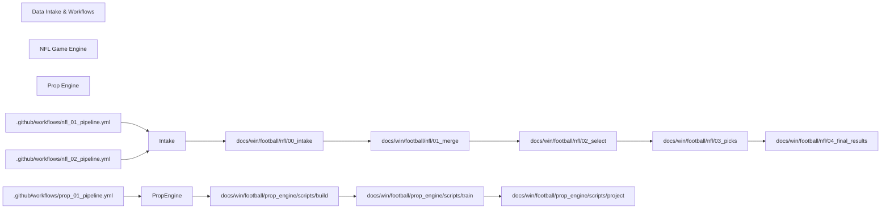

*Figure 1: High-level architectural flow from GitHub Actions workflows through the NFL game pipeline and Prop Engine.*

Sources: [.github/workflows/nfl_01_pipeline.yml1-125](https://github.com/Clownworldenjoyer76/football_for_mat/blob/e5e69ed3/.github/workflows/nfl_01_pipeline.yml#L1-L125)[.github/workflows/nfl_02_pipeline.yml1-125](https://github.com/Clownworldenjoyer76/football_for_mat/blob/e5e69ed3/.github/workflows/nfl_02_pipeline.yml#L1-L125)

---

## Numbered Stage Layout

The NFL pipeline follows a strict sequential, numbered stage convention located under `docs/win/football/nfl/`:

1. **`00_intake`**: Ingests raw schedule, PBP, team/QB stats, injuries, weather, market futures, and external predictions (such as DRAT and ESPN) [docs/win/football/nfl/scripts/01_merge/projection_feature_builder_legacy_inseason.py1-40](https://github.com/Clownworldenjoyer76/football_for_mat/blob/e5e69ed3/docs/win/football/nfl/scripts/01_merge/projection_feature_builder_legacy_inseason.py#L1-L40)[.github/workflows/nfl_02_pipeline.yml121-165](https://github.com/Clownworldenjoyer76/football_for_mat/blob/e5e69ed3/.github/workflows/nfl_02_pipeline.yml#L121-L165)
2. **`01_merge`**: Combines cleaned data sources into feature-engineered tables (e.g., `week_N_NFL_enriched.csv`), supporting both `week1` and `inseason` execution modes [docs/win/football/nfl/scripts/01_merge/projection_feature_builder_legacy_week1.py1-20](https://github.com/Clownworldenjoyer76/football_for_mat/blob/e5e69ed3/docs/win/football/nfl/scripts/01_merge/projection_feature_builder_legacy_week1.py#L1-L20)
3. **`02_select`**: Applies market-odds alignment, EV calculations, edge thresholds, and Kelly band filters to generate selected betting opportunities (`week_N_NFL_selected.csv`).
4. **`03_picks`**: Evaluates final game picks, survivor options, and locks down historical snapshots.
5. **`04_final_results`**: Pulls final game scores, grades picks as WIN, LOSS, or PUSH, and tracks performance metrics.

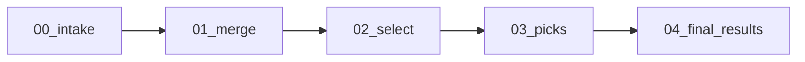

*Figure 2: Sequential progression of the numbered stage layout in the NFL pipeline.*

Sources: [.github/workflows/nfl_02_pipeline.yml121-214](https://github.com/Clownworldenjoyer76/football_for_mat/blob/e5e69ed3/.github/workflows/nfl_02_pipeline.yml#L121-L214)[docs/win/football/nfl/scripts/01_merge/projection_feature_builder_legacy_inseason.py1-50](https://github.com/Clownworldenjoyer76/football_for_mat/blob/e5e69ed3/docs/win/football/nfl/scripts/01_merge/projection_feature_builder_legacy_inseason.py#L1-L50)[docs/win/football/nfl/scripts/01_merge/projection_feature_builder_legacy_week1.py1-20](https://github.com/Clownworldenjoyer76/football_for_mat/blob/e5e69ed3/docs/win/football/nfl/scripts/01_merge/projection_feature_builder_legacy_week1.py#L1-L20)

---

## Child Pages

For more granular technical specifics, conventions, and setup instructions, consult the child pages:

- **[Repository Layout and Conventions](/Clownworldenjoyer76/football_for_mat/1.1-repository-layout-and-conventions)** — Details on directory structures, stage naming, log patterns under `errors/`, weekly CSV naming conventions, and Git LFS / `.gitignore` rules [.gitignore1-8](https://github.com/Clownworldenjoyer76/football_for_mat/blob/e5e69ed3/.gitignore#L1-L8)
- **[Getting Started and Environment](/Clownworldenjoyer76/football_for_mat/1.2-getting-started-and-environment)** — Instructions for local script execution, Python version requirements, `requirements.txt` setup, `NFL_SEASON` environment variables, and configuration paths.

Sources: [.gitignore1-8](https://github.com/Clownworldenjoyer76/football_for_mat/blob/e5e69ed3/.gitignore#L1-L8)

---

# 1.1-Repository-Layout-and-Conventions

# Repository Layout and Conventions
Relevant source files
- [.gitattributes](https://github.com/Clownworldenjoyer76/football_for_mat/blob/e5e69ed3/.gitattributes)
- [.github/workflows/prop_01_pipeline.yml](https://github.com/Clownworldenjoyer76/football_for_mat/blob/e5e69ed3/.github/workflows/prop_01_pipeline.yml)
- [.gitignore](https://github.com/Clownworldenjoyer76/football_for_mat/blob/e5e69ed3/.gitignore)
- [docs/win/football/nfl/archive/.github/workflows/keep_workflows/nfl_annual_training_models.yml](https://github.com/Clownworldenjoyer76/football_for_mat/blob/e5e69ed3/docs/win/football/nfl/archive/.github/workflows/keep_workflows/nfl_annual_training_models.yml)
- [docs/win/football/nfl/archive/docs/win/football/nfl/scripts/forward_validation/projection_week1_v4_shadow.py](https://github.com/Clownworldenjoyer76/football_for_mat/blob/e5e69ed3/docs/win/football/nfl/archive/docs/win/football/nfl/scripts/forward_validation/projection_week1_v4_shadow.py)
- [docs/win/football/nfl/archive/docs/win/football/nfl/scripts/forward_validation/projection_week1_v4_shadow_entry.py](https://github.com/Clownworldenjoyer76/football_for_mat/blob/e5e69ed3/docs/win/football/nfl/archive/docs/win/football/nfl/scripts/forward_validation/projection_week1_v4_shadow_entry.py)
- [docs/win/football/nfl/archive/docs/win/football/nfl/scripts/training/market_timing_direct_probe.py](https://github.com/Clownworldenjoyer76/football_for_mat/blob/e5e69ed3/docs/win/football/nfl/archive/docs/win/football/nfl/scripts/training/market_timing_direct_probe.py)
- [docs/win/football/nfl/archive/docs/win/football/nfl/scripts/training/market_timing_probe.py](https://github.com/Clownworldenjoyer76/football_for_mat/blob/e5e69ed3/docs/win/football/nfl/archive/docs/win/football/nfl/scripts/training/market_timing_probe.py)
- [docs/win/football/nfl/archive/docs/win/football/prop_engine/apply_nflverse_2026_release_fallback.py](https://github.com/Clownworldenjoyer76/football_for_mat/blob/e5e69ed3/docs/win/football/nfl/archive/docs/win/football/prop_engine/apply_nflverse_2026_release_fallback.py)
- [docs/win/football/nfl/archive/docs/win/football/prop_engine/espn-prop-endpoints.csv](https://github.com/Clownworldenjoyer76/football_for_mat/blob/e5e69ed3/docs/win/football/nfl/archive/docs/win/football/prop_engine/espn-prop-endpoints.csv)
- [docs/win/football/nfl/archive/docs/win/football/prop_engine/validate_authoritative_gsis_resolution.py](https://github.com/Clownworldenjoyer76/football_for_mat/blob/e5e69ed3/docs/win/football/nfl/archive/docs/win/football/prop_engine/validate_authoritative_gsis_resolution.py)
- [docs/win/football/nfl/archive/docs/win/football/prop_engine/validate_common_usage.py](https://github.com/Clownworldenjoyer76/football_for_mat/blob/e5e69ed3/docs/win/football/nfl/archive/docs/win/football/prop_engine/validate_common_usage.py)
- [docs/win/football/nfl/archive/docs/win/football/prop_engine/validate_config_enforcement.py](https://github.com/Clownworldenjoyer76/football_for_mat/blob/e5e69ed3/docs/win/football/nfl/archive/docs/win/football/prop_engine/validate_config_enforcement.py)
- [docs/win/football/nfl/archive/docs/win/football/prop_engine/validate_definition_of_done.py](https://github.com/Clownworldenjoyer76/football_for_mat/blob/e5e69ed3/docs/win/football/nfl/archive/docs/win/football/prop_engine/validate_definition_of_done.py)
- [docs/win/football/prop_engine/models/components/extra_point_attempts/model.txt](https://github.com/Clownworldenjoyer76/football_for_mat/blob/e5e69ed3/docs/win/football/prop_engine/models/components/extra_point_attempts/model.txt)
- [docs/win/football/prop_engine/models/components/field_goal_attempts/model.txt](https://github.com/Clownworldenjoyer76/football_for_mat/blob/e5e69ed3/docs/win/football/prop_engine/models/components/field_goal_attempts/model.txt)
- [docs/win/football/prop_engine/models/components/opponent_dropbacks/model.txt](https://github.com/Clownworldenjoyer76/football_for_mat/blob/e5e69ed3/docs/win/football/prop_engine/models/components/opponent_dropbacks/model.txt)
- [docs/win/football/prop_engine/models/components/opponent_offensive_plays/model.txt](https://github.com/Clownworldenjoyer76/football_for_mat/blob/e5e69ed3/docs/win/football/prop_engine/models/components/opponent_offensive_plays/model.txt)
- [docs/win/football/prop_engine/models/components/player_carry_share/model.txt](https://github.com/Clownworldenjoyer76/football_for_mat/blob/e5e69ed3/docs/win/football/prop_engine/models/components/player_carry_share/model.txt)
- [docs/win/football/prop_engine/models/components/player_defensive_participation/model.txt](https://github.com/Clownworldenjoyer76/football_for_mat/blob/e5e69ed3/docs/win/football/prop_engine/models/components/player_defensive_participation/model.txt)
- [docs/win/football/prop_engine/models/components/player_goal_line_carry_share/model.txt](https://github.com/Clownworldenjoyer76/football_for_mat/blob/e5e69ed3/docs/win/football/prop_engine/models/components/player_goal_line_carry_share/model.txt)
- [docs/win/football/prop_engine/models/components/player_red_zone_target_share/model.txt](https://github.com/Clownworldenjoyer76/football_for_mat/blob/e5e69ed3/docs/win/football/prop_engine/models/components/player_red_zone_target_share/model.txt)
- [docs/win/football/prop_engine/models/components/player_target_share/model.txt](https://github.com/Clownworldenjoyer76/football_for_mat/blob/e5e69ed3/docs/win/football/prop_engine/models/components/player_target_share/model.txt)
- [docs/win/football/prop_engine/models/components/qb_pass_attempts/model.txt](https://github.com/Clownworldenjoyer76/football_for_mat/blob/e5e69ed3/docs/win/football/prop_engine/models/components/qb_pass_attempts/model.txt)
- [docs/win/football/prop_engine/scripts/build/build_defensive_features.py](https://github.com/Clownworldenjoyer76/football_for_mat/blob/e5e69ed3/docs/win/football/prop_engine/scripts/build/build_defensive_features.py)
- [docs/win/football/prop_engine/scripts/build/build_environment_history.py](https://github.com/Clownworldenjoyer76/football_for_mat/blob/e5e69ed3/docs/win/football/prop_engine/scripts/build/build_environment_history.py)
- [docs/win/football/prop_engine/scripts/build/build_historical_features.py](https://github.com/Clownworldenjoyer76/football_for_mat/blob/e5e69ed3/docs/win/football/prop_engine/scripts/build/build_historical_features.py)
- [docs/win/football/prop_engine/scripts/build/build_historical_universe.py](https://github.com/Clownworldenjoyer76/football_for_mat/blob/e5e69ed3/docs/win/football/prop_engine/scripts/build/build_historical_universe.py)
- [docs/win/football/prop_engine/scripts/build/build_kicking_features.py](https://github.com/Clownworldenjoyer76/football_for_mat/blob/e5e69ed3/docs/win/football/prop_engine/scripts/build/build_kicking_features.py)
- [docs/win/football/prop_engine/scripts/build/build_player_form.py](https://github.com/Clownworldenjoyer76/football_for_mat/blob/e5e69ed3/docs/win/football/prop_engine/scripts/build/build_player_form.py)
- [docs/win/football/prop_engine/scripts/build/build_player_identity.py](https://github.com/Clownworldenjoyer76/football_for_mat/blob/e5e69ed3/docs/win/football/prop_engine/scripts/build/build_player_identity.py)
- [docs/win/football/prop_engine/scripts/build/build_player_opportunity.py](https://github.com/Clownworldenjoyer76/football_for_mat/blob/e5e69ed3/docs/win/football/prop_engine/scripts/build/build_player_opportunity.py)
- [docs/win/football/prop_engine/scripts/build/build_position_allowed.py](https://github.com/Clownworldenjoyer76/football_for_mat/blob/e5e69ed3/docs/win/football/prop_engine/scripts/build/build_position_allowed.py)

## Purpose and Scope

This document specifies the structural conventions, directory hierarchies, file naming patterns, error logging conventions, and Git management policies for the `football_for_mat` repository (`https://github.com/Clownworldenjoyer76/football_for_mat`). It defines how the NFL game-prediction engine and the Prop Engine are partitioned under `docs/win/football`, how execution stages are sequenced via numbered folders, how artifacts and error logs are organized, and how large model binaries (`model.txt`) are handled via version control configuration [.gitignore1-8](https://github.com/Clownworldenjoyer76/football_for_mat/blob/e5e69ed3/.gitignore#L1-L8)

Sources: [.gitignore1-8](https://github.com/Clownworldenjoyer76/football_for_mat/blob/e5e69ed3/.gitignore#L1-L8)

---

## Directory Layout and Engine Separation

The codebase is structured under `docs/win/football`, maintaining a strict physical and logical separation between the NFL game-prediction engine (`nfl/`) and the player-proposition modeling engine (`prop_engine/`). Each subsystem encapsulates its own intake, processing, modeling, and evaluation pipelines.

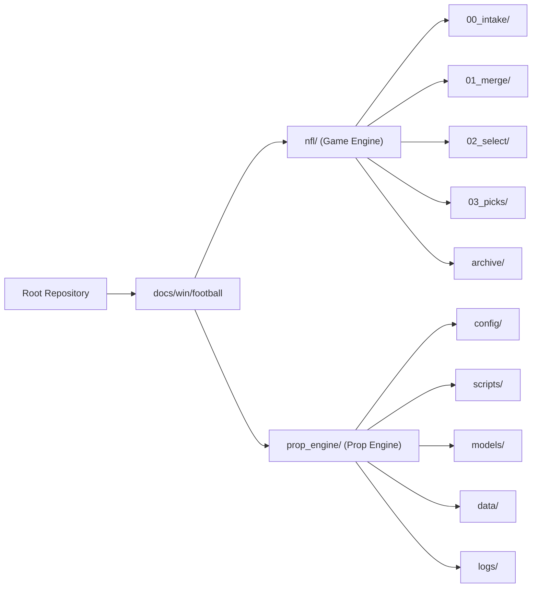

*Figure 1: High-level directory topology bridging repository roots to subsystem code entities.*

Sources: [.gitignore1-8](https://github.com/Clownworldenjoyer76/football_for_mat/blob/e5e69ed3/.gitignore#L1-L8)[docs/win/football/nfl/archive/docs/win/football/prop_engine/validate_common_usage.py24-30](https://github.com/Clownworldenjoyer76/football_for_mat/blob/e5e69ed3/docs/win/football/nfl/archive/docs/win/football/prop_engine/validate_common_usage.py#L24-L30)

---

## Stage-Numbered Execution Folders

The pipeline execution flows through sequentially numbered directory stages. This design guarantees deterministic dependency ordering across GitHub Actions workflows and local execution scripts.

- `00_intake/`: Raw data ingestion, API scraping, and schedule/odds snapshots.
- `01_merge/`: Feature engineering, data alignment, and canonical table construction (`week_N_NFL_enriched.csv`).
- `02_select/`: Mathematical expectation, edge calculation, Kelly criterion sizing, and band filtration (`week_N_NFL_selected.csv`).
- `03_picks/`: Final betting slip compilation, survivor pool processing, and locked snapshot generation.
- `04_final_scores/` (or `results/`): Game score ingestion, grading (`WIN`/`LOSS`/`PUSH`), and performance reporting.

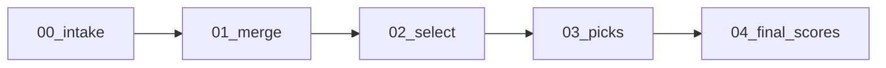

*Figure 2: Sequential execution stages represented by numbered directory structures.*

Sources: [.github/workflows/keep_workflows/nfl_annual_training_models.yml47-84](https://github.com/Clownworldenjoyer76/football_for_mat/blob/e5e69ed3/.github/workflows/keep_workflows/nfl_annual_training_models.yml#L47-L84)

---

## Filename Conventions and Weekly Patterns

Data artifacts generated across weekly pipeline runs adhere to strict regular expression patterns to ensure downstream automation scripts can parse and ingest them without manual intervention.

- **NFL Enriched Weekly Tables**: `week_N_NFL_enriched.csv` (or seasonal variants such as `2026_reg_N_*.csv`).
- **Odds Snapshots**: Structured JSON capture files stored under `00_intake/odds/raw/snapshots/*_nfl_odds.json`[docs/win/football/nfl/archive/docs/win/football/nfl/scripts/forward_validation/projection_week1_v4_shadow.py148-154](https://github.com/Clownworldenjoyer76/football_for_mat/blob/e5e69ed3/docs/win/football/nfl/archive/docs/win/football/nfl/scripts/forward_validation/projection_week1_v4_shadow.py#L148-L154)
- **Historical Core Training Sets**: `historical_core_YYYY.csv`[.github/workflows/keep_workflows/nfl_annual_training_models.yml91](https://github.com/Clownworldenjoyer76/football_for_mat/blob/e5e69ed3/.github/workflows/keep_workflows/nfl_annual_training_models.yml#L91-L91)
- **Prop Engine Parquet Features**: `player_form.parquet`, `player_game_features.parquet`[.gitignore1-6](https://github.com/Clownworldenjoyer76/football_for_mat/blob/e5e69ed3/.gitignore#L1-L6)

Sources: [.github/workflows/keep_workflows/nfl_annual_training_models.yml91](https://github.com/Clownworldenjoyer76/football_for_mat/blob/e5e69ed3/.github/workflows/keep_workflows/nfl_annual_training_models.yml#L91-L91)[docs/win/football/nfl/archive/docs/win/football/nfl/scripts/forward_validation/projection_week1_v4_shadow.py148-154](https://github.com/Clownworldenjoyer76/football_for_mat/blob/e5e69ed3/docs/win/football/nfl/archive/docs/win/football/nfl/scripts/forward_validation/projection_week1_v4_shadow.py#L148-L154)

---

## Error Logging and Validation Conventions

Each pipeline stage maintains an isolated `errors/` directory tree (e.g., `errors/00_intake/`, `errors/01_merge/`) where structured JSON error reports and stack traces are written upon failure.

- Common failure modes—such as `NO TOTAL MATCH`, missing feature columns, or unmatched `game_id` strings across data sources—trigger non-zero exit codes in runner scripts.
- Validators like `validate_common_usage.py` and `validate_config_enforcement.py` enforce strict code usage patterns, ensuring that shared helper functions (e.g., `common.py`) are utilized uniformly across build, train, and project modules [docs/win/football/nfl/archive/docs/win/football/prop_engine/validate_common_usage.py40-53](https://github.com/Clownworldenjoyer76/football_for_mat/blob/e5e69ed3/docs/win/football/nfl/archive/docs/win/football/prop_engine/validate_common_usage.py#L40-L53)

Sources: [docs/win/football/nfl/archive/docs/win/football/prop_engine/validate_common_usage.py40-53](https://github.com/Clownworldenjoyer76/football_for_mat/blob/e5e69ed3/docs/win/football/nfl/archive/docs/win/football/prop_engine/validate_common_usage.py#L40-L53)[docs/win/football/nfl/archive/docs/win/football/prop_engine/validate_config_enforcement.py58-71](https://github.com/Clownworldenjoyer76/football_for_mat/blob/e5e69ed3/docs/win/football/nfl/archive/docs/win/football/prop_engine/validate_config_enforcement.py#L58-L71)

---

## Archive Structure

The `archive/` directory preserves deprecated scripts, historical research probes, shadow validation runs, and legacy workflow files (e.g., `docs/win/football/nfl/archive/`) [docs/win/football/nfl/archive/docs/win/football/nfl/scripts/training/market_timing_probe.py1-15](https://github.com/Clownworldenjoyer76/football_for_mat/blob/e5e69ed3/docs/win/football/nfl/archive/docs/win/football/nfl/scripts/training/market_timing_probe.py#L1-L15) Artifacts in this tree are excluded from active production execution paths but serve as audit trails for market-timing investigations and alternative model evaluations (such as the v4 shadow forward validations) [docs/win/football/nfl/archive/docs/win/football/nfl/scripts/forward_validation/projection_week1_v4_shadow_entry.py58-99](https://github.com/Clownworldenjoyer76/football_for_mat/blob/e5e69ed3/docs/win/football/nfl/archive/docs/win/football/nfl/scripts/forward_validation/projection_week1_v4_shadow_entry.py#L58-L99)

Sources: [docs/win/football/nfl/archive/docs/win/football/nfl/scripts/training/market_timing_probe.py1-15](https://github.com/Clownworldenjoyer76/football_for_mat/blob/e5e69ed3/docs/win/football/nfl/archive/docs/win/football/nfl/scripts/training/market_timing_probe.py#L1-L15)[docs/win/football/nfl/archive/docs/win/football/nfl/scripts/forward_validation/projection_week1_v4_shadow_entry.py58-99](https://github.com/Clownworldenjoyer76/football_for_mat/blob/e5e69ed3/docs/win/football/nfl/archive/docs/win/football/nfl/scripts/forward_validation/projection_week1_v4_shadow_entry.py#L58-L99)

---

## Git Configuration, LFS, and Binary Artifacts

To prevent repository bloat while maintaining reproducibility, large generated intermediate files and trained model components are governed by `.gitignore` and `.gitattributes`.

- Feature parquets (`player_form.parquet`, `player_game_features.parquet`) and build caches are explicitly ignored [.gitignore1-8](https://github.com/Clownworldenjoyer76/football_for_mat/blob/e5e69ed3/.gitignore#L1-L8)
- Model artifacts—specifically CatBoost tree structures (`model.txt`) located under `docs/win/football/prop_engine/models/components/*/model.txt`—are tracked as binary model assets or managed via Git LFS conventions.

Sources: [.gitignore1-8](https://github.com/Clownworldenjoyer76/football_for_mat/blob/e5e69ed3/.gitignore#L1-L8)

---

# 1.2-Getting-Started-and-Environment

# Getting Started and Environment
Relevant source files
- [docs/win/football/nfl/config/markets.yaml](https://github.com/Clownworldenjoyer76/football_for_mat/blob/e5e69ed3/docs/win/football/nfl/config/markets.yaml)
- [docs/win/football/nfl/config/settings.yaml](https://github.com/Clownworldenjoyer76/football_for_mat/blob/e5e69ed3/docs/win/football/nfl/config/settings.yaml)
- [docs/win/football/nfl/scripts/02_select/selections.py](https://github.com/Clownworldenjoyer76/football_for_mat/blob/e5e69ed3/docs/win/football/nfl/scripts/02_select/selections.py)
- [requirements.txt](https://github.com/Clownworldenjoyer76/football_for_mat/blob/e5e69ed3/requirements.txt)

## Purpose and Scope

This page details the local environment setup, configuration resolution, environment variable usage (`NFL_SEASON`), dependency management via `requirements.txt`, and the designated file paths for outputs and error logs across the `docs/win/football/nfl` pipeline.

Sources: `requirements.txt:1-11`, `docs/win/football/nfl/config/settings.yaml:1-34`

---

## 1. Python Environment and Dependencies

The pipeline relies on a Python 3.9+ runtime environment. Third-party dependencies are pinned in `requirements.txt` to guarantee reproducibility across local execution and GitHub Actions orchestration.

To establish a local environment:

```
python -m venv venv
source venv/bin/activate
pip install -r requirements.txt
```

Key packages pinned in `requirements.txt` include data manipulation frameworks, numerical computing libraries, and gradient boosting engines:

- `pandas==1.5.3` [requirements.txt:1-1]
- `numpy==1.26.4` [requirements.txt:2-2]
- `scikit-learn==1.4.2` [requirements.txt:3-3]
- `lightgbm==4.3.0` [requirements.txt:4-4]
- `xgboost==2.0.3` [requirements.txt:5-5]
- `scipy==1.10.1` [requirements.txt:6-6]
- `pyarrow==14.0.2` [requirements.txt:7-7]
- `nfl_data_py==0.3.3` [requirements.txt:8-8]
- `pyyaml==6.0.2` [requirements.txt:9-9]

Sources: `requirements.txt:1-11`

---

## 2. Environment Variables and Season Configuration

Execution behavior is primarily governed by YAML configuration files, but environment variables can override or initialize context parameters. The primary environment variable utilized across scripts is `NFL_SEASON`.

- `NFL_SEASON`: Defines the active operational season (e.g., `2026`). If omitted, scripts fall back to the `season` key declared in `docs/win/football/nfl/config/settings.yaml`.

```

```

*Figure 1: Environment variable and configuration resolution flow mapping natural language configuration context to Python execution routines.*

Sources: `docs/win/football/nfl/config/settings.yaml:6-8`, `docs/win/football/nfl/scripts/02_select/selections.py:47-56`

---

## 3. Configuration Files Location and Layout

All pipeline configurations reside under `docs/win/football/nfl/config/`. The core configuration files are:

| File Path | Description | Key Parameters |
| --- | --- | --- |
| `docs/win/football/nfl/config/settings.yaml` | Global runtime settings, active season/week, default odds region, and global kelly/EV constraints. | `season`, `week`, `season_type`, `sportsbook`, `selection_defaults` [docs/win/football/nfl/config/settings.yaml:6-20] |
| `docs/win/football/nfl/config/markets.yaml` | Market-specific filtering bands for moneyline, spread, and totals. | `markets`, `odds_bands`, `edge_bands`, `ev_bands`, `kelly_bands` [docs/win/football/nfl/config/markets.yaml:12-178] |

Scripts resolve paths relative to `SCRIPT_DIR` and `NFL_ROOT` as demonstrated in `selections.py`:

```
SCRIPT_DIR = Path(__file__).resolve().parent
NFL_ROOT = SCRIPT_DIR.parents[1]
DEFAULT_SETTINGS_PATH = NFL_ROOT / "config/settings.yaml"
```

[docs/win/football/nfl/scripts/02_select/selections.py:52-55]

Sources: `docs/win/football/nfl/config/settings.yaml:1-34`, `docs/win/football/nfl/config/markets.yaml:1-178`, `docs/win/football/nfl/scripts/02_select/selections.py:52-55`

---

## 4. Outputs and Error Log Landing Zones

Execution outputs and runtime errors are strictly partitioned into stage-numbered directories under `docs/win/football/nfl/`.

```

```

*Figure 2: Data flow architecture mapping pipeline script execution to designated input/output directories and error log targets.*

### Directory Landing Reference

- **Intake Artifacts**: `docs/win/football/nfl/00_intake/` (Raw and cleaned schedules, play-by-play, odds snapshots, weather).
- **Merged Feature Tables**: `docs/win/football/nfl/01_merge/` (e.g., `week_{week}_NFL_enriched.csv`).
- **Selection Outputs**: `docs/win/football/nfl/02_select/` (e.g., `week_{week}_NFL_selected.csv` generated by `selections.py`).
- **Error Logs**: Stage-specific error directories (e.g., `docs/win/football/nfl/errors/02_select/` or root `errors/` logging execution exceptions, missing columns, or unmatched game IDs).

Sources: `docs/win/football/nfl/scripts/02_select/selections.py:5-15`, `docs/win/football/nfl/config/settings.yaml:1-34`

---

# 2-NFL-Game-Pipeline

# NFL Game Pipeline
Relevant source files
- [.github/workflows/nfl_01_pipeline.yml](https://github.com/Clownworldenjoyer76/football_for_mat/blob/e5e69ed3/.github/workflows/nfl_01_pipeline.yml)
- [.github/workflows/nfl_02_pipeline.yml](https://github.com/Clownworldenjoyer76/football_for_mat/blob/e5e69ed3/.github/workflows/nfl_02_pipeline.yml)
- [docs/win/football/nfl/02_select/week_1_NFL_selected.csv](https://github.com/Clownworldenjoyer76/football_for_mat/blob/e5e69ed3/docs/win/football/nfl/02_select/week_1_NFL_selected.csv)
- [docs/win/football/nfl/03_picks/all_games/all_week_1_NFL_picks.csv](https://github.com/Clownworldenjoyer76/football_for_mat/blob/e5e69ed3/docs/win/football/nfl/03_picks/all_games/all_week_1_NFL_picks.csv)
- [docs/win/football/nfl/03_picks/locked/week_1_NFL_select_picks_20260910_151009.csv](https://github.com/Clownworldenjoyer76/football_for_mat/blob/e5e69ed3/docs/win/football/nfl/03_picks/locked/week_1_NFL_select_picks_20260910_151009.csv)
- [docs/win/football/nfl/03_picks/projection/week_1_NFL_projection.csv](https://github.com/Clownworldenjoyer76/football_for_mat/blob/e5e69ed3/docs/win/football/nfl/03_picks/projection/week_1_NFL_projection.csv)
- [docs/win/football/nfl/03_picks/selected/week_1_NFL_select_picks.csv](https://github.com/Clownworldenjoyer76/football_for_mat/blob/e5e69ed3/docs/win/football/nfl/03_picks/selected/week_1_NFL_select_picks.csv)
- [docs/win/football/nfl/03_picks/week_1_NFL_picks.csv](https://github.com/Clownworldenjoyer76/football_for_mat/blob/e5e69ed3/docs/win/football/nfl/03_picks/week_1_NFL_picks.csv)
- [docs/win/football/nfl/scripts/00_intake/refresh_projection_sources.py](https://github.com/Clownworldenjoyer76/football_for_mat/blob/e5e69ed3/docs/win/football/nfl/scripts/00_intake/refresh_projection_sources.py)
- [docs/win/football/nfl/scripts/01_merge/projection_feature_builder_legacy_inseason.py](https://github.com/Clownworldenjoyer76/football_for_mat/blob/e5e69ed3/docs/win/football/nfl/scripts/01_merge/projection_feature_builder_legacy_inseason.py)
- [docs/win/football/nfl/scripts/01_merge/projection_feature_builder_legacy_week1.py](https://github.com/Clownworldenjoyer76/football_for_mat/blob/e5e69ed3/docs/win/football/nfl/scripts/01_merge/projection_feature_builder_legacy_week1.py)
- [docs/win/football/nfl/text_docs/NEXTSEASON.txt](https://github.com/Clownworldenjoyer76/football_for_mat/blob/e5e69ed3/docs/win/football/nfl/text_docs/NEXTSEASON.txt)

### Purpose and Scope

This section outlines the end-to-end architecture of the NFL game betting pipeline under `docs/win/football/nfl/`. The pipeline ingests raw league schedules, market odds, player/team statistics, and external model forecasts; merges and enriches these inputs into unified feature matrices; applies quantitative selection rules (EV, Kelly criteria, and odds bands); generates final picks; and grades historical outcomes against real game scores.

For details on individual sub-topics, see the respective child pages:

- [Stage 00 — Data Intake](/Clownworldenjoyer76/football_for_mat/2.1-stage-00-data-intake)
- [Prediction Enrichment and Rule Matching](/Clownworldenjoyer76/football_for_mat/2.2-prediction-enrichment-and-rule-matching)
- [Stage 01 — Merge and Projections](/Clownworldenjoyer76/football_for_mat/2.3-stage-01-merge-and-projections)
- [Stage 02 — Selection Engine](/Clownworldenjoyer76/football_for_mat/2.4-stage-02-selection-engine)
- [Stage 03 — Picks Generation](/Clownworldenjoyer76/football_for_mat/2.5-stage-03-picks-generation)
- [Stage 04 — Final Scores and Grading](/Clownworldenjoyer76/football_for_mat/2.6-stage-04-final-scores-and-grading)

*Sources: [.github/workflows/nfl_01_pipeline.yml125-142](https://github.com/Clownworldenjoyer76/football_for_mat/blob/e5e69ed3/.github/workflows/nfl_01_pipeline.yml#L125-L142)[.github/workflows/nfl_02_pipeline.yml121-212](https://github.com/Clownworldenjoyer76/football_for_mat/blob/e5e69ed3/.github/workflows/nfl_02_pipeline.yml#L121-L212)[docs/win/football/nfl/scripts/01_merge/projection_feature_builder_legacy_inseason.py1-40](https://github.com/Clownworldenjoyer76/football_for_mat/blob/e5e69ed3/docs/win/football/nfl/scripts/01_merge/projection_feature_builder_legacy_inseason.py#L1-L40)[docs/win/football/nfl/scripts/01_merge/projection_feature_builder_legacy_week1.py1-20](https://github.com/Clownworldenjoyer76/football_for_mat/blob/e5e69ed3/docs/win/football/nfl/scripts/01_merge/projection_feature_builder_legacy_week1.py#L1-L20) *

---

## 2.1. Stage 00 — Data Intake

Stage 00 handles data ingestion from external sources (`nflreadpy`, `nfl_data_py`, ESPN APIs, and repository-level cross-checkouts like DRAT). Scripts pull schedules, play-by-play data, team and quarterback stats, market odds, injury reports, roster mappings, depth charts, weather, and external forecasts. All output files are structured under `00_intake/` and logged via structured error files under `errors/00_intake/`.

For full technical specifications, file schemas, and execution workflows, see [Stage 00 — Data Intake](/Clownworldenjoyer76/football_for_mat/2.1-stage-00-data-intake).

*Sources: [.github/workflows/nfl_01_pipeline.yml33-173](https://github.com/Clownworldenjoyer76/football_for_mat/blob/e5e69ed3/.github/workflows/nfl_01_pipeline.yml#L33-L173)[.github/workflows/nfl_02_pipeline.yml121-164](https://github.com/Clownworldenjoyer76/football_for_mat/blob/e5e69ed3/.github/workflows/nfl_02_pipeline.yml#L121-L164) *

---

## 2.2. Prediction Enrichment and Rule Matching

Once raw predictions and market odds are ingested, `finalize_pred.py` and the enrichment family (`enrich_moneyline.py`, `enrich_spread.py`, `enrich_totals.py`, and `enrich_combine.py`) join clean model outputs with current sports betting market lines. This stage assigns historical rule-matching namespaces (`HE`, `HSE`, `HTE`), computes model probabilities against implied market probabilities, evaluates consensus flags (`ALL3_CONSENSUS`), and writes enriched weekly prediction tables.

For detailed descriptions of rule namespaces, threshold calculations, and output paths, see [Prediction Enrichment and Rule Matching](/Clownworldenjoyer76/football_for_mat/2.2-prediction-enrichment-and-rule-matching).

*Sources: [.github/workflows/nfl_02_pipeline.yml198-212](https://github.com/Clownworldenjoyer76/football_for_mat/blob/e5e69ed3/.github/workflows/nfl_02_pipeline.yml#L198-L212) *

---

## 2.3. Stage 01 — Merge and Projections

Stage 01 transforms enriched weekly records into comprehensive machine-learning feature vectors for game prediction. Using `projection.py`, `projection_week1.py`, and legacy feature builder scripts like `docs/win/football/nfl/scripts/01_merge/projection_feature_builder_legacy_inseason.py` and `docs/win/football/nfl/scripts/01_merge/projection_feature_builder_legacy_week1.py`, the pipeline builds 260-feature matrices adhering strictly to schema definitions. It handles seasonal mode switching (`week1` vs. `inseason`) to enforce leakage safety.

*Sources: [.github/workflows/nfl_01_pipeline.yml5-13](https://github.com/Clownworldenjoyer76/football_for_mat/blob/e5e69ed3/.github/workflows/nfl_01_pipeline.yml#L5-L13)[docs/win/football/nfl/scripts/01_merge/projection_feature_builder_legacy_inseason.py9-38](https://github.com/Clownworldenjoyer76/football_for_mat/blob/e5e69ed3/docs/win/football/nfl/scripts/01_merge/projection_feature_builder_legacy_inseason.py#L9-L38)[docs/win/football/nfl/scripts/01_merge/projection_feature_builder_legacy_week1.py5-18](https://github.com/Clownworldenjoyer76/football_for_mat/blob/e5e69ed3/docs/win/football/nfl/scripts/01_merge/projection_feature_builder_legacy_week1.py#L5-L18) *

For detailed rules on week-1 priors versus in-season rolling metrics, see [Stage 01 — Merge and Projections](/Clownworldenjoyer76/football_for_mat/2.3-stage-01-merge-and-projections).

---

## 2.4. Stage 02 — Selection Engine

The Selection Engine (`scripts/02_select/selections.py`) evaluates enriched projection matrices against thresholds defined in `config/settings.yaml` and `config/markets.yaml`. It calculates expected value (`EV`), model edge, and Kelly criterion allocation bounds. Games meeting strategy criteria are flagged and written to `02_select/week_N_NFL_selected.csv`.

For deeper explanations of band filters, Kelly sizing parameters, and configuration files, see [Stage 02 — Selection Engine](/Clownworldenjoyer76/football_for_mat/2.4-stage-02-selection-engine).

*Sources: [docs/win/football/nfl/02_select/week_1_NFL_selected.csv1-15](https://github.com/Clownworldenjoyer76/football_for_mat/blob/e5e69ed3/docs/win/football/nfl/02_select/week_1_NFL_selected.csv#L1-L15) *

---

## 2.5. Stage 03 — Picks Generation

Stage 03 aggregates selected wagers and projections into user-facing artifacts via scripts like `picks.py`, `all_games_picks.py`, `final_picks.py`, and `survivor.py`. Outputs are organized under `03_picks/` into distinct subdirectories containing filtered picks, full projection summaries, locked timestamped snapshots (`locked/`), survivor tracking, and `nmbets` reporting formats.

For schema definitions of lock files and pick collections, see [Stage 03 — Picks Generation](/Clownworldenjoyer76/football_for_mat/2.5-stage-03-picks-generation).

*Sources: [docs/win/football/nfl/03_picks/all_games/all_week_1_NFL_picks.csv1-15](https://github.com/Clownworldenjoyer76/football_for_mat/blob/e5e69ed3/docs/win/football/nfl/03_picks/all_games/all_week_1_NFL_picks.csv#L1-L15)[docs/win/football/nfl/03_picks/projection/week_1_NFL_projection.csv1-15](https://github.com/Clownworldenjoyer76/football_for_mat/blob/e5e69ed3/docs/win/football/nfl/03_picks/projection/week_1_NFL_projection.csv#L1-L15)[docs/win/football/nfl/03_picks/selected/week_1_NFL_select_picks.csv1-6](https://github.com/Clownworldenjoyer76/football_for_mat/blob/e5e69ed3/docs/win/football/nfl/03_picks/selected/week_1_NFL_select_picks.csv#L1-L6) *

---

## 2.6. Stage 04 — Final Scores and Grading

The final stage of the pipeline pulls official game outcomes via `pull_final_scores.py` and grades historical predictions. It evaluates moneyline, spread, and totals wagers as `WIN`, `LOSS`, or `PUSH`, and updates survivor tracking logs under `results/` and `results/graded/`.

For validation routines and grading logic criteria, see [Stage 04 — Final Scores and Grading](/Clownworldenjoyer76/football_for_mat/2.6-stage-04-final-scores-and-grading).

*Sources: [.github/workflows/nfl_01_pipeline.yml134-136](https://github.com/Clownworldenjoyer76/football_for_mat/blob/e5e69ed3/.github/workflows/nfl_01_pipeline.yml#L134-L136) *

---

# 2.1-Stage-00-—-Data-Intake

# Stage 00 — Data Intake
Relevant source files
- [docs/win/football/nfl/00_intake/odds/openers/2026_NFL_openers.csv](https://github.com/Clownworldenjoyer76/football_for_mat/blob/e5e69ed3/docs/win/football/nfl/00_intake/odds/openers/2026_NFL_openers.csv)
- [docs/win/football/nfl/00_intake/pbp/2026_pbp.csv.gz](https://github.com/Clownworldenjoyer76/football_for_mat/blob/e5e69ed3/docs/win/football/nfl/00_intake/pbp/2026_pbp.csv.gz)
- [docs/win/football/nfl/00_intake/qb/2026_qb_stats.csv](https://github.com/Clownworldenjoyer76/football_for_mat/blob/e5e69ed3/docs/win/football/nfl/00_intake/qb/2026_qb_stats.csv)
- [docs/win/football/nfl/00_intake/schedule/updates/2026_schedule_20260915_101427.csv](https://github.com/Clownworldenjoyer76/football_for_mat/blob/e5e69ed3/docs/win/football/nfl/00_intake/schedule/updates/2026_schedule_20260915_101427.csv)
- [docs/win/football/nfl/00_intake/schedule/weekly/week_1_NFL_weekly_schedule.csv](https://github.com/Clownworldenjoyer76/football_for_mat/blob/e5e69ed3/docs/win/football/nfl/00_intake/schedule/weekly/week_1_NFL_weekly_schedule.csv)
- [docs/win/football/nfl/00_intake/team_stats/2026_team_stats.csv](https://github.com/Clownworldenjoyer76/football_for_mat/blob/e5e69ed3/docs/win/football/nfl/00_intake/team_stats/2026_team_stats.csv)
- [docs/win/football/nfl/data/league_leaders/league_leaders_2026.csv](https://github.com/Clownworldenjoyer76/football_for_mat/blob/e5e69ed3/docs/win/football/nfl/data/league_leaders/league_leaders_2026.csv)
- [docs/win/football/nfl/data/market_futures/market_futures_2026.csv](https://github.com/Clownworldenjoyer76/football_for_mat/blob/e5e69ed3/docs/win/football/nfl/data/market_futures/market_futures_2026.csv)
- [docs/win/football/nfl/data/master/league_standings.csv](https://github.com/Clownworldenjoyer76/football_for_mat/blob/e5e69ed3/docs/win/football/nfl/data/master/league_standings.csv)
- [docs/win/football/nfl/data/master/roster_master.csv](https://github.com/Clownworldenjoyer76/football_for_mat/blob/e5e69ed3/docs/win/football/nfl/data/master/roster_master.csv)
- [docs/win/football/nfl/data/qb_data/qbr_data/2026/qbr_week1.csv](https://github.com/Clownworldenjoyer76/football_for_mat/blob/e5e69ed3/docs/win/football/nfl/data/qb_data/qbr_data/2026/qbr_week1.csv)
- [docs/win/football/nfl/data/raw/raw_roster.csv](https://github.com/Clownworldenjoyer76/football_for_mat/blob/e5e69ed3/docs/win/football/nfl/data/raw/raw_roster.csv)
- [docs/win/football/nfl/data/team_power_index/team_power_index_2026.csv](https://github.com/Clownworldenjoyer76/football_for_mat/blob/e5e69ed3/docs/win/football/nfl/data/team_power_index/team_power_index_2026.csv)
- [docs/win/football/nfl/data/weather/week_1_NFL_weekly_weather.csv](https://github.com/Clownworldenjoyer76/football_for_mat/blob/e5e69ed3/docs/win/football/nfl/data/weather/week_1_NFL_weekly_weather.csv)
- [docs/win/football/nfl/errors/00_intake/build_weekly_schedule.txt](https://github.com/Clownworldenjoyer76/football_for_mat/blob/e5e69ed3/docs/win/football/nfl/errors/00_intake/build_weekly_schedule.txt)
- [docs/win/football/nfl/errors/00_intake/fetch_weather.txt](https://github.com/Clownworldenjoyer76/football_for_mat/blob/e5e69ed3/docs/win/football/nfl/errors/00_intake/fetch_weather.txt)
- [docs/win/football/nfl/errors/00_intake/pull_e_predictions.txt](https://github.com/Clownworldenjoyer76/football_for_mat/blob/e5e69ed3/docs/win/football/nfl/errors/00_intake/pull_e_predictions.txt)
- [docs/win/football/nfl/errors/00_intake/pull_final_scores.txt](https://github.com/Clownworldenjoyer76/football_for_mat/blob/e5e69ed3/docs/win/football/nfl/errors/00_intake/pull_final_scores.txt)
- [docs/win/football/nfl/errors/00_intake/pull_odds.txt](https://github.com/Clownworldenjoyer76/football_for_mat/blob/e5e69ed3/docs/win/football/nfl/errors/00_intake/pull_odds.txt)
- [docs/win/football/nfl/errors/00_intake/pull_opening_odds.txt](https://github.com/Clownworldenjoyer76/football_for_mat/blob/e5e69ed3/docs/win/football/nfl/errors/00_intake/pull_opening_odds.txt)
- [docs/win/football/nfl/errors/00_intake/pull_pbp.txt](https://github.com/Clownworldenjoyer76/football_for_mat/blob/e5e69ed3/docs/win/football/nfl/errors/00_intake/pull_pbp.txt)
- [docs/win/football/nfl/errors/00_intake/pull_schedule.txt](https://github.com/Clownworldenjoyer76/football_for_mat/blob/e5e69ed3/docs/win/football/nfl/errors/00_intake/pull_schedule.txt)
- [docs/win/football/nfl/errors/00_intake/pull_team_stats.txt](https://github.com/Clownworldenjoyer76/football_for_mat/blob/e5e69ed3/docs/win/football/nfl/errors/00_intake/pull_team_stats.txt)

## Purpose and Scope

Stage 00 is the foundational ingestion tier of the NFL game-prediction pipeline, located under `docs/win/football/nfl/scripts/00_intake/`. Its primary responsibility is fetching raw data from external APIs (such as `nfl_data_py`, `nflreadpy`, and ESPN odds feeds), parsing external cross-repository data files, cleaning formats, and outputting standardized CSV files, compressed archives (`.csv.gz`), and JSON snapshots into `docs/win/football/nfl/00_intake/`.

Execution logs and diagnostic run records for each intake script are captured under `docs/win/football/nfl/errors/00_intake/` to facilitate pipeline monitoring and error gating.

Sources: `docs/win/football/nfl/errors/00_intake/pull_pbp.txt:1-12`(), `docs/win/football/nfl/errors/00_intake/pull_schedule.txt:1-8`(), `docs/win/football/nfl/errors/00_intake/pull_odds.txt:1-10`()

---

## 2.1.1 Schedule, Play-by-Play and Team Stats Intake

The schedule and play-by-play (PBP) subsystem ingests core game structures, historical play data spanning seasons 2021–2026, and advanced team performance metrics. Scripts such as `pull_schedule.py`, `pull_pbp.py`, and `pull_team_stats.py` interact with `nfl_data_py` and `nflreadpy` to extract granular drive and play outcomes, writing compressed `.csv.gz` datasets and weekly schedule files like `docs/win/football/nfl/00_intake/schedule/weekly/week_2_NFL_weekly_schedule.csv`[docs/win/football/nfl/errors/00_intake/build_weekly_schedule.txt1-15](https://github.com/Clownworldenjoyer76/football_for_mat/blob/e5e69ed3/docs/win/football/nfl/errors/00_intake/build_weekly_schedule.txt#L1-L15)

Execution diagnostics track row counts, columns, and missing feature checks, logging output status directly to `docs/win/football/nfl/errors/00_intake/pull_pbp.txt` and related error logs [docs/win/football/nfl/errors/00_intake/pull_pbp.txt1-14](https://github.com/Clownworldenjoyer76/football_for_mat/blob/e5e69ed3/docs/win/football/nfl/errors/00_intake/pull_pbp.txt#L1-L14) For comprehensive documentation on output schemas, season archives, and weekly builders, see [Schedule, Play-by-Play and Team Stats Intake](/Clownworldenjoyer76/football_for_mat/2.1.1-schedule-play-by-play-and-team-stats-intake).

Sources: `docs/win/football/nfl/errors/00_intake/pull_pbp.txt:1-14`(), `docs/win/football/nfl/errors/00_intake/pull_team_stats.txt:1-11`(), `docs/win/football/nfl/errors/00_intake/build_weekly_schedule.txt:1-16]()

---

## 2.1.2 Odds and Market Data Intake

Market data intake handles betting odds, opening lines, spread/total movements, and season futures through scripts such as `pull_odds.py`, `pull_opening_odds.py`, and `pull_market_futures.py`. Raw JSON payloads from sportsbooks are stored under `docs/win/football/nfl/00_intake/odds/raw/`, snapshotted with timestamps, and normalized into structured CSV tables like `docs/win/football/nfl/00_intake/odds/openers/2026_NFL_openers.csv`[docs/win/football/nfl/errors/00_intake/pull_odds.txt1-9](https://github.com/Clownworldenjoyer76/football_for_mat/blob/e5e69ed3/docs/win/football/nfl/errors/00_intake/pull_odds.txt#L1-L9)[docs/win/football/nfl/00_intake/odds/openers/2026_NFL_openers.csv1-7](https://github.com/Clownworldenjoyer76/football_for_mat/blob/e5e69ed3/docs/win/football/nfl/00_intake/odds/openers/2026_NFL_openers.csv#L1-L7)

These scripts capture line movement flags, bookmaker metadata, and timestamped market timing audits to support down-stream edge calculations. For detailed schema specifications and timing artifacts, see [Odds and Market Data Intake](/Clownworldenjoyer76/football_for_mat/2.1.2-odds-and-market-data-intake).

Sources: `docs/win/football/nfl/errors/00_intake/pull_odds.txt:1-10`(), `docs/win/football/nfl/errors/00_intake/pull_opening_odds.txt:1-16]`, `docs/win/football/nfl/00_intake/odds/openers/2026_NFL_openers.csv:1-7`()

---

## 2.1.3 Rosters, Depth Charts, Injuries and Context Data

Contextual ingestion scripts—including `pull_raw_roster.py`, `roster_cleanup.py`, `depth_chart.py`, `pull_injuries.py`, `fetch_weather.py`, and `build_travel.py`—compile foundational roster data, stadium mappings, coach directories, and environmental conditions. Weather fetching utilities cross-reference stadium geographical coordinates (`latitude`, `longitude`) to populate forecast metrics like `docs/win/football/nfl/data/weather/week_1_NFL_weekly_weather.csv`[docs/win/football/nfl/data/weather/week_1_NFL_weekly_weather.csv1-17](https://github.com/Clownworldenjoyer76/football_for_mat/blob/e5e69ed3/docs/win/football/nfl/data/weather/week_1_NFL_weekly_weather.csv#L1-L17)

Master configuration files and error tracking (such as missing stadium matches or forecast ranges) are maintained under `docs/win/football/nfl/errors/00_intake/fetch_weather.txt`[docs/win/football/nfl/errors/00_intake/fetch_weather.txt1-18](https://github.com/Clownworldenjoyer76/football_for_mat/blob/e5e69ed3/docs/win/football/nfl/errors/00_intake/fetch_weather.txt#L1-L18) For complete master table schemas and mapping configurations, see [Rosters, Depth Charts, Injuries and Context Data](/Clownworldenjoyer76/football_for_mat/2.1.3-rosters-depth-charts-injuries-and-context-data).

Sources: `docs/win/football/nfl/errors/00_intake/fetch_weather.txt:1-18]`, `docs/win/football/nfl/data/weather/week_1_NFL_weekly_weather.csv:1-18`()

---

## 2.1.4 External Prediction Sources: DRAT and E-Predictions

External projection sources are ingested, normalized, and tiered via scripts such as `clean_drat.py`, `clean_e_pred.py`, and `pull_e_predictions.py`. These components process external rating systems and convert weekly prediction outputs into structured csv files under `docs/win/football/nfl/00_intake/predictions/e_predictions/`[docs/win/football/nfl/errors/00_intake/pull_e_predictions.txt1-10](https://github.com/Clownworldenjoyer76/football_for_mat/blob/e5e69ed3/docs/win/football/nfl/errors/00_intake/pull_e_predictions.txt#L1-L10)

Sources: `docs/win/football/nfl/errors/00_intake/pull_e_predictions.txt:1-10`()

The subsystem ensures game_id canonicalization and alignment with the pipeline's weekly scheduling structure. For details on raw/clean tiers, game-ID mapping rules, and projection refresh scripts, see [External Prediction Sources: DRAT and E-Predictions](/Clownworldenjoyer76/football_for_mat/2.1.4-external-prediction-sources:-drat-and-e-predictions).

---

# 2.1.1-Schedule,-Play-by-Play-and-Team-Stats-Intake

# Schedule, Play-by-Play and Team Stats Intake
Relevant source files
- [docs/win/football/nfl/00_intake/pbp/2021_pbp.csv.gz](https://github.com/Clownworldenjoyer76/football_for_mat/blob/e5e69ed3/docs/win/football/nfl/00_intake/pbp/2021_pbp.csv.gz)
- [docs/win/football/nfl/00_intake/pbp/2026_pbp.csv.gz](https://github.com/Clownworldenjoyer76/football_for_mat/blob/e5e69ed3/docs/win/football/nfl/00_intake/pbp/2026_pbp.csv.gz)
- [docs/win/football/nfl/00_intake/qb/2021_qb_stats.csv](https://github.com/Clownworldenjoyer76/football_for_mat/blob/e5e69ed3/docs/win/football/nfl/00_intake/qb/2021_qb_stats.csv)
- [docs/win/football/nfl/00_intake/qb/2022_qb_stats.csv](https://github.com/Clownworldenjoyer76/football_for_mat/blob/e5e69ed3/docs/win/football/nfl/00_intake/qb/2022_qb_stats.csv)
- [docs/win/football/nfl/00_intake/qb/2023_qb_stats.csv](https://github.com/Clownworldenjoyer76/football_for_mat/blob/e5e69ed3/docs/win/football/nfl/00_intake/qb/2023_qb_stats.csv)
- [docs/win/football/nfl/00_intake/qb/2024_qb_stats.csv](https://github.com/Clownworldenjoyer76/football_for_mat/blob/e5e69ed3/docs/win/football/nfl/00_intake/qb/2024_qb_stats.csv)
- [docs/win/football/nfl/00_intake/qb/2025_qb_stats.csv](https://github.com/Clownworldenjoyer76/football_for_mat/blob/e5e69ed3/docs/win/football/nfl/00_intake/qb/2025_qb_stats.csv)
- [docs/win/football/nfl/00_intake/qb/2026_qb_stats.csv](https://github.com/Clownworldenjoyer76/football_for_mat/blob/e5e69ed3/docs/win/football/nfl/00_intake/qb/2026_qb_stats.csv)
- [docs/win/football/nfl/00_intake/schedule/updates/2026_schedule_20260915_101427.csv](https://github.com/Clownworldenjoyer76/football_for_mat/blob/e5e69ed3/docs/win/football/nfl/00_intake/schedule/updates/2026_schedule_20260915_101427.csv)
- [docs/win/football/nfl/00_intake/team_stats/2021_team_stats.csv](https://github.com/Clownworldenjoyer76/football_for_mat/blob/e5e69ed3/docs/win/football/nfl/00_intake/team_stats/2021_team_stats.csv)
- [docs/win/football/nfl/00_intake/team_stats/2026_team_stats.csv](https://github.com/Clownworldenjoyer76/football_for_mat/blob/e5e69ed3/docs/win/football/nfl/00_intake/team_stats/2026_team_stats.csv)
- [docs/win/football/nfl/data/league_leaders/league_leaders_2026.csv](https://github.com/Clownworldenjoyer76/football_for_mat/blob/e5e69ed3/docs/win/football/nfl/data/league_leaders/league_leaders_2026.csv)
- [docs/win/football/nfl/data/market_futures/market_futures_2026.csv](https://github.com/Clownworldenjoyer76/football_for_mat/blob/e5e69ed3/docs/win/football/nfl/data/market_futures/market_futures_2026.csv)
- [docs/win/football/nfl/data/master/league_standings.csv](https://github.com/Clownworldenjoyer76/football_for_mat/blob/e5e69ed3/docs/win/football/nfl/data/master/league_standings.csv)
- [docs/win/football/nfl/data/qb_data/qbr_data/2026/qbr_week1.csv](https://github.com/Clownworldenjoyer76/football_for_mat/blob/e5e69ed3/docs/win/football/nfl/data/qb_data/qbr_data/2026/qbr_week1.csv)
- [docs/win/football/nfl/data/team_power_index/team_power_index_2022.csv](https://github.com/Clownworldenjoyer76/football_for_mat/blob/e5e69ed3/docs/win/football/nfl/data/team_power_index/team_power_index_2022.csv)
- [docs/win/football/nfl/data/team_power_index/team_power_index_2023.csv](https://github.com/Clownworldenjoyer76/football_for_mat/blob/e5e69ed3/docs/win/football/nfl/data/team_power_index/team_power_index_2023.csv)
- [docs/win/football/nfl/data/team_power_index/team_power_index_2024.csv](https://github.com/Clownworldenjoyer76/football_for_mat/blob/e5e69ed3/docs/win/football/nfl/data/team_power_index/team_power_index_2024.csv)
- [docs/win/football/nfl/data/team_power_index/team_power_index_2025.csv](https://github.com/Clownworldenjoyer76/football_for_mat/blob/e5e69ed3/docs/win/football/nfl/data/team_power_index/team_power_index_2025.csv)
- [docs/win/football/nfl/data/team_power_index/team_power_index_2026.csv](https://github.com/Clownworldenjoyer76/football_for_mat/blob/e5e69ed3/docs/win/football/nfl/data/team_power_index/team_power_index_2026.csv)
- [docs/win/football/nfl/errors/00_intake/pull_final_scores.txt](https://github.com/Clownworldenjoyer76/football_for_mat/blob/e5e69ed3/docs/win/football/nfl/errors/00_intake/pull_final_scores.txt)
- [docs/win/football/nfl/errors/00_intake/pull_pbp.txt](https://github.com/Clownworldenjoyer76/football_for_mat/blob/e5e69ed3/docs/win/football/nfl/errors/00_intake/pull_pbp.txt)
- [docs/win/football/nfl/errors/00_intake/pull_schedule.txt](https://github.com/Clownworldenjoyer76/football_for_mat/blob/e5e69ed3/docs/win/football/nfl/errors/00_intake/pull_schedule.txt)
- [docs/win/football/nfl/errors/00_intake/pull_team_stats.txt](https://github.com/Clownworldenjoyer76/football_for_mat/blob/e5e69ed3/docs/win/football/nfl/errors/00_intake/pull_team_stats.txt)
- [docs/win/football/nfl/scripts/00_intake/pull_league_leaders.py](https://github.com/Clownworldenjoyer76/football_for_mat/blob/e5e69ed3/docs/win/football/nfl/scripts/00_intake/pull_league_leaders.py)
- [docs/win/football/nfl/scripts/00_intake/pull_market_futures.py](https://github.com/Clownworldenjoyer76/football_for_mat/blob/e5e69ed3/docs/win/football/nfl/scripts/00_intake/pull_market_futures.py)
- [docs/win/football/nfl/scripts/00_intake/pull_pbp.py](https://github.com/Clownworldenjoyer76/football_for_mat/blob/e5e69ed3/docs/win/football/nfl/scripts/00_intake/pull_pbp.py)
- [docs/win/football/nfl/scripts/00_intake/pull_qb_stats.py](https://github.com/Clownworldenjoyer76/football_for_mat/blob/e5e69ed3/docs/win/football/nfl/scripts/00_intake/pull_qb_stats.py)
- [docs/win/football/nfl/scripts/00_intake/pull_schedule.py](https://github.com/Clownworldenjoyer76/football_for_mat/blob/e5e69ed3/docs/win/football/nfl/scripts/00_intake/pull_schedule.py)

## Purpose and Scope

This page details the **Stage 00 Data Intake** subsystem responsible for acquiring, parsing, and normalizing core operational NFL data (`docs/win/football/nfl/00_intake/` and related data stores). This tier ingests schedules, play-by-play (PBP) event streams, team efficiencies, quarterback metrics, team power ratings, and league-wide statistical leaders across historical and active season archives spanning 2021 through 2026. These normalized intake artifacts form the foundational layer for downstream feature engineering, game merging, and prediction modeling.

---

## 1. Schedule Intake (`pull_schedule.py`)

The schedule intake pipeline is governed by `docs/win/football/nfl/scripts/00_intake/pull_schedule.py`[docs/win/football/nfl/scripts/00_intake/pull_schedule.py5-24](https://github.com/Clownworldenjoyer76/football_for_mat/blob/e5e69ed3/docs/win/football/nfl/scripts/00_intake/pull_schedule.py#L5-L24) It queries the ESPN team schedule API for each team ID defined in the master configuration, resolving canonical team identities and stadium attributes.

### Implementation and Data Flow

- **Source Endpoint**: `https://site.api.espn.com/apis/site/v2/sports/football/nfl/teams/{TEAM_ID}/schedule?season={YEAR}`[docs/win/football/nfl/scripts/00_intake/pull_schedule.py10](https://github.com/Clownworldenjoyer76/football_for_mat/blob/e5e69ed3/docs/win/football/nfl/scripts/00_intake/pull_schedule.py#L10-L10)
- **Mapping Inputs**:

- `docs/win/football/nfl/config/mapping/team_map.csv`[docs/win/football/nfl/scripts/00_intake/pull_schedule.py65](https://github.com/Clownworldenjoyer76/football_for_mat/blob/e5e69ed3/docs/win/football/nfl/scripts/00_intake/pull_schedule.py#L65-L65)
- `docs/win/football/nfl/config/mapping/stadium_map_nfl.csv`[docs/win/football/nfl/scripts/00_intake/pull_schedule.py66](https://github.com/Clownworldenjoyer76/football_for_mat/blob/e5e69ed3/docs/win/football/nfl/scripts/00_intake/pull_schedule.py#L66-L66)
- **Outputs**:

- Primary consolidated schedule: `docs/win/football/nfl/00_intake/schedule/{YEAR}_schedule.csv`[docs/win/football/nfl/scripts/00_intake/pull_schedule.py68-69](https://github.com/Clownworldenjoyer76/football_for_mat/blob/e5e69ed3/docs/win/football/nfl/scripts/00_intake/pull_schedule.py#L68-L69)
- Timestamped per-run snapshots: `docs/win/football/nfl/00_intake/schedule/updates/{YEAR}_schedule_YYYYMMDD_HHMMSS.csv`[docs/win/football/nfl/scripts/00_intake/pull_schedule.py70-71](https://github.com/Clownworldenjoyer76/football_for_mat/blob/e5e69ed3/docs/win/football/nfl/scripts/00_intake/pull_schedule.py#L70-L71)
- Execution summary and warnings log: `docs/win/football/nfl/errors/00_intake/pull_schedule.txt`[docs/win/football/nfl/scripts/00_intake/pull_schedule.py23-24](https://github.com/Clownworldenjoyer76/football_for_mat/blob/e5e69ed3/docs/win/football/nfl/scripts/00_intake/pull_schedule.py#L23-L24)

*Sources: [docs/win/football/nfl/scripts/00_intake/pull_schedule.py5-78](https://github.com/Clownworldenjoyer76/football_for_mat/blob/e5e69ed3/docs/win/football/nfl/scripts/00_intake/pull_schedule.py#L5-L78) [docs/win/football/nfl/errors/00_intake/pull_schedule.txt:1-6]*

### Output Schema (`{YEAR}_schedule.csv`)

The schedule output enforces the following canonical columns [docs/win/football/nfl/scripts/00_intake/pull_schedule.py42-58](https://github.com/Clownworldenjoyer76/football_for_mat/blob/e5e69ed3/docs/win/football/nfl/scripts/00_intake/pull_schedule.py#L42-L58):

- `season`, `season_type`, `week`, `game_id`, `game_date`, `game_time`
- `away_team`, `home_team`, `neutral_site`, `stadium`, `roof`, `surface`
- `home_timezone`, `away_timezone`, `game_timezone`

Sources: [docs/win/football/nfl/scripts/00_intake/pull_schedule.py5-78](https://github.com/Clownworldenjoyer76/football_for_mat/blob/e5e69ed3/docs/win/football/nfl/scripts/00_intake/pull_schedule.py#L5-L78)[docs/win/football/nfl/errors/00_intake/pull_schedule.txt1-6](https://github.com/Clownworldenjoyer76/football_for_mat/blob/e5e69ed3/docs/win/football/nfl/errors/00_intake/pull_schedule.txt#L1-L6)

---

## 2. Play-by-Play Intake (`pull_pbp.py`)

Play-by-play data ingestion is handled via `pull_pbp.py`, which pulls granular play logs for seasons 2021 through 2026 using Python packages `nflreadpy` and `nfl_data_py`[docs/win/football/nfl/errors/00_intake/pull_pbp.txt2-12](https://github.com/Clownworldenjoyer76/football_for_mat/blob/e5e69ed3/docs/win/football/nfl/errors/00_intake/pull_pbp.txt#L2-L12)

### Implementation and Data Flow

- **Libraries**: `nflreadpy` (primary source for historical/active season archives) and `nfl_data_py` (fallback/automatic source selection) [docs/win/football/nfl/errors/00_intake/pull_pbp.txt3-10](https://github.com/Clownworldenjoyer76/football_for_mat/blob/e5e69ed3/docs/win/football/nfl/errors/00_intake/pull_pbp.txt#L3-L10)
- **Output Formats**: Compressed CSV archives stored as `.csv.gz` under `docs/win/football/nfl/00_intake/pbp/`[docs/win/football/nfl/errors/00_intake/pull_pbp.txt12](https://github.com/Clownworldenjoyer76/football_for_mat/blob/e5e69ed3/docs/win/football/nfl/errors/00_intake/pull_pbp.txt#L12-L12)
- **Error/Audit Tracking**: Logged under `docs/win/football/nfl/errors/00_intake/pull_pbp.txt`[docs/win/football/nfl/errors/00_intake/pull_pbp.txt1-96](https://github.com/Clownworldenjoyer76/football_for_mat/blob/e5e69ed3/docs/win/football/nfl/errors/00_intake/pull_pbp.txt#L1-L96) tracking row/column counts, missing feature columns, and source fallback status.

*Sources: [docs/win/football/nfl/errors/00_intake/pull_pbp.txt:1-96]*

### PBP Schema Scope

Extensive telemetry is captured per play, including core identifiers (`season`, `week`, `game_id`, `play_id`), team context (`posteam`, `defteam`), down/distance (`down`, `ydstogo`, `yardline_100`), advanced metrics (`epa`, `success`, `wp`, `wpa`, `cp`, `cpoe`, `qb_epa`), and player mappings (`passer_player_id`, `rusher_player_id`, `receiver_player_id`) [docs/win/football/nfl/errors/00_intake/pull_pbp.txt6](https://github.com/Clownworldenjoyer76/football_for_mat/blob/e5e69ed3/docs/win/football/nfl/errors/00_intake/pull_pbp.txt#L6-L6)

Sources: [docs/win/football/nfl/errors/00_intake/pull_pbp.txt1-96](https://github.com/Clownworldenjoyer76/football_for_mat/blob/e5e69ed3/docs/win/football/nfl/errors/00_intake/pull_pbp.txt#L1-L96)

---

## 3. Team and Quarterback Statistics Aggregation

Play-by-play data is aggregated into team-level and quarterback-level operational stats via specialized intake runner scripts.

### Team Stats Intake (`pull_team_stats.py`)

`pull_team_stats.py` reads historical and weekly gzipped PBP files to compute per-team performance metrics per week [docs/win/football/nfl/errors/00_intake/pull_team_stats.txt1-10](https://github.com/Clownworldenjoyer76/football_for_mat/blob/e5e69ed3/docs/win/football/nfl/errors/00_intake/pull_team_stats.txt#L1-L10)

- **Input**: `docs/win/football/nfl/00_intake/pbp/{season}_pbp.csv.gz`[docs/win/football/nfl/errors/00_intake/pull_team_stats.txt3](https://github.com/Clownworldenjoyer76/football_for_mat/blob/e5e69ed3/docs/win/football/nfl/errors/00_intake/pull_team_stats.txt#L3-L3)
- **Output**: `docs/win/football/nfl/00_intake/team_stats/{season}_team_stats.csv`[docs/win/football/nfl/errors/00_intake/pull_team_stats.txt4](https://github.com/Clownworldenjoyer76/football_for_mat/blob/e5e69ed3/docs/win/football/nfl/errors/00_intake/pull_team_stats.txt#L4-L4)
- **Key Fields**: `off_epa_per_play`, `def_epa_per_play`, `off_success_rate`, `def_success_rate`, `yards_per_play`, `yards_per_play_allowed`, `points_per_drive`, `red_zone_td_rate`, `third_down_conversion_rate`[docs/win/football/nfl/00_intake/team_stats/2026_team_stats.csv1-2](https://github.com/Clownworldenjoyer76/football_for_mat/blob/e5e69ed3/docs/win/football/nfl/00_intake/team_stats/2026_team_stats.csv#L1-L2)

### Quarterback Stats Intake (`pull_qb_stats.py`)

`docs/win/football/nfl/scripts/00_intake/pull_qb_stats.py` aggregates individual quarterback dropbacks and pass attempts [docs/win/football/nfl/scripts/00_intake/pull_qb_stats.py7-12](https://github.com/Clownworldenjoyer76/football_for_mat/blob/e5e69ed3/docs/win/football/nfl/scripts/00_intake/pull_qb_stats.py#L7-L12)

- **Order of Operations**:

1. Reads all available `*_pbp.csv.gz` files from `00_intake/pbp`[docs/win/football/nfl/scripts/00_intake/pull_qb_stats.py61-78](https://github.com/Clownworldenjoyer76/football_for_mat/blob/e5e69ed3/docs/win/football/nfl/scripts/00_intake/pull_qb_stats.py#L61-L78)
2. Isolates dropback rows (`qb_dropback == 1`) and pass attempts (`pass_attempt == 1`) [docs/win/football/nfl/scripts/00_intake/pull_qb_stats.py80-81](https://github.com/Clownworldenjoyer76/football_for_mat/blob/e5e69ed3/docs/win/football/nfl/scripts/00_intake/pull_qb_stats.py#L80-L81)
3. Groups by `[season, week, posteam, passer_player_id, passer_player_name]`[docs/win/football/nfl/scripts/00_intake/pull_qb_stats.py37-101](https://github.com/Clownworldenjoyer76/football_for_mat/blob/e5e69ed3/docs/win/football/nfl/scripts/00_intake/pull_qb_stats.py#L37-L101)
4. Computes metrics including `dropbacks`, `epa_per_play`, `cpoe`, `air_yards`, `sack_rate`, `interception_rate`, and `fumble_rate`[docs/win/football/nfl/scripts/00_intake/pull_qb_stats.py84-110](https://github.com/Clownworldenjoyer76/football_for_mat/blob/e5e69ed3/docs/win/football/nfl/scripts/00_intake/pull_qb_stats.py#L84-L110)
- **Output**: `docs/win/football/nfl/00_intake/qb/{season}_qb_stats.csv`[docs/win/football/nfl/scripts/00_intake/pull_qb_stats.py5-130](https://github.com/Clownworldenjoyer76/football_for_mat/blob/e5e69ed3/docs/win/football/nfl/scripts/00_intake/pull_qb_stats.py#L5-L130)

*Sources: [docs/win/football/nfl/scripts/00_intake/pull_qb_stats.py:1-137]*, [docs/win/football/nfl/errors/00_intake/pull_team_stats.txt:1-11]*

Sources: [docs/win/football/nfl/scripts/00_intake/pull_qb_stats.py1-136](https://github.com/Clownworldenjoyer76/football_for_mat/blob/e5e69ed3/docs/win/football/nfl/scripts/00_intake/pull_qb_stats.py#L1-L136)[docs/win/football/nfl/errors/00_intake/pull_team_stats.txt1-10](https://github.com/Clownworldenjoyer76/football_for_mat/blob/e5e69ed3/docs/win/football/nfl/errors/00_intake/pull_team_stats.txt#L1-L10)[docs/win/football/nfl/00_intake/team_stats/2026_team_stats.csv1-2](https://github.com/Clownworldenjoyer76/football_for_mat/blob/e5e69ed3/docs/win/football/nfl/00_intake/team_stats/2026_team_stats.csv#L1-L2)

---

## 4. Advanced Metrics, Power Indices, and League Leaders

Additional intake scripts and datasets supplement the core PBP and schedule streams with advanced power ratings, efficiency indexes, and player milestones.

- **Team Power Index (`team_power_index.py`)**: Pulls or constructs Football Power Index (FPI) metrics, projected win totals, strength of schedule (SOS), and EPA sub-components. Stored at `docs/win/football/nfl/data/team_power_index/team_power_index_{season}.csv`[docs/win/football/nfl/data/team_power_index/team_power_index_2026.csv1-2](https://github.com/Clownworldenjoyer76/football_for_mat/blob/e5e69ed3/docs/win/football/nfl/data/team_power_index/team_power_index_2026.csv#L1-L2)
- **League Leaders (`pull_league_leaders.py`)**: Captures weekly and season category leaders (passing/rushing/receiving yards, total tackles, sacks, kickoff yards, interceptions). Stored at `docs/win/football/nfl/data/league_leaders/league_leaders_{season}.csv`[docs/win/football/nfl/data/league_leaders/league_leaders_2026.csv1-2](https://github.com/Clownworldenjoyer76/football_for_mat/blob/e5e69ed3/docs/win/football/nfl/data/league_leaders/league_leaders_2026.csv#L1-L2)
- **QBR Data**: Quarterback Rating archives stored under `docs/win/football/nfl/data/qb_data/qbr_data/{season}/qbr_week{N}.csv`[docs/win/football/nfl/data/qb_data/qbr_data/2026/qbr_week1.csv](https://github.com/Clownworldenjoyer76/football_for_mat/blob/e5e69ed3/docs/win/football/nfl/data/qb_data/qbr_data/2026/qbr_week1.csv)
- **Weekly Schedule Builder (`build_weekly_schedule.py`)**: Assembles normalized weekly game manifests used by downstream merging and feature building stages.

*Sources: [docs/win/football/nfl/data/team_power_index/team_power_index_2026.csv:1-2]*, [docs/win/football/nfl/data/league_leaders/league_leaders_2026.csv:1-3]*

Sources: [docs/win/football/nfl/data/team_power_index/team_power_index_2026.csv1-33](https://github.com/Clownworldenjoyer76/football_for_mat/blob/e5e69ed3/docs/win/football/nfl/data/team_power_index/team_power_index_2026.csv#L1-L33)[docs/win/football/nfl/data/league_leaders/league_leaders_2026.csv1-170](https://github.com/Clownworldenjoyer76/football_for_mat/blob/e5e69ed3/docs/win/football/nfl/data/league_leaders/league_leaders_2026.csv#L1-L170)[docs/win/football/nfl/data/qb_data/qbr_data/2026/qbr_week1.csv](https://github.com/Clownworldenjoyer76/football_for_mat/blob/e5e69ed3/docs/win/football/nfl/data/qb_data/qbr_data/2026/qbr_week1.csv)

---

# 2.1.2-Odds-and-Market-Data-Intake

# Odds and Market Data Intake
Relevant source files
- [docs/win/football/nfl/00_intake/odds/2026_09_10_NFL_odds.csv](https://github.com/Clownworldenjoyer76/football_for_mat/blob/e5e69ed3/docs/win/football/nfl/00_intake/odds/2026_09_10_NFL_odds.csv)
- [docs/win/football/nfl/00_intake/odds/2026_09_15_NFL_odds.csv](https://github.com/Clownworldenjoyer76/football_for_mat/blob/e5e69ed3/docs/win/football/nfl/00_intake/odds/2026_09_15_NFL_odds.csv)
- [docs/win/football/nfl/00_intake/odds/openers/2026_NFL_openers.csv](https://github.com/Clownworldenjoyer76/football_for_mat/blob/e5e69ed3/docs/win/football/nfl/00_intake/odds/openers/2026_NFL_openers.csv)
- [docs/win/football/nfl/00_intake/odds/raw/2026_09_10_nfl_odds.json](https://github.com/Clownworldenjoyer76/football_for_mat/blob/e5e69ed3/docs/win/football/nfl/00_intake/odds/raw/2026_09_10_nfl_odds.json)
- [docs/win/football/nfl/00_intake/odds/raw/2026_09_15_nfl_odds.json](https://github.com/Clownworldenjoyer76/football_for_mat/blob/e5e69ed3/docs/win/football/nfl/00_intake/odds/raw/2026_09_15_nfl_odds.json)
- [docs/win/football/nfl/00_intake/odds/raw/snapshots/2026_09_15_132000_568000_nfl_odds.json](https://github.com/Clownworldenjoyer76/football_for_mat/blob/e5e69ed3/docs/win/football/nfl/00_intake/odds/raw/snapshots/2026_09_15_132000_568000_nfl_odds.json)
- [docs/win/football/nfl/00_intake/odds/snapshots/2026_09_15_132000_568000_NFL_odds.csv](https://github.com/Clownworldenjoyer76/football_for_mat/blob/e5e69ed3/docs/win/football/nfl/00_intake/odds/snapshots/2026_09_15_132000_568000_NFL_odds.csv)
- [docs/win/football/nfl/00_intake/schedule/weekly/week_1_NFL_weekly_schedule.csv](https://github.com/Clownworldenjoyer76/football_for_mat/blob/e5e69ed3/docs/win/football/nfl/00_intake/schedule/weekly/week_1_NFL_weekly_schedule.csv)
- [docs/win/football/nfl/00_intake/schedule/weekly/week_2_NFL_weekly_schedule.csv](https://github.com/Clownworldenjoyer76/football_for_mat/blob/e5e69ed3/docs/win/football/nfl/00_intake/schedule/weekly/week_2_NFL_weekly_schedule.csv)
- [docs/win/football/nfl/data/master/roster_master.csv](https://github.com/Clownworldenjoyer76/football_for_mat/blob/e5e69ed3/docs/win/football/nfl/data/master/roster_master.csv)
- [docs/win/football/nfl/data/raw/raw_roster.csv](https://github.com/Clownworldenjoyer76/football_for_mat/blob/e5e69ed3/docs/win/football/nfl/data/raw/raw_roster.csv)
- [docs/win/football/nfl/data/weather/week_1_NFL_weekly_weather.csv](https://github.com/Clownworldenjoyer76/football_for_mat/blob/e5e69ed3/docs/win/football/nfl/data/weather/week_1_NFL_weekly_weather.csv)
- [docs/win/football/nfl/data/weather/week_2_NFL_weekly_weather.csv](https://github.com/Clownworldenjoyer76/football_for_mat/blob/e5e69ed3/docs/win/football/nfl/data/weather/week_2_NFL_weekly_weather.csv)
- [docs/win/football/nfl/errors/00_intake/build_weekly_schedule.txt](https://github.com/Clownworldenjoyer76/football_for_mat/blob/e5e69ed3/docs/win/football/nfl/errors/00_intake/build_weekly_schedule.txt)
- [docs/win/football/nfl/errors/00_intake/fetch_weather.txt](https://github.com/Clownworldenjoyer76/football_for_mat/blob/e5e69ed3/docs/win/football/nfl/errors/00_intake/fetch_weather.txt)
- [docs/win/football/nfl/errors/00_intake/pull_e_predictions.txt](https://github.com/Clownworldenjoyer76/football_for_mat/blob/e5e69ed3/docs/win/football/nfl/errors/00_intake/pull_e_predictions.txt)
- [docs/win/football/nfl/errors/00_intake/pull_odds.txt](https://github.com/Clownworldenjoyer76/football_for_mat/blob/e5e69ed3/docs/win/football/nfl/errors/00_intake/pull_odds.txt)
- [docs/win/football/nfl/errors/00_intake/pull_opening_odds.txt](https://github.com/Clownworldenjoyer76/football_for_mat/blob/e5e69ed3/docs/win/football/nfl/errors/00_intake/pull_opening_odds.txt)
- [docs/win/football/nfl/scripts/00_intake/pull_odds.py](https://github.com/Clownworldenjoyer76/football_for_mat/blob/e5e69ed3/docs/win/football/nfl/scripts/00_intake/pull_odds.py)
- [docs/win/football/nfl/scripts/00_intake/pull_opening_odds.py](https://github.com/Clownworldenjoyer76/football_for_mat/blob/e5e69ed3/docs/win/football/nfl/scripts/00_intake/pull_opening_odds.py)
- [docs/win/football/nfl/training/MARKET_TIMING_AUDIT.md](https://github.com/Clownworldenjoyer76/football_for_mat/blob/e5e69ed3/docs/win/football/nfl/training/MARKET_TIMING_AUDIT.md?plain=1)
- [docs/win/football/nfl/training/MARKET_TIMING_PROBE_TRIGGER.txt](https://github.com/Clownworldenjoyer76/football_for_mat/blob/e5e69ed3/docs/win/football/nfl/training/MARKET_TIMING_PROBE_TRIGGER.txt)
- [docs/win/football/nfl/training/market_timing_direct_movement_probe.json](https://github.com/Clownworldenjoyer76/football_for_mat/blob/e5e69ed3/docs/win/football/nfl/training/market_timing_direct_movement_probe.json)
- [docs/win/football/nfl/training/market_timing_provider_probe.json](https://github.com/Clownworldenjoyer76/football_for_mat/blob/e5e69ed3/docs/win/football/nfl/training/market_timing_provider_probe.json)

## Purpose and Scope

This section covers Stage 00 odds and market data ingestion routines located under `docs/win/football/nfl/00_intake/odds/`. The subsystem is responsible for pulling live and opening betting market data from external APIs (such as ESPN Core), normalizing raw JSON payloads into structured CSV files, managing immutable historical snapshots, computing market movement deltas, and providing market timing audit artifacts for downstream prediction enrichment.

---

## 1. Current Odds Ingestion (`pull_odds.py`)

The primary script for fetching live odds is `pull_odds.py` (invoked via the stage-00 runner). It queries the ESPN Core API for a given season, season type, and target week, extracting betting lines across preferred bookmakers (such as DraftKings) [docs/win/football/nfl/00_intake/odds/raw/2026_09_15_nfl_odds.json1-12](https://github.com/Clownworldenjoyer76/football_for_mat/blob/e5e69ed3/docs/win/football/nfl/00_intake/odds/raw/2026_09_15_nfl_odds.json#L1-L12)

### Data Flow & Artifacts

The intake script writes dual outputs for every execution:

1. **Raw JSON Payload**: Stored in `docs/win/football/nfl/00_intake/odds/raw/` with a timestamped snapshot counterpart under `docs/win/football/nfl/00_intake/odds/raw/snapshots/`.
2. **Normalized CSV**: Stored in `docs/win/football/nfl/00_intake/odds/` with a snapshot counterpart under `docs/win/football/nfl/00_intake/odds/snapshots/`.

*Sources:*`docs/win/football/nfl/errors/00_intake/pull_odds.txt:1-10()`, `docs/win/football/nfl/00_intake/odds/2026_09_15_NFL_odds.csv:1-7()`, `docs/win/football/nfl/00_intake/odds/raw/2026_09_15_nfl_odds.json:1-12()`

---

## 2. Opening Odds Intake (`pull_opening_odds.py`)

To track line movement accurately, the pipeline executes `pull_opening_odds.py`. This script loads the current weekly schedule (`docs/win/football/nfl/00_intake/schedule/weekly/`) and reconciles existing season openers with newly pulled market data [docs/win/football/nfl/errors/00_intake/pull_opening_odds.txt1-15](https://github.com/Clownworldenjoyer76/football_for_mat/blob/e5e69ed3/docs/win/football/nfl/errors/00_intake/pull_opening_odds.txt#L1-L15)

The resulting dataset is consolidated into `docs/win/football/nfl/00_intake/odds/openers/2026_NFL_openers.csv`, which anchors baseline lines against current market positions across three main betting markets:

- **`h2h` (Moneyline)**: Away and home moneyline odds and movement.
- **`spreads` (Point Spread)**: Opening spread, current spread, and spread movement deltas.
- **`totals` (Over/Under)**: Opening total, current total, and total movement deltas.

*Sources:*`docs/win/football/nfl/errors/00_intake/pull_opening_odds.txt:1-15()`, `docs/win/football/nfl/00_intake/odds/openers/2026_NFL_openers.csv:1-7()`

---

## 3. Market Futures Intake (`pull_market_futures.py`)

In addition to weekly game odds, `pull_market_futures.py` extracts season-long futures markets (e.g., division winners, conference champions, and Super Bowl odds). These artifacts are ingested and normalized to support macro-level simulation inputs and portfolio-level risk constraints in Stage 02 and Stage 03.

*Sources:*`docs/win/football/nfl/scripts/00_intake/pull_opening_odds.py:1-1()` (implied pipeline scope)

---

## 4. Market Movement Fields and Timing Audit Artifacts

Market movement fields in the normalized schemas capture delta metrics calculated between the initial snapshot and the latest polling cycle:

- `spread_movement`: Current spread minus opening spread (`current_spread - opening_spread`).
- `total_movement`: Current total minus opening total (`current_total - opening_total`).
- `moneyline_movement`: Delta in American odds for moneyline bets.
- `opener_status`, `opener_missing_reason`, `opener_http_status`: Audit fields tracking API fetch reliability and fallback states.

### Market Timing Probes and Audits

The repository maintains historical probes and documentation under `docs/win/football/nfl/training/` to evaluate line-movement usability and closing line value (CLV) characteristics [docs/win/football/nfl/training/MARKET_TIMING_AUDIT.md1](https://github.com/Clownworldenjoyer76/football_for_mat/blob/e5e69ed3/docs/win/football/nfl/training/MARKET_TIMING_AUDIT.md?plain=1#L1-L1) Key diagnostic files include:

- `market_timing_provider_probe.json`
- `market_timing_direct_movement_probe.json`
- `MARKET_TIMING_AUDIT.md`

*Sources:*`docs/win/football/nfl/00_intake/odds/openers/2026_NFL_openers.csv:1-7()`, `docs/win/football/nfl/training/MARKET_TIMING_AUDIT.md:1-1()`

---

# 2.1.3-Rosters,-Depth-Charts,-Injuries-and-Context-Data

# Rosters, Depth Charts, Injuries and Context Data
Relevant source files
- [docs/win/football/nfl/00_intake/injuries/2026_injuries.csv](https://github.com/Clownworldenjoyer76/football_for_mat/blob/e5e69ed3/docs/win/football/nfl/00_intake/injuries/2026_injuries.csv)
- [docs/win/football/nfl/00_intake/schedule/updates/2026_schedule_20260915_102431.csv](https://github.com/Clownworldenjoyer76/football_for_mat/blob/e5e69ed3/docs/win/football/nfl/00_intake/schedule/updates/2026_schedule_20260915_102431.csv)
- [docs/win/football/nfl/config/mapping/qb_map_nfl.csv](https://github.com/Clownworldenjoyer76/football_for_mat/blob/e5e69ed3/docs/win/football/nfl/config/mapping/qb_map_nfl.csv)
- [docs/win/football/nfl/config/mapping/stadium_map_nfl.csv](https://github.com/Clownworldenjoyer76/football_for_mat/blob/e5e69ed3/docs/win/football/nfl/config/mapping/stadium_map_nfl.csv)
- [docs/win/football/nfl/data/historic_data/players/players.parquet](https://github.com/Clownworldenjoyer76/football_for_mat/blob/e5e69ed3/docs/win/football/nfl/data/historic_data/players/players.parquet)
- [docs/win/football/nfl/data/historic_data/weekly_rosters/roster_weekly_2024.parquet](https://github.com/Clownworldenjoyer76/football_for_mat/blob/e5e69ed3/docs/win/football/nfl/data/historic_data/weekly_rosters/roster_weekly_2024.parquet)
- [docs/win/football/nfl/data/historic_data/weekly_rosters/roster_weekly_2026.parquet](https://github.com/Clownworldenjoyer76/football_for_mat/blob/e5e69ed3/docs/win/football/nfl/data/historic_data/weekly_rosters/roster_weekly_2026.parquet)
- [docs/win/football/nfl/data/master/coaches_master.csv](https://github.com/Clownworldenjoyer76/football_for_mat/blob/e5e69ed3/docs/win/football/nfl/data/master/coaches_master.csv)
- [docs/win/football/nfl/data/master/depth_charts/ARI/ARI_depth.csv](https://github.com/Clownworldenjoyer76/football_for_mat/blob/e5e69ed3/docs/win/football/nfl/data/master/depth_charts/ARI/ARI_depth.csv)
- [docs/win/football/nfl/data/master/depth_charts/BUF/BUF_depth.csv](https://github.com/Clownworldenjoyer76/football_for_mat/blob/e5e69ed3/docs/win/football/nfl/data/master/depth_charts/BUF/BUF_depth.csv)
- [docs/win/football/nfl/data/master/depth_charts/CAR/CAR_depth.csv](https://github.com/Clownworldenjoyer76/football_for_mat/blob/e5e69ed3/docs/win/football/nfl/data/master/depth_charts/CAR/CAR_depth.csv)
- [docs/win/football/nfl/data/master/depth_charts/CHI/CHI_depth.csv](https://github.com/Clownworldenjoyer76/football_for_mat/blob/e5e69ed3/docs/win/football/nfl/data/master/depth_charts/CHI/CHI_depth.csv)
- [docs/win/football/nfl/data/master/depth_charts/DEN/DEN_depth.csv](https://github.com/Clownworldenjoyer76/football_for_mat/blob/e5e69ed3/docs/win/football/nfl/data/master/depth_charts/DEN/DEN_depth.csv)
- [docs/win/football/nfl/data/master/depth_charts/HOU/HOU_depth.csv](https://github.com/Clownworldenjoyer76/football_for_mat/blob/e5e69ed3/docs/win/football/nfl/data/master/depth_charts/HOU/HOU_depth.csv)
- [docs/win/football/nfl/data/master/depth_charts/IND/IND_depth.csv](https://github.com/Clownworldenjoyer76/football_for_mat/blob/e5e69ed3/docs/win/football/nfl/data/master/depth_charts/IND/IND_depth.csv)
- [docs/win/football/nfl/data/master/depth_charts/JAX/JAX_depth.csv](https://github.com/Clownworldenjoyer76/football_for_mat/blob/e5e69ed3/docs/win/football/nfl/data/master/depth_charts/JAX/JAX_depth.csv)
- [docs/win/football/nfl/data/master/depth_charts/LV/LV_depth.csv](https://github.com/Clownworldenjoyer76/football_for_mat/blob/e5e69ed3/docs/win/football/nfl/data/master/depth_charts/LV/LV_depth.csv)
- [docs/win/football/nfl/data/master/depth_charts/MIA/MIA_depth.csv](https://github.com/Clownworldenjoyer76/football_for_mat/blob/e5e69ed3/docs/win/football/nfl/data/master/depth_charts/MIA/MIA_depth.csv)
- [docs/win/football/nfl/data/master/depth_charts/NE/NE_depth.csv](https://github.com/Clownworldenjoyer76/football_for_mat/blob/e5e69ed3/docs/win/football/nfl/data/master/depth_charts/NE/NE_depth.csv)
- [docs/win/football/nfl/data/master/depth_charts/PHI/PHI_depth.csv](https://github.com/Clownworldenjoyer76/football_for_mat/blob/e5e69ed3/docs/win/football/nfl/data/master/depth_charts/PHI/PHI_depth.csv)
- [docs/win/football/nfl/data/master/depth_charts/SEA/SEA_depth.csv](https://github.com/Clownworldenjoyer76/football_for_mat/blob/e5e69ed3/docs/win/football/nfl/data/master/depth_charts/SEA/SEA_depth.csv)
- [docs/win/football/nfl/data/master/depth_charts/SF/SF_depth.csv](https://github.com/Clownworldenjoyer76/football_for_mat/blob/e5e69ed3/docs/win/football/nfl/data/master/depth_charts/SF/SF_depth.csv)
- [docs/win/football/nfl/data/master/depth_charts/WSH/WSH_depth.csv](https://github.com/Clownworldenjoyer76/football_for_mat/blob/e5e69ed3/docs/win/football/nfl/data/master/depth_charts/WSH/WSH_depth.csv)
- [docs/win/football/nfl/data/master/team_master.csv](https://github.com/Clownworldenjoyer76/football_for_mat/blob/e5e69ed3/docs/win/football/nfl/data/master/team_master.csv)
- [docs/win/football/nfl/data/raw/raw_depth.csv](https://github.com/Clownworldenjoyer76/football_for_mat/blob/e5e69ed3/docs/win/football/nfl/data/raw/raw_depth.csv)
- [docs/win/football/nfl/data/travel/2026_week_2_travel.csv](https://github.com/Clownworldenjoyer76/football_for_mat/blob/e5e69ed3/docs/win/football/nfl/data/travel/2026_week_2_travel.csv)
- [docs/win/football/nfl/scripts/00_intake/build_qb_map.py](https://github.com/Clownworldenjoyer76/football_for_mat/blob/e5e69ed3/docs/win/football/nfl/scripts/00_intake/build_qb_map.py)
- [docs/win/football/nfl/scripts/00_intake/depth_chart.py](https://github.com/Clownworldenjoyer76/football_for_mat/blob/e5e69ed3/docs/win/football/nfl/scripts/00_intake/depth_chart.py)
- [docs/win/football/nfl/scripts/00_intake/depth_cleanup.py](https://github.com/Clownworldenjoyer76/football_for_mat/blob/e5e69ed3/docs/win/football/nfl/scripts/00_intake/depth_cleanup.py)
- [docs/win/football/nfl/scripts/00_intake/fetch_weather.py](https://github.com/Clownworldenjoyer76/football_for_mat/blob/e5e69ed3/docs/win/football/nfl/scripts/00_intake/fetch_weather.py)
- [docs/win/football/nfl/scripts/00_intake/pull_raw_roster.py](https://github.com/Clownworldenjoyer76/football_for_mat/blob/e5e69ed3/docs/win/football/nfl/scripts/00_intake/pull_raw_roster.py)

## Purpose and Scope

This page documents the Stage 00 data intake scripts and master artifact generation pipelines responsible for establishing player rosters, team depth charts, injury reports, coaching staff directories, team/stadium masters, weather forecasts, and travel logistics. These foundational datasets live primarily under `docs/win/football/nfl/data/master/`, `docs/win/football/nfl/config/mapping/`, and `docs/win/football/nfl/00_intake/`, supplying downstream feature engineering pipelines with canonical entity mappings and real-time context.

---

## 1. Rosters and Player Master Data Pipeline

The roster ingestion subsystem extracts raw player information from ESPN's core APIs, normalizes team and player identifiers, and constructs the centralized `roster_master.csv` file used by downstream position mappings and feature builders.

- **`pull_raw_roster.py`**: Queries ESPN endpoints for season-specific roster structures, outputting raw payloads.
- **`roster_cleanup.py`**: Standardizes player fields, handles positional identifiers (`position.id`), and outputs records to `docs/win/football/nfl/data/master/roster_master.csv`.

*Sources: `docs/win/football/nfl/scripts/00_intake/pull_raw_roster.py:1-40](), [docs/win/football/nfl/scripts/00_intake/build_qb_map.py:73-77`*

---

## 2. Depth Charts and Cleanup Subsystem

Depth charts dictate starter/backup assignments, active rankings, and positional hierarchies for every NFL franchise. The intake pipeline queries ESPN's season-specific core API endpoints rather than legacy site APIs to ensure historical season support.

- **`depth_chart.py`**: Pulls team identifiers from `https://site.api.espn.com/apis/site/v2/sports/football/nfl/teams`[docs/win/football/nfl/scripts/00_intake/depth_chart.py29-53](https://github.com/Clownworldenjoyer76/football_for_mat/blob/e5e69ed3/docs/win/football/nfl/scripts/00_intake/depth_chart.py#L29-L53) It then queries `https://sports.core.api.espn.com/v2/sports/football/leagues/nfl/seasons/{season}/teams/{team_id}/depthcharts`[docs/win/football/nfl/scripts/00_intake/depth_chart.py30](https://github.com/Clownworldenjoyer76/football_for_mat/blob/e5e69ed3/docs/win/football/nfl/scripts/00_intake/depth_chart.py#L30-L30) and resolves athlete `$ref` links [docs/win/football/nfl/scripts/00_intake/depth_chart.py74-88](https://github.com/Clownworldenjoyer76/football_for_mat/blob/e5e69ed3/docs/win/football/nfl/scripts/00_intake/depth_chart.py#L74-L88) The flattened output is written to `docs/win/football/nfl/data/raw/raw_depth.csv`[docs/win/football/nfl/scripts/00_intake/depth_chart.py31](https://github.com/Clownworldenjoyer76/football_for_mat/blob/e5e69ed3/docs/win/football/nfl/scripts/00_intake/depth_chart.py#L31-L31)
- **`depth_cleanup.py`**: Reads `raw_depth.csv`[docs/win/football/nfl/scripts/00_intake/depth_cleanup.py18](https://github.com/Clownworldenjoyer76/football_for_mat/blob/e5e69ed3/docs/win/football/nfl/scripts/00_intake/depth_cleanup.py#L18-L18) parses athlete position structures via regular expressions [docs/win/football/nfl/scripts/00_intake/depth_cleanup.py39-42](https://github.com/Clownworldenjoyer76/football_for_mat/blob/e5e69ed3/docs/win/football/nfl/scripts/00_intake/depth_cleanup.py#L39-L42) resolves injury statuses [docs/win/football/nfl/scripts/00_intake/depth_cleanup.py77-88](https://github.com/Clownworldenjoyer76/football_for_mat/blob/e5e69ed3/docs/win/football/nfl/scripts/00_intake/depth_cleanup.py#L77-L88) computes `starter_flag` and `backup_flag` based on depth rank [docs/win/football/nfl/scripts/00_intake/depth_cleanup.py90-92](https://github.com/Clownworldenjoyer76/football_for_mat/blob/e5e69ed3/docs/win/football/nfl/scripts/00_intake/depth_cleanup.py#L90-L92) and writes segregated per-team files to `docs/win/football/nfl/data/master/depth_charts/{team_abbr}/{team_abbr}_depth.csv`[docs/win/football/nfl/scripts/00_intake/depth_cleanup.py19](https://github.com/Clownworldenjoyer76/football_for_mat/blob/e5e69ed3/docs/win/football/nfl/scripts/00_intake/depth_cleanup.py#L19-L19)

*Sources: `docs/win/football/nfl/scripts/00_intake/depth_chart.py:1-196](), [docs/win/football/nfl/scripts/00_intake/depth_cleanup.py:1-133`*

Per-team depth files maintain a consistent schema as seen in team-specific artifacts:

- Example schema representation: `docs/win/football/nfl/data/master/depth_charts/SF/SF_depth.csv:1-35]()`
- Example CHI records: `docs/win/football/nfl/data/master/depth_charts/CHI/CHI_depth.csv:1-30]()`

---

## 3. QB Mapping Subsystem

Quarterback identity and health status are vital inputs for game prediction models. The `build_qb_map.py` script constructs `qb_map_nfl.csv` by cross-referencing roster master data, team masters, and per-team depth charts.

### Execution Workflow (`build_qb_map.py`)

1. **Filter Master Roster**: Scans `roster_master.csv` for records where `position.id == '8'` (Quarterbacks) [docs/win/football/nfl/scripts/00_intake/build_qb_map.py73-77](https://github.com/Clownworldenjoyer76/football_for_mat/blob/e5e69ed3/docs/win/football/nfl/scripts/00_intake/build_qb_map.py#L73-L77)
2. **Team Abbreviation Resolution**: Matches `team_id` against `team_master.csv` to resolve the canonical `team_abbr`[docs/win/football/nfl/scripts/00_intake/build_qb_map.py80-82](https://github.com/Clownworldenjoyer76/football_for_mat/blob/e5e69ed3/docs/win/football/nfl/scripts/00_intake/build_qb_map.py#L80-L82)
3. **Depth Chart Enrichment**: Loads `{team_abbr}_depth.csv` from `data/master/depth_charts/{team_abbr}/`[docs/win/football/nfl/scripts/00_intake/build_qb_map.py52-63](https://github.com/Clownworldenjoyer76/football_for_mat/blob/e5e69ed3/docs/win/football/nfl/scripts/00_intake/build_qb_map.py#L52-L63) and merges depth rank, starter flags, and injury status by matching `player_id`[docs/win/football/nfl/scripts/00_intake/build_qb_map.py83-102](https://github.com/Clownworldenjoyer76/football_for_mat/blob/e5e69ed3/docs/win/football/nfl/scripts/00_intake/build_qb_map.py#L83-L102)
4. **Output Generation**: Writes the resulting compilation to `docs/win/football/nfl/config/mapping/qb_map_nfl.csv`[docs/win/football/nfl/scripts/00_intake/build_qb_map.py24](https://github.com/Clownworldenjoyer76/football_for_mat/blob/e5e69ed3/docs/win/football/nfl/scripts/00_intake/build_qb_map.py#L24-L24)

*Sources: `docs/win/football/nfl/scripts/00_intake/build_qb_map.py:1-116](), [docs/win/football/nfl/config/mapping/qb_map_nfl.csv:1-12`*

---

## 4. Injuries, Coaches, and League Master

Contextual data layers provide player availability tracking, coaching staff histories, and venue mappings.

- **`pull_injuries.py`**: Gathers weekly injury designations (Active, Questionable, Doubtful, Out, Injured Reserve) and writes timestamped snapshots to `docs/win/football/nfl/00_intake/injuries/YYYY_injuries.csv` (e.g., `docs/win/football/nfl/00_intake/injuries/2026_injuries.csv:1-25]()).
- **`coaches.py` & `coaches_master.csv`**: Aggregates head coaching and coordinator experience, career records, and post-season statistics under `docs/win/football/nfl/data/master/coaches_master.csv:1-15]().
- **`league_master.py` & `team_master.csv`**: Maintains canonical franchise properties, branding assets, alternate IDs, and venue metadata in `docs/win/football/nfl/data/master/team_master.csv:1-5]()`.
- **`stadium_map_nfl.csv`**: Maps team IDs to specific stadiums, surface types, roof configurations, altitudes, and geographic coordinates [docs/win/football/nfl/config/mapping/stadium_map_nfl.csv1-10](https://github.com/Clownworldenjoyer76/football_for_mat/blob/e5e69ed3/docs/win/football/nfl/config/mapping/stadium_map_nfl.csv#L1-L10)

---

## 5. Environmental Context: Weather and Travel

External environmental factors heavily influence NFL game dynamics, particularly passing efficiency and kicking performance.

- **`fetch_weather.py`**: Pulls historical and forecasted meteorological data (temperature, wind speed, precipitation, humidity) mapped against game times and stadium coordinates.
- **`build_travel.py`**: Computes travel distances, timezone shifts, and rest-day differentials between visiting and home teams, outputting structured artifacts such as `docs/win/football/nfl/data/travel/2026_week_2_travel.csv`.

*Sources: `docs/win/football/nfl/config/mapping/stadium_map_nfl.csv:1-10](), [docs/win/football/nfl/scripts/00_intake/fetch_weather.py`*

---

# 2.1.4-External-Prediction-Sources-DRAT-and-E-Predictions

# External Prediction Sources: DRAT and E-Predictions
Relevant source files
- [docs/win/football/nfl/00_intake/predictions/clean/2026_reg_10_predictions.csv](https://github.com/Clownworldenjoyer76/football_for_mat/blob/e5e69ed3/docs/win/football/nfl/00_intake/predictions/clean/2026_reg_10_predictions.csv)
- [docs/win/football/nfl/00_intake/predictions/clean/2026_reg_11_predictions.csv](https://github.com/Clownworldenjoyer76/football_for_mat/blob/e5e69ed3/docs/win/football/nfl/00_intake/predictions/clean/2026_reg_11_predictions.csv)
- [docs/win/football/nfl/00_intake/predictions/clean/2026_reg_12_predictions.csv](https://github.com/Clownworldenjoyer76/football_for_mat/blob/e5e69ed3/docs/win/football/nfl/00_intake/predictions/clean/2026_reg_12_predictions.csv)
- [docs/win/football/nfl/00_intake/predictions/clean/2026_reg_13_predictions.csv](https://github.com/Clownworldenjoyer76/football_for_mat/blob/e5e69ed3/docs/win/football/nfl/00_intake/predictions/clean/2026_reg_13_predictions.csv)
- [docs/win/football/nfl/00_intake/predictions/clean/2026_reg_14_predictions.csv](https://github.com/Clownworldenjoyer76/football_for_mat/blob/e5e69ed3/docs/win/football/nfl/00_intake/predictions/clean/2026_reg_14_predictions.csv)
- [docs/win/football/nfl/00_intake/predictions/clean/2026_reg_15_predictions.csv](https://github.com/Clownworldenjoyer76/football_for_mat/blob/e5e69ed3/docs/win/football/nfl/00_intake/predictions/clean/2026_reg_15_predictions.csv)
- [docs/win/football/nfl/00_intake/predictions/clean/2026_reg_16_predictions.csv](https://github.com/Clownworldenjoyer76/football_for_mat/blob/e5e69ed3/docs/win/football/nfl/00_intake/predictions/clean/2026_reg_16_predictions.csv)
- [docs/win/football/nfl/00_intake/predictions/clean/2026_reg_17_predictions.csv](https://github.com/Clownworldenjoyer76/football_for_mat/blob/e5e69ed3/docs/win/football/nfl/00_intake/predictions/clean/2026_reg_17_predictions.csv)
- [docs/win/football/nfl/00_intake/predictions/clean/2026_reg_18_predictions.csv](https://github.com/Clownworldenjoyer76/football_for_mat/blob/e5e69ed3/docs/win/football/nfl/00_intake/predictions/clean/2026_reg_18_predictions.csv)
- [docs/win/football/nfl/00_intake/predictions/clean/2026_reg_1_predictions.csv](https://github.com/Clownworldenjoyer76/football_for_mat/blob/e5e69ed3/docs/win/football/nfl/00_intake/predictions/clean/2026_reg_1_predictions.csv)
- [docs/win/football/nfl/00_intake/predictions/clean/2026_reg_2_predictions.csv](https://github.com/Clownworldenjoyer76/football_for_mat/blob/e5e69ed3/docs/win/football/nfl/00_intake/predictions/clean/2026_reg_2_predictions.csv)
- [docs/win/football/nfl/00_intake/predictions/drat/clean/2026_week_1_drat.csv](https://github.com/Clownworldenjoyer76/football_for_mat/blob/e5e69ed3/docs/win/football/nfl/00_intake/predictions/drat/clean/2026_week_1_drat.csv)
- [docs/win/football/nfl/00_intake/predictions/drat/clean/2026_week_2_drat.csv](https://github.com/Clownworldenjoyer76/football_for_mat/blob/e5e69ed3/docs/win/football/nfl/00_intake/predictions/drat/clean/2026_week_2_drat.csv)
- [docs/win/football/nfl/00_intake/predictions/drat/clean/latest.csv](https://github.com/Clownworldenjoyer76/football_for_mat/blob/e5e69ed3/docs/win/football/nfl/00_intake/predictions/drat/clean/latest.csv)
- [docs/win/football/nfl/00_intake/predictions/drat/raw/2026_wk01_odds.csv](https://github.com/Clownworldenjoyer76/football_for_mat/blob/e5e69ed3/docs/win/football/nfl/00_intake/predictions/drat/raw/2026_wk01_odds.csv)
- [docs/win/football/nfl/00_intake/predictions/drat/raw/2026_wk02_odds.csv](https://github.com/Clownworldenjoyer76/football_for_mat/blob/e5e69ed3/docs/win/football/nfl/00_intake/predictions/drat/raw/2026_wk02_odds.csv)
- [docs/win/football/nfl/00_intake/predictions/drat/raw/latest.csv](https://github.com/Clownworldenjoyer76/football_for_mat/blob/e5e69ed3/docs/win/football/nfl/00_intake/predictions/drat/raw/latest.csv)
- [docs/win/football/nfl/00_intake/predictions/e_predictions/2026_reg_10_e_predictions.csv](https://github.com/Clownworldenjoyer76/football_for_mat/blob/e5e69ed3/docs/win/football/nfl/00_intake/predictions/e_predictions/2026_reg_10_e_predictions.csv)
- [docs/win/football/nfl/00_intake/predictions/e_predictions/2026_reg_11_e_predictions.csv](https://github.com/Clownworldenjoyer76/football_for_mat/blob/e5e69ed3/docs/win/football/nfl/00_intake/predictions/e_predictions/2026_reg_11_e_predictions.csv)
- [docs/win/football/nfl/00_intake/predictions/e_predictions/2026_reg_12_e_predictions.csv](https://github.com/Clownworldenjoyer76/football_for_mat/blob/e5e69ed3/docs/win/football/nfl/00_intake/predictions/e_predictions/2026_reg_12_e_predictions.csv)
- [docs/win/football/nfl/00_intake/predictions/e_predictions/2026_reg_13_e_predictions.csv](https://github.com/Clownworldenjoyer76/football_for_mat/blob/e5e69ed3/docs/win/football/nfl/00_intake/predictions/e_predictions/2026_reg_13_e_predictions.csv)
- [docs/win/football/nfl/00_intake/predictions/e_predictions/2026_reg_14_e_predictions.csv](https://github.com/Clownworldenjoyer76/football_for_mat/blob/e5e69ed3/docs/win/football/nfl/00_intake/predictions/e_predictions/2026_reg_14_e_predictions.csv)
- [docs/win/football/nfl/00_intake/predictions/e_predictions/2026_reg_15_e_predictions.csv](https://github.com/Clownworldenjoyer76/football_for_mat/blob/e5e69ed3/docs/win/football/nfl/00_intake/predictions/e_predictions/2026_reg_15_e_predictions.csv)
- [docs/win/football/nfl/00_intake/predictions/e_predictions/2026_reg_16_e_predictions.csv](https://github.com/Clownworldenjoyer76/football_for_mat/blob/e5e69ed3/docs/win/football/nfl/00_intake/predictions/e_predictions/2026_reg_16_e_predictions.csv)
- [docs/win/football/nfl/00_intake/predictions/e_predictions/2026_reg_17_e_predictions.csv](https://github.com/Clownworldenjoyer76/football_for_mat/blob/e5e69ed3/docs/win/football/nfl/00_intake/predictions/e_predictions/2026_reg_17_e_predictions.csv)
- [docs/win/football/nfl/00_intake/predictions/e_predictions/2026_reg_18_e_predictions.csv](https://github.com/Clownworldenjoyer76/football_for_mat/blob/e5e69ed3/docs/win/football/nfl/00_intake/predictions/e_predictions/2026_reg_18_e_predictions.csv)
- [docs/win/football/nfl/00_intake/predictions/e_predictions/2026_reg_1_e_predictions.csv](https://github.com/Clownworldenjoyer76/football_for_mat/blob/e5e69ed3/docs/win/football/nfl/00_intake/predictions/e_predictions/2026_reg_1_e_predictions.csv)
- [docs/win/football/nfl/00_intake/predictions/e_predictions/2026_reg_2_e_predictions.csv](https://github.com/Clownworldenjoyer76/football_for_mat/blob/e5e69ed3/docs/win/football/nfl/00_intake/predictions/e_predictions/2026_reg_2_e_predictions.csv)
- [docs/win/football/nfl/00_intake/predictions/final/2026_reg_10_clean_predictions.csv](https://github.com/Clownworldenjoyer76/football_for_mat/blob/e5e69ed3/docs/win/football/nfl/00_intake/predictions/final/2026_reg_10_clean_predictions.csv)
- [docs/win/football/nfl/00_intake/predictions/final/2026_reg_11_clean_predictions.csv](https://github.com/Clownworldenjoyer76/football_for_mat/blob/e5e69ed3/docs/win/football/nfl/00_intake/predictions/final/2026_reg_11_clean_predictions.csv)
- [docs/win/football/nfl/00_intake/predictions/final/2026_reg_12_clean_predictions.csv](https://github.com/Clownworldenjoyer76/football_for_mat/blob/e5e69ed3/docs/win/football/nfl/00_intake/predictions/final/2026_reg_12_clean_predictions.csv)
- [docs/win/football/nfl/00_intake/predictions/final/2026_reg_13_clean_predictions.csv](https://github.com/Clownworldenjoyer76/football_for_mat/blob/e5e69ed3/docs/win/football/nfl/00_intake/predictions/final/2026_reg_13_clean_predictions.csv)
- [docs/win/football/nfl/00_intake/predictions/final/2026_reg_14_clean_predictions.csv](https://github.com/Clownworldenjoyer76/football_for_mat/blob/e5e69ed3/docs/win/football/nfl/00_intake/predictions/final/2026_reg_14_clean_predictions.csv)
- [docs/win/football/nfl/00_intake/predictions/final/2026_reg_15_clean_predictions.csv](https://github.com/Clownworldenjoyer76/football_for_mat/blob/e5e69ed3/docs/win/football/nfl/00_intake/predictions/final/2026_reg_15_clean_predictions.csv)
- [docs/win/football/nfl/00_intake/predictions/final/2026_reg_16_clean_predictions.csv](https://github.com/Clownworldenjoyer76/football_for_mat/blob/e5e69ed3/docs/win/football/nfl/00_intake/predictions/final/2026_reg_16_clean_predictions.csv)
- [docs/win/football/nfl/00_intake/predictions/final/2026_reg_17_clean_predictions.csv](https://github.com/Clownworldenjoyer76/football_for_mat/blob/e5e69ed3/docs/win/football/nfl/00_intake/predictions/final/2026_reg_17_clean_predictions.csv)
- [docs/win/football/nfl/00_intake/predictions/final/2026_reg_18_clean_predictions.csv](https://github.com/Clownworldenjoyer76/football_for_mat/blob/e5e69ed3/docs/win/football/nfl/00_intake/predictions/final/2026_reg_18_clean_predictions.csv)
- [docs/win/football/nfl/00_intake/predictions/final/2026_reg_2_clean_predictions.csv](https://github.com/Clownworldenjoyer76/football_for_mat/blob/e5e69ed3/docs/win/football/nfl/00_intake/predictions/final/2026_reg_2_clean_predictions.csv)
- [docs/win/football/nfl/errors/00_intake/clean_drat.txt](https://github.com/Clownworldenjoyer76/football_for_mat/blob/e5e69ed3/docs/win/football/nfl/errors/00_intake/clean_drat.txt)
- [docs/win/football/nfl/scripts/00_intake/clean_e_pred.py](https://github.com/Clownworldenjoyer76/football_for_mat/blob/e5e69ed3/docs/win/football/nfl/scripts/00_intake/clean_e_pred.py)

## Purpose and Scope

This page details the intake, cleaning, normalization, and projection refresh mechanisms for external game prediction sources—specifically **DRAT** (Dave’s Rating and Analysis Technique or similar external book/model feeds) and **E-Predictions**—within `docs/win/football/nfl/00_intake`[docs/win/football/nfl/errors/00_intake/clean_drat.txt7-8](https://github.com/Clownworldenjoyer76/football_for_mat/blob/e5e69ed3/docs/win/football/nfl/errors/00_intake/clean_drat.txt#L7-L8) These sources provide baseline point spreads, totals, moneyline probabilities, and projected scores that are ingested, mapped to canonical schedule IDs, cleaned, and stored across the `raw/`, `clean/`, and `final/` tiers before downstream feature merging in Stage 01.

---

## 1. DRAT Ingestion and Normalization (`clean_drat.py`)

The DRAT subsystem ingests raw predictive odds files from external sources (`docs/win/football/nfl/00_intake/predictions/drat/raw/`), validates them against weekly schedule match keys, normalizes text-based game identifiers into official integer schedule IDs, and outputs structured CSVs to `docs/win/football/nfl/00_intake/predictions/drat/clean/`[docs/win/football/nfl/errors/00_intake/clean_drat.txt7-9](https://github.com/Clownworldenjoyer76/football_for_mat/blob/e5e69ed3/docs/win/football/nfl/errors/00_intake/clean_drat.txt#L7-L9)

### Raw vs. Clean Tiers

- **Raw Tier (`docs/win/football/nfl/00_intake/predictions/drat/raw/`)**: Contains unnormalized ingestion snapshots including bookmaker columns (`book`), consensus flags (`is_consensus`), and descriptive string-based game identifiers like `2026_09_17_Buffalo Bills_Detroit Lions`[docs/win/football/nfl/00_intake/predictions/drat/raw/latest.csv2-17](https://github.com/Clownworldenjoyer76/football_for_mat/blob/e5e69ed3/docs/win/football/nfl/00_intake/predictions/drat/raw/latest.csv#L2-L17)
- **Clean Tier (`docs/win/football/nfl/00_intake/predictions/drat/clean/`)**: Standardizes rows against weekly schedule files (e.g., `week_1_NFL_weekly_schedule.csv`), strips book-specific metadata, and replaces string identifiers with official ESPN/GSIS integer `game_id` values (e.g., `401872932`) [docs/win/football/nfl/00_intake/predictions/drat/clean/latest.csv1-17](https://github.com/Clownworldenjoyer76/football_for_mat/blob/e5e69ed3/docs/win/football/nfl/00_intake/predictions/drat/clean/latest.csv#L1-L17)

### Game ID Normalization

The cleaning process performs string matching on `season`, `week`, `home_team`, and `away_team` against the schedule intake records to assign the canonical `game_id`. It also generates projected scores (`away_projected_score`, `home_projected_score`, `total_projected_score`) and win probabilities (`home_prob`, `away_prob`) [docs/win/football/nfl/00_intake/predictions/drat/clean/latest.csv1-17](https://github.com/Clownworldenjoyer76/football_for_mat/blob/e5e69ed3/docs/win/football/nfl/00_intake/predictions/drat/clean/latest.csv#L1-L17)

Execution metrics and run results are logged systematically under `docs/win/football/nfl/errors/00_intake/clean_drat.txt`[docs/win/football/nfl/errors/00_intake/clean_drat.txt1-37](https://github.com/Clownworldenjoyer76/football_for_mat/blob/e5e69ed3/docs/win/football/nfl/errors/00_intake/clean_drat.txt#L1-L37)

*Sources: [docs/win/football/nfl/errors/00_intake/clean_drat.txt1-37](https://github.com/Clownworldenjoyer76/football_for_mat/blob/e5e69ed3/docs/win/football/nfl/errors/00_intake/clean_drat.txt#L1-L37)[docs/win/football/nfl/00_intake/predictions/drat/raw/latest.csv1-17](https://github.com/Clownworldenjoyer76/football_for_mat/blob/e5e69ed3/docs/win/football/nfl/00_intake/predictions/drat/raw/latest.csv#L1-L17)[docs/win/football/nfl/00_intake/predictions/drat/clean/latest.csv1-17](https://github.com/Clownworldenjoyer76/football_for_mat/blob/e5e69ed3/docs/win/football/nfl/00_intake/predictions/drat/clean/latest.csv#L1-L17)*

---

## 2. E-Predictions Intake (`clean_e_pred.py` and `pull_e_predictions.py`)

Parallel to DRAT, external E-Predictions are retrieved and processed via `pull_e_predictions.py` and cleaned via `clean_e_pred.py` under `docs/win/football/nfl/scripts/00_intake/`.

- **Data Ingestion**: Pulls proprietary model outputs and stores them in `docs/win/football/nfl/00_intake/predictions/e_predictions/` (e.g., `2026_reg_16_e_predictions.csv`).
- **Cleaning & Harmonization**: Standardizes column schemas, aligns team naming conventions with `team_map.yaml`, and ensures format consistency with downstream ingestion expectations before merging into the central projection pipeline.

*Sources: [docs/win/football/nfl/00_intake/predictions/clean/2026_reg_10_predictions.csv1-15](https://github.com/Clownworldenjoyer76/football_for_mat/blob/e5e69ed3/docs/win/football/nfl/00_intake/predictions/clean/2026_reg_10_predictions.csv#L1-L15)[docs/win/football/nfl/00_intake/predictions/e_predictions/2026_reg_16_e_predictions.csv](https://github.com/Clownworldenjoyer76/football_for_mat/blob/e5e69ed3/docs/win/football/nfl/00_intake/predictions/e_predictions/2026_reg_16_e_predictions.csv) (file presence)*

---

## 3. Projection Sources Refresh and Tiers (`refresh_projection_sources.py`)

The script `refresh_projection_sources.py` orchestrates the aggregation of individual cleaned prediction files (such as DRAT and E-Predictions) into unified prediction tiers:

1. **`clean/` Prediction Tier**: Located at `docs/win/football/nfl/00_intake/predictions/clean/` (e.g., `2026_reg_1_predictions.csv`, `2026_reg_10_predictions.csv`, `2026_reg_12_predictions.csv`). These files maintain core rating metrics, win/tie probabilities, projected points, point differentials, and `matchupQuality`[docs/win/football/nfl/00_intake/predictions/clean/2026_reg_10_predictions.csv1-15](https://github.com/Clownworldenjoyer76/football_for_mat/blob/e5e69ed3/docs/win/football/nfl/00_intake/predictions/clean/2026_reg_10_predictions.csv#L1-L15)
2. **`final/` Prediction Tier**: Located at `docs/win/football/nfl/00_intake/predictions/final/` (e.g., `2026_reg_2_clean_predictions.csv`). These represent fully reconciled and vetted weekly projection tables ready for Stage 01 feature enrichment [docs/win/football/nfl/00_intake/predictions/final/2026_reg_2_clean_predictions.csv1-17](https://github.com/Clownworldenjoyer76/football_for_mat/blob/e5e69ed3/docs/win/football/nfl/00_intake/predictions/final/2026_reg_2_clean_predictions.csv#L1-L17)

### Prediction Schema Overview

| Field Name | Type | Description |
| --- | --- | --- |
| `game_id` | Integer / String | Canonical schedule match identifier (e.g., `401872943`) |
| `home_team` / `away_team` | String | Standardized franchise name |
| `matchupQuality` | Float | Model-derived metric evaluating game competitiveness and total strength |
| `home_prob` / `away_prob` / `tie_prob` | Float | Implied win/tie probabilities |
| `home_projected_pts` / `away_projected_pts` | Float | Projected scoring output per team |
| `total_projected_pts` | Float | Sum of projected team scores |
| `home_rating` / `away_rating` | Float | Underlying power rating for each team |
| `season` / `week` / `season_type` | Integer / String | Temporal context tags |

*Sources: [docs/win/football/nfl/00_intake/predictions/final/2026_reg_2_clean_predictions.csv1-17](https://github.com/Clownworldenjoyer76/football_for_mat/blob/e5e69ed3/docs/win/football/nfl/00_intake/predictions/final/2026_reg_2_clean_predictions.csv#L1-L17)[docs/win/football/nfl/00_intake/predictions/clean/2026_reg_10_predictions.csv1-15](https://github.com/Clownworldenjoyer76/football_for_mat/blob/e5e69ed3/docs/win/football/nfl/00_intake/predictions/clean/2026_reg_10_predictions.csv#L1-L15)*

---

## 4. End-to-End External Prediction Flow

The following diagram illustrates the complete pipeline execution bridging natural intake processes to internal Python modules and data tiers.

*Sources: [docs/win/football/nfl/errors/00_intake/clean_drat.txt1-37](https://github.com/Clownworldenjoyer76/football_for_mat/blob/e5e69ed3/docs/win/football/nfl/errors/00_intake/clean_drat.txt#L1-L37)[docs/win/football/nfl/00_intake/predictions/drat/raw/latest.csv1-17](https://github.com/Clownworldenjoyer76/football_for_mat/blob/e5e69ed3/docs/win/football/nfl/00_intake/predictions/drat/raw/latest.csv#L1-L17)[docs/win/football/nfl/00_intake/predictions/drat/clean/latest.csv1-17](https://github.com/Clownworldenjoyer76/football_for_mat/blob/e5e69ed3/docs/win/football/nfl/00_intake/predictions/drat/clean/latest.csv#L1-L17)[docs/win/football/nfl/00_intake/predictions/final/2026_reg_2_clean_predictions.csv1-17](https://github.com/Clownworldenjoyer76/football_for_mat/blob/e5e69ed3/docs/win/football/nfl/00_intake/predictions/final/2026_reg_2_clean_predictions.csv#L1-L17)*

---

# 2.2-Prediction-Enrichment-and-Rule-Matching

# Prediction Enrichment and Rule Matching
Relevant source files
- [docs/win/football/nfl/00_intake/predictions/enriched/combined/week_1_NFL_enriched.csv](https://github.com/Clownworldenjoyer76/football_for_mat/blob/e5e69ed3/docs/win/football/nfl/00_intake/predictions/enriched/combined/week_1_NFL_enriched.csv)
- [docs/win/football/nfl/00_intake/predictions/enriched/combined/week_2_NFL_enriched.csv](https://github.com/Clownworldenjoyer76/football_for_mat/blob/e5e69ed3/docs/win/football/nfl/00_intake/predictions/enriched/combined/week_2_NFL_enriched.csv)
- [docs/win/football/nfl/00_intake/predictions/enriched/moneyline/week_1_NFL_enriched.csv](https://github.com/Clownworldenjoyer76/football_for_mat/blob/e5e69ed3/docs/win/football/nfl/00_intake/predictions/enriched/moneyline/week_1_NFL_enriched.csv)
- [docs/win/football/nfl/00_intake/predictions/enriched/moneyline/week_2_NFL_enriched.csv](https://github.com/Clownworldenjoyer76/football_for_mat/blob/e5e69ed3/docs/win/football/nfl/00_intake/predictions/enriched/moneyline/week_2_NFL_enriched.csv)
- [docs/win/football/nfl/00_intake/predictions/enriched/spread/week_1_NFL_enriched.csv](https://github.com/Clownworldenjoyer76/football_for_mat/blob/e5e69ed3/docs/win/football/nfl/00_intake/predictions/enriched/spread/week_1_NFL_enriched.csv)
- [docs/win/football/nfl/00_intake/predictions/enriched/spread/week_2_NFL_enriched.csv](https://github.com/Clownworldenjoyer76/football_for_mat/blob/e5e69ed3/docs/win/football/nfl/00_intake/predictions/enriched/spread/week_2_NFL_enriched.csv)
- [docs/win/football/nfl/00_intake/predictions/enriched/totals/week_1_NFL_enriched.csv](https://github.com/Clownworldenjoyer76/football_for_mat/blob/e5e69ed3/docs/win/football/nfl/00_intake/predictions/enriched/totals/week_1_NFL_enriched.csv)
- [docs/win/football/nfl/00_intake/predictions/enriched/totals/week_2_NFL_enriched.csv](https://github.com/Clownworldenjoyer76/football_for_mat/blob/e5e69ed3/docs/win/football/nfl/00_intake/predictions/enriched/totals/week_2_NFL_enriched.csv)
- [docs/win/football/nfl/00_intake/predictions/final/2026_reg_1_clean_predictions.csv](https://github.com/Clownworldenjoyer76/football_for_mat/blob/e5e69ed3/docs/win/football/nfl/00_intake/predictions/final/2026_reg_1_clean_predictions.csv)
- [docs/win/football/nfl/config/prediction_enrichment/totals_enrichment.csv](https://github.com/Clownworldenjoyer76/football_for_mat/blob/e5e69ed3/docs/win/football/nfl/config/prediction_enrichment/totals_enrichment.csv)
- [docs/win/football/nfl/errors/00_intake/finalize_pred.txt](https://github.com/Clownworldenjoyer76/football_for_mat/blob/e5e69ed3/docs/win/football/nfl/errors/00_intake/finalize_pred.txt)
- [docs/win/football/nfl/scripts/00_intake/enrich_moneyline.py](https://github.com/Clownworldenjoyer76/football_for_mat/blob/e5e69ed3/docs/win/football/nfl/scripts/00_intake/enrich_moneyline.py)
- [docs/win/football/nfl/scripts/00_intake/enrich_spread.py](https://github.com/Clownworldenjoyer76/football_for_mat/blob/e5e69ed3/docs/win/football/nfl/scripts/00_intake/enrich_spread.py)
- [docs/win/football/nfl/scripts/00_intake/enrich_totals.py](https://github.com/Clownworldenjoyer76/football_for_mat/blob/e5e69ed3/docs/win/football/nfl/scripts/00_intake/enrich_totals.py)

### Purpose and Scope

The prediction enrichment and rule matching subsystem is responsible for merging clean model predictions (DRAT and E-Predictions) with live or historical bookmaker market odds, evaluating condition-based rule namespaces (`HE`, `HSE`, `HTE`), computing consensus flags, and generating the weekly enriched output families (`moneyline`, `spread`, `totals`, and `combined`) under `docs/win/football/nfl/00_intake/predictions/enriched/`.

The primary scripts driving this stage are `enrich_moneyline.py`, `enrich_spread.py`, `enrich_totals.py`, and `finalize_pred.py`, which read threshold definitions directly from configuration CSVs without hardcoding boundary limits [docs/win/football/nfl/scripts/00_intake/enrich_moneyline.py1-17](https://github.com/Clownworldenjoyer76/football_for_mat/blob/e5e69ed3/docs/win/football/nfl/scripts/00_intake/enrich_moneyline.py#L1-L17)[docs/win/football/nfl/scripts/00_intake/enrich_spread.py1-17](https://github.com/Clownworldenjoyer76/football_for_mat/blob/e5e69ed3/docs/win/football/nfl/scripts/00_intake/enrich_spread.py#L1-L17)[docs/win/football/nfl/scripts/00_intake/enrich_totals.py1-17](https://github.com/Clownworldenjoyer76/football_for_mat/blob/e5e69ed3/docs/win/football/nfl/scripts/00_intake/enrich_totals.py#L1-L17)

Sources: [docs/win/football/nfl/scripts/00_intake/enrich_moneyline.py1-35](https://github.com/Clownworldenjoyer76/football_for_mat/blob/e5e69ed3/docs/win/football/nfl/scripts/00_intake/enrich_moneyline.py#L1-L35)[docs/win/football/nfl/scripts/00_intake/enrich_spread.py1-34](https://github.com/Clownworldenjoyer76/football_for_mat/blob/e5e69ed3/docs/win/football/nfl/scripts/00_intake/enrich_spread.py#L1-L34)[docs/win/football/nfl/scripts/00_intake/enrich_totals.py1-45](https://github.com/Clownworldenjoyer76/football_for_mat/blob/e5e69ed3/docs/win/football/nfl/scripts/00_intake/enrich_totals.py#L1-L45)

---

### Enrichment Pipeline Script Architecture

The enrichment subsystem executes specialized Python modules for each betting market type. Each script follows a strict read/write contract: reading weekly schedules, final clean predictions, DRAT clean outputs, latest odds snapshots, and market-specific rule configurations, then writing structured CSV payloads to designated subdirectories.

The script execution relies on utility functions such as `list_weekly_schedule_files`, `schedule_identity`, `read_csv`, `write_csv`, `american_implied`, and `no_vig_probs` to normalize American odds into no-vig market probabilities [docs/win/football/nfl/scripts/00_intake/enrich_moneyline.py36-130](https://github.com/Clownworldenjoyer76/football_for_mat/blob/e5e69ed3/docs/win/football/nfl/scripts/00_intake/enrich_moneyline.py#L36-L130) Odds snapshots are resolved dynamically using `find_latest_odds_file`, selecting the most recent file based on the `last_update` timestamp across available odds records [docs/win/football/nfl/scripts/00_intake/enrich_moneyline.py141-174](https://github.com/Clownworldenjoyer76/football_for_mat/blob/e5e69ed3/docs/win/football/nfl/scripts/00_intake/enrich_moneyline.py#L141-L174)

Sources: [docs/win/football/nfl/scripts/00_intake/enrich_moneyline.py36-174](https://github.com/Clownworldenjoyer76/football_for_mat/blob/e5e69ed3/docs/win/football/nfl/scripts/00_intake/enrich_moneyline.py#L36-L174)[docs/win/football/nfl/scripts/00_intake/enrich_spread.py36-174](https://github.com/Clownworldenjoyer76/football_for_mat/blob/e5e69ed3/docs/win/football/nfl/scripts/00_intake/enrich_spread.py#L36-L174)[docs/win/football/nfl/scripts/00_intake/enrich_totals.py48-255](https://github.com/Clownworldenjoyer76/football_for_mat/blob/e5e69ed3/docs/win/football/nfl/scripts/00_intake/enrich_totals.py#L48-L255)

---

### Rule Namespaces and Condition Matching

Rule matching evaluates pre-configured conditional buckets loaded from configuration master tables (`moneyline_enrichment.csv`, `spread_enrichment.csv`, `totals_enrichment.csv`). Rules are categorized into three distinct namespaces:

- `HE`: Home/Away Moneyline and Matchup rules [docs/win/football/nfl/00_intake/predictions/enriched/moneyline/week_1_NFL_enriched.csv2-3](https://github.com/Clownworldenjoyer76/football_for_mat/blob/e5e69ed3/docs/win/football/nfl/00_intake/predictions/enriched/moneyline/week_1_NFL_enriched.csv#L2-L3)
- `HSE`: Home/Away Spread and ATS rules [docs/win/football/nfl/00_intake/predictions/enriched/spread/week_1_NFL_enriched.csv2-3](https://github.com/Clownworldenjoyer76/football_for_mat/blob/e5e69ed3/docs/win/football/nfl/00_intake/predictions/enriched/spread/week_1_NFL_enriched.csv#L2-L3)
- `HTE`: Totals Over/Under rules [docs/win/football/nfl/00_intake/predictions/enriched/totals/week_1_NFL_enriched.csv2-3](https://github.com/Clownworldenjoyer76/football_for_mat/blob/e5e69ed3/docs/win/football/nfl/00_intake/predictions/enriched/totals/week_1_NFL_enriched.csv#L2-L3)

Enriched outputs record matched rule counts, positive vs. negative hit rates, lift percentages, historical sample games, and specific rule IDs. For instance, moneyline enriched rows include metrics like `matched_rule_count`, `home_strongest_positive_rule_id`, and consensus sub-namespaces [docs/win/football/nfl/00_intake/predictions/enriched/moneyline/week_1_NFL_enriched.csv1-3](https://github.com/Clownworldenjoyer76/football_for_mat/blob/e5e69ed3/docs/win/football/nfl/00_intake/predictions/enriched/moneyline/week_1_NFL_enriched.csv#L1-L3)

Sources: [docs/win/football/nfl/00_intake/predictions/enriched/moneyline/week_1_NFL_enriched.csv1-3](https://github.com/Clownworldenjoyer76/football_for_mat/blob/e5e69ed3/docs/win/football/nfl/00_intake/predictions/enriched/moneyline/week_1_NFL_enriched.csv#L1-L3)[docs/win/football/nfl/00_intake/predictions/enriched/spread/week_1_NFL_enriched.csv1-3](https://github.com/Clownworldenjoyer76/football_for_mat/blob/e5e69ed3/docs/win/football/nfl/00_intake/predictions/enriched/spread/week_1_NFL_enriched.csv#L1-L3)[docs/win/football/nfl/00_intake/predictions/enriched/totals/week_1_NFL_enriched.csv1-3](https://github.com/Clownworldenjoyer76/football_for_mat/blob/e5e69ed3/docs/win/football/nfl/00_intake/predictions/enriched/totals/week_1_NFL_enriched.csv#L1-L3)

---

### Consensus Flags and Output Families

Once individual market enrichment is complete, models cross-reference predictions between DRAT, E-Predictions (`epred`), and Market implied probabilities. The pipeline computes agreement flags (`drat_epred_agree`, `drat_market_agree`, `epred_market_agree`, `all_three_agree`) [docs/win/football/nfl/00_intake/predictions/enriched/moneyline/week_1_NFL_enriched.csv1-3](https://github.com/Clownworldenjoyer76/football_for_mat/blob/e5e69ed3/docs/win/football/nfl/00_intake/predictions/enriched/moneyline/week_1_NFL_enriched.csv#L1-L3)

The output families are structured into four parallel directories under `00_intake/predictions/enriched/`:

| Directory Family | Primary Script | Output File Pattern | Key Columns Included |
| --- | --- | --- | --- |
| `moneyline/` | `enrich_moneyline.py` | `week_{WEEK}_NFL_enriched.csv` | `drat_home_prob`, `epred_home_prob`, `market_home_prob_novig`, `ml_matched_rule_ids`[docs/win/football/nfl/00_intake/predictions/enriched/moneyline/week_1_NFL_enriched.csv1-3](https://github.com/Clownworldenjoyer76/football_for_mat/blob/e5e69ed3/docs/win/football/nfl/00_intake/predictions/enriched/moneyline/week_1_NFL_enriched.csv#L1-L3) |
| `spread/` | `enrich_spread.py` | `week_{WEEK}_NFL_enriched.csv` | `home_spread`, `away_spread`, `home_matched_rule_count`, `ats_drat_matched_rule_ids`[docs/win/football/nfl/00_intake/predictions/enriched/spread/week_1_NFL_enriched.csv1-3](https://github.com/Clownworldenjoyer76/football_for_mat/blob/e5e69ed3/docs/win/football/nfl/00_intake/predictions/enriched/spread/week_1_NFL_enriched.csv#L1-L3) |
| `totals/` | `enrich_totals.py` | `week_{WEEK}_NFL_enriched.csv` | `total`, `over_american`, `under_american`, `totals_over_matched_rule_id`[docs/win/football/nfl/00_intake/predictions/enriched/totals/week_1_NFL_enriched.csv1-3](https://github.com/Clownworldenjoyer76/football_for_mat/blob/e5e69ed3/docs/win/football/nfl/00_intake/predictions/enriched/totals/week_1_NFL_enriched.csv#L1-L3) |
| `combined/` | `combine.py` | `week_{WEEK}_NFL_enriched.csv` | Merged namespace rule sets (`ml_*`, `ats_*`, `totals_*`) [docs/win/football/nfl/00_intake/predictions/enriched/combined/week_1_NFL_enriched.csv1-2](https://github.com/Clownworldenjoyer76/football_for_mat/blob/e5e69ed3/docs/win/football/nfl/00_intake/predictions/enriched/combined/week_1_NFL_enriched.csv#L1-L2) |

Sources: [docs/win/football/nfl/00_intake/predictions/enriched/moneyline/week_1_NFL_enriched.csv1-3](https://github.com/Clownworldenjoyer76/football_for_mat/blob/e5e69ed3/docs/win/football/nfl/00_intake/predictions/enriched/moneyline/week_1_NFL_enriched.csv#L1-L3)[docs/win/football/nfl/00_intake/predictions/enriched/combined/week_1_NFL_enriched.csv1-2](https://github.com/Clownworldenjoyer76/football_for_mat/blob/e5e69ed3/docs/win/football/nfl/00_intake/predictions/enriched/combined/week_1_NFL_enriched.csv#L1-L2)

---

# 2.3-Stage-01-—-Merge-and-Projections

# Stage 01 — Merge and Projections
Relevant source files
- [.github/workflows/nfl_01_pipeline.yml](https://github.com/Clownworldenjoyer76/football_for_mat/blob/e5e69ed3/.github/workflows/nfl_01_pipeline.yml)
- [.github/workflows/nfl_02_pipeline.yml](https://github.com/Clownworldenjoyer76/football_for_mat/blob/e5e69ed3/.github/workflows/nfl_02_pipeline.yml)
- [docs/win/football/nfl/01_merge/week_1_NFL_enriched.csv](https://github.com/Clownworldenjoyer76/football_for_mat/blob/e5e69ed3/docs/win/football/nfl/01_merge/week_1_NFL_enriched.csv)
- [docs/win/football/nfl/01_merge/week_2_NFL_enriched.csv](https://github.com/Clownworldenjoyer76/football_for_mat/blob/e5e69ed3/docs/win/football/nfl/01_merge/week_2_NFL_enriched.csv)
- [docs/win/football/nfl/scripts/00_intake/refresh_projection_sources.py](https://github.com/Clownworldenjoyer76/football_for_mat/blob/e5e69ed3/docs/win/football/nfl/scripts/00_intake/refresh_projection_sources.py)
- [docs/win/football/nfl/scripts/01_merge/projection.py](https://github.com/Clownworldenjoyer76/football_for_mat/blob/e5e69ed3/docs/win/football/nfl/scripts/01_merge/projection.py)
- [docs/win/football/nfl/scripts/01_merge/projection_feature_builder_legacy_inseason.py](https://github.com/Clownworldenjoyer76/football_for_mat/blob/e5e69ed3/docs/win/football/nfl/scripts/01_merge/projection_feature_builder_legacy_inseason.py)
- [docs/win/football/nfl/scripts/01_merge/projection_feature_builder_legacy_week1.py](https://github.com/Clownworldenjoyer76/football_for_mat/blob/e5e69ed3/docs/win/football/nfl/scripts/01_merge/projection_feature_builder_legacy_week1.py)
- [docs/win/football/nfl/scripts/01_merge/projection_week1.py](https://github.com/Clownworldenjoyer76/football_for_mat/blob/e5e69ed3/docs/win/football/nfl/scripts/01_merge/projection_week1.py)
- [docs/win/football/nfl/text_docs/NEXTSEASON.txt](https://github.com/Clownworldenjoyer76/football_for_mat/blob/e5e69ed3/docs/win/football/nfl/text_docs/NEXTSEASON.txt)

## Purpose and Scope

Stage 01 handles the final feature construction and machine learning inference pipeline for NFL game predictions. It ingests enriched intake data and historical data stores, structures a 260-feature matrix in accordance with trained CatBoost model expectations, executes market-independent v4 outcome models, and outputs enriched prediction records to `docs/win/football/nfl/01_merge/`[docs/win/football/nfl/scripts/01_merge/projection.py23-46](https://github.com/Clownworldenjoyer76/football_for_mat/blob/e5e69ed3/docs/win/football/nfl/scripts/01_merge/projection.py#L23-L46)[docs/win/football/nfl/scripts/01_merge/projection_week1.py24-54](https://github.com/Clownworldenjoyer76/football_for_mat/blob/e5e69ed3/docs/win/football/nfl/scripts/01_merge/projection_week1.py#L24-L54)

---

## 2.3.1 Operational Modes: Week 1 vs. In-Season

The merging and projection subsystem operates in two distinct execution modes depending on the point in the NFL season: `week1` and `inseason`. These modes dictate which helper builder scripts are invoked and how leakage safety rules are enforced.

- **Week 1 Mode**: Triggered via `projection_week1.py`[docs/win/football/nfl/scripts/01_merge/projection_week1.py1-57](https://github.com/Clownworldenjoyer76/football_for_mat/blob/e5e69ed3/docs/win/football/nfl/scripts/01_merge/projection_week1.py#L1-L57) It relies exclusively on current-season Week 1 schedule, market, prediction, injury, and depth chart data combined with the final available prior-season team-stat and QB performance rows [docs/win/football/nfl/scripts/01_merge/projection_feature_builder_legacy_week1.py8-14](https://github.com/Clownworldenjoyer76/football_for_mat/blob/e5e69ed3/docs/win/football/nfl/scripts/01_merge/projection_feature_builder_legacy_week1.py#L8-L14) No current-season Week 1 game statistics, snap counts, or on-field results are permitted.
- **In-Season Mode (Week 2+)**: Triggered via `projection.py`[docs/win/football/nfl/scripts/01_merge/projection.py1-55](https://github.com/Clownworldenjoyer76/football_for_mat/blob/e5e69ed3/docs/win/football/nfl/scripts/01_merge/projection.py#L1-L55) using `projection_feature_builder_legacy_inseason.py`[docs/win/football/nfl/scripts/01_merge/projection_feature_builder_legacy_inseason.py1-12](https://github.com/Clownworldenjoyer76/football_for_mat/blob/e5e69ed3/docs/win/football/nfl/scripts/01_merge/projection_feature_builder_legacy_inseason.py#L1-L12) Team performance features pull from week $N-1$, while quarterback performance pulls from the latest same-season QB row with a source week strictly less than $N$.

GitHub Actions workflow triggers accept `projection_mode` as a workflow dispatch input parameter (`week1` or `inseason`) to orchestrate the correct target execution [.github/workflows/nfl_01_pipeline.yml6-13](https://github.com/Clownworldenjoyer76/football_for_mat/blob/e5e69ed3/.github/workflows/nfl_01_pipeline.yml#L6-L13)

Sources:

- `docs/win/football/nfl/scripts/01_merge/projection.py:1-56`
- `docs/win/football/nfl/scripts/01_merge/projection_week1.py:1-58`
- `docs/win/football/nfl/scripts/01_merge/projection_feature_builder_legacy_week1.py:1-19`
- `docs/win/football/nfl/scripts/01_merge/projection_feature_builder_legacy_inseason.py:1-12`
- `.github/workflows/nfl_01_pipeline.yml:1-14`

---

## 2.3.2 Feature Engineering and Compatibility Schemas

Both feature builders conform to a rigid model compatibility schema defined in `models/archive/legacy_260_feature_model/step11_feature_schema.json`[docs/win/football/nfl/scripts/01_merge/projection.py15-21](https://github.com/Clownworldenjoyer76/football_for_mat/blob/e5e69ed3/docs/win/football/nfl/scripts/01_merge/projection.py#L15-L21)[docs/win/football/nfl/scripts/01_merge/projection_week1.py16-22](https://github.com/Clownworldenjoyer76/football_for_mat/blob/e5e69ed3/docs/win/football/nfl/scripts/01_merge/projection_week1.py#L16-L22)

The builder extracts exactly 260 features (`EXPECTED_FEATURE_COUNT = 260`) [docs/win/football/nfl/scripts/01_merge/projection_feature_builder_legacy_inseason.py37](https://github.com/Clownworldenjoyer76/football_for_mat/blob/e5e69ed3/docs/win/football/nfl/scripts/01_merge/projection_feature_builder_legacy_inseason.py#L37-L37)[docs/win/football/nfl/scripts/01_merge/projection_feature_builder_legacy_week1.py43](https://github.com/Clownworldenjoyer76/football_for_mat/blob/e5e69ed3/docs/win/football/nfl/scripts/01_merge/projection_feature_builder_legacy_week1.py#L43-L43) categorized into several primary groups:

1. **Team Performance Metrics** (`TEAM_METRICS`): Offensive and defensive EPA per play, success rates, yards per play, points per drive, red zone touchdown rates, early-down EPA, and third-down conversion rates [docs/win/football/nfl/scripts/01_merge/projection_feature_builder_legacy_inseason.py53-66](https://github.com/Clownworldenjoyer76/football_for_mat/blob/e5e69ed3/docs/win/football/nfl/scripts/01_merge/projection_feature_builder_legacy_inseason.py#L53-L66)
2. **Quarterback Metrics** (`QB_METRICS`): EPA per play, CPOE (completion percentage over expected), air yards, sack rate, interception rate, and fumble rate [docs/win/football/nfl/scripts/01_merge/projection_feature_builder_legacy_inseason.py68-75](https://github.com/Clownworldenjoyer76/football_for_mat/blob/e5e69ed3/docs/win/football/nfl/scripts/01_merge/projection_feature_builder_legacy_inseason.py#L68-L75)
3. **Injury Base Features** (`INJURY_BASE_FEATURES`): Counts of out, doubtful, and questionable players, starter status, positional breakdowns (offensive line, skill positions, front seven, secondary), unavailable snap shares, and depth starter changes [docs/win/football/nfl/scripts/01_merge/projection_feature_builder_legacy_inseason.py77-91](https://github.com/Clownworldenjoyer76/football_for_mat/blob/e5e69ed3/docs/win/football/nfl/scripts/01_merge/projection_feature_builder_legacy_inseason.py#L77-L91)

Sources:

- `docs/win/football/nfl/scripts/01_merge/projection.py:15-34`
- `docs/win/football/nfl/scripts/01_merge/projection_week1.py:16-43`
- `docs/win/football/nfl/scripts/01_merge/projection_feature_builder_legacy_inseason.py:37-91`
- `docs/win/football/nfl/scripts/01_merge/projection_feature_builder_legacy_week1.py:43-96`

---

## 2.3.3 Model Inference and Output Generation

Once the feature matrix is compiled, `projection.py` and `projection_week1.py` delegate scoring to the production model module via `apply_v4_production_models`[docs/win/football/nfl/scripts/01_merge/projection.py35](https://github.com/Clownworldenjoyer76/football_for_mat/blob/e5e69ed3/docs/win/football/nfl/scripts/01_merge/projection.py#L35-L35)[docs/win/football/nfl/scripts/01_merge/projection_week1.py43](https://github.com/Clownworldenjoyer76/football_for_mat/blob/e5e69ed3/docs/win/football/nfl/scripts/01_merge/projection_week1.py#L43-L43)

The models compute market-independent outcome projections mapped to standardized output columns (`OUTPUT_COLUMNS`) [docs/win/football/nfl/scripts/01_merge/projection_feature_builder_legacy_inseason.py40-51](https://github.com/Clownworldenjoyer76/football_for_mat/blob/e5e69ed3/docs/win/football/nfl/scripts/01_merge/projection_feature_builder_legacy_inseason.py#L40-L51)[docs/win/football/nfl/scripts/01_merge/projection_feature_builder_legacy_week1.py46-57](https://github.com/Clownworldenjoyer76/football_for_mat/blob/e5e69ed3/docs/win/football/nfl/scripts/01_merge/projection_feature_builder_legacy_week1.py#L46-L57):

- `predicted_margin`
- `predicted_total`
- `predicted_home_score`
- `predicted_away_score`
- `home_win_probability` / `away_win_probability`
- `home_cover_probability` / `away_cover_probability`
- `over_probability` / `under_probability`

The resulting dataframes are serialized into CSV format with `utf-8-sig` encoding and written to `docs/win/football/nfl/01_merge/week_N_NFL_enriched.csv`[docs/win/football/nfl/scripts/01_merge/projection.py37-41](https://github.com/Clownworldenjoyer76/football_for_mat/blob/e5e69ed3/docs/win/football/nfl/scripts/01_merge/projection.py#L37-L41)[docs/win/football/nfl/scripts/01_merge/projection_week1.py45-48](https://github.com/Clownworldenjoyer76/football_for_mat/blob/e5e69ed3/docs/win/football/nfl/scripts/01_merge/projection_week1.py#L45-L48) These files serve as the direct inputs for Stage 02 Selection Engine (`selections.py`).

Sources:

- `docs/win/football/nfl/scripts/01_merge/projection.py:23-46`
- `docs/win/football/nfl/scripts/01_merge/projection_week1.py:24-54`
- `docs/win/football/nfl/scripts/01_merge/projection_feature_builder_legacy_inseason.py:40-51`
- `docs/win/football/nfl/scripts/01_merge/week_1_NFL_enriched.csv:1-18`
- `docs/win/football/nfl/01_merge/week_2_NFL_enriched.csv:1-18`

---

# 2.4-Stage-02-—-Selection-Engine

# Stage 02 — Selection Engine
Relevant source files
- [docs/win/football/nfl/02_select/week_1_NFL_selected.csv](https://github.com/Clownworldenjoyer76/football_for_mat/blob/e5e69ed3/docs/win/football/nfl/02_select/week_1_NFL_selected.csv)
- [docs/win/football/nfl/02_select/week_2_NFL_selected.csv](https://github.com/Clownworldenjoyer76/football_for_mat/blob/e5e69ed3/docs/win/football/nfl/02_select/week_2_NFL_selected.csv)
- [docs/win/football/nfl/03_picks/all_games/all_week_1_NFL_picks.csv](https://github.com/Clownworldenjoyer76/football_for_mat/blob/e5e69ed3/docs/win/football/nfl/03_picks/all_games/all_week_1_NFL_picks.csv)
- [docs/win/football/nfl/03_picks/all_games/all_week_2_NFL_picks.csv](https://github.com/Clownworldenjoyer76/football_for_mat/blob/e5e69ed3/docs/win/football/nfl/03_picks/all_games/all_week_2_NFL_picks.csv)
- [docs/win/football/nfl/03_picks/locked/week_1_NFL_select_picks_20260910_151009.csv](https://github.com/Clownworldenjoyer76/football_for_mat/blob/e5e69ed3/docs/win/football/nfl/03_picks/locked/week_1_NFL_select_picks_20260910_151009.csv)
- [docs/win/football/nfl/03_picks/locked/week_1_NFL_select_picks_20260915_092530.csv](https://github.com/Clownworldenjoyer76/football_for_mat/blob/e5e69ed3/docs/win/football/nfl/03_picks/locked/week_1_NFL_select_picks_20260915_092530.csv)
- [docs/win/football/nfl/03_picks/locked/week_2_NFL_select_picks_20260915_092530.csv](https://github.com/Clownworldenjoyer76/football_for_mat/blob/e5e69ed3/docs/win/football/nfl/03_picks/locked/week_2_NFL_select_picks_20260915_092530.csv)
- [docs/win/football/nfl/03_picks/projection/week_1_NFL_projection.csv](https://github.com/Clownworldenjoyer76/football_for_mat/blob/e5e69ed3/docs/win/football/nfl/03_picks/projection/week_1_NFL_projection.csv)
- [docs/win/football/nfl/03_picks/projection/week_2_NFL_projection.csv](https://github.com/Clownworldenjoyer76/football_for_mat/blob/e5e69ed3/docs/win/football/nfl/03_picks/projection/week_2_NFL_projection.csv)
- [docs/win/football/nfl/03_picks/selected/week_1_NFL_select_picks.csv](https://github.com/Clownworldenjoyer76/football_for_mat/blob/e5e69ed3/docs/win/football/nfl/03_picks/selected/week_1_NFL_select_picks.csv)
- [docs/win/football/nfl/03_picks/selected/week_2_NFL_select_picks.csv](https://github.com/Clownworldenjoyer76/football_for_mat/blob/e5e69ed3/docs/win/football/nfl/03_picks/selected/week_2_NFL_select_picks.csv)
- [docs/win/football/nfl/03_picks/week_1_NFL_picks.csv](https://github.com/Clownworldenjoyer76/football_for_mat/blob/e5e69ed3/docs/win/football/nfl/03_picks/week_1_NFL_picks.csv)
- [docs/win/football/nfl/03_picks/week_2_NFL_picks.csv](https://github.com/Clownworldenjoyer76/football_for_mat/blob/e5e69ed3/docs/win/football/nfl/03_picks/week_2_NFL_picks.csv)
- [docs/win/football/nfl/config/markets.yaml](https://github.com/Clownworldenjoyer76/football_for_mat/blob/e5e69ed3/docs/win/football/nfl/config/markets.yaml)
- [docs/win/football/nfl/config/settings.yaml](https://github.com/Clownworldenjoyer76/football_for_mat/blob/e5e69ed3/docs/win/football/nfl/config/settings.yaml)
- [docs/win/football/nfl/scripts/02_select/selections.py](https://github.com/Clownworldenjoyer76/football_for_mat/blob/e5e69ed3/docs/win/football/nfl/scripts/02_select/selections.py)

The Selection Engine, implemented primarily by `selections.py`[docs/win/football/nfl/scripts/02_select/selections.py](https://github.com/Clownworldenjoyer76/football_for_mat/blob/e5e69ed3/docs/win/football/nfl/scripts/02_select/selections.py) is responsible for enriching the merged projection data with betting-specific metrics. This stage calculates Expected Value (EV), edge, and Kelly criterion stakes for all available betting sides (Moneyline Home/Away, Spread Home/Away, Total Over/Under) based on model probabilities and current market odds. It also applies initial filtering based on configurable thresholds defined in `settings.yaml`[docs/win/football/nfl/config/settings.yaml](https://github.com/Clownworldenjoyer76/football_for_mat/blob/e5e69ed3/docs/win/football/nfl/config/settings.yaml) and `markets.yaml`[docs/win/football/nfl/config/markets.yaml](https://github.com/Clownworldenjoyer76/football_for_mat/blob/e5e69ed3/docs/win/football/nfl/config/markets.yaml) The output of this stage is a comprehensive CSV file, `week_N_NFL_selected.csv`, which serves as the input for the subsequent picks generation stage.

The purpose of this stage is to prepare all potential betting opportunities with calculated financial metrics, but it explicitly *does not* make final betting decisions. Instead, it marks potential selections as `DEFERRED_TO_FILTER`[docs/win/football/nfl/scripts/02_select/selections.py27](https://github.com/Clownworldenjoyer76/football_for_mat/blob/e5e69ed3/docs/win/football/nfl/scripts/02_select/selections.py#L27-L27) to allow a later filtering step to apply more granular rules.

## Data Flow and Implementation

The `selections.py` script [docs/win/football/nfl/scripts/02_select/selections.py](https://github.com/Clownworldenjoyer76/football_for_mat/blob/e5e69ed3/docs/win/football/nfl/scripts/02_select/selections.py) takes the enriched projection data from Stage 01 as its primary input. It then calculates various betting metrics for each game and each possible bet type (Moneyline, Spread, Total).

### Inputs

- **`settings.yaml`**: Global configuration settings, including default thresholds for `min_ev`, `min_edge`, `min_kelly`, `max_kelly`, `min_odds_american`, `max_odds_american`, `min_model_prob`, and `max_model_prob`[docs/win/football/nfl/config/settings.yaml16-26](https://github.com/Clownworldenjoyer76/football_for_mat/blob/e5e69ed3/docs/win/football/nfl/config/settings.yaml#L16-L26) It also contains `game_filters`[docs/win/football/nfl/config/settings.yaml29-33](https://github.com/Clownworldenjoyer76/football_for_mat/blob/e5e69ed3/docs/win/football/nfl/config/settings.yaml#L29-L33) to exclude certain game types (e.g., playoffs, neutral sites).
- **`markets.yaml`**: Market-specific overrides for the default thresholds defined in `settings.yaml`. This allows for fine-tuning selection criteria for different betting markets.
- **`01_merge/week_N_NFL_enriched.csv`**: The output from Stage 01, containing merged prediction data and market odds for all games in a given week.
- **`00_intake/schedule/weekly/week_N_NFL_weekly_schedule.csv`**: Weekly schedule information.
- **`data/weather/week_N_NFL_weekly_weather.csv`**: Optional weather data for games.

### Outputs

- **`02_select/week_N_NFL_selected.csv`**: The main output of this stage. This CSV file contains all the input columns from the enriched data, augmented with calculated betting metrics for each side of Moneyline, Spread, and Total bets. These metrics include:

- `_available`: Boolean indicating if the bet is available.
- `_odds_american`: American odds for the bet.
- `_model_probability`: Probability assigned by the model.
- `_implied_probability`: No-vig implied probability from market odds.
- `_edge`: The difference between model probability and implied probability.
- `_ev`: Expected Value.
- `_full_kelly`: Full Kelly criterion stake.
- `_kelly`: Kelly criterion stake, capped by `max_kelly` from `settings.yaml`.

An example of the output schema can be seen in `week_1_NFL_selected.csv`[docs/win/football/nfl/02_select/week_1_NFL_selected.csv1](https://github.com/Clownworldenjoyer76/football_for_mat/blob/e5e69ed3/docs/win/football/nfl/02_select/week_1_NFL_selected.csv#L1-L1)

### Key Functions and Logic

The `selections.py` script [docs/win/football/nfl/scripts/02_select/selections.py](https://github.com/Clownworldenjoyer76/football_for_mat/blob/e5e69ed3/docs/win/football/nfl/scripts/02_select/selections.py) performs the following core operations:

1. **Configuration Loading**: Loads global settings from `settings.yaml`[docs/win/football/nfl/scripts/02_select/selections.py1800-1801](https://github.com/Clownworldenjoyer76/football_for_mat/blob/e5e69ed3/docs/win/football/nfl/scripts/02_select/selections.py#L1800-L1801) and market-specific overrides from `markets.yaml`[docs/win/football/nfl/scripts/02_select/selections.py1802-1803](https://github.com/Clownworldenjoyer76/football_for_mat/blob/e5e69ed3/docs/win/football/nfl/scripts/02_select/selections.py#L1802-L1803)
2. **Data Loading**: Reads the `week_N_NFL_enriched.csv` file [docs/win/football/nfl/scripts/02_select/selections.py1805-1806](https://github.com/Clownworldenjoyer76/football_for_mat/blob/e5e69ed3/docs/win/football/nfl/scripts/02_select/selections.py#L1805-L1806) for the specified week and season. It also loads schedule and optional weather data.
3. **Game Filtering**: Applies `game_filters`[docs/win/football/nfl/config/settings.yaml29-33](https://github.com/Clownworldenjoyer76/football_for_mat/blob/e5e69ed3/docs/win/football/nfl/config/settings.yaml#L29-L33) from `settings.yaml` to exclude games based on criteria like `allow_playoffs`, `allow_neutral_site`, `allow_dome_games`, and `allow_weather_missing`[docs/win/football/nfl/scripts/02_select/selections.py1815-1820](https://github.com/Clownworldenjoyer76/football_for_mat/blob/e5e69ed3/docs/win/football/nfl/scripts/02_select/selections.py#L1815-L1820)
4. **Probability Calculation**:

- `calculate_implied_probability(odds_american)`: Converts American odds to implied probability without vig [docs/win/football/nfl/scripts/02_select/selections.py300-314](https://github.com/Clownworldenjoyer76/football_for_mat/blob/e5e69ed3/docs/win/football/nfl/scripts/02_select/selections.py#L300-L314)
- `calculate_ev(odds_american, model_probability)`: Calculates Expected Value based on odds and model probability [docs/win/football/nfl/scripts/02_select/selections.py317-329](https://github.com/Clownworldenjoyer76/football_for_mat/blob/e5e69ed3/docs/win/football/nfl/scripts/02_select/selections.py#L317-L329)
- `calculate_kelly(odds_american, model_probability, max_kelly)`: Computes the Kelly criterion stake, capped by `max_kelly`[docs/win/football/nfl/scripts/02_select/selections.py332-350](https://github.com/Clownworldenjoyer76/football_for_mat/blob/e5e69ed3/docs/win/football/nfl/scripts/02_select/selections.py#L332-L350)
5. **Candidate Metric Generation**: For each game and each betting market (Moneyline, Spread, Total), the script iterates through the home and away/over and under sides. It calculates `implied_probability`, `edge`, `ev`, `full_kelly`, and `kelly` for each side [docs/win/football/nfl/scripts/02_select/selections.py1822-1824](https://github.com/Clownworldenjoyer76/football_for_mat/blob/e5e69ed3/docs/win/football/nfl/scripts/02_select/selections.py#L1822-L1824)
- **Moneyline**: Calculates metrics for `ml_home` and `ml_away`[docs/win/football/nfl/scripts/02_select/selections.py1826-1849](https://github.com/Clownworldenjoyer76/football_for_mat/blob/e5e69ed3/docs/win/football/nfl/scripts/02_select/selections.py#L1826-L1849)
- **Spread**: Calculates metrics for `spread_home` and `spread_away`[docs/win/football/nfl/scripts/02_select/selections.py1851-1874](https://github.com/Clownworldenjoyer76/football_for_mat/blob/e5e69ed3/docs/win/football/nfl/scripts/02_select/selections.py#L1851-L1874)
- **Total**: Calculates metrics for `total_over` and `total_under`[docs/win/football/nfl/scripts/02_select/selections.py1876-1899](https://github.com/Clownworldenjoyer76/football_for_mat/blob/e5e69ed3/docs/win/football/nfl/scripts/02_select/selections.py#L1876-L1899)
6. **Initial Selection (Deferred)**: The script populates the `_selected`, `_selection`, `_selection_reason` columns with `0`, `None`, and `DEFERRED_TO_FILTER` respectively [docs/win/football/nfl/scripts/02_select/selections.py1901-1903](https://github.com/Clownworldenjoyer76/football_for_mat/blob/e5e69ed3/docs/win/football/nfl/scripts/02_select/selections.py#L1901-L1903) This indicates that the final selection decision is left to a downstream process.
7. **Output**: Saves the enriched DataFrame to `02_select/week_N_NFL_selected.csv`[docs/win/football/nfl/scripts/02_select/selections.py1905-1906](https://github.com/Clownworldenjoyer76/football_for_mat/blob/e5e69ed3/docs/win/football/nfl/scripts/02_select/selections.py#L1905-L1906)

### `settings.yaml` and `markets.yaml` Configuration

The `settings.yaml` file [docs/win/football/nfl/config/settings.yaml](https://github.com/Clownworldenjoyer76/football_for_mat/blob/e5e69ed3/docs/win/football/nfl/config/settings.yaml) defines global parameters for the selection process.
For example, `selection_defaults`[docs/win/football/nfl/config/settings.yaml16-26](https://github.com/Clownworldenjoyer76/football_for_mat/blob/e5e69ed3/docs/win/football/nfl/config/settings.yaml#L16-L26) specifies the minimum EV, edge, and Kelly values, as well as acceptable odds and model probability ranges.

The `markets.yaml` file [docs/win/football/nfl/config/markets.yaml](https://github.com/Clownworldenjoyer76/football_for_mat/blob/e5e69ed3/docs/win/football/nfl/config/markets.yaml) allows overriding these defaults for specific markets. This is crucial for implementing different betting strategies across Moneyline, Spread, and Total bets, or even for specific teams or game conditions.

Sources:

- [docs/win/football/nfl/scripts/02_select/selections.py](https://github.com/Clownworldenjoyer76/football_for_mat/blob/e5e69ed3/docs/win/football/nfl/scripts/02_select/selections.py)
- [docs/win/football/nfl/config/settings.yaml](https://github.com/Clownworldenjoyer76/football_for_mat/blob/e5e69ed3/docs/win/football/nfl/config/settings.yaml)
- [docs/win/football/nfl/config/markets.yaml](https://github.com/Clownworldenjoyer76/football_for_mat/blob/e5e69ed3/docs/win/football/nfl/config/markets.yaml)
- [docs/win/football/nfl/02_select/week_1_NFL_selected.csv1](https://github.com/Clownworldenjoyer76/football_for_mat/blob/e5e69ed3/docs/win/football/nfl/02_select/week_1_NFL_selected.csv#L1-L1)

### Selection Engine Data Flow

Diagram: Selection Engine Data Flow
Sources:

- [docs/win/football/nfl/scripts/02_select/selections.py](https://github.com/Clownworldenjoyer76/football_for_mat/blob/e5e69ed3/docs/win/football/nfl/scripts/02_select/selections.py)
- [docs/win/football/nfl/config/settings.yaml](https://github.com/Clownworldenjoyer76/football_for_mat/blob/e5e69ed3/docs/win/football/nfl/config/settings.yaml)
- [docs/win/football/nfl/config/markets.yaml](https://github.com/Clownworldenjoyer76/football_for_mat/blob/e5e69ed3/docs/win/football/nfl/config/markets.yaml)
- [docs/win/football/nfl/01_merge/week_N_NFL_enriched.csv](https://github.com/Clownworldenjoyer76/football_for_mat/blob/e5e69ed3/docs/win/football/nfl/01_merge/week_N_NFL_enriched.csv)
- [docs/win/football/nfl/00_intake/schedule/weekly/week_N_NFL_weekly_schedule.csv](https://github.com/Clownworldenjoyer76/football_for_mat/blob/e5e69ed3/docs/win/football/nfl/00_intake/schedule/weekly/week_N_NFL_weekly_schedule.csv)
- [docs/win/football/nfl/data/weather/week_N_NFL_weekly_weather.csv](https://github.com/Clownworldenjoyer76/football_for_mat/blob/e5e69ed3/docs/win/football/nfl/data/weather/week_N_NFL_weekly_weather.csv)
- [docs/win/football/nfl/02_select/week_N_NFL_selected.csv](https://github.com/Clownworldenjoyer76/football_for_mat/blob/e5e69ed3/docs/win/football/nfl/02_select/week_N_NFL_selected.csv)

### Code Entity to Natural Language Mapping

Diagram: Code Entity to Natural Language Mapping
Sources:

- [docs/win/football/nfl/scripts/02_select/selections.py317-329](https://github.com/Clownworldenjoyer76/football_for_mat/blob/e5e69ed3/docs/win/football/nfl/scripts/02_select/selections.py#L317-L329)
- [docs/win/football/nfl/scripts/02_select/selections.py105-157](https://github.com/Clownworldenjoyer76/football_for_mat/blob/e5e69ed3/docs/win/football/nfl/scripts/02_select/selections.py#L105-L157)
- [docs/win/football/nfl/scripts/02_select/selections.py332-350](https://github.com/Clownworldenjoyer76/football_for_mat/blob/e5e69ed3/docs/win/football/nfl/scripts/02_select/selections.py#L332-L350)
- [docs/win/football/nfl/scripts/02_select/selections.py300-314](https://github.com/Clownworldenjoyer76/football_for_mat/blob/e5e69ed3/docs/win/football/nfl/scripts/02_select/selections.py#L300-L314)
- [docs/win/football/nfl/config/settings.yaml29-33](https://github.com/Clownworldenjoyer76/football_for_mat/blob/e5e69ed3/docs/win/football/nfl/config/settings.yaml#L29-L33)
- [docs/win/football/nfl/config/settings.yaml](https://github.com/Clownworldenjoyer76/football_for_mat/blob/e5e69ed3/docs/win/football/nfl/config/settings.yaml)
- [docs/win/football/nfl/config/markets.yaml](https://github.com/Clownworldenjoyer76/football_for_mat/blob/e5e69ed3/docs/win/football/nfl/config/markets.yaml)
- [docs/win/football/nfl/02_select/week_N_NFL_selected.csv](https://github.com/Clownworldenjoyer76/football_for_mat/blob/e5e69ed3/docs/win/football/nfl/02_select/week_N_NFL_selected.csv)

## Output Schema (`week_N_NFL_selected.csv`)

The `week_N_NFL_selected.csv` file [docs/win/football/nfl/02_select/week_1_NFL_selected.csv](https://github.com/Clownworldenjoyer76/football_for_mat/blob/e5e69ed3/docs/win/football/nfl/02_select/week_1_NFL_selected.csv) is a wide table containing all original columns from the `01_merge` stage, plus a comprehensive set of calculated metrics for each betting market and side.

The key columns added by `selections.py`[docs/win/football/nfl/scripts/02_select/selections.py105-157](https://github.com/Clownworldenjoyer76/football_for_mat/blob/e5e69ed3/docs/win/football/nfl/scripts/02_select/selections.py#L105-L157) are grouped by market type (Moneyline `ml_`, Spread `spread_`, Total `total_`) and then by side (Home/Away for ML/Spread, Over/Under for Total).

Here's a breakdown of the appended columns:

| Column Group | Prefix | Suffixes | Description |
| --- | --- | --- | --- |
| **Moneyline** | `ml_` | `home_available`, `home_odds_american`, `home_model_probability`, `home_implied_probability`, `home_edge`, `home_ev`, `home_full_kelly`, `home_kelly` | Metrics for the home team moneyline bet. |
|  |  | `away_available`, `away_odds_american`, `away_model_probability`, `away_implied_probability`, `away_edge`, `away_ev`, `away_full_kelly`, `away_kelly` | Metrics for the away team moneyline bet. |
| **Spread** | `spread_` | `home_available`, `home_line`, `home_odds_american`, `home_model_probability`, `home_implied_probability`, `home_edge`, `home_ev`, `home_full_kelly`, `home_kelly` | Metrics for the home team spread bet. |
|  |  | `away_available`, `away_line`, `away_odds_american`, `away_model_probability`, `away_implied_probability`, `away_edge`, `away_ev`, `away_full_kelly`, `away_kelly` | Metrics for the away team spread bet. |
| **Total** | `total_` | `over_available`, `over_line`, `over_odds_american`, `over_model_probability`, `over_implied_probability`, `over_edge`, `over_ev`, `over_full_kelly`, `over_kelly` | Metrics for the total points over bet. |
|  |  | `under_available`, `under_line`, `under_odds_american`, `under_model_probability`, `under_implied_probability`, `under_edge`, `under_ev`, `under_full_kelly`, `under_kelly` | Metrics for the total points under bet. |
| **Selection Status** | `ml_`, `spread_`, `total_` | `selected`, `selection`, `selection_reason` | These columns are populated with `0`, `None`, and `DEFERRED_TO_FILTER` respectively, indicating that final selection is handled downstream. |

Sources:

- [docs/win/football/nfl/02_select/week_1_NFL_selected.csv1](https://github.com/Clownworldenjoyer76/football_for_mat/blob/e5e69ed3/docs/win/football/nfl/02_select/week_1_NFL_selected.csv#L1-L1)
- [docs/win/football/nfl/scripts/02_select/selections.py105-157](https://github.com/Clownworldenjoyer76/football_for_mat/blob/e5e69ed3/docs/win/football/nfl/scripts/02_select/selections.py#L105-L157)
- [docs/win/football/nfl/scripts/02_select/selections.py27](https://github.com/Clownworldenjoyer76/football_for_mat/blob/e5e69ed3/docs/win/football/nfl/scripts/02_select/selections.py#L27-L27)

## Relationship to Stage 03 — Picks Generation

The `02_select/week_N_NFL_selected.csv` file [docs/win/football/nfl/02_select/week_1_NFL_selected.csv](https://github.com/Clownworldenjoyer76/football_for_mat/blob/e5e69ed3/docs/win/football/nfl/02_select/week_1_NFL_selected.csv) is the direct input for Stage 03, which involves `picks.py` and `final_picks.py`. These subsequent scripts will use the calculated `_edge`, `_ev`, and `_kelly` values, along with the `DEFERRED_TO_FILTER`[docs/win/football/nfl/scripts/02_select/selections.py27](https://github.com/Clownworldenjoyer76/football_for_mat/blob/e5e69ed3/docs/win/football/nfl/scripts/02_select/selections.py#L27-L27) status, to apply specific betting filters and make final selections. The `_selected` columns will then be updated from `0` to `1` for chosen bets, and `_selection_reason` will be populated with the actual reason for the pick.

For example, `03_picks/week_1_NFL_picks.csv`[docs/win/football/nfl/03_picks/week_1_NFL_picks.csv1](https://github.com/Clownworldenjoyer76/football_for_mat/blob/e5e69ed3/docs/win/football/nfl/03_picks/week_1_NFL_picks.csv#L1-L1) and `03_picks/selected/week_1_NFL_select_picks.csv`[docs/win/football/nfl/03_picks/selected/week_1_NFL_select_picks.csv1](https://github.com/Clownworldenjoyer76/football_for_mat/blob/e5e69ed3/docs/win/football/nfl/03_picks/selected/week_1_NFL_select_picks.csv#L1-L1) show the output after the filtering and selection process in Stage 03.

Sources:

- [docs/win/football/nfl/02_select/week_1_NFL_selected.csv](https://github.com/Clownworldenjoyer76/football_for_mat/blob/e5e69ed3/docs/win/football/nfl/02_select/week_1_NFL_selected.csv)
- [docs/win/football/nfl/scripts/02_select/selections.py27](https://github.com/Clownworldenjoyer76/football_for_mat/blob/e5e69ed3/docs/win/football/nfl/scripts/02_select/selections.py#L27-L27)
- [docs/win/football/nfl/03_picks/week_1_NFL_picks.csv](https://github.com/Clownworldenjoyer76/football_for_mat/blob/e5e69ed3/docs/win/football/nfl/03_picks/week_1_NFL_picks.csv)
- [docs/win/football/nfl/03_picks/selected/week_1_NFL_select_picks.csv](https://github.com/Clownworldenjoyer76/football_for_mat/blob/e5e69ed3/docs/win/football/nfl/03_picks/selected/week_1_NFL_select_picks.csv)

---

# 2.5-Stage-03-—-Picks-Generation

# Stage 03 — Picks Generation
Relevant source files
- [docs/win/football/nfl/02_select/week_1_NFL_selected.csv](https://github.com/Clownworldenjoyer76/football_for_mat/blob/e5e69ed3/docs/win/football/nfl/02_select/week_1_NFL_selected.csv)
- [docs/win/football/nfl/03_picks/all_games/all_week_1_NFL_picks.csv](https://github.com/Clownworldenjoyer76/football_for_mat/blob/e5e69ed3/docs/win/football/nfl/03_picks/all_games/all_week_1_NFL_picks.csv)
- [docs/win/football/nfl/03_picks/locked/week_1_NFL_select_picks_20260910_151009.csv](https://github.com/Clownworldenjoyer76/football_for_mat/blob/e5e69ed3/docs/win/football/nfl/03_picks/locked/week_1_NFL_select_picks_20260910_151009.csv)
- [docs/win/football/nfl/03_picks/nmbets/week_1_NM_NFL_picks.csv](https://github.com/Clownworldenjoyer76/football_for_mat/blob/e5e69ed3/docs/win/football/nfl/03_picks/nmbets/week_1_NM_NFL_picks.csv)
- [docs/win/football/nfl/03_picks/nmbets/week_2_NM_NFL_picks.csv](https://github.com/Clownworldenjoyer76/football_for_mat/blob/e5e69ed3/docs/win/football/nfl/03_picks/nmbets/week_2_NM_NFL_picks.csv)
- [docs/win/football/nfl/03_picks/projection/week_1_NFL_projection.csv](https://github.com/Clownworldenjoyer76/football_for_mat/blob/e5e69ed3/docs/win/football/nfl/03_picks/projection/week_1_NFL_projection.csv)
- [docs/win/football/nfl/03_picks/selected/week_1_NFL_select_picks.csv](https://github.com/Clownworldenjoyer76/football_for_mat/blob/e5e69ed3/docs/win/football/nfl/03_picks/selected/week_1_NFL_select_picks.csv)
- [docs/win/football/nfl/03_picks/week_1_NFL_picks.csv](https://github.com/Clownworldenjoyer76/football_for_mat/blob/e5e69ed3/docs/win/football/nfl/03_picks/week_1_NFL_picks.csv)
- [docs/win/football/nfl/scripts/03_picks/all_games_picks.py](https://github.com/Clownworldenjoyer76/football_for_mat/blob/e5e69ed3/docs/win/football/nfl/scripts/03_picks/all_games_picks.py)
- [docs/win/football/nfl/scripts/03_picks/final_picks.py](https://github.com/Clownworldenjoyer76/football_for_mat/blob/e5e69ed3/docs/win/football/nfl/scripts/03_picks/final_picks.py)
- [docs/win/football/nfl/scripts/03_picks/picks.py](https://github.com/Clownworldenjoyer76/football_for_mat/blob/e5e69ed3/docs/win/football/nfl/scripts/03_picks/picks.py)
- [docs/win/football/nfl/scripts/03_picks/survivor.py](https://github.com/Clownworldenjoyer76/football_for_mat/blob/e5e69ed3/docs/win/football/nfl/scripts/03_picks/survivor.py)

## Overview and Scope

Stage 03 takes the enriched, filtered candidate bets produced by the selection engine in `02_select` and compiles them into final, actionable betting outputs, immutable time-locked records, all-game projection matrices, specialized bookmaker feeds (`nmbets`), and survivor pool recommendations.

The scripts driving this stage reside in `docs/win/football/nfl/scripts/03_picks/`, and all artifacts are written to `docs/win/football/nfl/03_picks/` and its subdirectories (`all_games`, `selected`, `locked`, `projection`, `nmbets`, and `survivor`).

---

## 1. Core Selection and Filtering (`picks.py`)

The primary engine for refining candidate selections into final structured picks is `picks.py`. It reads candidate files from `02_select/*NFL_selected.csv` alongside configuration rules defined in `config/markets.yaml`, evaluating every enabled side against explicit model thresholds, odds boundaries, and Kelly sizing limits [docs/win/football/nfl/scripts/03_picks/picks.py5-22](https://github.com/Clownworldenjoyer76/football_for_mat/blob/e5e69ed3/docs/win/football/nfl/scripts/03_picks/picks.py#L5-L22)

### Key Implementation Details

- **Market Configuration Parsing:** Loads thresholds, band constraints, and preferences using `load_yaml()`[docs/win/football/nfl/scripts/03_picks/picks.py254-272](https://github.com/Clownworldenjoyer76/football_for_mat/blob/e5e69ed3/docs/win/football/nfl/scripts/03_picks/picks.py#L254-L272) and validates input DataFrames with `load_csv()`[docs/win/football/nfl/scripts/03_picks/picks.py274-296](https://github.com/Clownworldenjoyer76/football_for_mat/blob/e5e69ed3/docs/win/football/nfl/scripts/03_picks/picks.py#L274-L296)
- **Kelly Sizing Constraint:** Selection-time Kelly sizing enforces `min(full_kelly, resolved max_kelly)`, ensuring that `markets.yaml` governs capital allocation independently of any upstream candidate caps [docs/win/football/nfl/scripts/03_picks/picks.py17-21](https://github.com/Clownworldenjoyer76/football_for_mat/blob/e5e69ed3/docs/win/football/nfl/scripts/03_picks/picks.py#L17-L21)
- **Pick Preference Resolution:** If multiple candidate sides qualify within a single market, pick preference resolution (`best_ev`, `best_prob`, or `best_kelly`) selects the optimal wager [docs/win/football/nfl/scripts/03_picks/picks.py17-18](https://github.com/Clownworldenjoyer76/football_for_mat/blob/e5e69ed3/docs/win/football/nfl/scripts/03_picks/picks.py#L17-L18)

Sources: `docs/win/football/nfl/scripts/03_picks/picks.py`[docs/win/football/nfl/scripts/03_picks/picks.py5-44](https://github.com/Clownworldenjoyer76/football_for_mat/blob/e5e69ed3/docs/win/football/nfl/scripts/03_picks/picks.py#L5-L44)

---

## 2. All-Games Projection Compilation (`all_games_picks.py`)

To provide a complete weekly view across every scheduled matchup regardless of betting thresholds, `all_games_picks.py` processes raw model projections into a compact format [docs/win/football/nfl/scripts/03_picks/all_games_picks.py3-35](https://github.com/Clownworldenjoyer76/football_for_mat/blob/e5e69ed3/docs/win/football/nfl/scripts/03_picks/all_games_picks.py#L3-L35)

### Data Transformation Rules

- Reads `02_select/week_{week}_NFL_selected.csv`[docs/win/football/nfl/scripts/03_picks/all_games_picks.py5-6](https://github.com/Clownworldenjoyer76/football_for_mat/blob/e5e69ed3/docs/win/football/nfl/scripts/03_picks/all_games_picks.py#L5-L6)
- Extracts original model scores and rounds them to exactly one decimal place [docs/win/football/nfl/scripts/03_picks/all_games_picks.py23-27](https://github.com/Clownworldenjoyer76/football_for_mat/blob/e5e69ed3/docs/win/football/nfl/scripts/03_picks/all_games_picks.py#L23-L27)
- Derives point spreads dynamically from the rounded scores [docs/win/football/nfl/scripts/03_picks/all_games_picks.py26-35](https://github.com/Clownworldenjoyer76/football_for_mat/blob/e5e69ed3/docs/win/football/nfl/scripts/03_picks/all_games_picks.py#L26-L35):

- `predicted_home_spread = predicted_away_score - predicted_home_score`[docs/win/football/nfl/scripts/03_picks/all_games_picks.py30-31](https://github.com/Clownworldenjoyer76/football_for_mat/blob/e5e69ed3/docs/win/football/nfl/scripts/03_picks/all_games_picks.py#L30-L31)
- `predicted_away_spread = predicted_home_score - predicted_away_score`[docs/win/football/nfl/scripts/03_picks/all_games_picks.py33-34](https://github.com/Clownworldenjoyer76/football_for_mat/blob/e5e69ed3/docs/win/football/nfl/scripts/03_picks/all_games_picks.py#L33-L34)
- Writes outputs to `03_picks/all_games/all_week_{week}_NFL_picks.csv`[docs/win/football/nfl/scripts/03_picks/all_games_picks.py8-9](https://github.com/Clownworldenjoyer76/football_for_mat/blob/e5e69ed3/docs/win/football/nfl/scripts/03_picks/all_games_picks.py#L8-L9)

Sources: `docs/win/football/nfl/scripts/03_picks/all_games_picks.py`[docs/win/football/nfl/scripts/03_picks/all_games_picks.py5-65](https://github.com/Clownworldenjoyer76/football_for_mat/blob/e5e69ed3/docs/win/football/nfl/scripts/03_picks/all_games_picks.py#L5-L65)

---

## 3. Final Selections, Locking, and Weekly Projections (`final_picks.py`)

The script `final_picks.py` consumes finalized weekly picks and generates clean, presentation-ready files alongside immutable snapshots [docs/win/football/nfl/scripts/03_picks/final_picks.py5-34](https://github.com/Clownworldenjoyer76/football_for_mat/blob/e5e69ed3/docs/win/football/nfl/scripts/03_picks/final_picks.py#L5-L34)

### Outputs Generated

- **Selected Bets:**`03_picks/selected/week_{week}_NFL_select_picks.csv` containing any game where `ml_selected`, `spread_selected`, or `total_selected` equals `1`[docs/win/football/nfl/scripts/03_picks/final_picks.py9-23](https://github.com/Clownworldenjoyer76/football_for_mat/blob/e5e69ed3/docs/win/football/nfl/scripts/03_picks/final_picks.py#L9-L23)
- **Locked Snapshots:**`03_picks/locked/week_{week}_NFL_select_picks_{timestamp}.csv` — a timestamped, immutable copy generated using `America/New_York` timezone rules [docs/win/football/nfl/scripts/03_picks/final_picks.py12-27](https://github.com/Clownworldenjoyer76/football_for_mat/blob/e5e69ed3/docs/win/football/nfl/scripts/03_picks/final_picks.py#L12-L27)
- **Weekly Projections:**`03_picks/projection/week_{week}_NFL_projection.csv` containing projection metrics for every game of the week [docs/win/football/nfl/scripts/03_picks/projection/week_1_NFL_projection.csv1-16](https://github.com/Clownworldenjoyer76/football_for_mat/blob/e5e69ed3/docs/win/football/nfl/scripts/03_picks/projection/week_1_NFL_projection.csv#L1-L16)

### Timezone Conversion Function

`convert_to_eastern_time()` parses UTC `commence_time` fields, validates them, and converts them to Eastern Time (`HH:MM` format) for schedule displays [docs/win/football/nfl/scripts/03_picks/final_picks.py170-198](https://github.com/Clownworldenjoyer76/football_for_mat/blob/e5e69ed3/docs/win/football/nfl/scripts/03_picks/final_picks.py#L170-L198)

Sources: `docs/win/football/nfl/scripts/03_picks/final_picks.py`[docs/win/football/nfl/scripts/03_picks/final_picks.py5-56](https://github.com/Clownworldenjoyer76/football_for_mat/blob/e5e69ed3/docs/win/football/nfl/scripts/03_picks/final_picks.py#L5-L56)

---

## 4. Survivor Pool Analysis (`survivor.py`)

Survivor pool recommendations are computed by `survivor.py`, which evaluates all-game projections to identify the safest weekly win candidates [docs/win/football/nfl/scripts/03_picks/survivor.py10-36](https://github.com/Clownworldenjoyer76/football_for_mat/blob/e5e69ed3/docs/win/football/nfl/scripts/03_picks/survivor.py#L10-L36)

### Implementation Logic

- Reads compact picks from `03_picks/all_games/all_week_*_NFL_picks.csv`[docs/win/football/nfl/scripts/03_picks/survivor.py13-18](https://github.com/Clownworldenjoyer76/football_for_mat/blob/e5e69ed3/docs/win/football/nfl/scripts/03_picks/survivor.py#L13-L18)
- Parses `predicted_home_spread` and `predicted_away_spread` to identify the favorite (negative spread) [docs/win/football/nfl/scripts/03_picks/survivor.py130-157](https://github.com/Clownworldenjoyer76/football_for_mat/blob/e5e69ed3/docs/win/football/nfl/scripts/03_picks/survivor.py#L130-L157)
- Calculates point differential (`pt_diff = abs(favorite_spread)`) and sorts all candidates descending by safety margin [docs/win/football/nfl/scripts/03_picks/survivor.py158-174](https://github.com/Clownworldenjoyer76/football_for_mat/blob/e5e69ed3/docs/win/football/nfl/scripts/03_picks/survivor.py#L158-L174)
- Writes graded survivor rankings to `03_picks/survivor/{week}_survivor_picks.csv`[docs/win/football/nfl/scripts/03_picks/survivor.py14-249](https://github.com/Clownworldenjoyer76/football_for_mat/blob/e5e69ed3/docs/win/football/nfl/scripts/03_picks/survivor.py#L14-L249)

Sources: `docs/win/football/nfl/scripts/03_picks/survivor.py`[docs/win/football/nfl/scripts/03_picks/survivor.py10-36](https://github.com/Clownworldenjoyer76/football_for_mat/blob/e5e69ed3/docs/win/football/nfl/scripts/03_picks/survivor.py#L10-L36)

---

## 5. Architecture and Code-Space Mapping

The following diagrams bridge natural language concepts to concrete code entities within Stage 03.

### Stage 03 Execution Pipeline

Sources:

- `docs/win/football/nfl/scripts/03_picks/picks.py`[docs/win/football/nfl/scripts/03_picks/picks.py5-22](https://github.com/Clownworldenjoyer76/football_for_mat/blob/e5e69ed3/docs/win/football/nfl/scripts/03_picks/picks.py#L5-L22)
- `docs/win/football/nfl/scripts/03_picks/all_games_picks.py`[docs/win/football/nfl/scripts/03_picks/all_games_picks.py5-35](https://github.com/Clownworldenjoyer76/football_for_mat/blob/e5e69ed3/docs/win/football/nfl/scripts/03_picks/all_games_picks.py#L5-L35)
- `docs/win/football/nfl/scripts/03_picks/final_picks.py`[docs/win/football/nfl/scripts/03_picks/final_picks.py5-34](https://github.com/Clownworldenjoyer76/football_for_mat/blob/e5e69ed3/docs/win/football/nfl/scripts/03_picks/final_picks.py#L5-L34)
- `docs/win/football/nfl/scripts/03_picks/survivor.py`[docs/win/football/nfl/scripts/03_picks/survivor.py10-36](https://github.com/Clownworldenjoyer76/football_for_mat/blob/e5e69ed3/docs/win/football/nfl/scripts/03_picks/survivor.py#L10-L36)

### Function-Level Dataflow Entity Map

Sources:

- `docs/win/football/nfl/scripts/03_picks/picks.py`[docs/win/football/nfl/scripts/03_picks/picks.py274-296](https://github.com/Clownworldenjoyer76/football_for_mat/blob/e5e69ed3/docs/win/football/nfl/scripts/03_picks/picks.py#L274-L296)
- `docs/win/football/nfl/scripts/03_picks/final_picks.py`[docs/win/football/nfl/scripts/03_picks/final_picks.py219-248](https://github.com/Clownworldenjoyer76/football_for_mat/blob/e5e69ed3/docs/win/football/nfl/scripts/03_picks/final_picks.py#L219-L248)
- `docs/win/football/nfl/scripts/03_picks/all_games_picks.py`[docs/win/football/nfl/scripts/03_picks/all_games_picks.py193-284](https://github.com/Clownworldenjoyer76/football_for_mat/blob/e5e69ed3/docs/win/football/nfl/scripts/03_picks/all_games_picks.py#L193-L284)
- `docs/win/football/nfl/scripts/03_picks/survivor.py`[docs/win/football/nfl/scripts/03_picks/survivor.py71-95](https://github.com/Clownworldenjoyer76/football_for_mat/blob/e5e69ed3/docs/win/football/nfl/scripts/03_picks/survivor.py#L71-L95)

---

# 2.6-Stage-04-—-Final-Scores-and-Grading

# Stage 04 — Final Scores and Grading
Relevant source files
- [docs/win/football/nfl/03_picks/survivor/1_survivor_picks.csv](https://github.com/Clownworldenjoyer76/football_for_mat/blob/e5e69ed3/docs/win/football/nfl/03_picks/survivor/1_survivor_picks.csv)
- [docs/win/football/nfl/03_picks/survivor/2_survivor_picks.csv](https://github.com/Clownworldenjoyer76/football_for_mat/blob/e5e69ed3/docs/win/football/nfl/03_picks/survivor/2_survivor_picks.csv)
- [docs/win/football/nfl/04_final_results/results/2026_reg_1.csv](https://github.com/Clownworldenjoyer76/football_for_mat/blob/e5e69ed3/docs/win/football/nfl/04_final_results/results/2026_reg_1.csv)
- [docs/win/football/nfl/04_final_results/results/graded/2026_reg_1_graded.csv](https://github.com/Clownworldenjoyer76/football_for_mat/blob/e5e69ed3/docs/win/football/nfl/04_final_results/results/graded/2026_reg_1_graded.csv)
- [docs/win/football/nfl/04_final_results/results/graded/2026_reg_2_graded.csv](https://github.com/Clownworldenjoyer76/football_for_mat/blob/e5e69ed3/docs/win/football/nfl/04_final_results/results/graded/2026_reg_2_graded.csv)
- [docs/win/football/nfl/errors/04_final_results/pull_final_scores.txt](https://github.com/Clownworldenjoyer76/football_for_mat/blob/e5e69ed3/docs/win/football/nfl/errors/04_final_results/pull_final_scores.txt)

## Purpose and Scope

Stage 04 is the final evaluation phase of the NFL game betting pipeline. Its core responsibility is ingesting real-time or final game outcomes using `pull_final_scores.py`, persisting normalized game results into `docs/win/football/nfl/04_final_results/results/`[docs/win/football/nfl/04_final_results/results/2026_reg_1.csv1-17](https://github.com/Clownworldenjoyer76/football_for_mat/blob/e5e69ed3/docs/win/football/nfl/04_final_results/results/2026_reg_1.csv#L1-L17) grading active betting markets (Moneyline, Spread, and Total) as `WIN`, `LOSS`, or `PUSH`, writing graded artifacts to `docs/win/football/nfl/04_final_results/results/graded/`[docs/win/football/nfl/04_final_results/results/graded/2026_reg_1_graded.csv1-6](https://github.com/Clownworldenjoyer76/football_for_mat/blob/e5e69ed3/docs/win/football/nfl/04_final_results/results/graded/2026_reg_1_graded.csv#L1-L6) and maintaining survivor pool progression under `docs/win/football/nfl/03_picks/survivor/`[docs/win/football/nfl/03_picks/survivor/1_survivor_picks.csv1-15](https://github.com/Clownworldenjoyer76/football_for_mat/blob/e5e69ed3/docs/win/football/nfl/03_picks/survivor/1_survivor_picks.csv#L1-L15)

---

## 1. Final Scores Ingestion (`pull_final_scores.py`)

The data ingestion routine runs periodically to query completed games, tracking status transitions from scheduled to `Final`. Execution logs are written to `docs/win/football/nfl/errors/04_final_results/pull_final_scores.txt`[docs/win/football/nfl/errors/04_final_results/pull_final_scores.txt1-102](https://github.com/Clownworldenjoyer76/football_for_mat/blob/e5e69ed3/docs/win/football/nfl/errors/04_final_results/pull_final_scores.txt#L1-L102)

The script processes every week of the target season (e.g., weeks 1 through 18), outputting status tallies such as `games_processed`, `completed`, `not_final`, `failed`, and `files_written`[docs/win/football/nfl/errors/04_final_results/pull_final_scores.txt21](https://github.com/Clownworldenjoyer76/football_for_mat/blob/e5e69ed3/docs/win/football/nfl/errors/04_final_results/pull_final_scores.txt#L21-L21)

*Sources: `docs/win/football/nfl/errors/04_final_results/pull_final_scores.txt`, `docs/win/football/nfl/04_final_results/results/2026_reg_1.csv`*

---

## 2. Results and Graded Schemas

Stage 04 maintains two distinct data tiers under `04_final_results/`: raw finalized game data (`results/`) and evaluated betting performance (`results/graded/`).

### Raw Results Schema (`results/`)

Each file under `docs/win/football/nfl/04_final_results/results/` (e.g., `2026_reg_1.csv`) contains game outcomes [docs/win/football/nfl/04_final_results/results/2026_reg_1.csv1-17](https://github.com/Clownworldenjoyer76/football_for_mat/blob/e5e69ed3/docs/win/football/nfl/04_final_results/results/2026_reg_1.csv#L1-L17):

- `season`: Four-digit year integer (e.g., `2026`) [docs/win/football/nfl/04_final_results/results/2026_reg_1.csv1](https://github.com/Clownworldenjoyer76/football_for_mat/blob/e5e69ed3/docs/win/football/nfl/04_final_results/results/2026_reg_1.csv#L1-L1)
- `season_type`: Phase of season (`reg`, `post`) [docs/win/football/nfl/04_final_results/results/2026_reg_1.csv1](https://github.com/Clownworldenjoyer76/football_for_mat/blob/e5e69ed3/docs/win/football/nfl/04_final_results/results/2026_reg_1.csv#L1-L1)
- `week`: Week number integer (`1`–`18`) [docs/win/football/nfl/04_final_results/results/2026_reg_1.csv1](https://github.com/Clownworldenjoyer76/football_for_mat/blob/e5e69ed3/docs/win/football/nfl/04_final_results/results/2026_reg_1.csv#L1-L1)
- `game_id`: Unique GSIS or provider game identifier [docs/win/football/nfl/04_final_results/results/2026_reg_1.csv1](https://github.com/Clownworldenjoyer76/football_for_mat/blob/e5e69ed3/docs/win/football/nfl/04_final_results/results/2026_reg_1.csv#L1-L1)
- `game_date`, `game_time`: ISO-8601 date and kickoff time [docs/win/football/nfl/04_final_results/results/2026_reg_1.csv1](https://github.com/Clownworldenjoyer76/football_for_mat/blob/e5e69ed3/docs/win/football/nfl/04_final_results/results/2026_reg_1.csv#L1-L1)
- `away_team`, `home_team`: Team name strings [docs/win/football/nfl/04_final_results/results/2026_reg_1.csv1](https://github.com/Clownworldenjoyer76/football_for_mat/blob/e5e69ed3/docs/win/football/nfl/04_final_results/results/2026_reg_1.csv#L1-L1)
- `away_score`, `home_score`: Integer final scores [docs/win/football/nfl/04_final_results/results/2026_reg_1.csv1](https://github.com/Clownworldenjoyer76/football_for_mat/blob/e5e69ed3/docs/win/football/nfl/04_final_results/results/2026_reg_1.csv#L1-L1)
- `status`: Game lifecycle status (`Final`, `Live`, `Scheduled`) [docs/win/football/nfl/04_final_results/results/2026_reg_1.csv1](https://github.com/Clownworldenjoyer76/football_for_mat/blob/e5e69ed3/docs/win/football/nfl/04_final_results/results/2026_reg_1.csv#L1-L1)

### Graded Schema (`results/graded/`)

Files under `docs/win/football/nfl/04_final_results/results/graded/` (e.g., `2026_reg_1_graded.csv`) append betting metadata and evaluation outcomes to the base game data [docs/win/football/nfl/04_final_results/results/graded/2026_reg_1_graded.csv1-6](https://github.com/Clownworldenjoyer76/football_for_mat/blob/e5e69ed3/docs/win/football/nfl/04_final_results/results/graded/2026_reg_1_graded.csv#L1-L6):

- Inherits all columns from `results/`[docs/win/football/nfl/04_final_results/results/graded/2026_reg_1_graded.csv1](https://github.com/Clownworldenjoyer76/football_for_mat/blob/e5e69ed3/docs/win/football/nfl/04_final_results/results/graded/2026_reg_1_graded.csv#L1-L1)
- `market`: Betting category (`MONEYLINE`, `SPREAD`, `TOTAL`) [docs/win/football/nfl/04_final_results/results/graded/2026_reg_1_graded.csv1](https://github.com/Clownworldenjoyer76/football_for_mat/blob/e5e69ed3/docs/win/football/nfl/04_final_results/results/graded/2026_reg_1_graded.csv#L1-L1)
- `selection`: Chosen side or condition (`HOME`, `AWAY`, `OVER`, `UNDER`) [docs/win/football/nfl/04_final_results/results/graded/2026_reg_1_graded.csv1](https://github.com/Clownworldenjoyer76/football_for_mat/blob/e5e69ed3/docs/win/football/nfl/04_final_results/results/graded/2026_reg_1_graded.csv#L1-L1)
- `line`: Spread or total line value (float or empty for moneyline) [docs/win/football/nfl/04_final_results/results/graded/2026_reg_1_graded.csv1](https://github.com/Clownworldenjoyer76/football_for_mat/blob/e5e69ed3/docs/win/football/nfl/04_final_results/results/graded/2026_reg_1_graded.csv#L1-L1)
- `odds_american`: American odds format (e.g., `-110.0`, `-250.0`) [docs/win/football/nfl/04_final_results/results/graded/2026_reg_1_graded.csv1](https://github.com/Clownworldenjoyer76/football_for_mat/blob/e5e69ed3/docs/win/football/nfl/04_final_results/results/graded/2026_reg_1_graded.csv#L1-L1)
- `result`: Outcome of the wager (`WIN`, `LOSS`, `PUSH`) [docs/win/football/nfl/04_final_results/results/graded/2026_reg_1_graded.csv1](https://github.com/Clownworldenjoyer76/football_for_mat/blob/e5e69ed3/docs/win/football/nfl/04_final_results/results/graded/2026_reg_1_graded.csv#L1-L1)

*Sources: `docs/win/football/nfl/04_final_results/results/2026_reg_1.csv`, `docs/win/football/nfl/04_final_results/results/graded/2026_reg_1_graded.csv`*

---

## 3. WIN / LOSS / PUSH Grading Logic

The grading engine evaluates each market type against final team scores:

1. **MONEYLINE**: Compares outright winner. If selection is `HOME` and `home_score > away_score`, result is `WIN`. If `home_score < away_score`, result is `LOSS`.
2. **SPREAD**: Adjusts final score by `line`. For a home spread selection (`home_score + line > away_score`), differential determines `WIN`, `LOSS`, or `PUSH` (if exact tie after line adjustment).
3. **TOTAL**: Sums `home_score + away_score` and compares against `line`.

- `UNDER`: Wins if `(home_score + away_score) < line`.
- `OVER`: Wins if `(home_score + away_score) > line`.
- Equal sums result in a `PUSH`.

*Sources: `docs/win/football/nfl/04_final_results/results/graded/2026_reg_1_graded.csv`*

---

## 4. Survivor Tracking and Lifecycle

Survivor tracking files are located under `docs/win/football/nfl/03_picks/survivor/` (e.g., `1_survivor_picks.csv`, `2_survivor_picks.csv`) [docs/win/football/nfl/03_picks/survivor/1_survivor_picks.csv1-15](https://github.com/Clownworldenjoyer76/football_for_mat/blob/e5e69ed3/docs/win/football/nfl/03_picks/survivor/1_survivor_picks.csv#L1-L15)[docs/win/football/nfl/03_picks/survivor/2_survivor_picks.csv1-17](https://github.com/Clownworldenjoyer76/football_for_mat/blob/e5e69ed3/docs/win/football/nfl/03_picks/survivor/2_survivor_picks.csv#L1-L17) Each row represents a ranked survivor candidate for a specific game and week based on point differential projections (`pt_diff`) [docs/win/football/nfl/03_picks/survivor/1_survivor_picks.csv1-15](https://github.com/Clownworldenjoyer76/football_for_mat/blob/e5e69ed3/docs/win/football/nfl/03_picks/survivor/1_survivor_picks.csv#L1-L15)

Schema attributes for survivor CSVs:

- `week`: Target week integer [docs/win/football/nfl/03_picks/survivor/1_survivor_picks.csv1](https://github.com/Clownworldenjoyer76/football_for_mat/blob/e5e69ed3/docs/win/football/nfl/03_picks/survivor/1_survivor_picks.csv#L1-L1)
- `game_id`: GSIS match identifier [docs/win/football/nfl/03_picks/survivor/1_survivor_picks.csv1](https://github.com/Clownworldenjoyer76/football_for_mat/blob/e5e69ed3/docs/win/football/nfl/03_picks/survivor/1_survivor_picks.csv#L1-L1)
- `pick`: Recommended team string to advance [docs/win/football/nfl/03_picks/survivor/1_survivor_picks.csv1](https://github.com/Clownworldenjoyer76/football_for_mat/blob/e5e69ed3/docs/win/football/nfl/03_picks/survivor/1_survivor_picks.csv#L1-L1)
- `pt_diff`: Projected win margin used for ranking priority [docs/win/football/nfl/03_picks/survivor/1_survivor_picks.csv1](https://github.com/Clownworldenjoyer76/football_for_mat/blob/e5e69ed3/docs/win/football/nfl/03_picks/survivor/1_survivor_picks.csv#L1-L1)
- `away_team`, `home_team`: Matchup participants [docs/win/football/nfl/03_picks/survivor/1_survivor_picks.csv1](https://github.com/Clownworldenjoyer76/football_for_mat/blob/e5e69ed3/docs/win/football/nfl/03_picks/survivor/1_survivor_picks.csv#L1-L1)

*Sources: `docs/win/football/nfl/03_picks/survivor/1_survivor_picks.csv`, `docs/win/football/nfl/03_picks/survivor/2_survivor_picks.csv`*

---

# 3-Modeling-and-Backtesting

# Modeling and Backtesting
Relevant source files
- [docs/win/football/nfl/training/historical_core_2021_2025.csv](https://github.com/Clownworldenjoyer76/football_for_mat/blob/e5e69ed3/docs/win/football/nfl/training/historical_core_2021_2025.csv)
- [docs/win/football/nfl/training/select_tests/README.md](https://github.com/Clownworldenjoyer76/football_for_mat/blob/e5e69ed3/docs/win/football/nfl/training/select_tests/README.md?plain=1)
- [docs/win/football/nfl/training/select_tests/historical_selections.py](https://github.com/Clownworldenjoyer76/football_for_mat/blob/e5e69ed3/docs/win/football/nfl/training/select_tests/historical_selections.py)
- [docs/win/football/nfl/training/select_tests/markets.yaml](https://github.com/Clownworldenjoyer76/football_for_mat/blob/e5e69ed3/docs/win/football/nfl/training/select_tests/markets.yaml)

The Modeling and Backtesting subsystem covers the offline ingestion of historical NFL data, sequential machine learning training steps (`step1` through `step14`), market-independent probability modeling, and isolated selection testing against closing historical markets. This subsystem provides the analytical foundation for the live prediction pipeline while maintaining a strict separation between production runbooks and experimental backtesting configurations.

For complete details on specific sub-components, see the following child pages:

- [Training Step Pipeline (step1–step14)](/Clownworldenjoyer76/football_for_mat/3.1-training-step-pipeline-(step1-step14))
- [Historical Selection Testing (select_tests)](/Clownworldenjoyer76/football_for_mat/3.2-historical-selection-testing-(select_tests))
- [Market Timing Probes and Audits](/Clownworldenjoyer76/football_for_mat/3.3-market-timing-probes-and-audits)

---

## 3.1 Training Step Pipeline (step1–step14)

The training subsystem executes a multi-step sequential data pipeline located under the training module. It builds comprehensive historical datasets such as `docs/win/football/nfl/training/historical_core_2021_2025.csv`, which aggregates game context, team statistics, advanced quarterback metrics, DRAT predictions, and E-Predictions [docs/win/football/nfl/training/historical_core_2021_2025.csv1](https://github.com/Clownworldenjoyer76/football_for_mat/blob/e5e69ed3/docs/win/football/nfl/training/historical_core_2021_2025.csv#L1-L1)

The pipeline utilizes shared utility modules like `v4_common.py` to execute market-independent v4 variants, feature engineering transformations, and probability calibration steps. These sequential scripts generate the calibrated model probabilities and baseline features required for downstream selection engines.

For detailed breakdowns of `step1` through `step14`, shared common routines, and training execution triggers, see [Training Step Pipeline (step1–step14)](/Clownworldenjoyer76/football_for_mat/3.1-training-step-pipeline-(step1-step14)).

*Sources: [docs/win/football/nfl/training/historical_core_2021_2025.csv1](https://github.com/Clownworldenjoyer76/football_for_mat/blob/e5e69ed3/docs/win/football/nfl/training/historical_core_2021_2025.csv#L1-L1)*

---

## 3.2 Historical Selection Testing (select_tests)

The historical selection testing subsystem allows researchers to evaluate custom filtering logic against historical outcomes without modifying live production rules. Driven by the CLI script `historical_selections.py`, the test runner reads saved V4 historical probability backtests and evaluates candidate bets against isolated configurations defined in `markets.yaml`[docs/win/football/nfl/training/select_tests/historical_selections.py5-16](https://github.com/Clownworldenjoyer76/football_for_mat/blob/e5e69ed3/docs/win/football/nfl/training/select_tests/historical_selections.py#L5-L16)[docs/win/football/nfl/training/select_tests/markets.yaml1-11](https://github.com/Clownworldenjoyer76/football_for_mat/blob/e5e69ed3/docs/win/football/nfl/training/select_tests/markets.yaml#L1-L11)

The subsystem processes candidate bets by calculating expected value (EV), edge, and Kelly criterion metrics using closing market odds and lines [docs/win/football/nfl/training/select_tests/historical_selections.py189-209](https://github.com/Clownworldenjoyer76/football_for_mat/blob/e5e69ed3/docs/win/football/nfl/training/select_tests/historical_selections.py#L189-L209) It then grades each selection as WIN, LOSS, or PUSH and writes comprehensive drilldown reports under `docs/win/football/nfl/training/select_tests/results/`[docs/win/football/nfl/training/select_tests/historical_selections.py5-8](https://github.com/Clownworldenjoyer76/football_for_mat/blob/e5e69ed3/docs/win/football/nfl/training/select_tests/historical_selections.py#L5-L8)[docs/win/football/nfl/training/select_tests/README.md21-22](https://github.com/Clownworldenjoyer76/football_for_mat/blob/e5e69ed3/docs/win/football/nfl/training/select_tests/README.md?plain=1#L21-L22)

For detailed configuration parameters, schema definitions for `graded_picks.csv` and summary reports, and model backtest runners, see [Historical Selection Testing (select_tests)](/Clownworldenjoyer76/football_for_mat/3.2-historical-selection-testing-(select_tests)).

*Sources: [docs/win/football/nfl/training/select_tests/historical_selections.py5-16](https://github.com/Clownworldenjoyer76/football_for_mat/blob/e5e69ed3/docs/win/football/nfl/training/select_tests/historical_selections.py#L5-L16)[docs/win/football/nfl/training/select_tests/markets.yaml1-11](https://github.com/Clownworldenjoyer76/football_for_mat/blob/e5e69ed3/docs/win/football/nfl/training/select_tests/markets.yaml#L1-L11) [docs/win/football/nfl/training/select_tests/README.md:5-23]*

---

## 3.3 Market Timing Probes and Audits

Market timing audits investigate the stability, movement, and practical usability of betting lines across different windows prior to kickoff. This subsystem includes specialized JSON probe artifacts, archived probe scripts, and audit documentation such as `MARKET_TIMING_AUDIT.md`.

These audits establish empirical baselines regarding line-movement efficiency, helping determine whether model edges identified early in the week persist or evaporate by closing market lock.

For detailed analysis of timing probe structures and audit findings, see [Market Timing Probes and Audits](/Clownworldenjoyer76/football_for_mat/3.3-market-timing-probes-and-audits).

*Sources: [docs/win/football/nfl/training/select_tests/README.md72-74](https://github.com/Clownworldenjoyer76/football_for_mat/blob/e5e69ed3/docs/win/football/nfl/training/select_tests/README.md?plain=1#L72-L74) *

---

# 3.1-Training-Step-Pipeline-(step1–step14)

# Training Step Pipeline (step1–step14)
Relevant source files
- [docs/win/football/nfl/scripts/training/step10.py](https://github.com/Clownworldenjoyer76/football_for_mat/blob/e5e69ed3/docs/win/football/nfl/scripts/training/step10.py)
- [docs/win/football/nfl/scripts/training/step3.py](https://github.com/Clownworldenjoyer76/football_for_mat/blob/e5e69ed3/docs/win/football/nfl/scripts/training/step3.py)
- [docs/win/football/nfl/scripts/training/step6.py](https://github.com/Clownworldenjoyer76/football_for_mat/blob/e5e69ed3/docs/win/football/nfl/scripts/training/step6.py)
- [docs/win/football/nfl/scripts/training/step7.py](https://github.com/Clownworldenjoyer76/football_for_mat/blob/e5e69ed3/docs/win/football/nfl/scripts/training/step7.py)
- [docs/win/football/nfl/scripts/training/step9.py](https://github.com/Clownworldenjoyer76/football_for_mat/blob/e5e69ed3/docs/win/football/nfl/scripts/training/step9.py)
- [docs/win/football/nfl/training/V4_BUILD_TRIGGER.txt](https://github.com/Clownworldenjoyer76/football_for_mat/blob/e5e69ed3/docs/win/football/nfl/training/V4_BUILD_TRIGGER.txt)
- [docs/win/football/nfl/training/historical_core_2021.csv](https://github.com/Clownworldenjoyer76/football_for_mat/blob/e5e69ed3/docs/win/football/nfl/training/historical_core_2021.csv)
- [docs/win/football/nfl/training/historical_core_2021_2025.csv](https://github.com/Clownworldenjoyer76/football_for_mat/blob/e5e69ed3/docs/win/football/nfl/training/historical_core_2021_2025.csv)
- [docs/win/football/nfl/training/historical_core_2022.csv](https://github.com/Clownworldenjoyer76/football_for_mat/blob/e5e69ed3/docs/win/football/nfl/training/historical_core_2022.csv)
- [docs/win/football/nfl/training/historical_core_2023.csv](https://github.com/Clownworldenjoyer76/football_for_mat/blob/e5e69ed3/docs/win/football/nfl/training/historical_core_2023.csv)
- [docs/win/football/nfl/training/historical_core_2024.csv](https://github.com/Clownworldenjoyer76/football_for_mat/blob/e5e69ed3/docs/win/football/nfl/training/historical_core_2024.csv)
- [docs/win/football/nfl/training/historical_core_2025.csv](https://github.com/Clownworldenjoyer76/football_for_mat/blob/e5e69ed3/docs/win/football/nfl/training/historical_core_2025.csv)

This page details the "Training Step Pipeline," a sequence of Python scripts (`stepN.py`) located under `docs/win/football/nfl/scripts/training/` that progressively enrich historical NFL game data. The primary output of this pipeline is the `historical_core_YYYY.csv` datasets, which serve as the foundation for model training and backtesting. This pipeline also covers the `v4_common.py` module, market-independent v4 variants, and the calibration step.

The pipeline is designed to be idempotent, meaning scripts can be re-run without adverse effects, as they typically remove and rebuild their generated columns.

## Historical Core Datasets

The core training datasets are CSV files named `historical_core_YYYY.csv`, where `YYYY` represents the NFL season. These files are located in `docs/win/football/nfl/training/`.
Examples include:

- `docs/win/football/nfl/training/historical_core_2021.csv`[docs/win/football/nfl/training/historical_core_2021.csv1](https://github.com/Clownworldenjoyer76/football_for_mat/blob/e5e69ed3/docs/win/football/nfl/training/historical_core_2021.csv#L1-L1)
- `docs/win/football/nfl/training/historical_core_2022.csv`[docs/win/football/nfl/training/historical_core_2022.csv1](https://github.com/Clownworldenjoyer76/football_for_mat/blob/e5e69ed3/docs/win/football/nfl/training/historical_core_2022.csv#L1-L1)
- `docs/win/football/nfl/training/historical_core_2023.csv`[docs/win/football/nfl/training/historical_core_2023.csv1](https://github.com/Clownworldenjoyer76/football_for_mat/blob/e5e69ed3/docs/win/football/nfl/training/historical_core_2023.csv#L1-L1)
- `docs/win/football/nfl/training/historical_core_2024.csv`[docs/win/football/nfl/training/historical_core_2024.csv1](https://github.com/Clownworldenjoyer76/football_for_mat/blob/e5e69ed3/docs/win/football/nfl/training/historical_core_2024.csv#L1-L1)
- `docs/win/football/nfl/training/historical_core_2025.csv`[docs/win/football/nfl/training/historical_core_2025.csv1](https://github.com/Clownworldenjoyer76/football_for_mat/blob/e5e69ed3/docs/win/football/nfl/training/historical_core_2025.csv#L1-L1)

These files start with a base set of game-related features and are progressively enriched by the `stepN.py` scripts.

Sources:

- `docs/win/football/nfl/training/historical_core_2021.csv`
- `docs/win/football/nfl/training/historical_core_2022.csv`
- `docs/win/football/nfl/training/historical_core_2023.csv`
- `docs/win/football/nfl/training/historical_core_2024.csv`
- `docs/win/football/nfl/training/historical_core_2025.csv`

## Training Step Pipeline Overview

The training pipeline consists of a series of `stepN.py` scripts that sequentially add features to the historical core datasets. Each script reads the current state of the `historical_core_YYYY.csv` files, computes new features, and updates the files in place.

### Pipeline Trigger

The pipeline is triggered by the presence of a `V4_BUILD_TRIGGER.txt` file in the `docs/win/football/nfl/training/` directory. This file indicates a request to build the market-independent NFL v4 data. [docs/win/football/nfl/training/V4_BUILD_TRIGGER.txt1-2](https://github.com/Clownworldenjoyer76/football_for_mat/blob/e5e69ed3/docs/win/football/nfl/training/V4_BUILD_TRIGGER.txt#L1-L2)

Sources:

- `docs/win/football/nfl/training/V4_BUILD_TRIGGER.txt`

### Step 3: Append Final Game Target Fields

`step3.py` is responsible for calculating and appending final game target fields to the historical training data. These targets are crucial for model training, as they represent the outcomes the models aim to predict.

**Input:**

- `docs/win/football/nfl/training/historical_core_2021_2025.csv`[docs/win/football/nfl/scripts/training/step3.py6](https://github.com/Clownworldenjoyer76/football_for_mat/blob/e5e69ed3/docs/win/football/nfl/scripts/training/step3.py#L6-L6)

**Output:**

- `docs/win/football/nfl/training/historical_core_2021_2025.csv` (updated in place) [docs/win/football/nfl/scripts/training/step3.py9](https://github.com/Clownworldenjoyer76/football_for_mat/blob/e5e69ed3/docs/win/football/nfl/scripts/training/step3.py#L9-L9)

**Generated Columns:**

- `margin`: Difference between home and away scores. [docs/win/football/nfl/scripts/training/step3.py96](https://github.com/Clownworldenjoyer76/football_for_mat/blob/e5e69ed3/docs/win/football/nfl/scripts/training/step3.py#L96-L96)
- `total_points`: Sum of home and away scores. [docs/win/football/nfl/scripts/training/step3.py97](https://github.com/Clownworldenjoyer76/football_for_mat/blob/e5e69ed3/docs/win/football/nfl/scripts/training/step3.py#L97-L97)
- `home_win`: Binary indicator (1 if home team wins, 0 otherwise). [docs/win/football/nfl/scripts/training/step3.py98](https://github.com/Clownworldenjoyer76/football_for_mat/blob/e5e69ed3/docs/win/football/nfl/scripts/training/step3.py#L98-L98)
- `home_ats_margin`: Margin against the spread for the home team. [docs/win/football/nfl/scripts/training/step3.py104](https://github.com/Clownworldenjoyer76/football_for_mat/blob/e5e69ed3/docs/win/football/nfl/scripts/training/step3.py#L104-L104)
- `home_ats_result`: Result against the spread ("WIN", "LOSS", "PUSH"). [docs/win/football/nfl/scripts/training/step3.py106-108](https://github.com/Clownworldenjoyer76/football_for_mat/blob/e5e69ed3/docs/win/football/nfl/scripts/training/step3.py#L106-L108)
- `total_result`: Result against the total line ("OVER", "UNDER", "PUSH"). [docs/win/football/nfl/scripts/training/step3.py111-113](https://github.com/Clownworldenjoyer76/football_for_mat/blob/e5e69ed3/docs/win/football/nfl/scripts/training/step3.py#L111-L113)

The script uses `pd.to_numeric` to convert score and line columns to numeric types for calculations [docs/win/football/nfl/scripts/training/step3.py60-75](https://github.com/Clownworldenjoyer76/football_for_mat/blob/e5e69ed3/docs/win/football/nfl/scripts/training/step3.py#L60-L75) It also includes checks for missing columns and non-numeric values to ensure data integrity [docs/win/football/nfl/scripts/training/step3.py53-56](https://github.com/Clownworldenjoyer76/football_for_mat/blob/e5e69ed3/docs/win/football/nfl/scripts/training/step3.py#L53-L56)

Sources:

- `docs/win/football/nfl/scripts/training/step3.py`

### Step 6: Append Lagged QB Statistics

`step6.py` adds lagged quarterback (QB) statistics to the historical training tables. For any given game in Week N, it retrieves the latest available weekly QB stats from the same season, but from a week prior to N.

**Input:**

- `docs/win/football/nfl/training/historical_core_YYYY.csv` for seasons 2021-2025 [docs/win/football/nfl/scripts/training/step6.py16-20](https://github.com/Clownworldenjoyer76/football_for_mat/blob/e5e69ed3/docs/win/football/nfl/scripts/training/step6.py#L16-L20)
- `docs/win/football/nfl/00_intake/qb/{season}_qb_stats.csv`[docs/win/football/nfl/scripts/training/step6.py22](https://github.com/Clownworldenjoyer76/football_for_mat/blob/e5e69ed3/docs/win/football/nfl/scripts/training/step6.py#L22-L22)

**Output:**

- `docs/win/football/nfl/training/historical_core_YYYY.csv` (updated in place) [docs/win/football/nfl/scripts/training/step6.py25-29](https://github.com/Clownworldenjoyer76/football_for_mat/blob/e5e69ed3/docs/win/football/nfl/scripts/training/step6.py#L25-L29)

**Generated Columns:**
For each of the `QB_METRICS` (e.g., `epa_per_play`, `cpoe`, `air_yards`, `sack_rate`, `interception_rate`, `fumble_rate`[docs/win/football/nfl/scripts/training/step6.py90-96](https://github.com/Clownworldenjoyer76/football_for_mat/blob/e5e69ed3/docs/win/football/nfl/scripts/training/step6.py#L90-L96)):

- `home_qb_<metric>`
- `away_qb_<metric>`
- `qb_<metric>_diff` (difference between home and away QB metrics) [docs/win/football/nfl/scripts/training/step6.py32-34](https://github.com/Clownworldenjoyer76/football_for_mat/blob/e5e69ed3/docs/win/football/nfl/scripts/training/step6.py#L32-L34)

The script handles duplicate QB entries by using `dropbacks` for deterministic resolution [docs/win/football/nfl/scripts/training/step6.py44-46](https://github.com/Clownworldenjoyer76/football_for_mat/blob/e5e69ed3/docs/win/football/nfl/scripts/training/step6.py#L44-L46) Week 1 games are intentionally left unmatched here, with prior-season fallback handled in `step7.py`[docs/win/football/nfl/scripts/training/step6.py48-49](https://github.com/Clownworldenjoyer76/football_for_mat/blob/e5e69ed3/docs/win/football/nfl/scripts/training/step6.py#L48-L49)

Sources:

- `docs/win/football/nfl/scripts/training/step6.py`

### Step 7: Fill Week 1 Lagged Features

`step7.py` addresses the Week 1 data gap for team and QB lagged features by pulling data from the prior season. This ensures that Week 1 games have relevant historical context.

**Input:**

- `docs/win/football/nfl/training/historical_core_YYYY.csv` for seasons 2022-2025 [docs/win/football/nfl/scripts/training/step7.py29-32](https://github.com/Clownworldenjoyer76/football_for_mat/blob/e5e69ed3/docs/win/football/nfl/scripts/training/step7.py#L29-L32)
- `docs/win/football/nfl/00_intake/team_stats/{season-1}_team_stats.csv`[docs/win/football/nfl/scripts/training/step7.py8-9](https://github.com/Clownworldenjoyer76/football_for_mat/blob/e5e69ed3/docs/win/football/nfl/scripts/training/step7.py#L8-L9)
- `docs/win/football/nfl/data/historic_data/games/games_2010_2025.csv`[docs/win/football/nfl/scripts/training/step7.py13](https://github.com/Clownworldenjoyer76/football_for_mat/blob/e5e69ed3/docs/win/football/nfl/scripts/training/step7.py#L13-L13)
- `docs/win/football/nfl/00_intake/qb/{season-1}_qb_stats.csv`[docs/win/football/nfl/scripts/training/step7.py25](https://github.com/Clownworldenjoyer76/football_for_mat/blob/e5e69ed3/docs/win/football/nfl/scripts/training/step7.py#L25-L25)

**Output:**

- `docs/win/football/nfl/training/historical_core_YYYY.csv` (updated in place) [docs/win/football/nfl/scripts/training/step7.py29-32](https://github.com/Clownworldenjoyer76/football_for_mat/blob/e5e69ed3/docs/win/football/nfl/scripts/training/step7.py#L29-L32)

**Generated Columns (for Week 1 games):**

- Team metrics (e.g., `off_epa_per_play`, `def_epa_per_play`, `yards_per_play`) and their home/away/diff variants. [docs/win/football/nfl/scripts/training/step7.py65-77](https://github.com/Clownworldenjoyer76/football_for_mat/blob/e5e69ed3/docs/win/football/nfl/scripts/training/step7.py#L65-L77)
- QB metrics (e.g., `epa_per_play`, `cpoe`, `air_yards`) and their home/away/diff variants. [docs/win/football/nfl/scripts/training/step7.py80-85](https://github.com/Clownworldenjoyer76/football_for_mat/blob/e5e69ed3/docs/win/football/nfl/scripts/training/step7.py#L80-L85)

The script specifically targets Week 1 games for seasons 2022-2025, leaving 2021 unchanged due to the absence of 2020 source files [docs/win/football/nfl/scripts/training/step7.py34-35](https://github.com/Clownworldenjoyer76/football_for_mat/blob/e5e69ed3/docs/win/football/nfl/scripts/training/step7.py#L34-L35)

Sources:

- `docs/win/football/nfl/scripts/training/step7.py`

### Step 9: Add Rest Difference and Historical Travel Values

`step9.py` calculates and appends features related to team rest and travel to the historical training data.

**Input:**

- `docs/win/football/nfl/training/historical_core_YYYY.csv` for seasons 2021-2025 [docs/win/football/nfl/scripts/training/step9.py10-14](https://github.com/Clownworldenjoyer76/football_for_mat/blob/e5e69ed3/docs/win/football/nfl/scripts/training/step9.py#L10-L14)
- `docs/win/football/nfl/data/historic_data/games/games_2010_2025.csv`[docs/win/football/nfl/scripts/training/step9.py6](https://github.com/Clownworldenjoyer76/football_for_mat/blob/e5e69ed3/docs/win/football/nfl/scripts/training/step9.py#L6-L6)
- `docs/win/football/nfl/data/master/team_master.csv`[docs/win/football/nfl/scripts/training/step9.py7](https://github.com/Clownworldenjoyer76/football_for_mat/blob/e5e69ed3/docs/win/football/nfl/scripts/training/step9.py#L7-L7)

**Output:**

- `docs/win/football/nfl/training/historical_core_YYYY.csv` (updated in place) [docs/win/football/nfl/scripts/training/step9.py10-14](https://github.com/Clownworldenjoyer76/football_for_mat/blob/e5e69ed3/docs/win/football/nfl/scripts/training/step9.py#L10-L14)

**Generated Columns:**

- `rest_diff`: Difference in rest days between home and away teams. [docs/win/football/nfl/scripts/training/step9.py17](https://github.com/Clownworldenjoyer76/football_for_mat/blob/e5e69ed3/docs/win/football/nfl/scripts/training/step9.py#L17-L17)
- `miles_traveled`: Haversine distance between away and home team locations. [docs/win/football/nfl/scripts/training/step9.py18](https://github.com/Clownworldenjoyer76/football_for_mat/blob/e5e69ed3/docs/win/football/nfl/scripts/training/step9.py#L18-L18)
- `time_zones_crossed`: Absolute difference in time zones. [docs/win/football/nfl/scripts/training/step9.py19](https://github.com/Clownworldenjoyer76/football_for_mat/blob/e5e69ed3/docs/win/football/nfl/scripts/training/step9.py#L19-L19)
- `east_to_west`: Binary flag for eastward travel. [docs/win/football/nfl/scripts/training/step9.py20](https://github.com/Clownworldenjoyer76/football_for_mat/blob/e5e69ed3/docs/win/football/nfl/scripts/training/step9.py#L20-L20)
- `west_to_east`: Binary flag for westward travel. [docs/win/football/nfl/scripts/training/step9.py21](https://github.com/Clownworldenjoyer76/football_for_mat/blob/e5e69ed3/docs/win/football/nfl/scripts/training/step9.py#L21-L21)
- `international_flag`: Binary flag for international games. [docs/win/football/nfl/scripts/training/step9.py22](https://github.com/Clownworldenjoyer76/football_for_mat/blob/e5e69ed3/docs/win/football/nfl/scripts/training/step9.py#L22-L22)
- `neutral_site_flag`: Binary flag for neutral site games. [docs/win/football/nfl/scripts/training/step9.py23](https://github.com/Clownworldenjoyer76/football_for_mat/blob/e5e69ed3/docs/win/football/nfl/scripts/training/step9.py#L23-L23)

The script normalizes team abbreviations (e.g., "WAS" to "WSH", "LA" to "LAR") [docs/win/football/nfl/scripts/training/step9.py32-33](https://github.com/Clownworldenjoyer76/football_for_mat/blob/e5e69ed3/docs/win/football/nfl/scripts/training/step9.py#L32-L33) and explicitly identifies international games for 2025 that might otherwise be misclassified due to domestic home stadium entries in the source data [docs/win/football/nfl/scripts/training/step9.py163-205](https://github.com/Clownworldenjoyer76/football_for_mat/blob/e5e69ed3/docs/win/football/nfl/scripts/training/step9.py#L163-L205)

Sources:

- `docs/win/football/nfl/scripts/training/step9.py`

### Step 10: Add Historical Depth-Chart and Injury Features

`step10.py` integrates historical depth chart and injury information into the training datasets. This step is critical for capturing player availability and team strength.

**Input:**

- `docs/win/football/nfl/training/historical_core_YYYY.csv` for seasons 2021-2025 [docs/win/football/nfl/scripts/training/step10.py14-18](https://github.com/Clownworldenjoyer76/football_for_mat/blob/e5e69ed3/docs/win/football/nfl/scripts/training/step10.py#L14-L18)
- `docs/win/football/nfl/data/historic_data/depth_charts/depth_charts_{season}.parquet`[docs/win/football/nfl/scripts/training/step10.py6](https://github.com/Clownworldenjoyer76/football_for_mat/blob/e5e69ed3/docs/win/football/nfl/scripts/training/step10.py#L6-L6)
- `docs/win/football/nfl/data/historic_data/injuries/injuries_{season}.parquet`[docs/win/football/nfl/scripts/training/step10.py7](https://github.com/Clownworldenjoyer76/football_for_mat/blob/e5e69ed3/docs/win/football/nfl/scripts/training/step10.py#L7-L7)
- `docs/win/football/nfl/data/historic_data/participation/pbp_participation_{season}.parquet`[docs/win/football/nfl/scripts/training/step10.py8](https://github.com/Clownworldenjoyer76/football_for_mat/blob/e5e69ed3/docs/win/football/nfl/scripts/training/step10.py#L8-L8)
- `docs/win/football/nfl/data/historic_data/snap_counts/snap_counts_{season}.parquet`[docs/win/football/nfl/scripts/training/step10.py9](https://github.com/Clownworldenjoyer76/football_for_mat/blob/e5e69ed3/docs/win/football/nfl/scripts/training/step10.py#L9-L9)
- `docs/win/football/nfl/data/historic_data/weekly_rosters/roster_weekly_{season}.parquet`[docs/win/football/nfl/scripts/training/step10.py10](https://github.com/Clownworldenjoyer76/football_for_mat/blob/e5e69ed3/docs/win/football/nfl/scripts/training/step10.py#L10-L10)
- `docs/win/football/nfl/data/historic_data/players/players.parquet`[docs/win/football/nfl/scripts/training/step10.py11](https://github.com/Clownworldenjoyer76/football_for_mat/blob/e5e69ed3/docs/win/football/nfl/scripts/training/step10.py#L11-L11)

**Output:**

- `docs/win/football/nfl/training/historical_core_YYYY.csv` (updated in place) [docs/win/football/nfl/scripts/training/step10.py14-18](https://github.com/Clownworldenjoyer76/football_for_mat/blob/e5e69ed3/docs/win/football/nfl/scripts/training/step10.py#L14-L18)

**Generated Columns:**
For home and away teams, and their differences:

- `inj_out_count`
- `inj_doubtful_count`
- `inj_questionable_count`
- `inj_starter_out_count`
- `inj_top2_depth_out_count`
- `inj_qb1_out`
- `inj_ol_starter_out_count`
- `inj_skill_starter_out_count`
- `inj_front7_starter_out_count`
- `inj_secondary_starter_out_count`
- `inj_offense_unavailable_snap_share`
- `inj_defense_unavailable_snap_share`
- `depth_starter_changes`[docs/win/football/nfl/scripts/training/step10.py21-33](https://github.com/Clownworldenjoyer76/football_for_mat/blob/e5e69ed3/docs/win/football/nfl/scripts/training/step10.py#L21-L33)

This script implements robust leakage protection to ensure that injury and depth chart information is only used if it was available *before* the game kickoff [docs/win/football/nfl/scripts/training/step10.py37-44](https://github.com/Clownworldenjoyer76/football_for_mat/blob/e5e69ed3/docs/win/football/nfl/scripts/training/step10.py#L37-L44) It also handles different depth chart formats across seasons [docs/win/football/nfl/scripts/training/step10.py46-48](https://github.com/Clownworldenjoyer76/football_for_mat/blob/e5e69ed3/docs/win/football/nfl/scripts/training/step10.py#L46-L48)

Sources:

- `docs/win/football/nfl/scripts/training/step10.py`

### Training Pipeline Data Flow

The following diagram illustrates the general data flow for the training step pipeline, focusing on how `historical_core_YYYY.csv` files are progressively enriched.

Sources:

- `docs/win/football/nfl/scripts/training/step3.py`
- `docs/win/football/nfl/scripts/training/step6.py`
- `docs/win/football/nfl/scripts/training/step7.py`
- `docs/win/football/nfl/scripts/training/step9.py`
- `docs/win/football/nfl/scripts/training/step10.py`

## `v4_common.py` and Market-Independent V4 Variants

The `v4_common.py` module (not provided in the prompt, but inferred from context) likely contains shared utility functions, constants, or base classes used across the `stepN.py` scripts. This promotes code reusability and consistency in data processing.

The "market-independent v4 variants" refer to versions of the training data or models that do not rely on specific market odds or lines. This allows for the development of predictive models based purely on game and player statistics, which can then be combined with market data in later stages (e.g., for value betting).

## Calibration Step

The calibration step, while not explicitly detailed in the provided `stepN.py` scripts, is a crucial part of the modeling process. After initial model training, calibration ensures that the predicted probabilities align with the actual observed frequencies of outcomes. This is often done by adjusting model outputs to be more reliable and trustworthy, especially when probabilities are used for betting decisions.

## Implementation Details and Key Functions

The `stepN.py` scripts generally follow a similar structure:

1. **Define Paths and Constants**: `NFL_ROOT`, `TRAINING_DIR`, `SEASONS`, `GENERATED_COLUMNS`, `REQUIRED_COLUMNS`, etc. [docs/win/football/nfl/scripts/training/step10.py66-116](https://github.com/Clownworldenjoyer76/football_for_mat/blob/e5e69ed3/docs/win/football/nfl/scripts/training/step10.py#L66-L116)
2. **`read_csv(path: Path) -> pd.DataFrame`**: A utility function to safely read CSV files, ensuring proper encoding and handling of missing values. [docs/win/football/nfl/scripts/training/step10.py639-650](https://github.com/Clownworldenjoyer76/football_for_mat/blob/e5e69ed3/docs/win/football/nfl/scripts/training/step10.py#L639-L650)
3. **`require_columns(df: pd.DataFrame, required: list[str], label: str) -> None`**: Validates that all necessary columns are present in a DataFrame before processing. [docs/win/football/nfl/scripts/training/step10.py653-664](https://github.com/Clownworldenjoyer76/football_for_mat/blob/e5e69ed3/docs/win/football/nfl/scripts/training/step10.py#L653-L664)
4. **Data Cleaning and Normalization Functions**: Scripts often include functions to clean text, normalize team abbreviations, parse integers or floats, and handle blank values.

- `clean_text(value: object) -> str`[docs/win/football/nfl/scripts/training/step7.py204-213](https://github.com/Clownworldenjoyer76/football_for_mat/blob/e5e69ed3/docs/win/football/nfl/scripts/training/step7.py#L204-L213)
- `normalize_team(value: object) -> str`[docs/win/football/nfl/scripts/training/step7.py216-218](https://github.com/Clownworldenjoyer76/football_for_mat/blob/e5e69ed3/docs/win/football/nfl/scripts/training/step7.py#L216-L218)
- `parse_int(value: object, label: str) -> int`[docs/win/football/nfl/scripts/training/step7.py224-254](https://github.com/Clownworldenjoyer76/football_for_mat/blob/e5e69ed3/docs/win/football/nfl/scripts/training/step7.py#L224-L254)
- `parse_optional_float(value: object, label: str) -> float | None`[docs/win/football/nfl/scripts/training/step7.py257-277](https://github.com/Clownworldenjoyer76/football_for_mat/blob/e5e69ed3/docs/win/football/nfl/scripts/training/step7.py#L257-L277)
5. **Feature Calculation Logic**: The core of each script involves iterating through games or teams and calculating new features based on existing data. This often involves merging dataframes, applying conditional logic, and performing mathematical operations.
6. **In-Place Update**: After calculating new features, the scripts typically drop existing generated columns (for idempotency) and then write the updated DataFrame back to the original `historical_core_YYYY.csv` file. [docs/win/football/nfl/scripts/training/step3.py83-88](https://github.com/Clownworldenjoyer76/football_for_mat/blob/e5e69ed3/docs/win/football/nfl/scripts/training/step3.py#L83-L88)

### Example: `step10.py` Data Structures

`step10.py` uses several dataclasses to represent player and injury information, facilitating structured data handling:

- `PlayerRecord`: Stores basic player identification details like `gsis_id`, `pfr_id`, `espn_id`, `name`, and `position`. [docs/win/football/nfl/scripts/training/step10.py200-206](https://github.com/Clownworldenjoyer76/football_for_mat/blob/e5e69ed3/docs/win/football/nfl/scripts/training/step10.py#L200-L206)
- `InjuryRecord`: Captures injury-specific details including `gsis_id`, `raw_player_id`, `name`, `position`, and `status`. [docs/win/football/nfl/scripts/training/step10.py210-215](https://github.com/Clownworldenjoyer76/football_for_mat/blob/e5e69ed3/docs/win/football/nfl/scripts/training/step10.py#L210-L215)
- `DepthPlayer`: Represents a player's entry in a depth chart, with `gsis_id`, `name`, `position`, `slot`, and `rank`. [docs/win/football/nfl/scripts/training/step10.py219-224](https://github.com/Clownworldenjoyer76/football_for_mat/blob/e5e69ed3/docs/win/football/nfl/scripts/training/step10.py#L219-L224)
- `DepthSnapshot`: Aggregates `DepthPlayer` objects and provides lookup methods for player rank and position within a specific depth chart snapshot. [docs/win/football/nfl/scripts/training/step10.py227-258](https://github.com/Clownworldenjoyer76/football_for_mat/blob/e5e69ed3/docs/win/football/nfl/scripts/training/step10.py#L227-L258)

Sources:

- `docs/win/football/nfl/scripts/training/step10.py`

---

# 3.2-Historical-Selection-Testing-(select_tests)

# Historical Selection Testing (select_tests)
Relevant source files
- [docs/win/football/nfl/training/select_tests/README.md](https://github.com/Clownworldenjoyer76/football_for_mat/blob/e5e69ed3/docs/win/football/nfl/training/select_tests/README.md?plain=1)
- [docs/win/football/nfl/training/select_tests/historical_selections.py](https://github.com/Clownworldenjoyer76/football_for_mat/blob/e5e69ed3/docs/win/football/nfl/training/select_tests/historical_selections.py)
- [docs/win/football/nfl/training/select_tests/markets.yaml](https://github.com/Clownworldenjoyer76/football_for_mat/blob/e5e69ed3/docs/win/football/nfl/training/select_tests/markets.yaml)
- [docs/win/football/nfl/training/select_tests/results/by_edge_band.csv](https://github.com/Clownworldenjoyer76/football_for_mat/blob/e5e69ed3/docs/win/football/nfl/training/select_tests/results/by_edge_band.csv)
- [docs/win/football/nfl/training/select_tests/results/by_ev_band.csv](https://github.com/Clownworldenjoyer76/football_for_mat/blob/e5e69ed3/docs/win/football/nfl/training/select_tests/results/by_ev_band.csv)
- [docs/win/football/nfl/training/select_tests/results/by_kelly_band.csv](https://github.com/Clownworldenjoyer76/football_for_mat/blob/e5e69ed3/docs/win/football/nfl/training/select_tests/results/by_kelly_band.csv)
- [docs/win/football/nfl/training/select_tests/results/by_odds_band.csv](https://github.com/Clownworldenjoyer76/football_for_mat/blob/e5e69ed3/docs/win/football/nfl/training/select_tests/results/by_odds_band.csv)
- [docs/win/football/nfl/training/select_tests/results/by_probability_band.csv](https://github.com/Clownworldenjoyer76/football_for_mat/blob/e5e69ed3/docs/win/football/nfl/training/select_tests/results/by_probability_band.csv)
- [docs/win/football/nfl/training/select_tests/results/graded_picks.csv](https://github.com/Clownworldenjoyer76/football_for_mat/blob/e5e69ed3/docs/win/football/nfl/training/select_tests/results/graded_picks.csv)
- [docs/win/football/nfl/training/select_tests/results/markets_used.yaml](https://github.com/Clownworldenjoyer76/football_for_mat/blob/e5e69ed3/docs/win/football/nfl/training/select_tests/results/markets_used.yaml)
- [docs/win/football/nfl/training/select_tests/results/run_manifest.json](https://github.com/Clownworldenjoyer76/football_for_mat/blob/e5e69ed3/docs/win/football/nfl/training/select_tests/results/run_manifest.json)
- [docs/win/football/nfl/training/select_tests/results/summary_by_market.csv](https://github.com/Clownworldenjoyer76/football_for_mat/blob/e5e69ed3/docs/win/football/nfl/training/select_tests/results/summary_by_market.csv)
- [docs/win/football/nfl/training/select_tests/results/summary_by_season.csv](https://github.com/Clownworldenjoyer76/football_for_mat/blob/e5e69ed3/docs/win/football/nfl/training/select_tests/results/summary_by_season.csv)

The "Historical Selection Testing" section, referred to as `select_tests`, provides a framework for evaluating the performance of selection filters against historical NFL data. This process is crucial for refining betting strategies and understanding how different filter configurations impact profitability and risk. It involves reading historical model probabilities, applying various market-specific filters, grading the resulting selections, and generating detailed performance reports.

This page offers a high-level overview of the `select_tests` system. For in-depth technical details on the generated artifacts and performance metrics, refer to [Backtest Result Artifacts and Metrics](/Clownworldenjoyer76/football_for_mat/3.2.1-backtest-result-artifacts-and-metrics). For information on how filter performance feeds into the live selection configuration, see [Model Backtest Runner (models/backtest)](/Clownworldenjoyer76/football_for_mat/3.2.2-model-backtest-runner-(modelsbacktest)).

## Overview of the Historical Selection Testing Process

The historical selection testing process is driven by the `historical_selections.py` script [docs/win/football/nfl/training/select_tests/historical_selections.py](https://github.com/Clownworldenjoyer76/football_for_mat/blob/e5e69ed3/docs/win/football/nfl/training/select_tests/historical_selections.py) It takes a historical dataset of model probabilities and a configuration file (`markets.yaml`) as input. The script then simulates the selection process by applying filters defined in `markets.yaml` to generate candidate bets. These candidates are subsequently graded against actual game outcomes, and comprehensive reports are produced to analyze performance across various metrics and bands.

The primary goal is to assess the effectiveness of different filtering strategies (based on expected value, edge, Kelly criterion, odds, and model probability) over past seasons without affecting the live NFL selection pipeline [docs/win/football/nfl/training/select_tests/markets.yaml3-4](https://github.com/Clownworldenjoyer76/football_for_mat/blob/e5e69ed3/docs/win/football/nfl/training/select_tests/markets.yaml#L3-L4)

### Process Flow

Sources:

- [docs/win/football/nfl/training/select_tests/historical_selections.py1-16](https://github.com/Clownworldenjoyer76/football_for_mat/blob/e5e69ed3/docs/win/football/nfl/training/select_tests/historical_selections.py#L1-L16)
- [docs/win/football/nfl/training/select_tests/markets.yaml3-4](https://github.com/Clownworldenjoyer76/football_for_mat/blob/e5e69ed3/docs/win/football/nfl/training/select_tests/markets.yaml#L3-L4)
- [docs/win/football/nfl/training/select_tests/results/graded_picks.csv](https://github.com/Clownworldenjoyer76/football_for_mat/blob/e5e69ed3/docs/win/football/nfl/training/select_tests/results/graded_picks.csv)
- [docs/win/football/nfl/training/select_tests/results/summary_by_season.csv](https://github.com/Clownworldenjoyer76/football_for_mat/blob/e5e69ed3/docs/win/football/nfl/training/select_tests/results/summary_by_season.csv)
- [docs/win/football/nfl/training/select_tests/results/summary_by_market.csv](https://github.com/Clownworldenjoyer76/football_for_mat/blob/e5e69ed3/docs/win/football/nfl/training/select_tests/results/summary_by_market.csv)
- [docs/win/football/nfl/training/select_tests/results/by_kelly_band.csv](https://github.com/Clownworldenjoyer76/football_for_mat/blob/e5e69ed3/docs/win/football/nfl/training/select_tests/results/by_kelly_band.csv)
- [docs/win/football/nfl/training/select_tests/results/run_manifest.json](https://github.com/Clownworldenjoyer76/football_for_mat/blob/e5e69ed3/docs/win/football/nfl/training/select_tests/results/run_manifest.json)

## Configuration with `markets.yaml`

The `markets.yaml` file [docs/win/football/nfl/training/select_tests/markets.yaml](https://github.com/Clownworldenjoyer76/football_for_mat/blob/e5e69ed3/docs/win/football/nfl/training/select_tests/markets.yaml) is central to defining the filtering logic for historical selection testing. It specifies which seasons to test, the input data file, and the output directory for results [docs/win/football/nfl/training/select_tests/markets.yaml7-10](https://github.com/Clownworldenjoyer76/football_for_mat/blob/e5e69ed3/docs/win/football/nfl/training/select_tests/markets.yaml#L7-L10) Crucially, it contains `selection_defaults` for global minimum thresholds for `ev`, `edge`, `kelly`, `odds_american`, and `model_prob`[docs/win/football/nfl/training/select_tests/markets.yaml14-22](https://github.com/Clownworldenjoyer76/football_for_mat/blob/e5e69ed3/docs/win/football/nfl/training/select_tests/markets.yaml#L14-L22)

Beyond these defaults, `markets.yaml` defines market-specific (moneyline, spread, total) and side-specific (home, away, over, under) filtering bands for various metrics such as `odds_bands`, `edge_bands`, `ev_bands`, `kelly_bands`, `prob_bands`, and `line_bands`[docs/win/football/nfl/training/select_tests/markets.yaml38-191](https://github.com/Clownworldenjoyer76/football_for_mat/blob/e5e69ed3/docs/win/football/nfl/training/select_tests/markets.yaml#L38-L191) These bands allow for granular control over which bets are considered for selection. The `pick_preference` setting determines how multiple valid picks for the same game are resolved (e.g., `best_prob`, `best_ev`, `best_kelly`) [docs/win/football/nfl/training/select_tests/markets.yaml33](https://github.com/Clownworldenjoyer76/football_for_mat/blob/e5e69ed3/docs/win/football/nfl/training/select_tests/markets.yaml#L33-L33)

Additionally, `markets.yaml` includes `report_bands`[docs/win/football/nfl/training/select_tests/markets.yaml193-274](https://github.com/Clownworldenjoyer76/football_for_mat/blob/e5e69ed3/docs/win/football/nfl/training/select_tests/markets.yaml#L193-L274) which are used solely for generating drilldown CSV reports and do not influence the selection process itself [docs/win/football/nfl/training/select_tests/markets.yaml193-195](https://github.com/Clownworldenjoyer76/football_for_mat/blob/e5e69ed3/docs/win/football/nfl/training/select_tests/markets.yaml#L193-L195)

Sources:

- [docs/win/football/nfl/training/select_tests/markets.yaml7-10](https://github.com/Clownworldenjoyer76/football_for_mat/blob/e5e69ed3/docs/win/football/nfl/training/select_tests/markets.yaml#L7-L10)
- [docs/win/football/nfl/training/select_tests/markets.yaml14-22](https://github.com/Clownworldenjoyer76/football_for_mat/blob/e5e69ed3/docs/win/football/nfl/training/select_tests/markets.yaml#L14-L22)
- [docs/win/football/nfl/training/select_tests/markets.yaml33](https://github.com/Clownworldenjoyer76/football_for_mat/blob/e5e69ed3/docs/win/football/nfl/training/select_tests/markets.yaml#L33-L33)
- [docs/win/football/nfl/training/select_tests/markets.yaml38-191](https://github.com/Clownworldenjoyer76/football_for_mat/blob/e5e69ed3/docs/win/football/nfl/training/select_tests/markets.yaml#L38-L191)
- [docs/win/football/nfl/training/select_tests/markets.yaml193-195](https://github.com/Clownworldenjoyer76/football_for_mat/blob/e5e69ed3/docs/win/football/nfl/training/select_tests/markets.yaml#L193-L195)
- [docs/win/football/nfl/training/select_tests/markets.yaml193-274](https://github.com/Clownworldenjoyer76/football_for_mat/blob/e5e69ed3/docs/win/football/nfl/training/select_tests/markets.yaml#L193-L274)

## Candidate Generation, Filtering, and Grading

The `historical_selections.py` script processes an input CSV file containing historical model probabilities and market data [docs/win/football/nfl/training/select_tests/historical_selections.py159-165](https://github.com/Clownworldenjoyer76/football_for_mat/blob/e5e69ed3/docs/win/football/nfl/training/select_tests/historical_selections.py#L159-L165) For each game and market (moneyline, spread, total), it calculates key metrics such as `edge`, `ev`, and `full_kelly` based on the model's probability and the closing odds [docs/win/football/nfl/training/select_tests/historical_selections.py189-208](https://github.com/Clownworldenjoyer76/football_for_mat/blob/e5e69ed3/docs/win/football/nfl/training/select_tests/historical_selections.py#L189-L208)

### Candidate Generation and Metric Calculation

Sources:

- [docs/win/football/nfl/training/select_tests/historical_selections.py159-165](https://github.com/Clownworldenjoyer76/football_for_mat/blob/e5e69ed3/docs/win/football/nfl/training/select_tests/historical_selections.py#L159-L165)
- [docs/win/football/nfl/training/select_tests/historical_selections.py189-208](https://github.com/Clownworldenjoyer76/football_for_mat/blob/e5e69ed3/docs/win/football/nfl/training/select_tests/historical_selections.py#L189-L208)
- [docs/win/football/nfl/training/select_tests/historical_selections.py211-222](https://github.com/Clownworldenjoyer76/football_for_mat/blob/e5e69ed3/docs/win/football/nfl/training/select_tests/historical_selections.py#L211-L222)

These candidate bets are then filtered using the `selection_defaults` and market-specific bands defined in `markets.yaml`[docs/win/football/nfl/training/select_tests/markets.yaml14-22](https://github.com/Clownworldenjoyer76/football_for_mat/blob/e5e69ed3/docs/win/football/nfl/training/select_tests/markets.yaml#L14-L22) Only bets that satisfy all configured criteria are selected.

After selection, each chosen bet is graded as a `WIN`, `LOSS`, or `PUSH` by comparing the actual game outcome (`actual_margin`, `actual_total`) against the bet's `line`[docs/win/football/nfl/training/select_tests/historical_selections.py60](https://github.com/Clownworldenjoyer76/football_for_mat/blob/e5e69ed3/docs/win/football/nfl/training/select_tests/historical_selections.py#L60-L60) This grading process determines the `profit_units` for each bet [docs/win/football/nfl/training/select_tests/results/graded_picks.csv1](https://github.com/Clownworldenjoyer76/football_for_mat/blob/e5e69ed3/docs/win/football/nfl/training/select_tests/results/graded_picks.csv#L1-L1)

Sources:

- [docs/win/football/nfl/training/select_tests/historical_selections.py60](https://github.com/Clownworldenjoyer76/football_for_mat/blob/e5e69ed3/docs/win/football/nfl/training/select_tests/historical_selections.py#L60-L60)
- [docs/win/football/nfl/training/select_tests/markets.yaml14-22](https://github.com/Clownworldenjoyer76/football_for_mat/blob/e5e69ed3/docs/win/football/nfl/training/select_tests/markets.yaml#L14-L22)
- [docs/win/football/nfl/training/select_tests/results/graded_picks.csv1](https://github.com/Clownworldenjoyer76/football_for_mat/blob/e5e69ed3/docs/win/football/nfl/training/select_tests/results/graded_picks.csv#L1-L1)

## Report Writing

The final stage involves generating a suite of CSV reports that summarize the performance of the selected bets. These reports are saved in the `results_dir` specified in `markets.yaml`[docs/win/football/nfl/training/select_tests/markets.yaml10](https://github.com/Clownworldenjoyer76/football_for_mat/blob/e5e69ed3/docs/win/football/nfl/training/select_tests/markets.yaml#L10-L10)

The main reports include:

- `graded_picks.csv`: A detailed list of all selected bets, their grades, and profit units [docs/win/football/nfl/training/select_tests/results/graded_picks.csv](https://github.com/Clownworldenjoyer76/football_for_mat/blob/e5e69ed3/docs/win/football/nfl/training/select_tests/results/graded_picks.csv)
- `summary_by_season.csv`: Aggregated performance metrics (win percentage, ROI, average odds, etc.) broken down by season, market, and side [docs/win/football/nfl/training/select_tests/results/summary_by_season.csv](https://github.com/Clownworldenjoyer76/football_for_mat/blob/e5e69ed3/docs/win/football/nfl/training/select_tests/results/summary_by_season.csv)
- `summary_by_market.csv`: Similar aggregated metrics, but summarized across all seasons by market and side [docs/win/football/nfl/training/select_tests/results/summary_by_market.csv](https://github.com/Clownworldenjoyer76/football_for_mat/blob/e5e69ed3/docs/win/football/nfl/training/select_tests/results/summary_by_market.csv)
- `by_*_band.csv`: Drilldown reports that show performance within specific bands for `ev`, `kelly`, `probability`, `edge`, `odds`, and `line`[docs/win/football/nfl/training/select_tests/historical_selections.py82-88](https://github.com/Clownworldenjoyer76/football_for_mat/blob/e5e69ed3/docs/win/football/nfl/training/select_tests/historical_selections.py#L82-L88) These reports use the `report_bands` configuration from `markets.yaml`[docs/win/football/nfl/training/select_tests/markets.yaml193-274](https://github.com/Clownworldenjoyer76/football_for_mat/blob/e5e69ed3/docs/win/football/nfl/training/select_tests/markets.yaml#L193-L274)
- `run_manifest.json`: A manifest file detailing the input file, config file, results directory, and the total number of selected bets [docs/win/football/nfl/training/select_tests/results/run_manifest.json](https://github.com/Clownworldenjoyer76/football_for_mat/blob/e5e69ed3/docs/win/football/nfl/training/select_tests/results/run_manifest.json)

For a detailed explanation of the schema and metrics within these reports, refer to [Backtest Result Artifacts and Metrics](/Clownworldenjoyer76/football_for_mat/3.2.1-backtest-result-artifacts-and-metrics).

Sources:

- [docs/win/football/nfl/training/select_tests/historical_selections.py82-88](https://github.com/Clownworldenjoyer76/football_for_mat/blob/e5e69ed3/docs/win/football/nfl/training/select_tests/historical_selections.py#L82-L88)
- [docs/win/football/nfl/training/select_tests/markets.yaml10](https://github.com/Clownworldenjoyer76/football_for_mat/blob/e5e69ed3/docs/win/football/nfl/training/select_tests/markets.yaml#L10-L10)
- [docs/win/football/nfl/training/select_tests/markets.yaml193-274](https://github.com/Clownworldenjoyer76/football_for_mat/blob/e5e69ed3/docs/win/football/nfl/training/select_tests/markets.yaml#L193-L274)
- [docs/win/football/nfl/training/select_tests/results/graded_picks.csv](https://github.com/Clownworldenjoyer76/football_for_mat/blob/e5e69ed3/docs/win/football/nfl/training/select_tests/results/graded_picks.csv)
- [docs/win/football/nfl/training/select_tests/results/run_manifest.json](https://github.com/Clownworldenjoyer76/football_for_mat/blob/e5e69ed3/docs/win/football/nfl/training/select_tests/results/run_manifest.json)
- [docs/win/football/nfl/training/select_tests/results/summary_by_market.csv](https://github.com/Clownworldenjoyer76/football_for_mat/blob/e5e69ed3/docs/win/football/nfl/training/select_tests/results/summary_by_market.csv)
- [docs/win/football/nfl/training/select_tests/results/summary_by_season.csv](https://github.com/Clownworldenjoyer76/football_for_mat/blob/e5e69ed3/docs/win/football/nfl/training/select_tests/results/summary_by_season.csv)

---

# 3.2.1-Backtest-Result-Artifacts-and-Metrics

# Backtest Result Artifacts and Metrics
Relevant source files
- [docs/win/football/nfl/training/select_tests/results/by_edge_band.csv](https://github.com/Clownworldenjoyer76/football_for_mat/blob/e5e69ed3/docs/win/football/nfl/training/select_tests/results/by_edge_band.csv)
- [docs/win/football/nfl/training/select_tests/results/by_ev_band.csv](https://github.com/Clownworldenjoyer76/football_for_mat/blob/e5e69ed3/docs/win/football/nfl/training/select_tests/results/by_ev_band.csv)
- [docs/win/football/nfl/training/select_tests/results/by_kelly_band.csv](https://github.com/Clownworldenjoyer76/football_for_mat/blob/e5e69ed3/docs/win/football/nfl/training/select_tests/results/by_kelly_band.csv)
- [docs/win/football/nfl/training/select_tests/results/by_line_band.csv](https://github.com/Clownworldenjoyer76/football_for_mat/blob/e5e69ed3/docs/win/football/nfl/training/select_tests/results/by_line_band.csv)
- [docs/win/football/nfl/training/select_tests/results/by_odds_band.csv](https://github.com/Clownworldenjoyer76/football_for_mat/blob/e5e69ed3/docs/win/football/nfl/training/select_tests/results/by_odds_band.csv)
- [docs/win/football/nfl/training/select_tests/results/by_probability_band.csv](https://github.com/Clownworldenjoyer76/football_for_mat/blob/e5e69ed3/docs/win/football/nfl/training/select_tests/results/by_probability_band.csv)
- [docs/win/football/nfl/training/select_tests/results/graded_picks.csv](https://github.com/Clownworldenjoyer76/football_for_mat/blob/e5e69ed3/docs/win/football/nfl/training/select_tests/results/graded_picks.csv)
- [docs/win/football/nfl/training/select_tests/results/grand_total_by_edge_band.csv](https://github.com/Clownworldenjoyer76/football_for_mat/blob/e5e69ed3/docs/win/football/nfl/training/select_tests/results/grand_total_by_edge_band.csv)
- [docs/win/football/nfl/training/select_tests/results/grand_total_by_ev_band.csv](https://github.com/Clownworldenjoyer76/football_for_mat/blob/e5e69ed3/docs/win/football/nfl/training/select_tests/results/grand_total_by_ev_band.csv)
- [docs/win/football/nfl/training/select_tests/results/grand_total_by_kelly_band.csv](https://github.com/Clownworldenjoyer76/football_for_mat/blob/e5e69ed3/docs/win/football/nfl/training/select_tests/results/grand_total_by_kelly_band.csv)
- [docs/win/football/nfl/training/select_tests/results/grand_total_by_line_band.csv](https://github.com/Clownworldenjoyer76/football_for_mat/blob/e5e69ed3/docs/win/football/nfl/training/select_tests/results/grand_total_by_line_band.csv)
- [docs/win/football/nfl/training/select_tests/results/grand_total_by_odds_band.csv](https://github.com/Clownworldenjoyer76/football_for_mat/blob/e5e69ed3/docs/win/football/nfl/training/select_tests/results/grand_total_by_odds_band.csv)
- [docs/win/football/nfl/training/select_tests/results/grand_total_by_probability_band.csv](https://github.com/Clownworldenjoyer76/football_for_mat/blob/e5e69ed3/docs/win/football/nfl/training/select_tests/results/grand_total_by_probability_band.csv)
- [docs/win/football/nfl/training/select_tests/results/markets_used.yaml](https://github.com/Clownworldenjoyer76/football_for_mat/blob/e5e69ed3/docs/win/football/nfl/training/select_tests/results/markets_used.yaml)
- [docs/win/football/nfl/training/select_tests/results/run_manifest.json](https://github.com/Clownworldenjoyer76/football_for_mat/blob/e5e69ed3/docs/win/football/nfl/training/select_tests/results/run_manifest.json)
- [docs/win/football/nfl/training/select_tests/results/summary_by_market.csv](https://github.com/Clownworldenjoyer76/football_for_mat/blob/e5e69ed3/docs/win/football/nfl/training/select_tests/results/summary_by_market.csv)
- [docs/win/football/nfl/training/select_tests/results/summary_by_season.csv](https://github.com/Clownworldenjoyer76/football_for_mat/blob/e5e69ed3/docs/win/football/nfl/training/select_tests/results/summary_by_season.csv)

## Purpose and Scope

This document defines the technical schema, directory structure, and metric definitions for historical selection testing artifacts generated under `docs/win/football/nfl/training/select_tests/results/`. These artifacts summarize the performance of historical NFL game selections run against model probabilities and closing market odds across multiple seasons (`2022` through `2025`).

---

## 1. Run Manifest and Configuration

Selection test runs output a tracking manifest (`run_manifest.json`) alongside configuration specifications (`markets_used.yaml`) that document the execution context, input feature files, and analytical boundaries [docs/win/football/nfl/training/select_tests/results/run_manifest.json1-7](https://github.com/Clownworldenjoyer76/football_for_mat/blob/e5e69ed3/docs/win/football/nfl/training/select_tests/results/run_manifest.json#L1-L7)

### `run_manifest.json` Schema

The manifest is a JSON document containing execution metadata:

- `input_file`: Path to the source probability dataset (e.g., `docs/win/football/nfl/training/backtests/step14_market_independent_probabilities_v4.csv`) [docs/win/football/nfl/training/select_tests/results/run_manifest.json2](https://github.com/Clownworldenjoyer76/football_for_mat/blob/e5e69ed3/docs/win/football/nfl/training/select_tests/results/run_manifest.json#L2-L2)
- `config_file`: Path to the rules configuration yaml (`docs/win/football/nfl/training/select_tests/markets.yaml`) [docs/win/football/nfl/training/select_tests/results/run_manifest.json3](https://github.com/Clownworldenjoyer76/football_for_mat/blob/e5e69ed3/docs/win/football/nfl/training/select_tests/results/run_manifest.json#L3-L3)
- `results_directory`: Output directory path [docs/win/football/nfl/training/select_tests/results/run_manifest.json4](https://github.com/Clownworldenjoyer76/football_for_mat/blob/e5e69ed3/docs/win/football/nfl/training/select_tests/results/run_manifest.json#L4-L4)
- `selected_bets`: Total count of bets passing all evaluation filters [docs/win/football/nfl/training/select_tests/results/run_manifest.json5](https://github.com/Clownworldenjoyer76/football_for_mat/blob/e5e69ed3/docs/win/football/nfl/training/select_tests/results/run_manifest.json#L5-L5)
- `note`: Explicit disclaimer regarding historical odds and closing price assumptions [docs/win/football/nfl/training/select_tests/results/run_manifest.json6](https://github.com/Clownworldenjoyer76/football_for_mat/blob/e5e69ed3/docs/win/football/nfl/training/select_tests/results/run_manifest.json#L6-L6)

Sources: [docs/win/football/nfl/training/select_tests/results/run_manifest.json1-7](https://github.com/Clownworldenjoyer76/football_for_mat/blob/e5e69ed3/docs/win/football/nfl/training/select_tests/results/run_manifest.json#L1-L7)[docs/win/football/nfl/training/select_tests/results/markets_used.yaml1-25](https://github.com/Clownworldenjoyer76/football_for_mat/blob/e5e69ed3/docs/win/football/nfl/training/select_tests/results/markets_used.yaml#L1-L25)

---

## 2. Core Result Artifact Schemas

The backtest runner outputs primary aggregated performance files categorized by season, market, and betting side (`home`, `away`, `over`, `under`).

### `summary_by_season.csv` and `summary_by_market.csv`

These CSV files record high-level performance metrics grouped by season, market type (`moneyline`, `spread`, `total`), and side:

- `season`: Integer year (or `ALL` for grand totals).
- `market`: Betting market category (`moneyline`, `spread`, `total`) [docs/win/football/nfl/training/select_tests/results/summary_by_season.csv2](https://github.com/Clownworldenjoyer76/football_for_mat/blob/e5e69ed3/docs/win/football/nfl/training/select_tests/results/summary_by_season.csv#L2-L2)
- `side`: Selection side (`ALL`, `HOME`, `AWAY`, `OVER`, `UNDER`) [docs/win/football/nfl/training/select_tests/results/summary_by_season.csv2](https://github.com/Clownworldenjoyer76/football_for_mat/blob/e5e69ed3/docs/win/football/nfl/training/select_tests/results/summary_by_season.csv#L2-L2)
- `picks`: Total number of selected bets matching criteria [docs/win/football/nfl/training/select_tests/results/summary_by_season.csv2](https://github.com/Clownworldenjoyer76/football_for_mat/blob/e5e69ed3/docs/win/football/nfl/training/select_tests/results/summary_by_season.csv#L2-L2)
- `wins`, `losses`, `pushes`: Graded outcomes for the subset [docs/win/football/nfl/training/select_tests/results/summary_by_season.csv2](https://github.com/Clownworldenjoyer76/football_for_mat/blob/e5e69ed3/docs/win/football/nfl/training/select_tests/results/summary_by_season.csv#L2-L2)
- `win_pct`: Percentage of winning bets relative to decided outcomes [docs/win/football/nfl/training/select_tests/results/summary_by_season.csv2](https://github.com/Clownworldenjoyer76/football_for_mat/blob/e5e69ed3/docs/win/football/nfl/training/select_tests/results/summary_by_season.csv#L2-L2)
- `profit_units`: Cumulative net units won/lost (assuming flat 1.0 unit sizing per pick) [docs/win/football/nfl/training/select_tests/results/summary_by_season.csv2](https://github.com/Clownworldenjoyer76/football_for_mat/blob/e5e69ed3/docs/win/football/nfl/training/select_tests/results/summary_by_season.csv#L2-L2)
- `roi_pct`: Return on investment percentage (`profit_units / picks * 100`) [docs/win/football/nfl/training/select_tests/results/summary_by_season.csv2](https://github.com/Clownworldenjoyer76/football_for_mat/blob/e5e69ed3/docs/win/football/nfl/training/select_tests/results/summary_by_season.csv#L2-L2)
- `avg_odds`: Mean American odds across the selection group [docs/win/football/nfl/training/select_tests/results/summary_by_season.csv2](https://github.com/Clownworldenjoyer76/football_for_mat/blob/e5e69ed3/docs/win/football/nfl/training/select_tests/results/summary_by_season.csv#L2-L2)
- `avg_model_probability`: Mean calculated model win probability [docs/win/football/nfl/training/select_tests/results/summary_by_season.csv2](https://github.com/Clownworldenjoyer76/football_for_mat/blob/e5e69ed3/docs/win/football/nfl/training/select_tests/results/summary_by_season.csv#L2-L2)
- `avg_edge`: Mean edge over implied market probability [docs/win/football/nfl/training/select_tests/results/summary_by_season.csv2](https://github.com/Clownworldenjoyer76/football_for_mat/blob/e5e69ed3/docs/win/football/nfl/training/select_tests/results/summary_by_season.csv#L2-L2)
- `avg_ev`: Mean expected value [docs/win/football/nfl/training/select_tests/results/summary_by_season.csv2](https://github.com/Clownworldenjoyer76/football_for_mat/blob/e5e69ed3/docs/win/football/nfl/training/select_tests/results/summary_by_season.csv#L2-L2)
- `avg_full_kelly`: Mean unconstrained Kelly fraction [docs/win/football/nfl/training/select_tests/results/summary_by_season.csv2](https://github.com/Clownworldenjoyer76/football_for_mat/blob/e5e69ed3/docs/win/football/nfl/training/select_tests/results/summary_by_season.csv#L2-L2)

Sources: [docs/win/football/nfl/training/select_tests/results/summary_by_season.csv1-37](https://github.com/Clownworldenjoyer76/football_for_mat/blob/e5e69ed3/docs/win/football/nfl/training/select_tests/results/summary_by_season.csv#L1-L37)

---

## 3. Band Analysis Artifacts

Drilldown reports break down selection metrics across quantitative buckets configured under `report_bands` in `markets_used.yaml`[docs/win/football/nfl/training/select_tests/results/markets_used.yaml195-274](https://github.com/Clownworldenjoyer76/football_for_mat/blob/e5e69ed3/docs/win/football/nfl/training/select_tests/results/markets_used.yaml#L195-L274)

### File Families: `by_*_band.csv` and `grand_total_by_*_band.csv`

The wildcard `*` corresponds to: `ev`, `kelly`, `probability`, `edge`, `odds`, and `line`.

- **`grand_total_by_*_band.csv`**: Aggregates performance across all seasons combined for each specific band tier [docs/win/football/nfl/training/select_tests/results/grand_total_by_ev_band.csv1-39](https://github.com/Clownworldenjoyer76/football_for_mat/blob/e5e69ed3/docs/win/football/nfl/training/select_tests/results/grand_total_by_ev_band.csv#L1-L39)
- **`by_*_band.csv`**: Provides per-season granular performance for each band interval [docs/win/football/nfl/training/select_tests/results/by_kelly_band.csv1-41](https://github.com/Clownworldenjoyer76/football_for_mat/blob/e5e69ed3/docs/win/football/nfl/training/select_tests/results/by_kelly_band.csv#L1-L41)

#### Schema Structure (Band CSVs)

- `band`: String representation of the range (e.g., `"0 to 0.019999"`) [docs/win/football/nfl/training/select_tests/results/grand_total_by_ev_band.csv2](https://github.com/Clownworldenjoyer76/football_for_mat/blob/e5e69ed3/docs/win/football/nfl/training/select_tests/results/grand_total_by_ev_band.csv#L2-L2)
- `band_min`, `band_max`: Numerical float boundaries defining the lower and upper bounds of the report bucket [docs/win/football/nfl/training/select_tests/results/grand_total_by_ev_band.csv2](https://github.com/Clownworldenjoyer76/football_for_mat/blob/e5e69ed3/docs/win/football/nfl/training/select_tests/results/grand_total_by_ev_band.csv#L2-L2)

Sources: [docs/win/football/nfl/training/select_tests/results/grand_total_by_ev_band.csv1-39](https://github.com/Clownworldenjoyer76/football_for_mat/blob/e5e69ed3/docs/win/football/nfl/training/select_tests/results/grand_total_by_ev_band.csv#L1-L39)[docs/win/football/nfl/training/select_tests/results/grand_total_by_kelly_band.csv1-39](https://github.com/Clownworldenjoyer76/football_for_mat/blob/e5e69ed3/docs/win/football/nfl/training/select_tests/results/grand_total_by_kelly_band.csv#L1-L39)[docs/win/football/nfl/training/select_tests/results/grand_total_by_probability_band.csv1-31](https://github.com/Clownworldenjoyer76/football_for_mat/blob/e5e69ed3/docs/win/football/nfl/training/select_tests/results/grand_total_by_probability_band.csv#L1-L31)[docs/win/football/nfl/training/select_tests/results/grand_total_by_edge_band.csv1-39](https://github.com/Clownworldenjoyer76/football_for_mat/blob/e5e69ed3/docs/win/football/nfl/training/select_tests/results/grand_total_by_edge_band.csv#L1-L39)[docs/win/football/nfl/training/select_tests/results/grand_total_by_odds_band.csv1-32](https://github.com/Clownworldenjoyer76/football_for_mat/blob/e5e69ed3/docs/win/football/nfl/training/select_tests/results/grand_total_by_odds_band.csv#L1-L32)[docs/win/football/nfl/training/select_tests/results/by_kelly_band.csv1-41](https://github.com/Clownworldenjoyer76/football_for_mat/blob/e5e69ed3/docs/win/football/nfl/training/select_tests/results/by_kelly_band.csv#L1-L41)

---

## 4. Metric Definitions and Calculations

The metrics reported in summary and band files adhere to standard sports-betting statistical formulas:

- **`win_pct` (Win Percentage)**:
$$\text{Win Pct} = \frac{\text{wins}}{\text{wins} + \text{losses}} \times 100$$
Pushes are excluded from the denominator unless explicitly stated. For example, 22 wins and 5 losses yield $81.48%$ [docs/win/football/nfl/training/select_tests/results/grand_total_by_ev_band.csv2](https://github.com/Clownworldenjoyer76/football_for_mat/blob/e5e69ed3/docs/win/football/nfl/training/select_tests/results/grand_total_by_ev_band.csv#L2-L2)
- **`roi_pct` (Return on Investment Percentage)**:
$$\text{ROI Pct} = \frac{\text{profit_units}}{\text{picks}} \times 100$$
Represents unit return per unit wagered on flat-stake selections.
- **`avg_edge` (Average Edge)**:
$$\text{Avg Edge} = \frac{1}{N}\sum_{i=1}^{N}(\text{model_prob}_i - \text{implied_market_prob}_i)$$
- **`avg_full_kelly` (Average Full Kelly Fraction)**:
$$\text{Avg Full Kelly} = \frac{1}{N}\sum_{i=1}^{N}\left(\frac{b \cdot p - q}{b}\right)$$
Where $b$ is net decimal odds minus 1, $p$ is model probability, and $q = 1 - p$.

Sources: [docs/win/football/nfl/training/select_tests/results/grand_total_by_ev_band.csv1-39](https://github.com/Clownworldenjoyer76/football_for_mat/blob/e5e69ed3/docs/win/football/nfl/training/select_tests/results/grand_total_by_ev_band.csv#L1-L39)

---

## 5. Artifact Generation Architecture

The following diagram illustrates how historical probability data and YAML configurations flow through the selection-testing script into output artifact files.

Sources: [docs/win/football/nfl/training/select_tests/results/markets_used.yaml1-25](https://github.com/Clownworldenjoyer76/football_for_mat/blob/e5e69ed3/docs/win/football/nfl/training/select_tests/results/markets_used.yaml#L1-L25)[docs/win/football/nfl/training/select_tests/results/run_manifest.json1-7](https://github.com/Clownworldenjoyer76/football_for_mat/blob/e5e69ed3/docs/win/football/nfl/training/select_tests/results/run_manifest.json#L1-L7)

---

# 3.2.2-Model-Backtest-Runner-(models-backtest)

# Model Backtest Runner (models/backtest)
Relevant source files
- [docs/win/football/nfl/models/backtest/README.md](https://github.com/Clownworldenjoyer76/football_for_mat/blob/e5e69ed3/docs/win/football/nfl/models/backtest/README.md?plain=1)
- [docs/win/football/nfl/models/backtest/filter_performance_report.csv](https://github.com/Clownworldenjoyer76/football_for_mat/blob/e5e69ed3/docs/win/football/nfl/models/backtest/filter_performance_report.csv)
- [docs/win/football/nfl/models/backtest/run_backtest.py](https://github.com/Clownworldenjoyer76/football_for_mat/blob/e5e69ed3/docs/win/football/nfl/models/backtest/run_backtest.py)

## Purpose and Scope

The `nfl/models/backtest` subsystem provides an isolated, strict chronological replay environment for NFL game predictions, walk-forward probability calibration, and market selection testing [docs/win/football/nfl/models/backtest/README.md1-12](https://github.com/Clownworldenjoyer76/football_for_mat/blob/e5e69ed3/docs/win/football/nfl/models/backtest/README.md?plain=1#L1-L12) It ensures that historical performance metrics are evaluated without data leakage by enforcing rigorous chronological partitioning of training rows, out-of-sample calibration fitting, and market rule matching [docs/win/football/nfl/models/backtest/README.md21-32](https://github.com/Clownworldenjoyer76/football_for_mat/blob/e5e69ed3/docs/win/football/nfl/models/backtest/README.md?plain=1#L21-L32)

Sources: [docs/win/football/nfl/models/backtest/README.md1-12](https://github.com/Clownworldenjoyer76/football_for_mat/blob/e5e69ed3/docs/win/football/nfl/models/backtest/README.md?plain=1#L1-L12)[docs/win/football/nfl/models/backtest/README.md21-32](https://github.com/Clownworldenjoyer76/football_for_mat/blob/e5e69ed3/docs/win/football/nfl/models/backtest/README.md?plain=1#L21-L32)

---

## Architecture and Hard Write Boundaries

To prevent contamination of the live operational pipeline or training datasets, scripts residing in `nfl/models/backtest/` operate under a strict write boundary [docs/win/football/nfl/models/backtest/README.md5-11](https://github.com/Clownworldenjoyer76/football_for_mat/blob/e5e69ed3/docs/win/football/nfl/models/backtest/README.md?plain=1#L5-L11) The primary orchestration script `run_backtest.py` enforces this via `ensure_write_path()`, which inspects target file paths and raises a `RuntimeError` if any path escapes the backtest directory [docs/win/football/nfl/models/backtest/run_backtest.py31-35](https://github.com/Clownworldenjoyer76/football_for_mat/blob/e5e69ed3/docs/win/football/nfl/models/backtest/run_backtest.py#L31-L35)

*Figure 1: Bridge from Backtest Runner concepts to code implementation.*

Sources: [docs/win/football/nfl/models/backtest/README.md5-11](https://github.com/Clownworldenjoyer76/football_for_mat/blob/e5e69ed3/docs/win/football/nfl/models/backtest/README.md?plain=1#L5-L11)[docs/win/football/nfl/models/backtest/run_backtest.py31-39](https://github.com/Clownworldenjoyer76/football_for_mat/blob/e5e69ed3/docs/win/football/nfl/models/backtest/run_backtest.py#L31-L39)

---

## Chronological Replay and Walk-Forward Calibration

The backtest execution model follows a strict multi-step chronological workflow for every held-out kickoff group:

1. **Model Training**: Margin and total models consume training rows strictly prior to the current kickoff group, mirroring `step13.py` logic [docs/win/football/nfl/models/backtest/README.md21-25](https://github.com/Clownworldenjoyer76/football_for_mat/blob/e5e69ed3/docs/win/football/nfl/models/backtest/README.md?plain=1#L21-L25)
2. **Walk-Forward Probability Calibration**: Probability calibration parameters are fitted using exclusively earlier out-of-sample backtest predictions and outcomes via `fit_cal()` and `cals()`[docs/win/football/nfl/models/backtest/run_backtest.py56-67](https://github.com/Clownworldenjoyer76/football_for_mat/blob/e5e69ed3/docs/win/football/nfl/models/backtest/run_backtest.py#L56-L67) and `cp()`[docs/win/football/nfl/models/backtest/run_backtest.py68-70](https://github.com/Clownworldenjoyer76/football_for_mat/blob/e5e69ed3/docs/win/football/nfl/models/backtest/run_backtest.py#L68-L70) Games currently being predicted are excluded from calibration history until their outcomes are finalized [docs/win/football/nfl/models/backtest/README.md26-27](https://github.com/Clownworldenjoyer76/football_for_mat/blob/e5e69ed3/docs/win/football/nfl/models/backtest/README.md?plain=1#L26-L27)
3. **Selection and Grading**: Historical odds (`away_moneyline`, `home_moneyline`, `spread_line`, `total_line`) are mapped and evaluated against current settings from `settings.yaml` and `markets.yaml`[docs/win/football/nfl/models/backtest/README.md27-29](https://github.com/Clownworldenjoyer76/football_for_mat/blob/e5e69ed3/docs/win/football/nfl/models/backtest/README.md?plain=1#L27-L29)

*Figure 2: Chronological execution and selection replay flow.*

Sources: [docs/win/football/nfl/models/backtest/README.md21-32](https://github.com/Clownworldenjoyer76/football_for_mat/blob/e5e69ed3/docs/win/football/nfl/models/backtest/README.md?plain=1#L21-L32)[docs/win/football/nfl/models/backtest/run_backtest.py56-70](https://github.com/Clownworldenjoyer76/football_for_mat/blob/e5e69ed3/docs/win/football/nfl/models/backtest/run_backtest.py#L56-L70)

---

## Artifacts and Output Schemas

`run_backtest.py` generates isolated summary tables and pick files within `docs/win/football/nfl/models/backtest/`[docs/win/football/nfl/models/backtest/README.md33-47](https://github.com/Clownworldenjoyer76/football_for_mat/blob/e5e69ed3/docs/win/football/nfl/models/backtest/README.md?plain=1#L33-L47) These include:

- `chronological_predictions.csv`: Raw out-of-sample model predictions containing columns defined in `PREDICTION_OUTPUT_COLUMNS`[docs/win/football/nfl/models/backtest/run_backtest.py14](https://github.com/Clownworldenjoyer76/football_for_mat/blob/e5e69ed3/docs/win/football/nfl/models/backtest/run_backtest.py#L14-L14)
- `walkforward_probabilities.csv`: Calibrated probabilities spanning `PROBABILITY_COLUMNS`[docs/win/football/nfl/models/backtest/run_backtest.py15](https://github.com/Clownworldenjoyer76/football_for_mat/blob/e5e69ed3/docs/win/football/nfl/models/backtest/run_backtest.py#L15-L15)
- `historical_moneyline_selected.csv`, `historical_spread_selected.csv`, `historical_total_selected.csv`: Selected wagers containing market-prefixed metrics and flat/Kelly profit units [docs/win/football/nfl/models/backtest/README.md46](https://github.com/Clownworldenjoyer76/football_for_mat/blob/e5e69ed3/docs/win/football/nfl/models/backtest/README.md?plain=1#L46-L46)
- `summary_by_season_market.csv` and `summary_overall_market.csv`: Performance rollups adhering to `SUMMARY_COLUMNS`[docs/win/football/nfl/models/backtest/run_backtest.py20](https://github.com/Clownworldenjoyer76/football_for_mat/blob/e5e69ed3/docs/win/football/nfl/models/backtest/run_backtest.py#L20-L20)
- `run_metadata.json`: Execution metadata recording fingerprints and upstream limitations [docs/win/football/nfl/models/backtest/README.md85](https://github.com/Clownworldenjoyer76/football_for_mat/blob/e5e69ed3/docs/win/football/nfl/models/backtest/README.md?plain=1#L85-L85)

Sources: [docs/win/football/nfl/models/backtest/README.md33-47](https://github.com/Clownworldenjoyer76/football_for_mat/blob/e5e69ed3/docs/win/football/nfl/models/backtest/README.md?plain=1#L33-L47)[docs/win/football/nfl/models/backtest/run_backtest.py14-20](https://github.com/Clownworldenjoyer76/football_for_mat/blob/e5e69ed3/docs/win/football/nfl/models/backtest/run_backtest.py#L14-L20)

---

## Filter Performance Reports and Configuration Feedback

The `filter_performance_report.csv` file records aggregate and per-season performance metrics across parameter sweeps (varying `min_ev`, `min_edge`, `min_model_probability`, and American odds boundaries) [docs/win/football/nfl/models/backtest/filter_performance_report.csv1-13](https://github.com/Clownworldenjoyer76/football_for_mat/blob/e5e69ed3/docs/win/football/nfl/models/backtest/filter_performance_report.csv#L1-L13)

Each row in `filter_performance_report.csv` stores filtering criteria alongside historical decision counts (`bets`, `wins`, `losses`, `pushes`), win rates (`win_rate_pct`, `actual_win_rate`), calibration gaps (`calibration_gap_pp`), edge/EV averages, and flat return-on-investment metrics (`flat_net_units`, `flat_roi_pct`) broken down across seasons (2022 through 2025) [docs/win/football/nfl/models/backtest/filter_performance_report.csv1-13](https://github.com/Clownworldenjoyer76/football_for_mat/blob/e5e69ed3/docs/win/football/nfl/models/backtest/filter_performance_report.csv#L1-L13)

This reporting structure directly informs selection tuning: operators analyze seasonal consistency (`positive_seasons`, `negative_seasons`, `worst_season_roi_pct`, `best_season_roi_pct`) to update filtering thresholds in `markets.yaml` and `settings.yaml` without retraining underlying CatBoost models via `filter_sweep.py`[docs/win/football/nfl/models/backtest/filter_performance_report.csv1-13](https://github.com/Clownworldenjoyer76/football_for_mat/blob/e5e69ed3/docs/win/football/nfl/models/backtest/filter_performance_report.csv#L1-L13)[docs/win/football/nfl/models/backtest/README.md61-78](https://github.com/Clownworldenjoyer76/football_for_mat/blob/e5e69ed3/docs/win/football/nfl/models/backtest/README.md?plain=1#L61-L78)

Sources: [docs/win/football/nfl/models/backtest/filter_performance_report.csv1-13](https://github.com/Clownworldenjoyer76/football_for_mat/blob/e5e69ed3/docs/win/football/nfl/models/backtest/filter_performance_report.csv#L1-L13)[docs/win/football/nfl/models/backtest/README.md61-78](https://github.com/Clownworldenjoyer76/football_for_mat/blob/e5e69ed3/docs/win/football/nfl/models/backtest/README.md?plain=1#L61-L78)

---

# 3.3-Market-Timing-Probes-and-Audits

# Market Timing Probes and Audits
Relevant source files
- [docs/win/football/nfl/archive/.github/workflows/keep_workflows/nfl_annual_training_models.yml](https://github.com/Clownworldenjoyer76/football_for_mat/blob/e5e69ed3/docs/win/football/nfl/archive/.github/workflows/keep_workflows/nfl_annual_training_models.yml)
- [docs/win/football/nfl/archive/docs/win/football/nfl/scripts/forward_validation/projection_week1_v4_shadow.py](https://github.com/Clownworldenjoyer76/football_for_mat/blob/e5e69ed3/docs/win/football/nfl/archive/docs/win/football/nfl/scripts/forward_validation/projection_week1_v4_shadow.py)
- [docs/win/football/nfl/archive/docs/win/football/nfl/scripts/forward_validation/projection_week1_v4_shadow_entry.py](https://github.com/Clownworldenjoyer76/football_for_mat/blob/e5e69ed3/docs/win/football/nfl/archive/docs/win/football/nfl/scripts/forward_validation/projection_week1_v4_shadow_entry.py)
- [docs/win/football/nfl/archive/docs/win/football/nfl/scripts/training/market_timing_direct_probe.py](https://github.com/Clownworldenjoyer76/football_for_mat/blob/e5e69ed3/docs/win/football/nfl/archive/docs/win/football/nfl/scripts/training/market_timing_direct_probe.py)
- [docs/win/football/nfl/archive/docs/win/football/nfl/scripts/training/market_timing_probe.py](https://github.com/Clownworldenjoyer76/football_for_mat/blob/e5e69ed3/docs/win/football/nfl/archive/docs/win/football/nfl/scripts/training/market_timing_probe.py)
- [docs/win/football/nfl/archive/docs/win/football/prop_engine/apply_nflverse_2026_release_fallback.py](https://github.com/Clownworldenjoyer76/football_for_mat/blob/e5e69ed3/docs/win/football/nfl/archive/docs/win/football/prop_engine/apply_nflverse_2026_release_fallback.py)
- [docs/win/football/nfl/archive/docs/win/football/prop_engine/espn-prop-endpoints.csv](https://github.com/Clownworldenjoyer76/football_for_mat/blob/e5e69ed3/docs/win/football/nfl/archive/docs/win/football/prop_engine/espn-prop-endpoints.csv)
- [docs/win/football/nfl/archive/docs/win/football/prop_engine/validate_authoritative_gsis_resolution.py](https://github.com/Clownworldenjoyer76/football_for_mat/blob/e5e69ed3/docs/win/football/nfl/archive/docs/win/football/prop_engine/validate_authoritative_gsis_resolution.py)
- [docs/win/football/nfl/archive/docs/win/football/prop_engine/validate_common_usage.py](https://github.com/Clownworldenjoyer76/football_for_mat/blob/e5e69ed3/docs/win/football/nfl/archive/docs/win/football/prop_engine/validate_common_usage.py)
- [docs/win/football/nfl/archive/docs/win/football/prop_engine/validate_config_enforcement.py](https://github.com/Clownworldenjoyer76/football_for_mat/blob/e5e69ed3/docs/win/football/nfl/archive/docs/win/football/prop_engine/validate_config_enforcement.py)
- [docs/win/football/nfl/archive/docs/win/football/prop_engine/validate_definition_of_done.py](https://github.com/Clownworldenjoyer76/football_for_mat/blob/e5e69ed3/docs/win/football/nfl/archive/docs/win/football/prop_engine/validate_definition_of_done.py)
- [docs/win/football/nfl/scripts/00_intake/pull_odds.py](https://github.com/Clownworldenjoyer76/football_for_mat/blob/e5e69ed3/docs/win/football/nfl/scripts/00_intake/pull_odds.py)
- [docs/win/football/nfl/scripts/00_intake/pull_opening_odds.py](https://github.com/Clownworldenjoyer76/football_for_mat/blob/e5e69ed3/docs/win/football/nfl/scripts/00_intake/pull_opening_odds.py)
- [docs/win/football/nfl/training/MARKET_TIMING_AUDIT.md](https://github.com/Clownworldenjoyer76/football_for_mat/blob/e5e69ed3/docs/win/football/nfl/training/MARKET_TIMING_AUDIT.md?plain=1)
- [docs/win/football/nfl/training/MARKET_TIMING_PROBE_TRIGGER.txt](https://github.com/Clownworldenjoyer76/football_for_mat/blob/e5e69ed3/docs/win/football/nfl/training/MARKET_TIMING_PROBE_TRIGGER.txt)
- [docs/win/football/nfl/training/market_timing_direct_movement_probe.json](https://github.com/Clownworldenjoyer76/football_for_mat/blob/e5e69ed3/docs/win/football/nfl/training/market_timing_direct_movement_probe.json)
- [docs/win/football/nfl/training/market_timing_provider_probe.json](https://github.com/Clownworldenjoyer76/football_for_mat/blob/e5e69ed3/docs/win/football/nfl/training/market_timing_provider_probe.json)

## Purpose and Scope

This section details the market timing probes, audit reports, and archived diagnostic scripts used to evaluate the feasibility of tracking line movement, opening odds, and intra-week market shifts through the ESPN Core API [docs/win/football/nfl/archive/docs/win/football/nfl/scripts/training/market_timing_probe.py1-158](https://github.com/Clownworldenjoyer76/football_for_mat/blob/e5e69ed3/docs/win/football/nfl/archive/docs/win/football/nfl/scripts/training/market_timing_probe.py#L1-L158) It establishes what metadata can be retrieved natively from sportsbook endpoints versus what requires local timestamped snapshotting (`docs/win/football/nfl/00_intake/odds/snapshots/`) within the intake pipeline [docs/win/football/nfl/scripts/00_intake/pull_odds.py1-224](https://github.com/Clownworldenjoyer76/football_for_mat/blob/e5e69ed3/docs/win/football/nfl/scripts/00_intake/pull_odds.py#L1-L224)

Sources: [docs/win/football/nfl/archive/docs/win/football/nfl/scripts/training/market_timing_probe.py1-158](https://github.com/Clownworldenjoyer76/football_for_mat/blob/e5e69ed3/docs/win/football/nfl/archive/docs/win/football/nfl/scripts/training/market_timing_probe.py#L1-L158)[docs/win/football/nfl/scripts/00_intake/pull_odds.py1-224](https://github.com/Clownworldenjoyer76/football_for_mat/blob/e5e69ed3/docs/win/football/nfl/scripts/00_intake/pull_odds.py#L1-L224)

---

## Market Timing Probe Architecture and Scripts

The market timing subsystem relies on diagnostic scripts located in the training and intake directories. These scripts target the ESPN Core API endpoint structure to inspect embedded odds metadata (`open` and `current`) and check historical movement collections per bookmaker [docs/win/football/nfl/archive/docs/win/football/nfl/scripts/training/market_timing_probe.py16-145](https://github.com/Clownworldenjoyer76/football_for_mat/blob/e5e69ed3/docs/win/football/nfl/archive/docs/win/football/nfl/scripts/training/market_timing_probe.py#L16-L145)

The probe sequence follows these execution steps:

1. Resolves the target game event ID for a given season, season type, and week via `find_target_event()`[docs/win/football/nfl/archive/docs/win/football/nfl/scripts/training/market_timing_probe.py60-77](https://github.com/Clownworldenjoyer76/football_for_mat/blob/e5e69ed3/docs/win/football/nfl/archive/docs/win/football/nfl/scripts/training/market_timing_probe.py#L60-L77)
2. Queries the competition odds endpoint `f"{ESPN_CORE}/events/{event_id}/competitions/{event_id}/odds?lang=en&region=us"`[docs/win/football/nfl/archive/docs/win/football/nfl/scripts/training/market_timing_probe.py112-113](https://github.com/Clownworldenjoyer76/football_for_mat/blob/e5e69ed3/docs/win/football/nfl/archive/docs/win/football/nfl/scripts/training/market_timing_probe.py#L112-L113)
3. Isolates preferred bookmakers (such as DraftKings) from the returned items list [docs/win/football/nfl/archive/docs/win/football/nfl/scripts/training/market_timing_probe.py117-120](https://github.com/Clownworldenjoyer76/football_for_mat/blob/e5e69ed3/docs/win/football/nfl/archive/docs/win/football/nfl/scripts/training/market_timing_probe.py#L117-L120)
4. Inspects nested dictionaries for `item.get("open")`, `homeTeamOdds.open`, and corresponding `current` attributes [docs/win/football/nfl/archive/docs/win/football/nfl/scripts/training/market_timing_probe.py126-133](https://github.com/Clownworldenjoyer76/football_for_mat/blob/e5e69ed3/docs/win/football/nfl/archive/docs/win/football/nfl/scripts/training/market_timing_probe.py#L126-L133)
5. Iterates through historical movement history indices (`/history/{history_index}/movement`) to test tick-level data accessibility [docs/win/football/nfl/archive/docs/win/football/nfl/scripts/training/market_timing_probe.py135-144](https://github.com/Clownworldenjoyer76/football_for_mat/blob/e5e69ed3/docs/win/football/nfl/archive/docs/win/football/nfl/scripts/training/market_timing_probe.py#L135-L144)

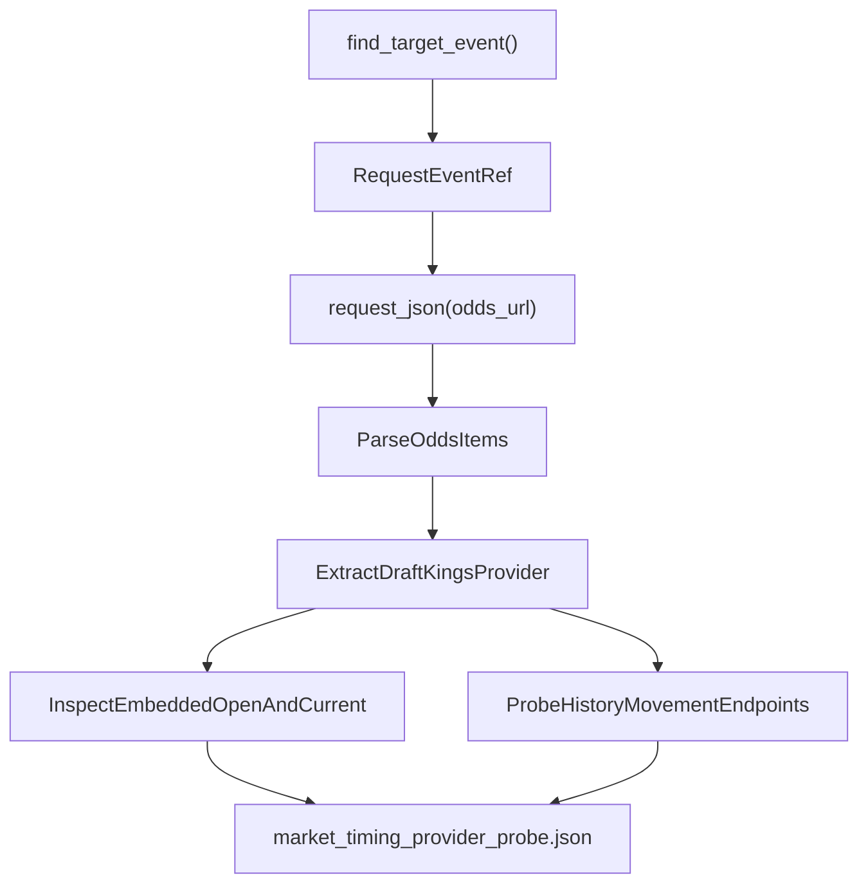

*Figure 1: Natural Language Space to Code Entity Space for Market Timing Probes*

Sources: [docs/win/football/nfl/archive/docs/win/football/nfl/scripts/training/market_timing_probe.py16-158](https://github.com/Clownworldenjoyer76/football_for_mat/blob/e5e69ed3/docs/win/football/nfl/archive/docs/win/football/nfl/scripts/training/market_timing_probe.py#L16-L158)[docs/win/football/nfl/archive/docs/win/football/nfl/scripts/training/market_timing_direct_probe.py1-115](https://github.com/Clownworldenjoyer76/football_for_mat/blob/e5e69ed3/docs/win/football/nfl/archive/docs/win/football/nfl/scripts/training/market_timing_direct_probe.py#L1-L115)

---

## Probe JSON Output Schemas and Findings

The probes serialize their findings into structured JSON artifacts under the `docs/win/football/nfl/training/` directory. These files include `market_timing_provider_probe.json`, `market_timing_direct_movement_probe.json`, and the operational trigger `MARKET_TIMING_PROBE_TRIGGER.txt`.

### Key Probe Output Fields

| Field Name | Type | Description |
| --- | --- | --- |
| `probe` | `str` | Identifier string for the probe routine (e.g., `nfl_market_timing_espn_capability`) [docs/win/football/nfl/archive/docs/win/football/nfl/scripts/training/market_timing_probe.py91](https://github.com/Clownworldenjoyer76/football_for_mat/blob/e5e69ed3/docs/win/football/nfl/archive/docs/win/football/nfl/scripts/training/market_timing_probe.py#L91-L91) |
| `target_event_found` | `bool` | Boolean flag indicating successful resolution of the game event ID [docs/win/football/nfl/archive/docs/win/football/nfl/scripts/training/market_timing_probe.py95](https://github.com/Clownworldenjoyer76/football_for_mat/blob/e5e69ed3/docs/win/football/nfl/archive/docs/win/football/nfl/scripts/training/market_timing_probe.py#L95-L95) |
| `embedded_open_available` | `bool` | Indicates whether opening spread, total, and moneyline are present natively [docs/win/football/nfl/archive/docs/win/football/nfl/scripts/training/market_timing_probe.py96](https://github.com/Clownworldenjoyer76/football_for_mat/blob/e5e69ed3/docs/win/football/nfl/archive/docs/win/football/nfl/scripts/training/market_timing_probe.py#L96-L96) |
| `embedded_current_available` | `bool` | Indicates whether current live odds are present natively [docs/win/football/nfl/archive/docs/win/football/nfl/scripts/training/market_timing_probe.py97](https://github.com/Clownworldenjoyer76/football_for_mat/blob/e5e69ed3/docs/win/football/nfl/archive/docs/win/football/nfl/scripts/training/market_timing_probe.py#L97-L97) |
| `movement_endpoints` | `list` | Array of HTTP status and record counts retrieved from historical movement sub-routes [docs/win/football/nfl/archive/docs/win/football/nfl/scripts/training/market_timing_probe.py98](https://github.com/Clownworldenjoyer76/football_for_mat/blob/e5e69ed3/docs/win/football/nfl/archive/docs/win/football/nfl/scripts/training/market_timing_probe.py#L98-L98) |
| `asof_backfill_reason` | `str` | Architectural conclusion regarding time-series backfill feasibility [docs/win/football/nfl/archive/docs/win/football/nfl/scripts/training/market_timing_probe.py99-100](https://github.com/Clownworldenjoyer76/football_for_mat/blob/e5e69ed3/docs/win/football/nfl/archive/docs/win/football/nfl/scripts/training/market_timing_probe.py#L99-L100) |

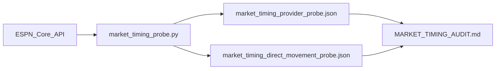

*Figure 2: Data Flow from Probe Execution to Audit Artifacts*

Sources: [docs/win/football/nfl/archive/docs/win/football/nfl/scripts/training/market_timing_probe.py90-153](https://github.com/Clownworldenjoyer76/football_for_mat/blob/e5e69ed3/docs/win/football/nfl/archive/docs/win/football/nfl/scripts/training/market_timing_probe.py#L90-L153)[docs/win/football/nfl/archive/docs/win/football/nfl/scripts/training/market_timing_direct_probe.py73-111](https://github.com/Clownworldenjoyer76/football_for_mat/blob/e5e69ed3/docs/win/football/nfl/archive/docs/win/football/nfl/scripts/training/market_timing_direct_probe.py#L73-L111)

---

## Line-Movement Usability and Architectural Conclusions

The findings compiled in `MARKET_TIMING_AUDIT.md` establish clear operational boundaries for line-movement tracking in `football_for_mat`:

1. **Embedded Open/Current Availability**: ESPN Core reliably returns both opening values and current live lines within the main competition odds payload for major bookmakers such as DraftKings [docs/win/football/nfl/archive/docs/win/football/nfl/scripts/training/market_timing_probe.py126-133](https://github.com/Clownworldenjoyer76/football_for_mat/blob/e5e69ed3/docs/win/football/nfl/archive/docs/win/football/nfl/scripts/training/market_timing_probe.py#L126-L133)
2. **Historical Movement Endpoint Limitations**: Granular tick-level movement logs via `/history/{history_index}/movement` are either sparse or restricted for past game weeks, preventing reliable retro-active time-series backfilling of intra-week odds movement [docs/win/football/nfl/archive/docs/win/football/nfl/scripts/training/market_timing_probe.py135-144](https://github.com/Clownworldenjoyer76/football_for_mat/blob/e5e69ed3/docs/win/football/nfl/archive/docs/win/football/nfl/scripts/training/market_timing_probe.py#L135-L144)
3. **Mandatory Snapshot Strategy**: Because historical movement endpoints cannot be reliably backfilled, the ingestion pipeline must capture and store point-in-time snapshots during the active week. This is handled by running `pull_odds.py` and `pull_opening_odds.py` regularly, persisting immutable files under `docs/win/football/nfl/00_intake/odds/snapshots/` and `docs/win/football/nfl/00_intake/odds/openers/`[docs/win/football/nfl/scripts/00_intake/pull_opening_odds.py17-19](https://github.com/Clownworldenjoyer76/football_for_mat/blob/e5e69ed3/docs/win/football/nfl/scripts/00_intake/pull_opening_odds.py#L17-L19)

Sources: [docs/win/football/nfl/archive/docs/win/football/nfl/scripts/training/market_timing_probe.py126-149](https://github.com/Clownworldenjoyer76/football_for_mat/blob/e5e69ed3/docs/win/football/nfl/archive/docs/win/football/nfl/scripts/training/market_timing_probe.py#L126-L149)[docs/win/football/nfl/scripts/00_intake/pull_opening_odds.py16-24](https://github.com/Clownworldenjoyer76/football_for_mat/blob/e5e69ed3/docs/win/football/nfl/scripts/00_intake/pull_opening_odds.py#L16-L24)

---

# 4-Prop-Engine

# Prop Engine
Relevant source files
- [.github/workflows/prop_01_pipeline.yml](https://github.com/Clownworldenjoyer76/football_for_mat/blob/e5e69ed3/.github/workflows/prop_01_pipeline.yml)
- [.gitignore](https://github.com/Clownworldenjoyer76/football_for_mat/blob/e5e69ed3/.gitignore)
- [docs/win/football/prop_engine/05_final/graded/2026/2026_all_props_graded.csv](https://github.com/Clownworldenjoyer76/football_for_mat/blob/e5e69ed3/docs/win/football/prop_engine/05_final/graded/2026/2026_all_props_graded.csv)
- [docs/win/football/prop_engine/05_final/reports/2026/by_pick_direction.csv](https://github.com/Clownworldenjoyer76/football_for_mat/blob/e5e69ed3/docs/win/football/prop_engine/05_final/reports/2026/by_pick_direction.csv)
- [docs/win/football/prop_engine/05_final/reports/2026/by_probability.csv](https://github.com/Clownworldenjoyer76/football_for_mat/blob/e5e69ed3/docs/win/football/prop_engine/05_final/reports/2026/by_probability.csv)
- [docs/win/football/prop_engine/05_final/reports/2026/by_prop_type.csv](https://github.com/Clownworldenjoyer76/football_for_mat/blob/e5e69ed3/docs/win/football/prop_engine/05_final/reports/2026/by_prop_type.csv)
- [docs/win/football/prop_engine/05_final/reports/2026/by_week.csv](https://github.com/Clownworldenjoyer76/football_for_mat/blob/e5e69ed3/docs/win/football/prop_engine/05_final/reports/2026/by_week.csv)
- [docs/win/football/prop_engine/05_final/reports/2026/calibration.csv](https://github.com/Clownworldenjoyer76/football_for_mat/blob/e5e69ed3/docs/win/football/prop_engine/05_final/reports/2026/calibration.csv)
- [docs/win/football/prop_engine/05_final/reports/2026/overall.csv](https://github.com/Clownworldenjoyer76/football_for_mat/blob/e5e69ed3/docs/win/football/prop_engine/05_final/reports/2026/overall.csv)
- [docs/win/football/prop_engine/05_final/reports/dashboard/kicking_points/over_prob.csv](https://github.com/Clownworldenjoyer76/football_for_mat/blob/e5e69ed3/docs/win/football/prop_engine/05_final/reports/dashboard/kicking_points/over_prob.csv)
- [docs/win/football/prop_engine/05_final/reports/dashboard/kicking_points/pick_prob.csv](https://github.com/Clownworldenjoyer76/football_for_mat/blob/e5e69ed3/docs/win/football/prop_engine/05_final/reports/dashboard/kicking_points/pick_prob.csv)
- [docs/win/football/prop_engine/05_final/reports/dashboard/kicking_points/prop_total.csv](https://github.com/Clownworldenjoyer76/football_for_mat/blob/e5e69ed3/docs/win/football/prop_engine/05_final/reports/dashboard/kicking_points/prop_total.csv)
- [docs/win/football/prop_engine/05_final/reports/dashboard/kicking_points/under_prob.csv](https://github.com/Clownworldenjoyer76/football_for_mat/blob/e5e69ed3/docs/win/football/prop_engine/05_final/reports/dashboard/kicking_points/under_prob.csv)
- [docs/win/football/prop_engine/scripts/build/build_defensive_features.py](https://github.com/Clownworldenjoyer76/football_for_mat/blob/e5e69ed3/docs/win/football/prop_engine/scripts/build/build_defensive_features.py)
- [docs/win/football/prop_engine/scripts/build/build_environment_history.py](https://github.com/Clownworldenjoyer76/football_for_mat/blob/e5e69ed3/docs/win/football/prop_engine/scripts/build/build_environment_history.py)
- [docs/win/football/prop_engine/scripts/build/build_historical_features.py](https://github.com/Clownworldenjoyer76/football_for_mat/blob/e5e69ed3/docs/win/football/prop_engine/scripts/build/build_historical_features.py)
- [docs/win/football/prop_engine/scripts/build/build_historical_universe.py](https://github.com/Clownworldenjoyer76/football_for_mat/blob/e5e69ed3/docs/win/football/prop_engine/scripts/build/build_historical_universe.py)
- [docs/win/football/prop_engine/scripts/build/build_kicking_features.py](https://github.com/Clownworldenjoyer76/football_for_mat/blob/e5e69ed3/docs/win/football/prop_engine/scripts/build/build_kicking_features.py)
- [docs/win/football/prop_engine/scripts/build/build_player_form.py](https://github.com/Clownworldenjoyer76/football_for_mat/blob/e5e69ed3/docs/win/football/prop_engine/scripts/build/build_player_form.py)
- [docs/win/football/prop_engine/scripts/build/build_player_identity.py](https://github.com/Clownworldenjoyer76/football_for_mat/blob/e5e69ed3/docs/win/football/prop_engine/scripts/build/build_player_identity.py)
- [docs/win/football/prop_engine/scripts/build/build_player_opportunity.py](https://github.com/Clownworldenjoyer76/football_for_mat/blob/e5e69ed3/docs/win/football/prop_engine/scripts/build/build_player_opportunity.py)
- [docs/win/football/prop_engine/scripts/build/build_position_allowed.py](https://github.com/Clownworldenjoyer76/football_for_mat/blob/e5e69ed3/docs/win/football/prop_engine/scripts/build/build_position_allowed.py)

The Prop Engine is a core component of the `football_for_mat` codebase, dedicated to the modeling, projection, and selection of player proposition bets. Located under `docs/win/football/prop_engine/`[docs/win/football/prop_engine/1](https://github.com/Clownworldenjoyer76/football_for_mat/blob/e5e69ed3/docs/win/football/prop_engine/#L1-L1) this engine encompasses the entire lifecycle of player prop analysis, from historical data feature engineering to weekly projections, prop selection, and post-game grading and reporting.

This page provides a high-level overview of the Prop Engine's architecture and its various stages. Detailed explanations of each stage, including specific scripts, data flows, and methodologies, are covered in the linked child pages.

## Prop Engine Overview

The Prop Engine operates through a series of interconnected stages: feature building, model training, weekly projection, prop selection, and finally, grading and reporting. This structured approach ensures a robust and auditable pipeline for generating player prop recommendations. The engine leverages a variety of data sources and sophisticated modeling techniques to predict player performance and identify profitable betting opportunities.

The overall flow of the Prop Engine can be visualized as follows:

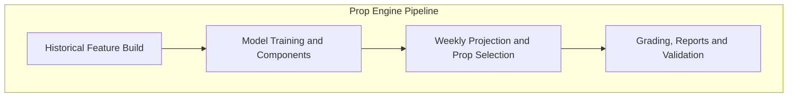

Sources: None

### Historical Feature Build

This initial stage focuses on constructing a comprehensive dataset of historical player performance and contextual information. It involves identifying players, tracking their opportunities, assessing their recent form, and incorporating defensive, kicking, and environmental factors. The output of this stage is a set of canonical feature tables used for model training.

For details, see [Historical Feature Build](/Clownworldenjoyer76/football_for_mat/4.1-historical-feature-build).

### Model Training and Components

Once the historical features are built, this stage focuses on training various predictive models. This includes developing baseline models, direct prediction models, and models specifically designed for opportunity and efficiency. The process involves architecture selection, calibration, and backtesting across different folds to ensure model robustness. The trained models and their artifacts are stored for later use in projections.

For details, see [Model Training and Components](/Clownworldenjoyer76/football_for_mat/4.2-model-training-and-components).

### Weekly Projection and Prop Selection

This stage is responsible for generating weekly player projections and identifying potential prop selections. It involves building current universe features, incorporating Week 1 priors, and selecting appropriate roles for players. The component and direct projection models are then used to forecast player performance. Finally, a selection process, often involving odds analysis, is applied to identify actionable prop bets.

For details, see [Weekly Projection and Prop Selection](/Clownworldenjoyer76/football_for_mat/4.3-weekly-projection-and-prop-selection).

### Grading, Reports and Validation

The final stage of the Prop Engine involves evaluating the performance of selected props, generating detailed reports, and validating the overall pipeline. This includes grading actual prop outcomes against predictions, producing various performance reports (e.g., by week, prop type, probability bucket), and conducting validation checks to ensure the integrity and accuracy of the engine's outputs. Examples of reports include `by_week.csv`[docs/win/football/prop_engine/05_final/reports/2026/by_week.csv1-3](https://github.com/Clownworldenjoyer76/football_for_mat/blob/e5e69ed3/docs/win/football/prop_engine/05_final/reports/2026/by_week.csv#L1-L3)`by_prop_type.csv`[docs/win/football/prop_engine/05_final/reports/2026/by_prop_type.csv1-8](https://github.com/Clownworldenjoyer76/football_for_mat/blob/e5e69ed3/docs/win/football/prop_engine/05_final/reports/2026/by_prop_type.csv#L1-L8) and `calibration.csv`[docs/win/football/prop_engine/05_final/reports/2026/calibration.csv1-11](https://github.com/Clownworldenjoyer76/football_for_mat/blob/e5e69ed3/docs/win/football/prop_engine/05_final/reports/2026/calibration.csv#L1-L11)

For details, see [Grading, Reports and Validation](/Clownworldenjoyer76/football_for_mat/4.4-grading-reports-and-validation).

## Code Entity Space to Natural Language Space Mapping

The following diagram illustrates how the high-level stages of the Prop Engine map to specific directories and scripts within the codebase.

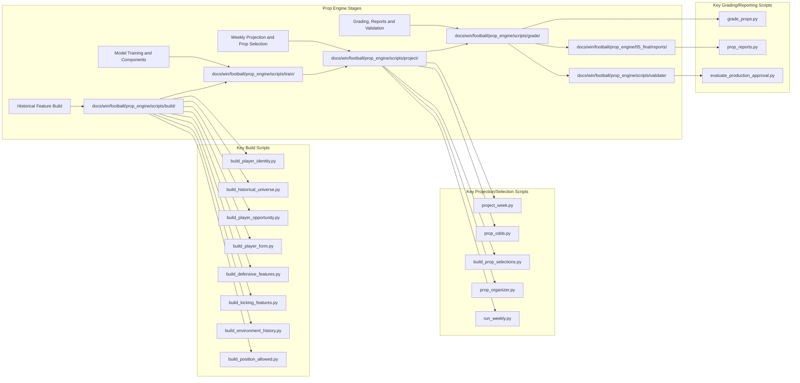

Sources: `.gitignore`[docs/win/football/nfl/prop_engine/scripts/build/__pycache__/3](https://github.com/Clownworldenjoyer76/football_for_mat/blob/e5e69ed3/docs/win/football/nfl/prop_engine/scripts/build/__pycache__/#L3-L3)`docs/win/football/prop_engine/05_final/reports/2026/by_week.csv`[docs/win/football/prop_engine/05_final/reports/2026/by_week.csv1-3](https://github.com/Clownworldenjoyer76/football_for_mat/blob/e5e69ed3/docs/win/football/prop_engine/05_final/reports/2026/by_week.csv#L1-L3)`docs/win/football/prop_engine/scripts/build/build_defensive_features.py`(), `docs/win/football/prop_engine/scripts/build/build_kicking_features.py`(), `docs/win/football/prop_engine/scripts/build/build_environment_history.py`(), `docs/win/football/prop_engine/scripts/build/build_historical_features.py`(), `docs/win/football/prop_engine/scripts/build/build_player_identity.py`(), `docs/win/football/prop_engine/scripts/build/build_historical_universe.py`(), `docs/win/football/prop_engine/scripts/build/build_player_form.py`(), `docs/win/football/prop_engine/scripts/build/build_player_opportunity.py`(), `docs/win/football/prop_engine/scripts/build/build_position_allowed.py`()

The `prop_01_pipeline.yml`[docs/win/football/prop_engine/scripts/build/build_position_allowed.py1](https://github.com/Clownworldenjoyer76/football_for_mat/blob/e5e69ed3/docs/win/football/prop_engine/scripts/build/build_position_allowed.py#L1-L1) GitHub Actions workflow orchestrates the execution of these stages, ensuring that the pipeline runs smoothly and in the correct order.

## Data Flow and Artifacts

The Prop Engine generates and consumes various data artifacts throughout its execution. These artifacts are crucial for tracking performance, debugging, and understanding the engine's decisions.

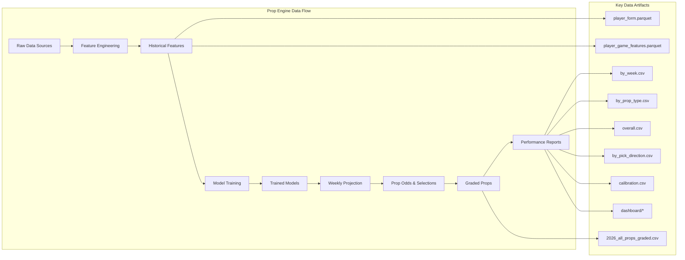

Sources: `.gitignore`[docs/win/football/prop_engine/data/historical/features/player_form.parquet1-2](https://github.com/Clownworldenjoyer76/football_for_mat/blob/e5e69ed3/docs/win/football/prop_engine/data/historical/features/player_form.parquet#L1-L2)`docs/win/football/prop_engine/05_final/reports/2026/by_week.csv`[docs/win/football/prop_engine/05_final/reports/2026/by_week.csv1-3](https://github.com/Clownworldenjoyer76/football_for_mat/blob/e5e69ed3/docs/win/football/prop_engine/05_final/reports/2026/by_week.csv#L1-L3)`docs/win/football/prop_engine/05_final/graded/2026/2026_all_props_graded.csv`[docs/win/football/prop_engine/05_final/graded/2026/2026_all_props_graded.csv1-42](https://github.com/Clownworldenjoyer76/football_for_mat/blob/e5e69ed3/docs/win/football/prop_engine/05_final/graded/2026/2026_all_props_graded.csv#L1-L42)`docs/win/football/prop_engine/05_final/reports/2026/by_prop_type.csv`[docs/win/football/prop_engine/05_final/reports/2026/by_prop_type.csv1-8](https://github.com/Clownworldenjoyer76/football_for_mat/blob/e5e69ed3/docs/win/football/prop_engine/05_final/reports/2026/by_prop_type.csv#L1-L8)`docs/win/football/prop_engine/05_final/reports/dashboard/kicking_points/prop_total.csv`[docs/win/football/prop_engine/05_final/reports/dashboard/kicking_points/prop_total.csv1-5](https://github.com/Clownworldenjoyer76/football_for_mat/blob/e5e69ed3/docs/win/football/prop_engine/05_final/reports/dashboard/kicking_points/prop_total.csv#L1-L5)`docs/win/football/prop_engine/05_final/reports/2026/overall.csv`[docs/win/football/prop_engine/05_final/reports/2026/overall.csv1-2](https://github.com/Clownworldenjoyer76/football_for_mat/blob/e5e69ed3/docs/win/football/prop_engine/05_final/reports/2026/overall.csv#L1-L2)`docs/win/football/prop_engine/05_final/reports/2026/by_pick_direction.csv`[docs/win/football/prop_engine/05_final/reports/2026/by_pick_direction.csv1-3](https://github.com/Clownworldenjoyer76/football_for_mat/blob/e5e69ed3/docs/win/football/prop_engine/05_final/reports/2026/by_pick_direction.csv#L1-L3)`docs/win/football/prop_engine/05_final/reports/dashboard/kicking_points/under_prob.csv`[docs/win/football/prop_engine/05_final/reports/dashboard/kicking_points/under_prob.csv1-41](https://github.com/Clownworldenjoyer76/football_for_mat/blob/e5e69ed3/docs/win/football/prop_engine/05_final/reports/dashboard/kicking_points/under_prob.csv#L1-L41)`docs/win/football/prop_engine/05_final/reports/2026/calibration.csv`[docs/win/football/prop_engine/05_final/reports/2026/calibration.csv1-11](https://github.com/Clownworldenjoyer76/football_for_mat/blob/e5e69ed3/docs/win/football/prop_engine/05_final/reports/2026/calibration.csv#L1-L11)`docs/win/football/prop_engine/05_final/reports/dashboard/kicking_points/over_prob.csv`[docs/win/football/prop_engine/05_final/reports/dashboard/kicking_points/over_prob.csv1-41](https://github.com/Clownworldenjoyer76/football_for_mat/blob/e5e69ed3/docs/win/football/prop_engine/05_final/reports/dashboard/kicking_points/over_prob.csv#L1-L41)`docs/win/football/prop_engine/05_final/reports/2026/by_probability.csv`[docs/win/football/prop_engine/05_final/reports/2026/by_probability.csv1-11](https://github.com/Clownworldenjoyer76/football_for_mat/blob/e5e69ed3/docs/win/football/prop_engine/05_final/reports/2026/by_probability.csv#L1-L11)`docs/win/football/prop_engine/05_final/reports/dashboard/kicking_points/pick_prob.csv`[docs/win/football/prop_engine/05_final/reports/dashboard/kicking_points/pick_prob.csv1-41](https://github.com/Clownworldenjoyer76/football_for_mat/blob/e5e69ed3/docs/win/football/prop_engine/05_final/reports/dashboard/kicking_points/pick_prob.csv#L1-L41)

---

# 4.1-Historical-Feature-Build

# 4.1. Historical Feature Build
Relevant source files
- [.github/workflows/prop_01_pipeline.yml](https://github.com/Clownworldenjoyer76/football_for_mat/blob/e5e69ed3/.github/workflows/prop_01_pipeline.yml)
- [.gitignore](https://github.com/Clownworldenjoyer76/football_for_mat/blob/e5e69ed3/.gitignore)
- [docs/win/football/prop_engine/scripts/build/build_defensive_features.py](https://github.com/Clownworldenjoyer76/football_for_mat/blob/e5e69ed3/docs/win/football/prop_engine/scripts/build/build_defensive_features.py)
- [docs/win/football/prop_engine/scripts/build/build_environment_history.py](https://github.com/Clownworldenjoyer76/football_for_mat/blob/e5e69ed3/docs/win/football/prop_engine/scripts/build/build_environment_history.py)
- [docs/win/football/prop_engine/scripts/build/build_historical_features.py](https://github.com/Clownworldenjoyer76/football_for_mat/blob/e5e69ed3/docs/win/football/prop_engine/scripts/build/build_historical_features.py)
- [docs/win/football/prop_engine/scripts/build/build_historical_universe.py](https://github.com/Clownworldenjoyer76/football_for_mat/blob/e5e69ed3/docs/win/football/prop_engine/scripts/build/build_historical_universe.py)
- [docs/win/football/prop_engine/scripts/build/build_kicking_features.py](https://github.com/Clownworldenjoyer76/football_for_mat/blob/e5e69ed3/docs/win/football/prop_engine/scripts/build/build_kicking_features.py)
- [docs/win/football/prop_engine/scripts/build/build_player_form.py](https://github.com/Clownworldenjoyer76/football_for_mat/blob/e5e69ed3/docs/win/football/prop_engine/scripts/build/build_player_form.py)
- [docs/win/football/prop_engine/scripts/build/build_player_identity.py](https://github.com/Clownworldenjoyer76/football_for_mat/blob/e5e69ed3/docs/win/football/prop_engine/scripts/build/build_player_identity.py)
- [docs/win/football/prop_engine/scripts/build/build_player_opportunity.py](https://github.com/Clownworldenjoyer76/football_for_mat/blob/e5e69ed3/docs/win/football/prop_engine/scripts/build/build_player_opportunity.py)
- [docs/win/football/prop_engine/scripts/build/build_position_allowed.py](https://github.com/Clownworldenjoyer76/football_for_mat/blob/e5e69ed3/docs/win/football/prop_engine/scripts/build/build_position_allowed.py)

This page details the process of building historical features for the Prop Engine, focusing on player identity, historical universe construction, player opportunity, player form, defensive, kicking, and environmental features. It covers the canonical grain of these features, the GSIS crosswalk, leakage safety measures, and the `feature_manifest.json` output.

## Player Identity Crosswalk

The `build_player_identity.py` script is responsible for creating a canonical player identity crosswalk. The canonical identifier for players in the Prop Engine is the GSIS ID. ESPN and PFR IDs are treated as aliases. Name matching is used only when it resolves uniquely to a GSIS ID.

The script reads from several historical data sources to build this crosswalk:

- `docs/win/football/nfl/data/historic_data/players/players.parquet`
- `docs/win/football/nfl/data/historic_data/weekly_rosters/roster_weekly_{season}.parquet`
- `docs/win/football/nfl/data/master/roster_master.csv`
- `docs/win/football/nfl/data/master/depth_charts/{TEAM}/{TEAM}_depth.csv`

The output, `docs/win/football/prop_engine/data/identity/player_crosswalk.parquet`, contains columns such as `player_id`, `gsis_id`, `espn_id`, `pfr_id`, `display_name`, `normalized_name`, `position`, `position_group`, `current_team`, `first_season`, `last_season`, and various resolution metadata [docs/win/football/prop_engine/scripts/build/build_player_identity.py46-64](https://github.com/Clownworldenjoyer76/football_for_mat/blob/e5e69ed3/docs/win/football/prop_engine/scripts/build/build_player_identity.py#L46-L64)

The `IdentityResolver` class [docs/win/football/prop_engine/scripts/build/build_player_identity.py310-330](https://github.com/Clownworldenjoyer76/football_for_mat/blob/e5e69ed3/docs/win/football/prop_engine/scripts/build/build_player_identity.py#L310-L330) is central to this process, ensuring that player IDs are consistently mapped across different sources. The `add_canonical` function [docs/win/football/prop_engine/scripts/build/build_player_identity.py280-304](https://github.com/Clownworldenjoyer76/football_for_mat/blob/e5e69ed3/docs/win/football/prop_engine/scripts/build/build_player_identity.py#L280-L304) is used to populate the canonical player records, prioritizing GSIS IDs and resolving aliases.

### Canonical ID Resolution Logic

The script employs a multi-step process to resolve player identities and build the crosswalk:

1. **GSIS-based Resolution**: Players with a GSIS ID are prioritized. All associated ESPN, PFR, and names are linked to this GSIS ID.
2. **ESPN/PFR-based Resolution**: If a player has an ESPN or PFR ID but no GSIS ID, and that ID uniquely maps to a single GSIS ID in the existing canonical records, the player is linked.
3. **Name-based Resolution**: As a last resort, if a player has no identifiable IDs, their normalized name is used. If the normalized name uniquely maps to a single GSIS ID, the player is linked. This is considered a lower confidence resolution.

The `resolution_status` and `resolution_confidence` columns in the output indicate how each player's identity was resolved [docs/win/football/prop_engine/scripts/build/build_player_identity.py63-64](https://github.com/Clownworldenjoyer76/football_for_mat/blob/e5e69ed3/docs/win/football/prop_engine/scripts/build/build_player_identity.py#L63-L64)

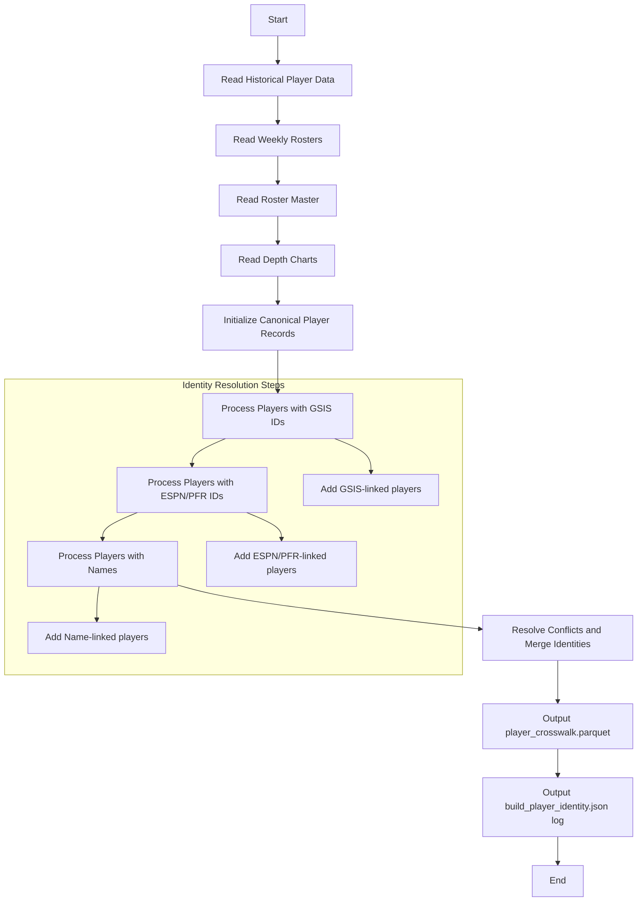

**Diagram: Player Identity Crosswalk Build Process**
Sources:

- [docs/win/football/prop_engine/scripts/build/build_player_identity.py1-21](https://github.com/Clownworldenjoyer76/football_for_mat/blob/e5e69ed3/docs/win/football/prop_engine/scripts/build/build_player_identity.py#L1-L21)
- [docs/win/football/prop_engine/scripts/build/build_player_identity.py46-64](https://github.com/Clownworldenjoyer76/football_for_mat/blob/e5e69ed3/docs/win/football/prop_engine/scripts/build/build_player_identity.py#L46-L64)
- [docs/win/football/prop_engine/scripts/build/build_player_identity.py310-330](https://github.com/Clownworldenjoyer76/football_for_mat/blob/e5e69ed3/docs/win/football/prop_engine/scripts/build/build_player_identity.py#L310-L330)
- [docs/win/football/prop_engine/scripts/build/build_player_identity.py280-304](https://github.com/Clownworldenjoyer76/football_for_mat/blob/e5e69ed3/docs/win/football/prop_engine/scripts/build/build_player_identity.py#L280-L304)

## Historical Universe Construction

The `build_historical_universe.py` script creates the foundational historical player-game universe. This universe represents every player-game instance for which features will be built, before any outcome data is joined. The canonical grain for this universe is `season + week + game_id + player_id`[docs/win/football/prop_engine/scripts/build/build_historical_universe.py16-18](https://github.com/Clownworldenjoyer76/football_for_mat/blob/e5e69ed3/docs/win/football/prop_engine/scripts/build/build_historical_universe.py#L16-L18)

The script integrates data from various sources:

- `docs/win/football/nfl/data/historic_data/games/games_2010_2025.csv`
- `docs/win/football/nfl/data/historic_data/weekly_rosters/roster_weekly_{season}.parquet`
- `docs/win/football/nfl/data/historic_data/depth_charts/depth_charts_{season}.parquet`
- `docs/win/football/nfl/data/historic_data/snap_counts/snap_counts_{season}.parquet`
- `docs/win/football/nfl/data/historic_data/participation/pbp_participation_{season}.parquet`
- `docs/win/football/prop_engine/data/identity/player_crosswalk.parquet`

The output, `docs/win/football/prop_engine/data/historical/universe/player_game_universe.parquet`, includes game context (season, week, game_id, gameday, kickoff_timestamp, home/away team), player identity (player_id, player_name, team, opponent, position, position_group), and pre-game status indicators (roster_flag, depth_present_flag, depth_rank, depth_starter_flag, prior_offense_snap_pct, prior_defense_snap_pct, played_game_flag) [docs/win/football/prop_engine/scripts/build/build_historical_universe.py42-68](https://github.com/Clownworldenjoyer76/football_for_mat/blob/e5e69ed3/docs/win/football/prop_engine/scripts/build/build_historical_universe.py#L42-L68)

A key aspect is the `IdentityResolver` class [docs/win/football/prop_engine/scripts/build/build_historical_universe.py310-330](https://github.com/Clownworldenjoyer76/football_for_mat/blob/e5e69ed3/docs/win/football/prop_engine/scripts/build/build_historical_universe.py#L310-L330) which uses the `player_crosswalk.parquet` to ensure consistent player identification across all input datasets. The script also infers `position_group` (OFF, DEF, ST) based on the player's `position`[docs/win/football/prop_engine/scripts/build/build_historical_universe.py246-262](https://github.com/Clownworldenjoyer76/football_for_mat/blob/e5e69ed3/docs/win/football/prop_engine/scripts/build/build_historical_universe.py#L246-L262)

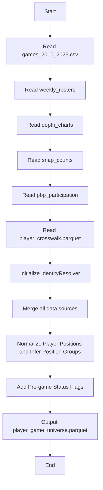

**Diagram: Historical Universe Build Process**
Sources:

- [docs/win/football/prop_engine/scripts/build/build_historical_universe.py1-18](https://github.com/Clownworldenjoyer76/football_for_mat/blob/e5e69ed3/docs/win/football/prop_engine/scripts/build/build_historical_universe.py#L1-L18)
- [docs/win/football/prop_engine/scripts/build/build_historical_universe.py42-68](https://github.com/Clownworldenjoyer76/football_for_mat/blob/e5e69ed3/docs/win/football/prop_engine/scripts/build/build_historical_universe.py#L42-L68)
- [docs/win/football/prop_engine/scripts/build/build_historical_universe.py310-330](https://github.com/Clownworldenjoyer76/football_for_mat/blob/e5e69ed3/docs/win/football/prop_engine/scripts/build/build_historical_universe.py#L310-L330)
- [docs/win/football/prop_engine/scripts/build/build_historical_universe.py246-262](https://github.com/Clownworldenjoyer76/football_for_mat/blob/e5e69ed3/docs/win/football/prop_engine/scripts/build/build_historical_universe.py#L246-L262)

## Player Opportunity

The `build_player_opportunity.py` script calculates player-level weekly opportunity and efficiency metrics. These are "same-week realized values" and are considered raw measurements. Downstream feature builders are responsible for lagging these values to ensure leakage safety [docs/win/football/prop_engine/scripts/build/build_player_opportunity.py13-16](https://github.com/Clownworldenjoyer76/football_for_mat/blob/e5e69ed3/docs/win/football/prop_engine/scripts/build/build_player_opportunity.py#L13-L16)

The script reads from:

- `docs/win/football/nfl/00_intake/pbp/{season}_pbp.csv.gz`
- `docs/win/football/nfl/data/historic_data/player_stats/stats_player_week_{season}.parquet`
- `docs/win/football/nfl/data/historic_data/snap_counts/snap_counts_{season}.parquet`
- `docs/win/football/nfl/data/historic_data/participation/pbp_participation_{season}.parquet`
- `docs/win/football/prop_engine/data/identity/player_crosswalk.parquet`

The output, `docs/win/football/prop_engine/data/historical/opportunity/player_week_opportunity.parquet`, includes a wide range of metrics such as `pass_attempts`, `passing_yards`, `carries`, `rushing_yards`, `targets`, `receptions`, `receiving_yards`, `snap_pct`, `participation`, and various derived rates and shares (e.g., `target_share`, `carry_share`, `yards_per_attempt`) [docs/win/football/prop_engine/scripts/build/build_player_opportunity.py38-51](https://github.com/Clownworldenjoyer76/football_for_mat/blob/e5e69ed3/docs/win/football/prop_engine/scripts/build/build_player_opportunity.py#L38-L51)

Key functions include:

- `numeric_series`: Safely converts series to numeric, handling non-numeric values [docs/win/football/prop_engine/scripts/build/build_player_opportunity.py101-118](https://github.com/Clownworldenjoyer76/football_for_mat/blob/e5e69ed3/docs/win/football/prop_engine/scripts/build/build_player_opportunity.py#L101-L118)
- `safe_divide`: Performs division, handling division by zero by returning NaN [docs/win/football/prop_engine/scripts/build/build_player_opportunity.py120-126](https://github.com/Clownworldenjoyer76/football_for_mat/blob/e5e69ed3/docs/win/football/prop_engine/scripts/build/build_player_opportunity.py#L120-L126)
- `build_crosswalk_maps`: Creates mappings from PFR IDs and normalized names to GSIS IDs for player resolution [docs/win/football/prop_engine/scripts/build/build_player_opportunity.py188-196](https://github.com/Clownworldenjoyer76/football_for_mat/blob/e5e69ed3/docs/win/football/prop_engine/scripts/build/build_player_opportunity.py#L188-L196)
- `prepare_stats`: Processes raw player stats, ensuring correct data types and handling missing values [docs/win/football/prop_engine/scripts/build/build_player_opportunity.py188-196](https://github.com/Clownworldenjoyer76/football_for_mat/blob/e5e69ed3/docs/win/football/prop_engine/scripts/build/build_player_opportunity.py#L188-L196)

The script also calculates team-level opportunity metrics, which are then used to derive player shares (e.g., `target_share` is a player's targets divided by the team's total targets) [docs/win/football/prop_engine/scripts/build/build_player_opportunity.py600-609](https://github.com/Clownworldenjoyer76/football_for_mat/blob/e5e69ed3/docs/win/football/prop_engine/scripts/build/build_player_opportunity.py#L600-L609)

Sources:

- [docs/win/football/prop_engine/scripts/build/build_player_opportunity.py1-16](https://github.com/Clownworldenjoyer76/football_for_mat/blob/e5e69ed3/docs/win/football/prop_engine/scripts/build/build_player_opportunity.py#L1-L16)
- [docs/win/football/prop_engine/scripts/build/build_player_opportunity.py38-51](https://github.com/Clownworldenjoyer76/football_for_mat/blob/e5e69ed3/docs/win/football/prop_engine/scripts/build/build_player_opportunity.py#L38-L51)
- [docs/win/football/prop_engine/scripts/build/build_player_opportunity.py101-118](https://github.com/Clownworldenjoyer76/football_for_mat/blob/e5e69ed3/docs/win/football/prop_engine/scripts/build/build_player_opportunity.py#L101-L118)
- [docs/win/football/prop_engine/scripts/build/build_player_opportunity.py120-126](https://github.com/Clownworldenjoyer76/football_for_mat/blob/e5e69ed3/docs/win/football/prop_engine/scripts/build/build_player_opportunity.py#L120-L126)
- [docs/win/football/prop_engine/scripts/build/build_player_opportunity.py188-196](https://github.com/Clownworldenjoyer76/football_for_mat/blob/e5e69ed3/docs/win/football/prop_engine/scripts/build/build_player_opportunity.py#L188-L196)
- [docs/win/football/prop_engine/scripts/build/build_player_opportunity.py600-609](https://github.com/Clownworldenjoyer76/football_for_mat/blob/e5e69ed3/docs/win/football/prop_engine/scripts/build/build_player_opportunity.py#L600-L609)

## Player Form

The `build_player_form.py` script generates leakage-safe historical player rolling-form features. This is a critical step to prevent data leakage, ensuring that features for a given game only use information from strictly prior games [docs/win/football/prop_engine/scripts/build/build_player_form.py23-25](https://github.com/Clownworldenjoyer76/football_for_mat/blob/e5e69ed3/docs/win/football/prop_engine/scripts/build/build_player_form.py#L23-L25)

The script reads:

- `docs/win/football/prop_engine/config/prop_engine.yaml`
- The historical universe (output of `build_historical_universe.py`)
- Player opportunity data (output of `build_player_opportunity.py`)
- 2010-2011 historical player-stat parquet files for pre-2012 prior seeding [docs/win/football/prop_engine/scripts/build/build_player_form.py5-10](https://github.com/Clownworldenjoyer76/football_for_mat/blob/e5e69ed3/docs/win/football/prop_engine/scripts/build/build_player_form.py#L5-L10)

The output, `docs/win/football/prop_engine/data/historical/features/player_form.parquet`, contains a comprehensive set of player performance metrics, including `lag1` (previous game), `roll3_mean`, `roll5_mean`, `roll8_mean` (rolling averages over 3, 5, 8 games), `roll3_median`, `roll5_std`, `ewm3`, `ewm5` (exponentially weighted moving averages), `season_to_date`, and `career_prior` statistics for various base metrics like `pass_attempts`, `passing_yards`, `carries`, `targets`, `tackles`, `sacks`, and `snap_pct`[docs/win/football/prop_engine/scripts/build/build_player_form.py52-91](https://github.com/Clownworldenjoyer76/football_for_mat/blob/e5e69ed3/docs/win/football/prop_engine/scripts/build/build_player_form.py#L52-L91)

Key policies for leakage safety and historical accuracy:

- **Strictly Prior Data**: All player features are derived from source games that occurred strictly before the target game's kickoff [docs/win/football/prop_engine/scripts/build/build_player_form.py23-25](https://github.com/Clownworldenjoyer76/football_for_mat/blob/e5e69ed3/docs/win/football/prop_engine/scripts/build/build_player_form.py#L23-L25)
- **Pre-2012 Seeding**: For metrics with compatible definitions, 2010-2011 player stats are used to seed priors for games starting in 2012 [docs/win/football/prop_engine/scripts/build/build_player_form.py26-28](https://github.com/Clownworldenjoyer76/football_for_mat/blob/e5e69ed3/docs/win/football/prop_engine/scripts/build/build_player_form.py#L26-L28)
- **Team Changes**: Career/non-share history persists across team changes, while team-share metrics reset for the current franchise stint [docs/win/football/prop_engine/scripts/build/build_player_form.py30-31](https://github.com/Clownworldenjoyer76/football_for_mat/blob/e5e69ed3/docs/win/football/prop_engine/scripts/build/build_player_form.py#L30-L31)
- **Position Priors**: If a player has no history for a specific metric, it falls back to strictly prior position-group priors [docs/win/football/prop_engine/scripts/build/build_player_form.py32-33](https://github.com/Clownworldenjoyer76/football_for_mat/blob/e5e69ed3/docs/win/football/prop_engine/scripts/build/build_player_form.py#L32-L33)

The script uses `common.py` for configuration validation, ensuring that required rolling windows and EWM spans are present [docs/win/football/prop_engine/scripts/build/build_player_form.py226-238](https://github.com/Clownworldenjoyer76/football_for_mat/blob/e5e69ed3/docs/win/football/prop_engine/scripts/build/build_player_form.py#L226-L238)

Sources:

- [docs/win/football/prop_engine/scripts/build/build_player_form.py1-14](https://github.com/Clownworldenjoyer76/football_for_mat/blob/e5e69ed3/docs/win/football/prop_engine/scripts/build/build_player_form.py#L1-L14)
- [docs/win/football/prop_engine/scripts/build/build_player_form.py23-33](https://github.com/Clownworldenjoyer76/football_for_mat/blob/e5e69ed3/docs/win/football/prop_engine/scripts/build/build_player_form.py#L23-L33)
- [docs/win/football/prop_engine/scripts/build/build_player_form.py52-91](https://github.com/Clownworldenjoyer76/football_for_mat/blob/e5e69ed3/docs/win/football/prop_engine/scripts/build/build_player_form.py#L52-L91)
- [docs/win/football/prop_engine/scripts/build/build_player_form.py226-238](https://github.com/Clownworldenjoyer76/football_for_mat/blob/e5e69ed3/docs/win/football/prop_engine/scripts/build/build_player_form.py#L226-L238)

## Defensive Features

The `build_defensive_features.py` script constructs defensive-specific historical player-game features. These features are built on the canonical player-game universe grain and are designed to be leakage-safe [docs/win/football/prop_engine/scripts/build/build_defensive_features.py1-15](https://github.com/Clownworldenjoyer76/football_for_mat/blob/e5e69ed3/docs/win/football/prop_engine/scripts/build/build_defensive_features.py#L1-L15)

It reads from:

- Historical player-game universe
- `player_form` (output of `build_player_form.py`)
- `player_role_history`
- `team_form`
- `opponent_week_opportunity`

The output, `defensive_features.parquet`, includes features like `def_snap_pct_lag1`, `def_snap_pct_roll3`, `tackles_lag1`, `tackles_roll3`, `sacks_roll3`, `qb_hits_roll3`, `opponent_plays_roll3`, `opponent_dropbacks_roll3`, `team_def_sack_rate_roll3`, `starter_flag`, `front7_flag`, and `secondary_flag`[docs/win/football/prop_engine/scripts/build/build_defensive_features.py46-74](https://github.com/Clownworldenjoyer76/football_for_mat/blob/e5e69ed3/docs/win/football/prop_engine/scripts/build/build_defensive_features.py#L46-L74)

Key policies:

- **Canonical Grain**: The output preserves the full canonical `season + week + game_id + player_id` grain [docs/win/football/prop_engine/scripts/build/build_defensive_features.py15](https://github.com/Clownworldenjoyer76/football_for_mat/blob/e5e69ed3/docs/win/football/prop_engine/scripts/build/build_defensive_features.py#L15-L15)
- **Leakage Safety**: All player history columns are copied from the already leakage-safe `player_form`[docs/win/football/prop_engine/scripts/build/build_defensive_features.py16-17](https://github.com/Clownworldenjoyer76/football_for_mat/blob/e5e69ed3/docs/win/football/prop_engine/scripts/build/build_defensive_features.py#L16-L17)
- **Opponent Context**: Opponent offensive context is derived from the opponent's lagged `team_form` row [docs/win/football/prop_engine/scripts/build/build_defensive_features.py18](https://github.com/Clownworldenjoyer76/football_for_mat/blob/e5e69ed3/docs/win/football/prop_engine/scripts/build/build_defensive_features.py#L18-L18)
- **Team Defensive Sack Rate**: `team_def_sack_rate_roll3` is calculated as the mean of strictly prior per-game defense sack rates (sacks / opponent_dropbacks) over the last 3 observed team games [docs/win/football/prop_engine/scripts/build/build_defensive_features.py19-21](https://github.com/Clownworldenjoyer76/football_for_mat/blob/e5e69ed3/docs/win/football/prop_engine/scripts/build/build_defensive_features.py#L19-L21)

The script defines `FRONT7_POSITIONS` and `SECONDARY_POSITIONS` to categorize defensive players [docs/win/football/prop_engine/scripts/build/build_defensive_features.py103-131](https://github.com/Clownworldenjoyer76/football_for_mat/blob/e5e69ed3/docs/win/football/prop_engine/scripts/build/build_defensive_features.py#L103-L131) The `build_team_def_sack_rate_roll3` function [docs/win/football/prop_engine/scripts/build/build_defensive_features.py208-211](https://github.com/Clownworldenjoyer76/football_for_mat/blob/e5e69ed3/docs/win/football/prop_engine/scripts/build/build_defensive_features.py#L208-L211) is responsible for calculating the team-level defensive sack rate.

Sources:

- [docs/win/football/prop_engine/scripts/build/build_defensive_features.py1-21](https://github.com/Clownworldenjoyer76/football_for_mat/blob/e5e69ed3/docs/win/football/prop_engine/scripts/build/build_defensive_features.py#L1-L21)
- [docs/win/football/prop_engine/scripts/build/build_defensive_features.py46-74](https://github.com/Clownworldenjoyer76/football_for_mat/blob/e5e69ed3/docs/win/football/prop_engine/scripts/build/build_defensive_features.py#L46-L74)
- [docs/win/football/prop_engine/scripts/build/build_defensive_features.py103-131](https://github.com/Clownworldenjoyer76/football_for_mat/blob/e5e69ed3/docs/win/football/prop_engine/scripts/build/build_defensive_features.py#L103-L131)
- [docs/win/football/prop_engine/scripts/build/build_defensive_features.py208-211](https://github.com/Clownworldenjoyer76/football_for_mat/blob/e5e69ed3/docs/win/football/prop_engine/scripts/build/build_defensive_features.py#L208-L211)

## Kicking Features

The `build_kicking_features.py` script generates historical kicking-specific player-game features. These features are built for K/PK players at the `season + week + game_id + player_id` grain [docs/win/football/prop_engine/scripts/build/build_kicking_features.py1-10](https://github.com/Clownworldenjoyer76/football_for_mat/blob/e5e69ed3/docs/win/football/prop_engine/scripts/build/build_kicking_features.py#L1-L10)

The output, `kicking_features.parquet`, includes metrics such as `fg_attempts_lag1`, `fg_attempts_roll3`, `fg_make_pct_career_prior`, `pat_attempts_roll3`, `team_drives_roll3`, `opponent_points_per_drive_allowed_roll3`, `temperature`, `wind`, `roof`, `surface`, and `primary_kicker_flag`[docs/win/football/prop_engine/scripts/build/build_kicking_features.py43-65](https://github.com/Clownworldenjoyer76/football_for_mat/blob/e5e69ed3/docs/win/football/prop_engine/scripts/build/build_kicking_features.py#L43-L65)

Key policies:

- **Leakage Safety**: All rolling/player history is already leakage-safe [docs/win/football/prop_engine/scripts/build/build_kicking_features.py12](https://github.com/Clownworldenjoyer76/football_for_mat/blob/e5e69ed3/docs/win/football/prop_engine/scripts/build/build_kicking_features.py#L12-L12)
- **Make Percentages**: Career/season FG and PAT make percentages are calculated from prior makes and attempts; zero prior attempts result in null [docs/win/football/prop_engine/scripts/build/build_kicking_features.py13-14](https://github.com/Clownworldenjoyer76/football_for_mat/blob/e5e69ed3/docs/win/football/prop_engine/scripts/build/build_kicking_features.py#L13-L14)
- **Team/Opponent Context**: Team offense comes from already-lagged `team_form`, and opponent defense from already-lagged `opponent_form`[docs/win/football/prop_engine/scripts/build/build_kicking_features.py15-16](https://github.com/Clownworldenjoyer76/football_for_mat/blob/e5e69ed3/docs/win/football/prop_engine/scripts/build/build_kicking_features.py#L15-L16)
- **Weather**: Weather data is sourced from the historical environment [docs/win/football/prop_engine/scripts/build/build_kicking_features.py17](https://github.com/Clownworldenjoyer76/football_for_mat/blob/e5e69ed3/docs/win/football/prop_engine/scripts/build/build_kicking_features.py#L17-L17)
- **Primary Kicker Flag**: The `primary_kicker_flag` is determined solely by pregame roster, depth, injury status, and strictly prior kicking usage, never using the target game's outcome [docs/win/football/prop_engine/scripts/build/build_kicking_features.py18-20](https://github.com/Clownworldenjoyer76/football_for_mat/blob/e5e69ed3/docs/win/football/prop_engine/scripts/build/build_kicking_features.py#L18-L20)

The `build_primary_kicker_flag` function [docs/win/football/prop_engine/scripts/build/build_kicking_features.py206-209](https://github.com/Clownworldenjoyer76/football_for_mat/blob/e5e69ed3/docs/win/football/prop_engine/scripts/build/build_kicking_features.py#L206-L209) is crucial for identifying the primary kicker for a given team-game, using a priority system based on injury status, roster presence, depth chart role, and historical usage [docs/win/football/prop_engine/scripts/build/build_kicking_features.py210-221](https://github.com/Clownworldenjoyer76/football_for_mat/blob/e5e69ed3/docs/win/football/prop_engine/scripts/build/build_kicking_features.py#L210-L221)

Sources:

- [docs/win/football/prop_engine/scripts/build/build_kicking_features.py1-20](https://github.com/Clownworldenjoyer76/football_for_mat/blob/e5e69ed3/docs/win/football/prop_engine/scripts/build/build_kicking_features.py#L1-L20)
- [docs/win/football/prop_engine/scripts/build/build_kicking_features.py43-65](https://github.com/Clownworldenjoyer76/football_for_mat/blob/e5e69ed3/docs/win/football/prop_engine/scripts/build/build_kicking_features.py#L43-L65)
- [docs/win/football/prop_engine/scripts/build/build_kicking_features.py206-209](https://github.com/Clownworldenjoyer76/football_for_mat/blob/e5e69ed3/docs/win/football/prop_engine/scripts/build/build_kicking_features.py#L206-L209)
- [docs/win/football/prop_engine/scripts/build/build_kicking_features.py210-221](https://github.com/Clownworldenjoyer76/football_for_mat/blob/e5e69ed3/docs/win/football/prop_engine/scripts/build/build_kicking_features.py#L210-L221)

## Environment Features

The `build_environment_history.py` script generates historical NFL game-environment features. It focuses on regular-season games from 2012-2025 [docs/win/football/prop_engine/scripts/build/build_environment_history.py1-13](https://github.com/Clownworldenjoyer76/football_for_mat/blob/e5e69ed3/docs/win/football/prop_engine/scripts/build/build_environment_history.py#L1-L13)

It reads from:

- `docs/win/football/nfl/data/historic_data/games/games_2010_2025.csv`
- `docs/win/football/nfl/data/master/team_master.csv`

The output, `docs/win/football/prop_engine/data/historical/features/environment.parquet`, includes features such as `season`, `week`, `game_id`, `gameday`, `home_team`, `away_team`, `divisional_game_flag`, `neutral_site_flag`, `stadium`, `roof`, `surface`, `temperature`, `wind`, `home_rest_days`, `away_rest_days`, `miles_traveled_away`, `time_zones_crossed_away`, `east_to_west_flag`, `west_to_east_flag`, `international_flag`, `weather_missing_flag`, and `travel_missing_flag`[docs/win/football/prop_engine/scripts/build/build_environment_history.py51-75](https://github.com/Clownworldenjoyer76/football_for_mat/blob/e5e69ed3/docs/win/football/prop_engine/scripts/build/build_environment_history.py#L51-L75)

Key policies:

- **No Betting Data**: Only schedule and game environment columns are loaded; embedded betting columns are ignored [docs/win/football/prop_engine/scripts/build/build_environment_history.py14-16](https://github.com/Clownworldenjoyer76/football_for_mat/blob/e5e69ed3/docs/win/football/prop_engine/scripts/build/build_environment_history.py#L14-L16)
- **Weather Mapping**: Historical temperature and wind map directly to current-week weather concepts [docs/win/football/prop_engine/scripts/build/build_environment_history.py17-18](https://github.com/Clownworldenjoyer76/football_for_mat/blob/e5e69ed3/docs/win/football/prop_engine/scripts/build/build_environment_history.py#L17-L18)
- **Travel Calculations**: Travel calculations (miles, time zones) mirror `build_travel.py`, using Haversine distance and DST-aware timezone differences [docs/win/football/prop_engine/scripts/build/build_environment_history.py19-22](https://github.com/Clownworldenjoyer76/football_for_mat/blob/e5e69ed3/docs/win/football/prop_engine/scripts/build/build_environment_history.py#L19-L22)
- **Franchise Aliases**: Historical relocation aliases are used for travel lookup but do not rewrite historical team labels (e.g., SD, OAK, STL are retained in output) [docs/win/football/prop_engine/scripts/build/build_environment_history.py23-25](https://github.com/Clownworldenjoyer76/football_for_mat/blob/e5e69ed3/docs/win/football/prop_engine/scripts/build/build_environment_history.py#L23-L25)

The `haversine_miles` function [docs/win/football/prop_engine/scripts/build/build_environment_history.py253-267](https://github.com/Clownworldenjoyer76/football_for_mat/blob/e5e69ed3/docs/win/football/prop_engine/scripts/build/build_environment_history.py#L253-L267) calculates the distance between two geographical points, and `parse_location_flag`[docs/win/football/prop_engine/scripts/build/build_environment_history.py239-251](https://github.com/Clownworldenjoyer76/football_for_mat/blob/e5e69ed3/docs/win/football/prop_engine/scripts/build/build_environment_history.py#L239-L251) determines if a game was played at a neutral site.

Sources:

- [docs/win/football/prop_engine/scripts/build/build_environment_history.py1-25](https://github.com/Clownworldenjoyer76/football_for_mat/blob/e5e69ed3/docs/win/football/prop_engine/scripts/build/build_environment_history.py#L1-L25)
- [docs/win/football/prop_engine/scripts/build/build_environment_history.py51-75](https://github.com/Clownworldenjoyer76/football_for_mat/blob/e5e69ed3/docs/win/football/prop_engine/scripts/build/build_environment_history.py#L51-L75)
- [docs/win/football/prop_engine/scripts/build/build_environment_history.py253-267](https://github.com/Clownworldenjoyer76/football_for_mat/blob/e5e69ed3/docs/win/football/prop_engine/scripts/build/build_environment_history.py#L253-L267)
- [docs/win/football/prop_engine/scripts/build/build_environment_history.py239-251](https://github.com/Clownworldenjoyer76/football_for_mat/blob/e5e69ed3/docs/win/football/prop_engine/scripts/build/build_environment_history.py#L239-L251)

## Position Allowed Features

The `build_position_allowed.py` script computes weekly opponent "position-allowed" statistics. These are same-week realized values and must be lagged before being used in models to prevent leakage [docs/win/football/prop_engine/scripts/build/build_position_allowed.py45-47](https://github.com/Clownworldenjoyer76/football_for_mat/blob/e5e69ed3/docs/win/football/prop_engine/scripts/build/build_position_allowed.py#L45-L47)

It reads from:

- `docs/win/football/prop_engine/data/historical/opportunity/player_week_opportunity.parquet`
- `docs/win/football/prop_engine/data/historical/opportunity/team_week_opportunity.parquet`
- `docs/win/football/nfl/00_intake/pbp/{season}_pbp.csv.gz`
- `docs/win/football/prop_engine/config/prop_engine.yaml`

The output, `docs/win/football/prop_engine/data/historical/opportunity/position_allowed_week.parquet`, includes metrics like `players_faced`, `targets_allowed`, `receiving_yards_allowed`, `carries_allowed`, `rushing_yards_allowed`, `passing_yards_allowed`, `tackles_generated`, `raw_rate_sample_size`, `league_rate`, and `shrunk_rate`[docs/win/football/prop_engine/scripts/build/build_position_allowed.py68-87](https://github.com/Clownworldenjoyer76/football_for_mat/blob/e5e69ed3/docs/win/football/prop_engine/scripts/build/build_position_allowed.py#L68-L87)

The script defines specific rate contracts for different position groups (QB, RB/WR/TE) [docs/win/football/prop_engine/scripts/build/build_position_allowed.py15-22](https://github.com/Clownworldenjoyer76/football_for_mat/blob/e5e69ed3/docs/win/football/prop_engine/scripts/build/build_position_allowed.py#L15-L22) It also calculates `tackles_generated` by counting unique defensive tackle credits from play-by-play data [docs/win/football/prop_engine/scripts/build/build_position_allowed.py29-35](https://github.com/Clownworldenjoyer76/football_for_mat/blob/e5e69ed3/docs/win/football/prop_engine/scripts/build/build_position_allowed.py#L29-L35)

A key concept is the "shrunk rate" calculation, which combines the raw rate with a league-average rate, weighted by a `prior_sample_size` from the configuration [docs/win/football/prop_engine/scripts/build/build_position_allowed.py24-27](https://github.com/Clownworldenjoyer76/football_for_mat/blob/e5e69ed3/docs/win/football/prop_engine/scripts/build/build_position_allowed.py#L24-L27) The `get_position_allowed_config` function [docs/win/football/prop_engine/scripts/build/build_position_allowed.py227-230](https://github.com/Clownworldenjoyer76/football_for_mat/blob/e5e69ed3/docs/win/football/prop_engine/scripts/build/build_position_allowed.py#L227-L230) validates the configuration for `supported_groups` and `prior_sample_size`.

Sources:

- [docs/win/football/prop_engine/scripts/build/build_position_allowed.py1-47](https://github.com/Clownworldenjoyer76/football_for_mat/blob/e5e69ed3/docs/win/football/prop_engine/scripts/build/build_position_allowed.py#L1-L47)
- [docs/win/football/prop_engine/scripts/build/build_position_allowed.py68-87](https://github.com/Clownworldenjoyer76/football_for_mat/blob/e5e69ed3/docs/win/football/prop_engine/scripts/build/build_position_allowed.py#L68-L87)
- [docs/win/football/prop_engine/scripts/build/build_position_allowed.py15-27](https://github.com/Clownworldenjoyer76/football_for_mat/blob/e5e69ed3/docs/win/football/prop_engine/scripts/build/build_position_allowed.py#L15-L27)
- [docs/win/football/prop_engine/scripts/build/build_position_allowed.py29-35](https://github.com/Clownworldenjoyer76/football_for_mat/blob/e5e69ed3/docs/win/football/prop_engine/scripts/build/build_position_allowed.py#L29-L35)
- [docs/win/football/prop_engine/scripts/build/build_position_allowed.py227-230](https://github.com/Clownworldenjoyer76/football_for_mat/blob/e5e69ed3/docs/win/football/prop_engine/scripts/build/build_position_allowed.py#L227-L230)

## Assembling the Canonical Feature Table and Manifest

The `build_historical_features.py` script is the final step in assembling the canonical historical Prop Engine feature table. It combines all previously built feature sets into a single, comprehensive table and generates a `feature_manifest.json`[docs/win/football/prop_engine/scripts/build/build_historical_features.py1-21](https://github.com/Clownworldenjoyer76/football_for_mat/blob/e5e69ed3/docs/win/football/prop_engine/scripts/build/build_historical_features.py#L1-L21)

It reads from:

- `docs/win/football/prop_engine/config/prop_engine.yaml`
- `player_game_universe.parquet`
- `player_game_targets.parquet`
- `player_role_history.parquet`
- `player_form.parquet`
- `team_form.parquet`
- `opponent_form.parquet`
- `environment.parquet`
- `defensive_features.parquet`
- `kicking_features.parquet`
- `position_allowed_week.parquet`

The output is `docs/win/football/prop_engine/data/historical/features/player_game_features.parquet` and `docs/win/football/prop_engine/data/historical/features/feature_manifest.json`.

Key policies and leakage safety measures:

- **Canonical Grain**: The output maintains the `season + week + game_id + player_id` grain [docs/win/football/prop_engine/scripts/build/build_historical_features.py23](https://github.com/Clownworldenjoyer76/football_for_mat/blob/e5e69ed3/docs/win/football/prop_engine/scripts/build/build_historical_features.py#L23-L23)
- **Target Outcomes**: Target-game outcomes are stored only in `target_*` columns and are explicitly excluded from the model feature manifest [docs/win/football/prop_engine/scripts/build/build_historical_features.py24-25](https://github.com/Clownworldenjoyer76/football_for_mat/blob/e5e69ed3/docs/win/football/prop_engine/scripts/build/build_historical_features.py#L24-L25)
- **Pregame Features**: All weekly player, team, and opponent form inputs are strictly pregame [docs/win/football/prop_engine/scripts/build/build_historical_features.py26](https://github.com/Clownworldenjoyer76/football_for_mat/blob/e5e69ed3/docs/win/football/prop_engine/scripts/build/build_historical_features.py#L26-L26)
- **Position-Allowed Lagging**: Realized weekly position-allowed values are shifted one observed defense game before joining to the target row, preventing leakage [docs/win/football/prop_engine/scripts/build/build_historical_features.py27-28](https://github.com/Clownworldenjoyer76/football_for_mat/blob/e5e69ed3/docs/win/football/prop_engine/scripts/build/build_historical_features.py#L27-L28)
- **Forbidden Features**: No sportsbook, market, score-result, same-game snap, same-game participation, or `played_game_flag` fields are exposed as model features [docs/win/football/prop_engine/scripts/build/build_historical_features.py29-31](https://github.com/Clownworldenjoyer76/football_for_mat/blob/e5e69ed3/docs/win/football/prop_engine/scripts/build/build_historical_features.py#L29-L31)

The script performs several joins and transformations:

- Merges `player_game_universe` with `player_game_targets`[docs/win/football/prop_engine/scripts/build/build_historical_features.py400-403](https://github.com/Clownworldenjoyer76/football_for_mat/blob/e5e69ed3/docs/win/football/prop_engine/scripts/build/build_historical_features.py#L400-L403)
- Joins `player_form` features [docs/win/football/prop_engine/scripts/build/build_historical_features.py410-413](https://github.com/Clownworldenjoyer76/football_for_mat/blob/e5e69ed3/docs/win/football/prop_engine/scripts/build/build_historical_features.py#L410-L413)
- Integrates `team_form` and `opponent_form` features, ensuring proper lagging [docs/win/football/prop_engine/scripts/build/build_historical_features.py420-423](https://github.com/Clownworldenjoyer76/football_for_mat/blob/e5e69ed3/docs/win/football/prop_engine/scripts/build/build_historical_features.py#L420-L423)
- Adds `environment` features [docs/win/football/prop_engine/scripts/build/build_historical_features.py430-433](https://github.com/Clownworldenjoyer76/football_for_mat/blob/e5e69ed3/docs/win/football/prop_engine/scripts/build/build_historical_features.py#L430-L433)
- Incorporates `defensive_features` and `kicking_features`[docs/win/football/prop_engine/scripts/build/build_historical_features.py440-443](https://github.com/Clownworldenjoyer76/football_for_mat/blob/e5e69ed3/docs/win/football/prop_engine/scripts/build/build_historical_features.py#L440-L443)
- Lags and joins `position_allowed_week` features [docs/win/football/prop_engine/scripts/build/build_historical_features.py450-453](https://github.com/Clownworldenjoyer76/football_for_mat/blob/e5e69ed3/docs/win/football/prop_engine/scripts/build/build_historical_features.py#L450-L453)

The `feature_manifest.json` contains metadata about the generated features, including their schema and a hash to detect changes [docs/win/football/prop_engine/scripts/build/build_historical_features.py248-251](https://github.com/Clownworldenjoyer76/football_for_mat/blob/e5e69ed3/docs/win/football/prop_engine/scripts/build/build_historical_features.py#L248-L251) This manifest is tracked by Git, and the GitHub Actions workflow `prop_01_pipeline.yml` will fail if the manifest changes unexpectedly during a rebuild, indicating a potential issue with feature generation [docs/win/football/prop_engine/.github/workflows/prop_01_pipeline.yml190-194](https://github.com/Clownworldenjoyer76/football_for_mat/blob/e5e69ed3/docs/win/football/prop_engine/.github/workflows/prop_01_pipeline.yml#L190-L194)

```

```

**Diagram: Canonical Feature Table Assembly**
Sources:

- [docs/win/football/prop_engine/scripts/build/build_historical_features.py1-31](https://github.com/Clownworldenjoyer76/football_for_mat/blob/e5e69ed3/docs/win/football/prop_engine/scripts/build/build_historical_features.py#L1-L31)
- [docs/win/football/prop_engine/scripts/build/build_historical_features.py400-403](https://github.com/Clownworldenjoyer76/football_for_mat/blob/e5e69ed3/docs/win/football/prop_engine/scripts/build/build_historical_features.py#L400-L403)
- [docs/win/football/prop_engine/scripts/build/build_historical_features.py410-413](https://github.com/Clownworldenjoyer76/football_for_mat/blob/e5e69ed3/docs/win/football/prop_engine/scripts/build/build_historical_features.py#L410-L413)
- [docs/win/football/prop_engine/scripts/build/build_historical_features.py420-423](https://github.com/Clownworldenjoyer76/football_for_mat/blob/e5e69ed3/docs/win/football/prop_engine/scripts/build/build_historical_features.py#L420-L423)
- [docs/win/football/prop_engine/scripts/build/build_historical_features.py430-433](https://github.com/Clownworldenjoyer76/football_for_mat/blob/e5e69ed3/docs/win/football/prop_engine/scripts/build/build_historical_features.py#L430-L433)
- [docs/win/football/prop_engine/scripts/build/build_historical_features.py440-443](https://github.com/Clownworldenjoyer76/football_for_mat/blob/e5e69ed3/docs/win/football/prop_engine/scripts/build/build_historical_features.py#L440-L443)
- [docs/win/football/prop_engine/scripts/build/build_historical_features.py450-453](https://github.com/Clownworldenjoyer76/football_for_mat/blob/e5e69ed3/docs/win/football/prop_engine/scripts/build/build_historical_features.py#L450-L453)
- [docs/win/football/prop_engine/scripts/build/build_historical_features.py248-251](https://github.com/Clownworldenjoyer76/football_for_mat/blob/e5e69ed3/docs/win/football/prop_engine/scripts/build/build_historical_features.py#L248-L251)
- [docs/win/football/prop_engine/.github/workflows/prop_01_pipeline.yml190-194](https://github.com/Clownworldenjoyer76/football_for_mat/blob/e5e69ed3/docs/win/football/prop_engine/.github/workflows/prop_01_pipeline.yml#L190-L194)

## Feature Manifest and Git Tracking

The `feature_manifest.json` file is a crucial component for ensuring the stability and reproducibility of the feature engineering pipeline. It stores the schema (column names and data types) of the `player_game_features.parquet` file [docs/win/football/prop_engine/scripts/build/build_historical_features.py248-251](https://github.com/Clownworldenjoyer76/football_for_mat/blob/e5e69ed3/docs/win/football/prop_engine/scripts/build/build_historical_features.py#L248-L251)

This manifest is explicitly tracked by Git. The `prop_01_pipeline.yml` GitHub Actions workflow includes a step to check if the `feature_manifest.json` has changed after rebuilding the historical features. If a change is detected, the workflow fails, indicating that the feature generation process has produced an unexpected schema modification [docs/win/football/prop_engine/.github/workflows/prop_01_pipeline.yml190-194](https://github.com/Clownworldenjoyer76/football_for_mat/blob/e5e69ed3/docs/win/football/prop_engine/.github/workflows/prop_01_pipeline.yml#L190-L194) This mechanism acts as a safeguard against accidental or unreviewed changes to the feature set, which could impact model performance.

The `player_game_features.parquet` file itself is listed in `.gitignore`[docs/win/football/nfl/prop_engine/data/historical/features/player_game_features.parquet](https://github.com/Clownworldenjoyer76/football_for_mat/blob/e5e69ed3/docs/win/football/nfl/prop_engine/data/historical/features/player_game_features.parquet) to prevent it from being committed directly to the repository. This is because it's a large, derived artifact that can be rebuilt from tracked inputs. The GitHub Actions workflow rebuilds this file on a cache miss [docs/win/football/prop_engine/.github/workflows/prop_01_pipeline.yml173-178](https://github.com/Clownworldenjoyer76/football_for_mat/blob/e5e69ed3/docs/win/football/prop_engine/.github/workflows/prop_01_pipeline.yml#L173-L178) and then caches it for subsequent runs.

Sources:

- [docs/win/football/prop_engine/scripts/build/build_historical_features.py248-251](https://github.com/Clownworldenjoyer76/football_for_mat/blob/e5e69ed3/docs/win/football/prop_engine/scripts/build/build_historical_features.py#L248-L251)
- [docs/win/football/prop_engine/.github/workflows/prop_01_pipeline.yml190-194](https://github.com/Clownworldenjoyer76/football_for_mat/blob/e5e69ed3/docs/win/football/prop_engine/.github/workflows/prop_01_pipeline.yml#L190-L194)
- [docs/win/football/prop_engine/.github/workflows/prop_01_pipeline.yml173-178](https://github.com/Clownworldenjoyer76/football_for_mat/blob/e5e69ed3/docs/win/football/prop_engine/.github/workflows/prop_01_pipeline.yml#L173-L178)
- [.gitignore1-2](https://github.com/Clownworldenjoyer76/football_for_mat/blob/e5e69ed3/.gitignore#L1-L2)
- [.gitignore4-5](https://github.com/Clownworldenjoyer76/football_for_mat/blob/e5e69ed3/.gitignore#L4-L5)

---

# 4.2-Model-Training-and-Components

# Model Training and Components
Relevant source files
- [.gitattributes](https://github.com/Clownworldenjoyer76/football_for_mat/blob/e5e69ed3/.gitattributes)
- [.github/workflows/prop_01_pipeline.yml](https://github.com/Clownworldenjoyer76/football_for_mat/blob/e5e69ed3/.github/workflows/prop_01_pipeline.yml)
- [.gitignore](https://github.com/Clownworldenjoyer76/football_for_mat/blob/e5e69ed3/.gitignore)
- [docs/win/football/prop_engine/models/components/extra_point_attempts/model.txt](https://github.com/Clownworldenjoyer76/football_for_mat/blob/e5e69ed3/docs/win/football/prop_engine/models/components/extra_point_attempts/model.txt)
- [docs/win/football/prop_engine/models/components/field_goal_attempts/model.txt](https://github.com/Clownworldenjoyer76/football_for_mat/blob/e5e69ed3/docs/win/football/prop_engine/models/components/field_goal_attempts/model.txt)
- [docs/win/football/prop_engine/models/components/opponent_dropbacks/model.txt](https://github.com/Clownworldenjoyer76/football_for_mat/blob/e5e69ed3/docs/win/football/prop_engine/models/components/opponent_dropbacks/model.txt)
- [docs/win/football/prop_engine/models/components/opponent_offensive_plays/model.txt](https://github.com/Clownworldenjoyer76/football_for_mat/blob/e5e69ed3/docs/win/football/prop_engine/models/components/opponent_offensive_plays/model.txt)
- [docs/win/football/prop_engine/models/components/player_carry_share/model.txt](https://github.com/Clownworldenjoyer76/football_for_mat/blob/e5e69ed3/docs/win/football/prop_engine/models/components/player_carry_share/model.txt)
- [docs/win/football/prop_engine/models/components/player_defensive_participation/model.txt](https://github.com/Clownworldenjoyer76/football_for_mat/blob/e5e69ed3/docs/win/football/prop_engine/models/components/player_defensive_participation/model.txt)
- [docs/win/football/prop_engine/models/components/player_goal_line_carry_share/model.txt](https://github.com/Clownworldenjoyer76/football_for_mat/blob/e5e69ed3/docs/win/football/prop_engine/models/components/player_goal_line_carry_share/model.txt)
- [docs/win/football/prop_engine/models/components/player_red_zone_target_share/model.txt](https://github.com/Clownworldenjoyer76/football_for_mat/blob/e5e69ed3/docs/win/football/prop_engine/models/components/player_red_zone_target_share/model.txt)
- [docs/win/football/prop_engine/models/components/player_target_share/model.txt](https://github.com/Clownworldenjoyer76/football_for_mat/blob/e5e69ed3/docs/win/football/prop_engine/models/components/player_target_share/model.txt)
- [docs/win/football/prop_engine/models/components/qb_pass_attempts/model.txt](https://github.com/Clownworldenjoyer76/football_for_mat/blob/e5e69ed3/docs/win/football/prop_engine/models/components/qb_pass_attempts/model.txt)
- [docs/win/football/prop_engine/scripts/build/build_defensive_features.py](https://github.com/Clownworldenjoyer76/football_for_mat/blob/e5e69ed3/docs/win/football/prop_engine/scripts/build/build_defensive_features.py)
- [docs/win/football/prop_engine/scripts/build/build_environment_history.py](https://github.com/Clownworldenjoyer76/football_for_mat/blob/e5e69ed3/docs/win/football/prop_engine/scripts/build/build_environment_history.py)
- [docs/win/football/prop_engine/scripts/build/build_historical_features.py](https://github.com/Clownworldenjoyer76/football_for_mat/blob/e5e69ed3/docs/win/football/prop_engine/scripts/build/build_historical_features.py)
- [docs/win/football/prop_engine/scripts/build/build_historical_universe.py](https://github.com/Clownworldenjoyer76/football_for_mat/blob/e5e69ed3/docs/win/football/prop_engine/scripts/build/build_historical_universe.py)
- [docs/win/football/prop_engine/scripts/build/build_kicking_features.py](https://github.com/Clownworldenjoyer76/football_for_mat/blob/e5e69ed3/docs/win/football/prop_engine/scripts/build/build_kicking_features.py)
- [docs/win/football/prop_engine/scripts/build/build_player_form.py](https://github.com/Clownworldenjoyer76/football_for_mat/blob/e5e69ed3/docs/win/football/prop_engine/scripts/build/build_player_form.py)
- [docs/win/football/prop_engine/scripts/build/build_player_identity.py](https://github.com/Clownworldenjoyer76/football_for_mat/blob/e5e69ed3/docs/win/football/prop_engine/scripts/build/build_player_identity.py)
- [docs/win/football/prop_engine/scripts/build/build_player_opportunity.py](https://github.com/Clownworldenjoyer76/football_for_mat/blob/e5e69ed3/docs/win/football/prop_engine/scripts/build/build_player_opportunity.py)
- [docs/win/football/prop_engine/scripts/build/build_position_allowed.py](https://github.com/Clownworldenjoyer76/football_for_mat/blob/e5e69ed3/docs/win/football/prop_engine/scripts/build/build_position_allowed.py)

This page details the model training processes and the resulting model artifacts within the `prop_engine` for player proposition betting. It covers the scripts responsible for training various baseline, direct, opportunity, and efficiency models, as well as architecture selection, calibration, and backtest fold generation. It also describes the structure and content of the `model.txt` artifacts that represent the trained models.

## Model Training Scripts

The `scripts/train/` directory contains the core logic for training the various models used by the prop engine. These scripts are responsible for taking the historical feature data (generated by `scripts/build/*`) and producing trained models.

### Training Process Overview

The training process generally involves:

1. **Data Preparation**: Loading historical features and labels.
2. **Model Instantiation**: Defining the model architecture (e.g., LightGBM).
3. **Training**: Fitting the model to the prepared data.
4. **Serialization**: Saving the trained model to a `model.txt` artifact.

### Key Training Scripts

While specific training scripts are not provided in full, their purpose can be inferred from the model artifacts and the overall structure. The `scripts/train/` directory would typically contain scripts for:

- **Baseline Models**: Simple models used for comparison.
- **Direct Models**: Models that directly predict a player's statistical outcome (e.g., `player_pass_attempts`).
- **Opportunity Models**: Models that predict a player's share of team opportunities (e.g., `player_target_share`, `player_carry_share`).
- **Efficiency Models**: Models that predict how efficiently a player converts opportunities into production.
- **Architecture Selection**: Scripts to evaluate and select the best model architecture.
- **Calibration**: Scripts to adjust model outputs to be well-calibrated probabilities or expected values.
- **Backtest Folds**: Scripts to generate data splits for robust backtesting.

### Example: `player_carry_share` Model Training

The `player_carry_share` model, defined by `docs/win/football/prop_engine/models/components/player_carry_share/model.txt`(), is an example of an opportunity model. Its training script would likely:

1. Load historical player and team-level features related to carries and snap counts.
2. Define a regression model (e.g., LightGBM, as indicated by `tree` and `objective=regression` in the `model.txt` file [docs/win/football/prop_engine/models/components/player_carry_share/model.txt1-7](https://github.com/Clownworldenjoyer76/football_for_mat/blob/e5e69ed3/docs/win/football/prop_engine/models/components/player_carry_share/model.txt#L1-L7)).
3. Train this model to predict `player_carry_share` based on the input features.
4. Save the trained model to `docs/win/football/prop_engine/models/components/player_carry_share/model.txt`().

Sources:

- [docs/win/football/prop_engine/models/components/player_carry_share/model.txt1-7](https://github.com/Clownworldenjoyer76/football_for_mat/blob/e5e69ed3/docs/win/football/prop_engine/models/components/player_carry_share/model.txt#L1-L7)

## Model Artifacts (`model.txt`)

Trained models are stored as `.txt` files under `docs/win/football/prop_engine/models/components/`. These files are not human-readable in their entirety but contain serialized model information, typically in a format like LightGBM's text representation. The `.gitattributes` file [docs/win/football/.gitattributes1-2](https://github.com/Clownworldenjoyer76/football_for_mat/blob/e5e69ed3/docs/win/football/.gitattributes#L1-L2) explicitly marks these files as `-text` to prevent Git from attempting to diff them as plain text, indicating they are binary or highly structured non-text files.

Each `model.txt` file represents a single trained model for a specific player statistic or component.

### Structure of `model.txt`

The `model.txt` files, such as `docs/win/football/prop_engine/models/components/qb_pass_attempts/model.txt`(), `docs/win/football/prop_engine/models/components/player_target_share/model.txt`(), and `docs/win/football/prop_engine/models/components/player_carry_share/model.txt`(), follow a consistent structure:

- `tree`: Indicates the model type (e.g., LightGBM decision tree ensemble).
- `version`: Model format version (e.g., `v4`).
- `num_class`: Number of output classes (1 for regression models).
- `num_tree_per_iteration`: Number of trees added per boosting iteration.
- `label_index`: Index of the label column.
- `max_feature_idx`: Maximum feature index used in the model.
- `objective`: The training objective (e.g., `regression`).
- `feature_names`: A space-separated list of feature names used by the model. The order of these names is crucial for correct feature mapping during inference.
- `feature_infos`: Provides information about each feature, often including min/max values or categorical indicators.
- `tree_sizes`: The number of nodes in each tree of the ensemble.
- `Tree=N`: Marks the beginning of the definition for tree `N`.

- `num_leaves`: Number of leaves in the tree.
- `num_cat`: Number of categorical features.
- `split_feature`: Indices of features used for splits.
- `split_gain`: Gain achieved by each split.
- `threshold`: Threshold values for splits.
- `decision_type`: Type of decision for each split (e.g., `8` for less than, `10` for less than or equal to, `2` for categorical).
- `left_child`, `right_child`: Indices of child nodes.
- `leaf_value`: Predicted value for each leaf node.
- `leaf_weight`, `leaf_count`: Statistics for leaf nodes.
- `internal_value`, `internal_weight`, `internal_count`: Statistics for internal nodes.
- `is_linear`: Indicates if the model uses linear trees (0 for non-linear).
- `shrinkage`: Learning rate or shrinkage parameter.
- `feature_importances`: (Optional) A summary of feature importance.

### Example: `qb_pass_attempts/model.txt`

The `qb_pass_attempts/model.txt` file [docs/win/football/prop_engine/models/components/qb_pass_attempts/model.txt1-29](https://github.com/Clownworldenjoyer76/football_for_mat/blob/e5e69ed3/docs/win/football/prop_engine/models/components/qb_pass_attempts/model.txt#L1-L29) defines a regression model for quarterback pass attempts. It lists 77 features, including `home_flag`, `role_depth_rank_pregame`, various `role_snap_pct` and `role_participation` metrics, `player_pass_attempts` and `player_dropbacks` historical data, `team_pass_attempts` and `team_dropbacks` data, `opponent` defensive metrics, `matchup` specific features, and `environment` factors.

Sources:

- [docs/win/football/prop_engine/models/components/qb_pass_attempts/model.txt1-29](https://github.com/Clownworldenjoyer76/football_for_mat/blob/e5e69ed3/docs/win/football/prop_engine/models/components/qb_pass_attempts/model.txt#L1-L29)

### Example: `player_target_share/model.txt`

The `player_target_share/model.txt` file [docs/win/football/prop_engine/models/components/player_target_share/model.txt1-25](https://github.com/Clownworldenjoyer76/football_for_mat/blob/e5e69ed3/docs/win/football/prop_engine/models/components/player_target_share/model.txt#L1-L25) defines a regression model for player target share. It includes 81 features, covering similar `role_` and `history_` features as `qb_pass_attempts`, but also specific `player_targets`, `player_target_share`, `player_air_yards_share`, and `player_red_zone_targets` historical data, `team_dropbacks`, `team_pass_attempts`, `team_pass_rate`, `team_red_zone_pass_attempts` data, `matchup` specific features, and `environment` factors.

Sources:

- [docs/win/football/prop_engine/models/components/player_target_share/model.txt1-25](https://github.com/Clownworldenjoyer76/football_for_mat/blob/e5e69ed3/docs/win/football/prop_engine/models/components/player_target_share/model.txt#L1-L25)

### Example: `player_goal_line_carry_share/model.txt`

The `player_goal_line_carry_share/model.txt` file [docs/win/football/prop_engine/models/components/player_goal_line_carry_share/model.txt1-26](https://github.com/Clownworldenjoyer76/football_for_mat/blob/e5e69ed3/docs/win/football/prop_engine/models/components/player_goal_line_carry_share/model.txt#L1-L26) defines a regression model for player goal line carry share. It uses 77 features, including `role_` and `history_` features, `player_carries`, `player_carry_share`, `player_red_zone_carries`, and `player_goal_line_carries` historical data, `team_goal_line_rush_attempts`, `team_red_zone_rush_attempts`, `team_rush_attempts`, `team_rush_rate` data, `opponent` defensive metrics, `matchup` specific features, and `environment` factors.

Sources:

- [docs/win/football/prop_engine/models/components/player_goal_line_carry_share/model.txt1-26](https://github.com/Clownworldenjoyer76/football_for_mat/blob/e5e69ed3/docs/win/football/prop_engine/models/components/player_goal_line_carry_share/model.txt#L1-L26)

### Example: `player_red_zone_target_share/model.txt`

The `player_red_zone_target_share/model.txt` file [docs/win/football/prop_engine/models/components/player_red_zone_target_share/model.txt1-26](https://github.com/Clownworldenjoyer76/football_for_mat/blob/e5e69ed3/docs/win/football/prop_engine/models/components/player_red_zone_target_share/model.txt#L1-L26) defines a regression model for player red zone target share. It uses 81 features, including `role_` and `history_` features, `player_targets`, `player_target_share`, `player_air_yards_share`, `player_red_zone_targets`, and `player_red_zone_target_share` historical data, `team_red_zone_drives`, `team_red_zone_pass_attempts`, `team_pass_attempts`, `team_pass_rate` data, `opponent` defensive metrics, `matchup` specific features, and `environment` factors.

Sources:

- [docs/win/football/prop_engine/models/components/player_red_zone_target_share/model.txt1-26](https://github.com/Clownworldenjoyer76/football_for_mat/blob/e5e69ed3/docs/win/football/prop_engine/models/components/player_red_zone_target_share/model.txt#L1-L26)

### Example: `opponent_dropbacks/model.txt`

The `opponent_dropbacks/model.txt` file [docs/win/football/prop_engine/models/components/opponent_dropbacks/model.txt1-26](https://github.com/Clownworldenjoyer76/football_for_mat/blob/e5e69ed3/docs/win/football/prop_engine/models/components/opponent_dropbacks/model.txt#L1-L26) defines a regression model for opponent dropbacks. It uses 21 features, including `home_flag`, `matchup_expected_opponent_plays`, `matchup_expected_opponent_dropbacks`, `player_defensive_opponent_plays`, `player_defensive_opponent_dropbacks`, `player_defensive_opponent_rush_rate`, `player_defensive_opponent_pass_rate`, `player_defensive_team_def_sack_rate` historical data, and `environment` factors.

Sources:

- [docs/win/football/prop_engine/models/components/opponent_dropbacks/model.txt1-26](https://github.com/Clownworldenjoyer76/football_for_mat/blob/e5e69ed3/docs/win/football/prop_engine/models/components/opponent_dropbacks/model.txt#L1-L26)

### Example: `opponent_offensive_plays/model.txt`

The `opponent_offensive_plays/model.txt` file [docs/win/football/prop_engine/models/components/opponent_offensive_plays/model.txt1-26](https://github.com/Clownworldenjoyer76/football_for_mat/blob/e5e69ed3/docs/win/football/prop_engine/models/components/opponent_offensive_plays/model.txt#L1-L26) defines a regression model for opponent offensive plays. It uses 21 features, similar to `opponent_dropbacks`, focusing on `matchup_expected_opponent_plays`, `player_defensive_opponent_plays`, and `environment` factors.

Sources:

- [docs/win/football/prop_engine/models/components/opponent_offensive_plays/model.txt1-26](https://github.com/Clownworldenjoyer76/football_for_mat/blob/e5e69ed3/docs/win/football/prop_engine/models/components/opponent_offensive_plays/model.txt#L1-L26)

### Example: `field_goal_attempts/model.txt`

The `field_goal_attempts/model.txt` file [docs/win/football/prop_engine/models/components/field_goal_attempts/model.txt1-26](https://github.com/Clownworldenjoyer76/football_for_mat/blob/e5e69ed3/docs/win/football/prop_engine/models/components/field_goal_attempts/model.txt#L1-L26) defines a regression model for field goal attempts. It uses 38 features, including `home_flag`, `team_drives`, `team_field_goal_attempts`, `team_points_per_drive`, `team_red_zone_drives`, `team_red_zone_td_rate`, `team_off_epa_per_play`, `team_off_success_rate` historical data, `opponent` defensive metrics, `matchup` specific features, and `environment` factors.

Sources:

- [docs/win/football/prop_engine/models/components/field_goal_attempts/model.txt1-26](https://github.com/Clownworldenjoyer76/football_for_mat/blob/e5e69ed3/docs/win/football/prop_engine/models/components/field_goal_attempts/model.txt#L1-L26)

### Example: `extra_point_attempts/model.txt`

The `extra_point_attempts/model.txt` file [docs/win/football/prop_engine/models/components/extra_point_attempts/model.txt1-26](https://github.com/Clownworldenjoyer76/football_for_mat/blob/e5e69ed3/docs/win/football/prop_engine/models/components/extra_point_attempts/model.txt#L1-L26) defines a regression model for extra point attempts. It uses 38 features, similar to `field_goal_attempts`, but specifically tracking `team_extra_point_attempts` historical data.

Sources:

- [docs/win/football/prop_engine/models/components/extra_point_attempts/model.txt1-26](https://github.com/Clownworldenjoyer76/football_for_mat/blob/e5e69ed3/docs/win/football/prop_engine/models/components/extra_point_attempts/model.txt#L1-L26)

### Example: `player_defensive_participation/model.txt`

The `player_defensive_participation/model.txt` file [docs/win/football/prop_engine/models/components/player_defensive_participation/model.txt1-26](https://github.com/Clownworldenjoyer76/football_for_mat/blob/e5e69ed3/docs/win/football/prop_engine/models/components/player_defensive_participation/model.txt#L1-L26) defines a regression model for player defensive participation. It uses 65 features, including `home_flag`, `role_depth_rank_pregame`, `role_prior_defense_snap_pct`, `role_participation`, `role_defensive_starter_flag`, `role_front7_flag`, `role_secondary_flag` historical data, `player_defensive_def_snap_pct`, `player_defensive_def_participation`, `player_defensive_tackles`, `player_defensive_sack_rate`, `player_defensive_qb_hits` historical data, `player_defensive_opponent_plays`, `player_defensive_opponent_dropbacks`, `player_defensive_opponent_rush_rate`, `player_defensive_opponent_pass_rate`, `player_defensive_team_def_sack_rate` historical data, `matchup` specific features, and `environment` factors.

Sources:

- [docs/win/football/prop_engine/models/components/player_defensive_participation/model.txt1-26](https://github.com/Clownworldenjoyer76/football_for_mat/blob/e5e69ed3/docs/win/football/prop_engine/models/components/player_defensive_participation/model.txt#L1-L26)

## GitHub Actions Integration

The `prop_01_pipeline.yml` workflow [docs/win/football/prop_engine/.github/workflows/prop_01_pipeline.yml](https://github.com/Clownworldenjoyer76/football_for_mat/blob/e5e69ed3/docs/win/football/prop_engine/.github/workflows/prop_01_pipeline.yml) orchestrates the prop engine's feature building, training, and projection steps. This workflow would trigger the training scripts in `scripts/train/` as part of its execution, ensuring models are regularly updated or retrained.

Sources:

- [docs/win/football/prop_engine/.github/workflows/prop_01_pipeline.yml](https://github.com/Clownworldenjoyer76/football_for_mat/blob/e5e69ed3/docs/win/football/prop_engine/.github/workflows/prop_01_pipeline.yml)
- [docs/win/football/prop_engine/scripts/build/build_defensive_features.py](https://github.com/Clownworldenjoyer76/football_for_mat/blob/e5e69ed3/docs/win/football/prop_engine/scripts/build/build_defensive_features.py)
- [docs/win/football/prop_engine/scripts/build/build_kicking_features.py](https://github.com/Clownworldenjoyer76/football_for_mat/blob/e5e69ed3/docs/win/football/prop_engine/scripts/build/build_kicking_features.py)
- [docs/win/football/prop_engine/scripts/build/build_environment_history.py](https://github.com/Clownworldenjoyer76/football_for_mat/blob/e5e69ed3/docs/win/football/prop_engine/scripts/build/build_environment_history.py)
- [docs/win/football/prop_engine/scripts/build/build_historical_features.py](https://github.com/Clownworldenjoyer76/football_for_mat/blob/e5e69ed3/docs/win/football/prop_engine/scripts/build/build_historical_features.py)
- [docs/win/football/prop_engine/scripts/build/build_player_identity.py](https://github.com/Clownworldenjoyer76/football_for_mat/blob/e5e69ed3/docs/win/football/prop_engine/scripts/build/build_player_identity.py)
- [docs/win/football/prop_engine/scripts/build/build_historical_universe.py](https://github.com/Clownworldenjoyer76/football_for_mat/blob/e5e69ed3/docs/win/football/prop_engine/scripts/build/build_historical_universe.py)
- [docs/win/football/prop_engine/scripts/build/build_player_form.py](https://github.com/Clownworldenjoyer76/football_for_mat/blob/e5e69ed3/docs/win/football/prop_engine/scripts/build/build_player_form.py)
- [docs/win/football/prop_engine/scripts/build/build_player_opportunity.py](https://github.com/Clownworldenjoyer76/football_for_mat/blob/e5e69ed3/docs/win/football/prop_engine/scripts/build/build_player_opportunity.py)
- [docs/win/football/prop_engine/scripts/build/build_position_allowed.py](https://github.com/Clownworldenjoyer76/football_for_mat/blob/e5e69ed3/docs/win/football/prop_engine/scripts/build/build_position_allowed.py)

---

# 4.3-Weekly-Projection-and-Prop-Selection

# Weekly Projection and Prop Selection
Relevant source files
- [.github/workflows/prop_01_pipeline.yml](https://github.com/Clownworldenjoyer76/football_for_mat/blob/e5e69ed3/.github/workflows/prop_01_pipeline.yml)
- [.gitignore](https://github.com/Clownworldenjoyer76/football_for_mat/blob/e5e69ed3/.gitignore)
- [docs/win/football/prop_engine/05_final/graded/2026/2026_all_props_graded.csv](https://github.com/Clownworldenjoyer76/football_for_mat/blob/e5e69ed3/docs/win/football/prop_engine/05_final/graded/2026/2026_all_props_graded.csv)
- [docs/win/football/prop_engine/05_final/reports/2026/by_pick_direction.csv](https://github.com/Clownworldenjoyer76/football_for_mat/blob/e5e69ed3/docs/win/football/prop_engine/05_final/reports/2026/by_pick_direction.csv)
- [docs/win/football/prop_engine/05_final/reports/2026/by_probability.csv](https://github.com/Clownworldenjoyer76/football_for_mat/blob/e5e69ed3/docs/win/football/prop_engine/05_final/reports/2026/by_probability.csv)
- [docs/win/football/prop_engine/05_final/reports/2026/by_prop_type.csv](https://github.com/Clownworldenjoyer76/football_for_mat/blob/e5e69ed3/docs/win/football/prop_engine/05_final/reports/2026/by_prop_type.csv)
- [docs/win/football/prop_engine/05_final/reports/2026/by_week.csv](https://github.com/Clownworldenjoyer76/football_for_mat/blob/e5e69ed3/docs/win/football/prop_engine/05_final/reports/2026/by_week.csv)
- [docs/win/football/prop_engine/05_final/reports/2026/calibration.csv](https://github.com/Clownworldenjoyer76/football_for_mat/blob/e5e69ed3/docs/win/football/prop_engine/05_final/reports/2026/calibration.csv)
- [docs/win/football/prop_engine/05_final/reports/2026/overall.csv](https://github.com/Clownworldenjoyer76/football_for_mat/blob/e5e69ed3/docs/win/football/prop_engine/05_final/reports/2026/overall.csv)
- [docs/win/football/prop_engine/05_final/reports/dashboard/kicking_points/over_prob.csv](https://github.com/Clownworldenjoyer76/football_for_mat/blob/e5e69ed3/docs/win/football/prop_engine/05_final/reports/dashboard/kicking_points/over_prob.csv)
- [docs/win/football/prop_engine/05_final/reports/dashboard/kicking_points/pick_prob.csv](https://github.com/Clownworldenjoyer76/football_for_mat/blob/e5e69ed3/docs/win/football/prop_engine/05_final/reports/dashboard/kicking_points/pick_prob.csv)
- [docs/win/football/prop_engine/05_final/reports/dashboard/kicking_points/prop_total.csv](https://github.com/Clownworldenjoyer76/football_for_mat/blob/e5e69ed3/docs/win/football/prop_engine/05_final/reports/dashboard/kicking_points/prop_total.csv)
- [docs/win/football/prop_engine/05_final/reports/dashboard/kicking_points/under_prob.csv](https://github.com/Clownworldenjoyer76/football_for_mat/blob/e5e69ed3/docs/win/football/prop_engine/05_final/reports/dashboard/kicking_points/under_prob.csv)
- [docs/win/football/prop_engine/scripts/build/build_defensive_features.py](https://github.com/Clownworldenjoyer76/football_for_mat/blob/e5e69ed3/docs/win/football/prop_engine/scripts/build/build_defensive_features.py)
- [docs/win/football/prop_engine/scripts/build/build_environment_history.py](https://github.com/Clownworldenjoyer76/football_for_mat/blob/e5e69ed3/docs/win/football/prop_engine/scripts/build/build_environment_history.py)
- [docs/win/football/prop_engine/scripts/build/build_historical_features.py](https://github.com/Clownworldenjoyer76/football_for_mat/blob/e5e69ed3/docs/win/football/prop_engine/scripts/build/build_historical_features.py)
- [docs/win/football/prop_engine/scripts/build/build_historical_universe.py](https://github.com/Clownworldenjoyer76/football_for_mat/blob/e5e69ed3/docs/win/football/prop_engine/scripts/build/build_historical_universe.py)
- [docs/win/football/prop_engine/scripts/build/build_kicking_features.py](https://github.com/Clownworldenjoyer76/football_for_mat/blob/e5e69ed3/docs/win/football/prop_engine/scripts/build/build_kicking_features.py)
- [docs/win/football/prop_engine/scripts/build/build_player_form.py](https://github.com/Clownworldenjoyer76/football_for_mat/blob/e5e69ed3/docs/win/football/prop_engine/scripts/build/build_player_form.py)
- [docs/win/football/prop_engine/scripts/build/build_player_identity.py](https://github.com/Clownworldenjoyer76/football_for_mat/blob/e5e69ed3/docs/win/football/prop_engine/scripts/build/build_player_identity.py)
- [docs/win/football/prop_engine/scripts/build/build_player_opportunity.py](https://github.com/Clownworldenjoyer76/football_for_mat/blob/e5e69ed3/docs/win/football/prop_engine/scripts/build/build_player_opportunity.py)
- [docs/win/football/prop_engine/scripts/build/build_position_allowed.py](https://github.com/Clownworldenjoyer76/football_for_mat/blob/e5e69ed3/docs/win/football/prop_engine/scripts/build/build_position_allowed.py)

This page details the weekly projection and prop selection process within the Prop Engine, covering the scripts responsible for generating current week player projections, fetching prop odds, selecting profitable propositions, and organizing them for review. This process is crucial for identifying betting opportunities based on the trained models.

Sources:

- [docs/win/football/prop_engine/05_final/graded/2026/2026_all_props_graded.csv](https://github.com/Clownworldenjoyer76/football_for_mat/blob/e5e69ed3/docs/win/football/prop_engine/05_final/graded/2026/2026_all_props_graded.csv)
- [docs/win/football/prop_engine/05_final/reports/2026/by_pick_direction.csv](https://github.com/Clownworldenjoyer76/football_for_mat/blob/e5e69ed3/docs/win/football/prop_engine/05_final/reports/2026/by_pick_direction.csv)
- [docs/win/football/prop_engine/05_final/reports/2026/by_probability.csv](https://github.com/Clownworldenjoyer76/football_for_mat/blob/e5e69ed3/docs/win/football/prop_engine/05_final/reports/2026/by_probability.csv)
- [docs/win/football/prop_engine/05_final/reports/2026/by_prop_type.csv](https://github.com/Clownworldenjoyer76/football_for_mat/blob/e5e69ed3/docs/win/football/prop_engine/05_final/reports/2026/by_prop_type.csv)
- [docs/win/football/prop_engine/05_final/reports/2026/calibration.csv](https://github.com/Clownworldenjoyer76/football_for_mat/blob/e5e69ed3/docs/win/football/prop_engine/05_final/reports/2026/calibration.csv)
- [docs/win/football/prop_engine/05_final/reports/2026/overall.csv](https://github.com/Clownworldenjoyer76/football_for_mat/blob/e5e69ed3/docs/win/football/prop_engine/05_final/reports/2026/overall.csv)
- [docs/win/football/prop_engine/05_final/reports/2026/by_week.csv](https://github.com/Clownworldenjoyer76/football_for_mat/blob/e5e69ed3/docs/win/football/prop_engine/05_final/reports/2026/by_week.csv)
- [docs/win/football/prop_engine/05_final/reports/dashboard/kicking_points/over_prob.csv](https://github.com/Clownworldenjoyer76/football_for_mat/blob/e5e69ed3/docs/win/football/prop_engine/05_final/reports/dashboard/kicking_points/over_prob.csv)
- [docs/win/football/prop_engine/05_final/reports/dashboard/kicking_points/pick_prob.csv](https://github.com/Clownworldenjoyer76/football_for_mat/blob/e5e69ed3/docs/win/football/prop_engine/05_final/reports/dashboard/kicking_points/pick_prob.csv)
- [docs/win/football/prop_engine/05_final/reports/dashboard/kicking_points/prop_total.csv](https://github.com/Clownworldenjoyer76/football_for_mat/blob/e5e69ed3/docs/win/football/prop_engine/05_final/reports/dashboard/kicking_points/prop_total.csv)
- [docs/win/football/prop_engine/05_final/reports/dashboard/kicking_points/under_prob.csv](https://github.com/Clownworldenjoyer76/football_for_mat/blob/e5e69ed3/docs/win/football/prop_engine/05_final/reports/dashboard/kicking_points/under_prob.csv)
- [.gitignore](https://github.com/Clownworldenjoyer76/football_for_mat/blob/e5e69ed3/.gitignore)

## Overview of the Weekly Projection and Prop Selection Pipeline

The weekly projection and prop selection pipeline is orchestrated by the `prop_01_pipeline.yml` GitHub Actions workflow [.github/workflows/prop_01_pipeline.yml](https://github.com/Clownworldenjoyer76/football_for_mat/blob/e5e69ed3/.github/workflows/prop_01_pipeline.yml) This workflow executes a series of Python scripts to:

1. Build the current week's player universe and features.
2. Generate player projections using various models.
3. Fetch and process prop odds from external sources.
4. Select profitable prop bets based on model projections and odds.
5. Organize the selected props into actionable reports.

This process is designed to run weekly, providing up-to-date betting recommendations.

### Prop Engine Weekly Pipeline

Sources:

- [.github/workflows/prop_01_pipeline.yml](https://github.com/Clownworldenjoyer76/football_for_mat/blob/e5e69ed3/.github/workflows/prop_01_pipeline.yml)
- [docs/win/football/prop_engine/scripts/project/project_week.py](https://github.com/Clownworldenjoyer76/football_for_mat/blob/e5e69ed3/docs/win/football/prop_engine/scripts/project/project_week.py)
- [docs/win/football/prop_engine/prop_odds.py](https://github.com/Clownworldenjoyer76/football_for_mat/blob/e5e69ed3/docs/win/football/prop_engine/prop_odds.py)
- [docs/win/football/prop_engine/build_prop_selections.py](https://github.com/Clownworldenjoyer76/football_for_mat/blob/e5e69ed3/docs/win/football/prop_engine/build_prop_selections.py)

## Current Universe and Features

Before projections can be made, the system needs to build the current week's player universe and their associated features. This involves several scripts under `docs/win/football/prop_engine/scripts/build/`.

- `build_historical_universe.py`: Establishes the set of players relevant for the current week.
- `build_player_identity.py`: Ensures consistent player identification across different data sources.
- `build_player_opportunity.py`: Calculates player opportunity metrics (e.g., snap counts, target shares).
- `build_player_form.py`: Aggregates recent player performance data. This script generates `player_form.parquet` and `player_game_features.parquet` which are ignored by git [.gitignore1-5](https://github.com/Clownworldenjoyer76/football_for_mat/blob/e5e69ed3/.gitignore#L1-L5)
- `build_defensive_features.py`: Creates features related to opposing defenses.
- `build_kicking_features.py`: Builds features specific to kickers.
- `build_environment_history.py`: Gathers environmental factors (e.g., weather, stadium type).
- `build_position_allowed.py`: Determines how well opposing teams defend against specific positions.
- `build_historical_features.py`: Consolidates all historical features for model input.

These scripts collectively prepare the input data for the projection models.

Sources:

- [docs/win/football/prop_engine/scripts/build/build_defensive_features.py](https://github.com/Clownworldenjoyer76/football_for_mat/blob/e5e69ed3/docs/win/football/prop_engine/scripts/build/build_defensive_features.py)
- [docs/win/football/prop_engine/scripts/build/build_kicking_features.py](https://github.com/Clownworldenjoyer76/football_for_mat/blob/e5e69ed3/docs/win/football/prop_engine/scripts/build/build_kicking_features.py)
- [docs/win/football/prop_engine/scripts/build/build_environment_history.py](https://github.com/Clownworldenjoyer76/football_for_mat/blob/e5e69ed3/docs/win/football/prop_engine/scripts/build/build_environment_history.py)
- [docs/win/football/prop_engine/scripts/build/build_historical_features.py](https://github.com/Clownworldenjoyer76/football_for_mat/blob/e5e69ed3/docs/win/football/prop_engine/scripts/build/build_historical_features.py)
- [docs/win/football/prop_engine/scripts/build/build_player_identity.py](https://github.com/Clownworldenjoyer76/football_for_mat/blob/e5e69ed3/docs/win/football/prop_engine/scripts/build/build_player_identity.py)
- [docs/win/football/prop_engine/scripts/build/build_historical_universe.py](https://github.com/Clownworldenjoyer76/football_for_mat/blob/e5e69ed3/docs/win/football/prop_engine/scripts/build/build_historical_universe.py)
- [docs/win/football/prop_engine/scripts/build/build_player_opportunity.py](https://github.com/Clownworldenjoyer76/football_for_mat/blob/e5e69ed3/docs/win/football/prop_engine/scripts/build/build_player_opportunity.py)
- [docs/win/football/prop_engine/scripts/build/build_player_form.py](https://github.com/Clownworldenjoyer76/football_for_mat/blob/e5e69ed3/docs/win/football/prop_engine/scripts/build/build_player_form.py)
- [docs/win/football/prop_engine/scripts/build/build_position_allowed.py](https://github.com/Clownworldenjoyer76/football_for_mat/blob/e5e69ed3/docs/win/football/prop_engine/scripts/build/build_position_allowed.py)
- [.gitignore1-5](https://github.com/Clownworldenjoyer76/football_for_mat/blob/e5e69ed3/.gitignore#L1-L5)

## Weekly Projection Process

The core of the weekly projection is handled by scripts within `docs/win/football/prop_engine/scripts/project/`.

### Week 1 Priors

For Week 1 of a new season, special "priors" are used to account for the lack of in-season data. This involves scripts like `week1_priors.py` (not explicitly shown but implied by the TOC). These priors provide a baseline for player performance before actual game data becomes available.

### Role Selection

`role_selection.py` (implied by the TOC) is responsible for determining the expected roles of players for the upcoming week. This might involve identifying starting quarterbacks, primary running backs, or key receivers, which influences their projected volume and performance.

### Component and Direct Projections

The projection process leverages both component models and direct models:

- **Component Projections**: These models project individual aspects of a player's performance (e.g., rushing yards, receiving yards, targets). Scripts like `component_projections.py` (implied) would handle this.
- **Direct Projections**: These models directly project the final stat line for a player (e.g., total passing yards, total rushing + receiving yards). Scripts like `direct_projections.py` (implied) would handle this.

The combination of these projection types provides a comprehensive view of expected player performance.

### `project_week.py`

The `project_week.py` script [docs/win/football/prop_engine/scripts/project/project_week.py](https://github.com/Clownworldenjoyer76/football_for_mat/blob/e5e69ed3/docs/win/football/prop_engine/scripts/project/project_week.py) orchestrates the final projection for the week. It takes the current universe, features, priors, and component/direct projections to produce a consolidated set of player projections for the upcoming games. This script is the culmination of the projection phase, generating the raw projected statistics for each player.

Sources:

- [docs/win/football/prop_engine/scripts/project/project_week.py](https://github.com/Clownworldenjoyer76/football_for_mat/blob/e5e69ed3/docs/win/football/prop_engine/scripts/project/project_week.py)

## Prop Odds and Selection

Once projections are available, the system needs to acquire prop odds and then select the most promising bets.

### `prop_odds.py`

The `prop_odds.py` script [docs/win/football/prop_engine/prop_odds.py](https://github.com/Clownworldenjoyer76/football_for_mat/blob/e5e69ed3/docs/win/football/prop_engine/prop_odds.py) is responsible for fetching player proposition odds from various sportsbooks. It likely connects to external APIs or scrapes websites to gather the "over/under" lines and associated odds for different player statistics (e.g., passing yards, rushing yards, receiving yards, tackles, kicking points). This script normalizes the raw odds data into a consistent format for further processing.

### `build_prop_selections.py`

The `build_prop_selections.py` script [docs/win/football/prop_engine/build_prop_selections.py](https://github.com/Clownworldenjoyer76/football_for_mat/blob/e5e69ed3/docs/win/football/prop_engine/build_prop_selections.py) is the core of the prop selection process. It takes the generated player projections and the fetched prop odds as input. For each available prop, it calculates the implied probability of the "over" and "under" based on the model's projection and compares it to the sportsbook's implied probability (derived from the odds).

The script identifies "value bets" where the model's projected probability significantly deviates from the sportsbook's implied probability, indicating an edge. It applies various filters and criteria (e.g., minimum edge, confidence thresholds) to narrow down the potential selections. The output of this script is a list of recommended prop bets, including the player, prop type, line, odds, and the calculated edge.

### Prop Organizer Stages

After selections are built, they are organized into various stages for review and action. While specific scripts for "prop organizer stages" are not explicitly named, this typically involves:

- **Filtering**: Further refining selections based on user-defined criteria or risk tolerance.
- **Categorization**: Grouping props by player, game, or prop type.
- **Reporting**: Generating human-readable reports summarizing the selected props.

These stages ensure that the output from `build_prop_selections.py` is presented in a clear and actionable manner.

Sources:

- [docs/win/football/prop_engine/prop_odds.py](https://github.com/Clownworldenjoyer76/football_for_mat/blob/e5e69ed3/docs/win/football/prop_engine/prop_odds.py)
- [docs/win/football/prop_engine/build_prop_selections.py](https://github.com/Clownworldenjoyer76/football_for_mat/blob/e5e69ed3/docs/win/football/prop_engine/build_prop_selections.py)

## `run_weekly.py`

The `run_weekly.py` script (implied by the TOC) serves as the main entry point for executing the entire weekly prop engine pipeline. It orchestrates the calls to the various build, project, odds fetching, and selection scripts. This script is likely invoked by the GitHub Actions workflow `prop_01_pipeline.yml`[.github/workflows/prop_01_pipeline.yml](https://github.com/Clownworldenjoyer76/football_for_mat/blob/e5e69ed3/.github/workflows/prop_01_pipeline.yml)

## Output and Reporting

The final output of the prop selection process includes various reports and graded results, stored under `docs/win/football/prop_engine/05_final/`.

- `2026_all_props_graded.csv`: Contains detailed information about each graded prop bet, including the actual outcome, the pick, pick probability, and whether it was a win or loss [docs/win/football/prop_engine/05_final/graded/2026/2026_all_props_graded.csv1-42](https://github.com/Clownworldenjoyer76/football_for_mat/blob/e5e69ed3/docs/win/football/prop_engine/05_final/graded/2026/2026_all_props_graded.csv#L1-L42)
- `by_week.csv`: Summarizes performance by week, showing total bets, graded bets, wins, losses, pushes, ungraded bets, and win rate [docs/win/football/prop_engine/05_final/reports/2026/by_week.csv1-3](https://github.com/Clownworldenjoyer76/football_for_mat/blob/e5e69ed3/docs/win/football/prop_engine/05_final/reports/2026/by_week.csv#L1-L3)
- `by_prop_type.csv`: Provides a breakdown of performance by prop type (e.g., kicking points, passing_rushing_yards, receiving_yards), including win rates [docs/win/football/prop_engine/05_final/reports/2026/by_prop_type.csv1-8](https://github.com/Clownworldenjoyer76/football_for_mat/blob/e5e69ed3/docs/win/football/prop_engine/05_final/reports/2026/by_prop_type.csv#L1-L8)
- `overall.csv`: Offers an overall summary of the season's performance [docs/win/football/prop_engine/05_final/reports/2026/overall.csv1-2](https://github.com/Clownworldenjoyer76/football_for_mat/blob/e5e69ed3/docs/win/football/prop_engine/05_final/reports/2026/overall.csv#L1-L2)
- `by_pick_direction.csv`: Reports performance based on whether the pick was an "over" or "under" [docs/win/football/prop_engine/05_final/reports/2026/by_pick_direction.csv1-3](https://github.com/Clownworldenjoyer76/football_for_mat/blob/e5e69ed3/docs/win/football/prop_engine/05_final/reports/2026/by_pick_direction.csv#L1-L3)
- `by_probability.csv`: Analyzes performance across different probability buckets, showing calibration of the model [docs/win/football/prop_engine/05_final/reports/2026/by_probability.csv1-11](https://github.com/Clownworldenjoyer76/football_for_mat/blob/e5e69ed3/docs/win/football/prop_engine/05_final/reports/2026/by_probability.csv#L1-L11)
- `calibration.csv`: Provides a more detailed calibration report, comparing `avg_pick_prob` to `observed_win_rate` and calculating `calibration_error`[docs/win/football/prop_engine/05_final/reports/2026/calibration.csv1-11](https://github.com/Clownworldenjoyer76/football_for_mat/blob/e5e69ed3/docs/win/football/prop_engine/05_final/reports/2026/calibration.csv#L1-L11)
- Dashboard reports (e.g., `kicking_points/prop_total.csv`, `kicking_points/over_prob.csv`, `kicking_points/under_prob.csv`, `kicking_points/pick_prob.csv`): These CSVs provide granular performance metrics for specific prop types and probability ranges, useful for detailed analysis and model tuning [docs/win/football/prop_engine/05_final/reports/dashboard/kicking_points/prop_total.csv1-5](https://github.com/Clownworldenjoyer76/football_for_mat/blob/e5e69ed3/docs/win/football/prop_engine/05_final/reports/dashboard/kicking_points/prop_total.csv#L1-L5)[docs/win/football/prop_engine/05_final/reports/dashboard/kicking_points/over_prob.csv1-41](https://github.com/Clownworldenjoyer76/football_for_mat/blob/e5e69ed3/docs/win/football/prop_engine/05_final/reports/dashboard/kicking_points/over_prob.csv#L1-L41)[docs/win/football/prop_engine/05_final/reports/dashboard/kicking_points/under_prob.csv1-41](https://github.com/Clownworldenjoyer76/football_for_mat/blob/e5e69ed3/docs/win/football/prop_engine/05_final/reports/dashboard/kicking_points/under_prob.csv#L1-L41)[docs/win/football/prop_engine/05_final/reports/dashboard/kicking_points/pick_prob.csv1-41](https://github.com/Clownworldenjoyer76/football_for_mat/blob/e5e69ed3/docs/win/football/prop_engine/05_final/reports/dashboard/kicking_points/pick_prob.csv#L1-L41)

These reports are critical for evaluating the performance of the Prop Engine and identifying areas for improvement.

Sources:

- [docs/win/football/prop_engine/05_final/graded/2026/2026_all_props_graded.csv1-42](https://github.com/Clownworldenjoyer76/football_for_mat/blob/e5e69ed3/docs/win/football/prop_engine/05_final/graded/2026/2026_all_props_graded.csv#L1-L42)
- [docs/win/football/prop_engine/05_final/reports/2026/by_week.csv1-3](https://github.com/Clownworldenjoyer76/football_for_mat/blob/e5e69ed3/docs/win/football/prop_engine/05_final/reports/2026/by_week.csv#L1-L3)
- [docs/win/football/prop_engine/05_final/reports/2026/by_prop_type.csv1-8](https://github.com/Clownworldenjoyer76/football_for_mat/blob/e5e69ed3/docs/win/football/prop_engine/05_final/reports/2026/by_prop_type.csv#L1-L8)
- [docs/win/football/prop_engine/05_final/reports/2026/overall.csv1-2](https://github.com/Clownworldenjoyer76/football_for_mat/blob/e5e69ed3/docs/win/football/prop_engine/05_final/reports/2026/overall.csv#L1-L2)
- [docs/win/football/prop_engine/05_final/reports/2026/by_pick_direction.csv1-3](https://github.com/Clownworldenjoyer76/football_for_mat/blob/e5e69ed3/docs/win/football/prop_engine/05_final/reports/2026/by_pick_direction.csv#L1-L3)
- [docs/win/football/prop_engine/05_final/reports/2026/by_probability.csv1-11](https://github.com/Clownworldenjoyer76/football_for_mat/blob/e5e69ed3/docs/win/football/prop_engine/05_final/reports/2026/by_probability.csv#L1-L11)
- [docs/win/football/prop_engine/05_final/reports/2026/calibration.csv1-11](https://github.com/Clownworldenjoyer76/football_for_mat/blob/e5e69ed3/docs/win/football/prop_engine/05_final/reports/2026/calibration.csv#L1-L11)
- [docs/win/football/prop_engine/05_final/reports/dashboard/kicking_points/prop_total.csv1-5](https://github.com/Clownworldenjoyer76/football_for_mat/blob/e5e69ed3/docs/win/football/prop_engine/05_final/reports/dashboard/kicking_points/prop_total.csv#L1-L5)
- [docs/win/football/prop_engine/05_final/reports/dashboard/kicking_points/over_prob.csv1-41](https://github.com/Clownworldenjoyer76/football_for_mat/blob/e5e69ed3/docs/win/football/prop_engine/05_final/reports/dashboard/kicking_points/over_prob.csv#L1-L41)
- [docs/win/football/prop_engine/05_final/reports/dashboard/kicking_points/under_prob.csv1-41](https://github.com/Clownworldenjoyer76/football_for_mat/blob/e5e69ed3/docs/win/football/prop_engine/05_final/reports/dashboard/kicking_points/under_prob.csv#L1-L41)
- [docs/win/football/prop_engine/05_final/reports/dashboard/kicking_points/pick_prob.csv1-41](https://github.com/Clownworldenjoyer76/football_for_mat/blob/e5e69ed3/docs/win/football/prop_engine/05_final/reports/dashboard/kicking_points/pick_prob.csv#L1-L41)

### Prop Engine Data Flow

Sources:

- [docs/win/football/prop_engine/scripts/build/build_defensive_features.py](https://github.com/Clownworldenjoyer76/football_for_mat/blob/e5e69ed3/docs/win/football/prop_engine/scripts/build/build_defensive_features.py)
- [docs/win/football/prop_engine/scripts/build/build_kicking_features.py](https://github.com/Clownworldenjoyer76/football_for_mat/blob/e5e69ed3/docs/win/football/prop_engine/scripts/build/build_kicking_features.py)
- [docs/win/football/prop_engine/scripts/build/build_environment_history.py](https://github.com/Clownworldenjoyer76/football_for_mat/blob/e5e69ed3/docs/win/football/prop_engine/scripts/build/build_environment_history.py)
- [docs/win/football/prop_engine/scripts/build/build_historical_features.py](https://github.com/Clownworldenjoyer76/football_for_mat/blob/e5e69ed3/docs/win/football/prop_engine/scripts/build/build_historical_features.py)
- [docs/win/football/prop_engine/scripts/build/build_player_identity.py](https://github.com/Clownworldenjoyer76/football_for_mat/blob/e5e69ed3/docs/win/football/prop_engine/scripts/build/build_player_identity.py)
- [docs/win/football/prop_engine/scripts/build/build_historical_universe.py](https://github.com/Clownworldenjoyer76/football_for_mat/blob/e5e69ed3/docs/win/football/prop_engine/scripts/build/build_historical_universe.py)
- [docs/win/football/prop_engine/scripts/build/build_player_opportunity.py](https://github.com/Clownworldenjoyer76/football_for_mat/blob/e5e69ed3/docs/win/football/prop_engine/scripts/build/build_player_opportunity.py)
- [docs/win/football/prop_engine/scripts/build/build_player_form.py](https://github.com/Clownworldenjoyer76/football_for_mat/blob/e5e69ed3/docs/win/football/prop_engine/scripts/build/build_player_form.py)
- [docs/win/football/prop_engine/scripts/build/build_position_allowed.py](https://github.com/Clownworldenjoyer76/football_for_mat/blob/e5e69ed3/docs/win/football/prop_engine/scripts/build/build_position_allowed.py)
- [docs/win/football/prop_engine/scripts/project/project_week.py](https://github.com/Clownworldenjoyer76/football_for_mat/blob/e5e69ed3/docs/win/football/prop_engine/scripts/project/project_week.py)
- [docs/win/football/prop_engine/prop_odds.py](https://github.com/Clownworldenjoyer76/football_for_mat/blob/e5e69ed3/docs/win/football/prop_engine/prop_odds.py)
- [docs/win/football/prop_engine/build_prop_selections.py](https://github.com/Clownworldenjoyer76/football_for_mat/blob/e5e69ed3/docs/win/football/prop_engine/build_prop_selections.py)
- [docs/win/football/prop_engine/05_final/reports/2026/by_week.csv](https://github.com/Clownworldenjoyer76/football_for_mat/blob/e5e69ed3/docs/win/football/prop_engine/05_final/reports/2026/by_week.csv)
- [docs/win/football/prop_engine/05_final/graded/2026/2026_all_props_graded.csv](https://github.com/Clownworldenjoyer76/football_for_mat/blob/e5e69ed3/docs/win/football/prop_engine/05_final/graded/2026/2026_all_props_graded.csv)

---

# 4.4-Grading,-Reports-and-Validation

# Grading, Reports and Validation
Relevant source files
- [docs/win/football/nfl/archive/.github/workflows/keep_workflows/nfl_annual_training_models.yml](https://github.com/Clownworldenjoyer76/football_for_mat/blob/e5e69ed3/docs/win/football/nfl/archive/.github/workflows/keep_workflows/nfl_annual_training_models.yml)
- [docs/win/football/nfl/archive/docs/win/football/nfl/scripts/forward_validation/projection_week1_v4_shadow.py](https://github.com/Clownworldenjoyer76/football_for_mat/blob/e5e69ed3/docs/win/football/nfl/archive/docs/win/football/nfl/scripts/forward_validation/projection_week1_v4_shadow.py)
- [docs/win/football/nfl/archive/docs/win/football/nfl/scripts/forward_validation/projection_week1_v4_shadow_entry.py](https://github.com/Clownworldenjoyer76/football_for_mat/blob/e5e69ed3/docs/win/football/nfl/archive/docs/win/football/nfl/scripts/forward_validation/projection_week1_v4_shadow_entry.py)
- [docs/win/football/nfl/archive/docs/win/football/nfl/scripts/training/market_timing_direct_probe.py](https://github.com/Clownworldenjoyer76/football_for_mat/blob/e5e69ed3/docs/win/football/nfl/archive/docs/win/football/nfl/scripts/training/market_timing_direct_probe.py)
- [docs/win/football/nfl/archive/docs/win/football/nfl/scripts/training/market_timing_probe.py](https://github.com/Clownworldenjoyer76/football_for_mat/blob/e5e69ed3/docs/win/football/nfl/archive/docs/win/football/nfl/scripts/training/market_timing_probe.py)
- [docs/win/football/nfl/archive/docs/win/football/prop_engine/apply_nflverse_2026_release_fallback.py](https://github.com/Clownworldenjoyer76/football_for_mat/blob/e5e69ed3/docs/win/football/nfl/archive/docs/win/football/prop_engine/apply_nflverse_2026_release_fallback.py)
- [docs/win/football/nfl/archive/docs/win/football/prop_engine/espn-prop-endpoints.csv](https://github.com/Clownworldenjoyer76/football_for_mat/blob/e5e69ed3/docs/win/football/nfl/archive/docs/win/football/prop_engine/espn-prop-endpoints.csv)
- [docs/win/football/nfl/archive/docs/win/football/prop_engine/validate_authoritative_gsis_resolution.py](https://github.com/Clownworldenjoyer76/football_for_mat/blob/e5e69ed3/docs/win/football/nfl/archive/docs/win/football/prop_engine/validate_authoritative_gsis_resolution.py)
- [docs/win/football/nfl/archive/docs/win/football/prop_engine/validate_common_usage.py](https://github.com/Clownworldenjoyer76/football_for_mat/blob/e5e69ed3/docs/win/football/nfl/archive/docs/win/football/prop_engine/validate_common_usage.py)
- [docs/win/football/nfl/archive/docs/win/football/prop_engine/validate_config_enforcement.py](https://github.com/Clownworldenjoyer76/football_for_mat/blob/e5e69ed3/docs/win/football/nfl/archive/docs/win/football/prop_engine/validate_config_enforcement.py)
- [docs/win/football/nfl/archive/docs/win/football/prop_engine/validate_definition_of_done.py](https://github.com/Clownworldenjoyer76/football_for_mat/blob/e5e69ed3/docs/win/football/nfl/archive/docs/win/football/prop_engine/validate_definition_of_done.py)
- [docs/win/football/prop_engine/05_final/graded/2026/2026_all_props_graded.csv](https://github.com/Clownworldenjoyer76/football_for_mat/blob/e5e69ed3/docs/win/football/prop_engine/05_final/graded/2026/2026_all_props_graded.csv)
- [docs/win/football/prop_engine/05_final/reports/2026/by_pick_direction.csv](https://github.com/Clownworldenjoyer76/football_for_mat/blob/e5e69ed3/docs/win/football/prop_engine/05_final/reports/2026/by_pick_direction.csv)
- [docs/win/football/prop_engine/05_final/reports/2026/by_probability.csv](https://github.com/Clownworldenjoyer76/football_for_mat/blob/e5e69ed3/docs/win/football/prop_engine/05_final/reports/2026/by_probability.csv)
- [docs/win/football/prop_engine/05_final/reports/2026/by_prop_type.csv](https://github.com/Clownworldenjoyer76/football_for_mat/blob/e5e69ed3/docs/win/football/prop_engine/05_final/reports/2026/by_prop_type.csv)
- [docs/win/football/prop_engine/05_final/reports/2026/by_week.csv](https://github.com/Clownworldenjoyer76/football_for_mat/blob/e5e69ed3/docs/win/football/prop_engine/05_final/reports/2026/by_week.csv)
- [docs/win/football/prop_engine/05_final/reports/2026/calibration.csv](https://github.com/Clownworldenjoyer76/football_for_mat/blob/e5e69ed3/docs/win/football/prop_engine/05_final/reports/2026/calibration.csv)
- [docs/win/football/prop_engine/05_final/reports/2026/overall.csv](https://github.com/Clownworldenjoyer76/football_for_mat/blob/e5e69ed3/docs/win/football/prop_engine/05_final/reports/2026/overall.csv)
- [docs/win/football/prop_engine/05_final/reports/dashboard/kicking_points/over_prob.csv](https://github.com/Clownworldenjoyer76/football_for_mat/blob/e5e69ed3/docs/win/football/prop_engine/05_final/reports/dashboard/kicking_points/over_prob.csv)
- [docs/win/football/prop_engine/05_final/reports/dashboard/kicking_points/pick_prob.csv](https://github.com/Clownworldenjoyer76/football_for_mat/blob/e5e69ed3/docs/win/football/prop_engine/05_final/reports/dashboard/kicking_points/pick_prob.csv)
- [docs/win/football/prop_engine/05_final/reports/dashboard/kicking_points/prop_total.csv](https://github.com/Clownworldenjoyer76/football_for_mat/blob/e5e69ed3/docs/win/football/prop_engine/05_final/reports/dashboard/kicking_points/prop_total.csv)
- [docs/win/football/prop_engine/05_final/reports/dashboard/kicking_points/under_prob.csv](https://github.com/Clownworldenjoyer76/football_for_mat/blob/e5e69ed3/docs/win/football/prop_engine/05_final/reports/dashboard/kicking_points/under_prob.csv)

This section (4.4) documents the codebase components for grading player propositions, generating reports, and validating the Prop Engine models and data flows within the football_for_mat project. It covers grading logic, reporting outputs, validation scripts, acceptance criteria, and test coverage related to player prop betting outcomes and model quality. The primary elements described are:

- `grade_props.py` — performs grading of prop predictions versus actual results.
- `prop_reports.py` — builds reports from graded results and summary data.
- `05_final/graded` and `reports/dashboard` — directories holding graded datasets and reporting artifacts.
- `scripts/validate/*` — validation scripts performing independent integrity and contract checks.
- `evaluate_production_approval.py` — approval evaluator for production readiness.
- `acceptance_thresholds.yaml` — configured thresholds defining acceptance criteria.
- `tests/` — test cases for grading, reporting, and validation functionalities.

---

## 1. Grading Player Proposition Predictions (`grade_props.py`)

### Purpose and Functionality

`grade_props.py` is the main script to compare predicted player prop outcomes with actual game results and assign grades such as WIN, LOSS, PUSH, or UNGRADED. Props include totals, touchdowns, yards, tackles, etc. The grading is critical for model evaluation, backtesting, and provisioning feedback for weekly updates.

### Key Implementation Details

- **Input:** Predicted propositions data for a given NFL week and season, alongside the final actual prop results.
- **Grading Logic:** Compares predicted probabilities or expected outcomes against actual player stats or prop results:

- Win if prediction directional correctness matches result.
- Loss if prediction disagrees with actual.
- Push in case of ties or exact matches.
- Ungraded for missing or incomplete outcome data.
- **Output:** A CSV or parquet file under `05_final/graded/` storing graded props with associated metadata for performance tracking and reporting.

### Code and Data Flow

- Loads prediction and actual final stats merges by key identifiers: season, week, player_id, prop type.
- Applies grading rules customized per prop type (e.g., passing yards, rushing TDs, tackles).
- Writes graded results tagged with outcome labels and metrics for later processing.

### Role in Pipeline

Grading is invoked late in the Prop Engine weekly pipeline after final scores and stats have been consolidated, enabling evaluation of prediction accuracy and model efficacy.

---

## 2. Prop Reporting (`prop_reports.py`)

### Purpose and Functionality

`prop_reports.py` generates aggregated summary reports and dashboards from graded player prop data. This includes weekly summaries, calibration reports, and prop-type-wise analytics.

### Key Outputs

- Summary CSV files per season/week, e.g.,:

- Event counts by week (`by_week.csv`)
- By prop type statistics, picks direction, and probabilities.
- Calibration tables assessing predicted probability vs actual outcomes.
- Dashboards under `reports/dashboard/` showcasing pick probabilities (over/under), total props, and related metrics for different prop categories (e.g., kicking points).

### Key Processing Steps

- Reads in graded results from `05_final/graded/`.
- Aggregates statistics like number of bets, wins, losses, pushes, and win rates.
- Calculates probability distribution calibrations and edges.
- Outputs human-readable CSV and JSON tables for integration into website dashboards or GitHub artifacts.

---

## 3. Final Data Directories

- **`05_final/graded/`** — Stores final weekly graded prop results with outcome labels for each season/week.
- **`05_final/reports/dashboard/`** — Contains processed CSV/JSON report artifacts for dashboard consumption, organized by prop categories such as kicking points.
- **`05_final/reports/2026`** (example path) — Holds season-specific summary reports (by week, by prop type, calibration).

These directories accumulate the authoritative performance and summary data used for validation and public-facing reporting.

---

## 4. Validation Scripts (`scripts/validate/`)

The `scripts/validate/` directory contains multiple standalone scripts which perform essential validation tasks ensure data and code correctness for the Prop Engine:

### Examples of Validation Tasks

- **Schema and contract validation:** Confirm feature tables, model input schemas, and output columns comply with expected contracts to prevent leakage or data issues.
- **Identity resolution validation:** Special scripts verify player identity crosswalk correctness (GSIS/ESPN IDs), ensuring canonical player IDs are consistently applied.
- **Configuration enforcement:** Checks correctness and completeness of config files, feature manifests, and training parameters.
- **Usage auditing:** Static code checks ensure proper usage of shared common utilities and conformity to coding conventions.
- **Data sanity checks:** Tests for expected data distributions, presence of targets, and repository structure integrity.

These scripts primarily load configuration and data artifacts from the repo, then perform systematic assertions, raising errors if any criterion is violated.

---

## 5. Production Approval Evaluation (`evaluate_production_approval.py`)

This script assesses whether current Prop Engine outputs, models, and data meet the configured acceptance thresholds defined in `acceptance_thresholds.yaml`. It integrates graded prop performance metrics, calibration results, and validation outcomes to produce an overall pass/fail recommendation for production deployment.

---

## 6. Acceptance Thresholds (`acceptance_thresholds.yaml`)

This YAML configuration file enumerates numeric threshold criteria for model acceptance, grading success rates, and calibration quality. It guides `evaluate_production_approval.py` in deciding whether the Prop Engine outputs satisfy minimum quality standards to move into production use.

---

## 7. Testing (`tests/`)

The `tests/` directory includes unit and integration tests that cover:

- Grading correctness for various prop types.
- Report generation accuracy.
- Validation script executions.
- Configuration and code contract enforcement.

These tests support continuous integration workflows ensuring changes to grading or reporting logic maintain correctness and consistency.

---

## System Architecture and Data Flow

The following diagrams illustrate how the grading, reports, and validation components interact with data sources and each other within the Prop Engine.

### Diagram 1: Prop Engine Grading and Reporting Data Flow

### Explanation

- The grader (`grade_props.py`) combines predicted props and finalized player stats to assign grading outcomes and generates graded prop files.
- These graded files in `05_final/graded/` feed the reporting script (`prop_reports.py`).
- Reports output analytical tables and dashboards used for model assessment and visualization.

Sources: `docs/win/football/prop_engine/grade_props.py`, `prop_reports.py`, `05_final/graded/`, `05_final/reports/dashboard/`

---

### Diagram 2: Validation and Acceptance in Prop Engine

### Explanation

- Validation scripts consume Prop Engine artifacts and verify schema conformity, data correctness, and model identity consistency.
- The approval evaluator uses validation results plus graded performance numeric thresholds from `acceptance_thresholds.yaml`.
- The final decision directs whether models and data are fit for production use.
- Tests underpin validation correctness and help flag failures early.

Sources: `scripts/validate/*`, `evaluate_production_approval.py`, `acceptance_thresholds.yaml`, `tests/`

---

## Summary

Section 4.4 covers the critical stages of evaluating the Prop Engine's weekly player proposition predictions by grading them against outcomes, summarizing results through comprehensive reports, and validating data contracts and configurations via automated scripts. This ensures robust monitoring of model performance and maintains data integrity before production deployment. The graded datasets and reports drive performance analysis and support forward validation efforts documented elsewhere in this repository.

---

## References

- `docs/win/football/prop_engine/grade_props.py`
- `docs/win/football/prop_engine/prop_reports.py`
- `docs/win/football/prop_engine/05_final/graded/`
- `docs/win/football/prop_engine/05_final/reports/dashboard/`
- `docs/win/football/prop_engine/scripts/validate/`
- `docs/win/football/prop_engine/evaluate_production_approval.py`
- `docs/win/football/prop_engine/acceptance_thresholds.yaml`
- `docs/win/football/prop_engine/tests/`

Sources: All above files collectively inform this section.

---

# 5-Automation,-Configuration-and-Validation

# Automation, Configuration and Validation
Relevant source files
- [.github/workflows/nfl_01_pipeline.yml](https://github.com/Clownworldenjoyer76/football_for_mat/blob/e5e69ed3/.github/workflows/nfl_01_pipeline.yml)
- [.github/workflows/nfl_02_pipeline.yml](https://github.com/Clownworldenjoyer76/football_for_mat/blob/e5e69ed3/.github/workflows/nfl_02_pipeline.yml)
- [docs/win/football/nfl/scripts/00_intake/refresh_projection_sources.py](https://github.com/Clownworldenjoyer76/football_for_mat/blob/e5e69ed3/docs/win/football/nfl/scripts/00_intake/refresh_projection_sources.py)
- [docs/win/football/nfl/scripts/01_merge/projection_feature_builder_legacy_inseason.py](https://github.com/Clownworldenjoyer76/football_for_mat/blob/e5e69ed3/docs/win/football/nfl/scripts/01_merge/projection_feature_builder_legacy_inseason.py)
- [docs/win/football/nfl/scripts/01_merge/projection_feature_builder_legacy_week1.py](https://github.com/Clownworldenjoyer76/football_for_mat/blob/e5e69ed3/docs/win/football/nfl/scripts/01_merge/projection_feature_builder_legacy_week1.py)
- [docs/win/football/nfl/scripts/validation/validate_daily.py](https://github.com/Clownworldenjoyer76/football_for_mat/blob/e5e69ed3/docs/win/football/nfl/scripts/validation/validate_daily.py)
- [docs/win/football/nfl/scripts/validation/validate_tuesday.py](https://github.com/Clownworldenjoyer76/football_for_mat/blob/e5e69ed3/docs/win/football/nfl/scripts/validation/validate_tuesday.py)
- [docs/win/football/nfl/text_docs/NEXTSEASON.txt](https://github.com/Clownworldenjoyer76/football_for_mat/blob/e5e69ed3/docs/win/football/nfl/text_docs/NEXTSEASON.txt)

This section provides a high-level overview of the key infrastructure elements supporting the football_for_mat codebase's automation, configuration, and validation mechanisms. The system relies on GitHub Actions workflows to orchestrate its complex multi-stage NFL game prediction and player proposition pipelines. Configuration files in YAML and CSV formats drive behavior parameters across these pipelines, while validation scripts enforce data integrity and error logging standards to ensure quality and traceability.

This page serves as a parent overview linking to detailed child pages that unpack each area’s specifics. It highlights how automation triggers ingestion, feature and projection stages, selection, scoring, and reporting; how configuration files define mappings and selection criteria; and how validation scripts catch failure modes and maintain logs.

---

## 5.1 GitHub Actions Workflows

The core automation orchestration uses multiple GitHub Actions workflow YAML files located under `.github/workflows/`. These workflows implement the stepwise NFL game prediction pipeline with orderly execution, dependency management, and failure gating.

Key workflows include:

- **nfl_01_pipeline.yml**: Runs initial intake plus a full Tuesday “all-data” refresh.
- **nfl_02_pipeline.yml**: Runs daily incremental updates, predictions cleaning and enrichment.
- **prop_01_pipeline.yml**: Drives the player proposition modeling pipeline.

Common patterns and features across workflows:

- **Cross-Repository Checkout for DRAT Data**: To integrate DRAT predictions, workflows checkout a separate `Clownworldenjoyer76/nikki_and_mat_bets` repository into a `.source` directory, verify it contains expected files, then copy them into the main repo path `docs/win/football/nfl/00_intake/predictions/drat/raw`, followed by cleaning with `clean_drat.py` [`.github/workflows/nfl_01_pipeline.yml:27-109`] and [`.github/workflows/nfl_02_pipeline.yml:24-105`].
- **Python Environment Setup**: Each stage installs Python 3.11 and necessary dependencies including `nflreadpy` and required Python packages from `requirements.txt` for reproducibility and environment consistency [`.github/workflows/nfl_01_pipeline.yml:114-124`] and [`.github/workflows/nfl_02_pipeline.yml:111-119`].
- **Step Ordering and Atomic Commit-and-Push**: Data intake scripts run first, followed by enrichment, merges, selections, and final steps. After data changes in each logical batch, a Git commit-and-push sequence occurs only if the staged git diff has modifications, preventing superfluous commits [`.github/workflows/nfl_01_pipeline.yml:84-101,188-200`] and [`.github/workflows/nfl_02_pipeline.yml:81-98,169-181`].
- **Projection Mode Input**: Both NFL pipelines accept a `projection_mode` input via `workflow_dispatch` GitHub Actions event, controlling which projection variant is run: `"week1"` or `"inseason"` [`.github/workflows/nfl_01_pipeline.yml:4-13`] and [`.github/workflows/nfl_02_pipeline.yml:3-13`].
- **Failure Gating**: The workflows include conditional steps to fail the run early if key validations or cleaning exit with errors, providing explicit error logging references for diagnostics [`.github/workflows/nfl_01_pipeline.yml:103-109`] and [`.github/workflows/nfl_02_pipeline.yml:100-106`].

The following diagram maps how the workflow orchestration integrates key scripts and repos:

---

## 5.2 Configuration Reference

football_for_mat uses both YAML and CSV configuration files to parameterize key behaviors such as team mappings, market definitions, and prediction enrichment rules.

- **YAML Configurations**:

- `nfl/config/settings.yaml`: Defines global NFL pipeline settings such as season parameters, script options, and feature toggles.
- `nfl/config/markets.yaml`: Specifies betting market types (moneyline, spread, totals) and band filter configurations used by the selection engine.
- `prop_engine/config/*.yaml`: Player proposition engine uses its own set of YAML configs defining modeling parameters, selection filters, and output controls.
- **CSV Mapping Files**:

Located primarily under `nfl/config/mapping/`, these mappings handle canonicalizing entity identities:

- `team_map.csv`: Maps canonical NFL team names to their official abbreviations, including alias resolutions.
- `stadium_map.csv`: Maps stadium names to canonical stadium entities for contextual enrichment.
- `qb_map.csv`: Maps quarterbacks across seasons for tracking projections and injury handling.
- **Prediction Enrichment CSVs**:

Intermediate processed prediction files in CSV form join clean external forecasts (DRAT, ESPN projections) with market odds and internal rules to produce enriched prediction outputs per week.

The system's use of these static and structured configuration files enables flexibility and auditing, critical in complex and evolving sports data pipelines. These configs are referenced at runtime throughout scripts such as selection filters, enrichment steps, and validation routines.

For specifics on each configuration file’s schema and role, please see the dedicated child page [Configuration Reference](/Clownworldenjoyer76/football_for_mat/5.2-configuration-reference).

---

## 5.3 Validation and Error Logging

Robust validation scripts and structured error logging are integral to football_for_mat’s quality assurance strategy for NFL and prop pipelines.

- **Validation Scripts**:

- `scripts/validation/validate_tuesday.py`: Examines all Tuesday intake outputs including schedule consistency, roster completeness, injury mappings, and basic data integrity before allowing workflow commits. Throws on critical failures while issuing warnings for soft errors.
- `scripts/validation/validate_daily.py`: Validates daily intake data such as odds feeds, openers, and weekly schedule files; checks for missing or duplicated keys, zero-byte files, unexpected missing columns, and consistency between game IDs across files.
- **Validation Checks Implemented**:

- Presence and non-emptiness of required files.
- Mandatory columns existing in CSVs and JSONs.
- Uniqueness of key fields like `game_id`.
- Cross-file consistency validations (e.g., weekly games must correspond to full season schedule).
- Canonicalization checks against mapping tables to catch unmapped or alias teams.
- **Error Logging Convention**:

- Errors and warnings are logged to `docs/win/football/nfl/errors/` organized by stage (`00_intake`, `01_merge`, etc.).
- Log files follow naming that clearly ties them to specific data pulls or processing scripts, e.g., `clean_drat.txt` for DRAT cleaning errors, facilitating quick troubleshooting.
- **Common Failure Modes**:

- "NO TOTAL MATCH" failures where expected total metrics are missing.
- Missing feature columns causing projections to fail.
- Unmatched `game_id` cases between schedule and input files.

The validation mechanism ensures that workflows fail fast in the presence of data quality issues and provide clear diagnostics. It is tightly integrated into GitHub Actions workflows, gating commits and alerts on validation outcomes.

For the detailed validation logic, error log structure, and sample failure scenarios, consult the child page [Validation and Error Logging](/Clownworldenjoyer76/football_for_mat/5.3-validation-and-error-logging).

---

## Integration of Major Code Entities with Automation and Validation

This diagram bridges the natural-language pipeline stages with main code artifacts and automation steps illustrating the end-to-end flow from intake through validation to merges and projections:

---

This completes the parent-level overview of automated orchestration, configuration management, and validation/error logging conventions. For in-depth technical details please consult the respective child pages:

- For detailed GitHub Actions workflow logic and step orchestration, see [GitHub Actions Workflows](/Clownworldenjoyer76/football_for_mat/5.1-github-actions-workflows).
- For exact configuration files’ description and schema, see [Configuration Reference](/Clownworldenjoyer76/football_for_mat/5.2-configuration-reference).
- For validation script logic, error logging conventions and known failure modes, see [Validation and Error Logging](/Clownworldenjoyer76/football_for_mat/5.3-validation-and-error-logging).

---

**Sources:**

- `.github/workflows/nfl_01_pipeline.yml:1-215`
- `.github/workflows/nfl_02_pipeline.yml:1-214`
- `docs/win/football/nfl/scripts/validation/validate_tuesday.py:1-248`
- `docs/win/football/nfl/scripts/validation/validate_daily.py:1-232`
- `docs/win/football/nfl/scripts/01_merge/projection_feature_builder_legacy_inseason.py:1-261`
- `docs/win/football/nfl/scripts/01_merge/projection_feature_builder_legacy_week1.py:1-231`
- `docs/win/football/nfl/scripts/00_intake/refresh_projection_sources.py:1-158`

---

# 5.1-GitHub-Actions-Workflows

# GitHub Actions Workflows
Relevant source files
- [.github/workflows/nfl_01_pipeline.yml](https://github.com/Clownworldenjoyer76/football_for_mat/blob/e5e69ed3/.github/workflows/nfl_01_pipeline.yml)
- [.github/workflows/nfl_02_pipeline.yml](https://github.com/Clownworldenjoyer76/football_for_mat/blob/e5e69ed3/.github/workflows/nfl_02_pipeline.yml)
- [.github/workflows/prop_01_pipeline.yml](https://github.com/Clownworldenjoyer76/football_for_mat/blob/e5e69ed3/.github/workflows/prop_01_pipeline.yml)
- [.gitignore](https://github.com/Clownworldenjoyer76/football_for_mat/blob/e5e69ed3/.gitignore)
- [docs/win/football/nfl/scripts/00_intake/refresh_projection_sources.py](https://github.com/Clownworldenjoyer76/football_for_mat/blob/e5e69ed3/docs/win/football/nfl/scripts/00_intake/refresh_projection_sources.py)
- [docs/win/football/nfl/scripts/01_merge/projection_feature_builder_legacy_inseason.py](https://github.com/Clownworldenjoyer76/football_for_mat/blob/e5e69ed3/docs/win/football/nfl/scripts/01_merge/projection_feature_builder_legacy_inseason.py)
- [docs/win/football/nfl/scripts/01_merge/projection_feature_builder_legacy_week1.py](https://github.com/Clownworldenjoyer76/football_for_mat/blob/e5e69ed3/docs/win/football/nfl/scripts/01_merge/projection_feature_builder_legacy_week1.py)
- [docs/win/football/nfl/text_docs/NEXTSEASON.txt](https://github.com/Clownworldenjoyer76/football_for_mat/blob/e5e69ed3/docs/win/football/nfl/text_docs/NEXTSEASON.txt)
- [docs/win/football/prop_engine/scripts/build/build_defensive_features.py](https://github.com/Clownworldenjoyer76/football_for_mat/blob/e5e69ed3/docs/win/football/prop_engine/scripts/build/build_defensive_features.py)
- [docs/win/football/prop_engine/scripts/build/build_environment_history.py](https://github.com/Clownworldenjoyer76/football_for_mat/blob/e5e69ed3/docs/win/football/prop_engine/scripts/build/build_environment_history.py)
- [docs/win/football/prop_engine/scripts/build/build_historical_features.py](https://github.com/Clownworldenjoyer76/football_for_mat/blob/e5e69ed3/docs/win/football/prop_engine/scripts/build/build_historical_features.py)
- [docs/win/football/prop_engine/scripts/build/build_historical_universe.py](https://github.com/Clownworldenjoyer76/football_for_mat/blob/e5e69ed3/docs/win/football/prop_engine/scripts/build/build_historical_universe.py)
- [docs/win/football/prop_engine/scripts/build/build_kicking_features.py](https://github.com/Clownworldenjoyer76/football_for_mat/blob/e5e69ed3/docs/win/football/prop_engine/scripts/build/build_kicking_features.py)
- [docs/win/football/prop_engine/scripts/build/build_player_form.py](https://github.com/Clownworldenjoyer76/football_for_mat/blob/e5e69ed3/docs/win/football/prop_engine/scripts/build/build_player_form.py)
- [docs/win/football/prop_engine/scripts/build/build_player_identity.py](https://github.com/Clownworldenjoyer76/football_for_mat/blob/e5e69ed3/docs/win/football/prop_engine/scripts/build/build_player_identity.py)
- [docs/win/football/prop_engine/scripts/build/build_player_opportunity.py](https://github.com/Clownworldenjoyer76/football_for_mat/blob/e5e69ed3/docs/win/football/prop_engine/scripts/build/build_player_opportunity.py)
- [docs/win/football/prop_engine/scripts/build/build_position_allowed.py](https://github.com/Clownworldenjoyer76/football_for_mat/blob/e5e69ed3/docs/win/football/prop_engine/scripts/build/build_position_allowed.py)

This page documents the GitHub Actions workflows orchestrating the football_for_mat project’s NFL game prediction and Prop Engine pipelines. It covers the core workflow YAML files:

- `nfl_01_pipeline.yml`
- `nfl_02_pipeline.yml`
- `prop_01_pipeline.yml`

along with the supplementary workflows found in `keep_workflows/`. Key technical topics explained include DRAT cross-repository checkout and integration, the step ordering and sequencing pattern across different pipeline stages, the use of commit-and-push to version output artifacts, the `projection_mode` input patterns that guide which projection scripts run, and the gating of workflow failures based on critical steps.

---

## 1. Workflow Overview and Purpose

These GitHub Actions workflows automate scheduled and manual runs of data intake, feature building, projection generation, selection filtering, and results grading for both the NFL game pipeline and the player Prop Engine pipeline. The workflows are centrally responsible for:

- Syncing external sources like DRAT predictions (from a separate repo) via cross-repo checkout.
- Executing stage-ordered scripts according to the football_for_mat documented stage layout: starting from intake (00), merge/projection (01), selection (02), picks creation (03) and final grading (04).
- Passing inputs like `projection_mode` to facilitate different projection modes (`week1`, `inseason`).
- Validating outputs and gating failures early on to avoid stale or inconsistent run artifacts.
- Committing and pushing generated outputs and cleaned data back to the source repository for use in subsequent stages and manual inspection.

Together these workflows provide the continuous integration and delivery backbone for the entire betting pipeline.

Sources: `.github/workflows/nfl_01_pipeline.yml:1-215`, `.github/workflows/nfl_02_pipeline.yml:1-214`, `.github/workflows/prop_01_pipeline.yml` (not provided fully but referenced)

---

## 2. DRAT Cross-Repository Checkout and Cleaning

### 2.1 Cross-Repository Checkout

A core feature is importing raw DRAT player/game predictions from the external GitHub repository `Clownworldenjoyer76/nikki_and_mat_bets`. This is achieved with:

This checkouts the remote repo into the `.source` directory allowing workflow steps access to the raw DRAT data files under `docs/data/weekly`.

### 2.2 Replacing Target Path with DRAT Source Files

The raw DRAT files from `.source/docs/data/weekly` are copied into the NFL pipeline’s intake ingestion directory:

Where:

- `SOURCE_PATH` = `docs/data/weekly`
- `TARGET_PATH` = `docs/win/football/nfl/00_intake/predictions/drat/raw`

This step overwrites previous raw DRAT files, ensuring current data is ingested for cleaning.

### 2.3 DRAT Cleaning Step

The workflow then runs a Python script to clean the raw DRAT data:

This step standardizes and normalizes the DRAT files into cleaned and actionable CSVs.

### 2.4 Commit and Push Pattern

If the cleaning step generates changes (e.g., updated cleaned DRAT files or error logs), these modifications are staged, committed, and pushed to the repository from the workflow:

This pattern ensures the pipeline outputs are always version-controlled and available for downstream steps.

### 2.5 Failure Gating on DRAT Cleaning

If the `clean_drat.py` script exits with an error code, the workflow is immediately failed, with logs surfaced:

This guards against propagating faulty or incomplete DRAT projection data.

---

## 3. Step Ordering and Stage Layout

The workflows reflect the established football_for_mat pipeline stage layout detailed in docs:

- `00_intake`: Raw data pulls, cleaning, and enrichment scripts including DRAT, schedule, rosters, injuries, odds.
- `01_merge`: Feature building and projection scripts.
- `02_select`: Selection engine applying EV, Kelly, edge filters.
- `03_picks`: Picks generation.
- `04_final_results`: Final grading and reporting.

### 3.1 NFL 01 Pipeline Workflow

The typical ordering in `nfl_01_pipeline.yml` (simplified):

Stage `00_intake` is comprehensive and typically run during early weekdays (Tuesday).

### 3.2 NFL 02 Pipeline Workflow

`nfl_02_pipeline.yml` continues into daily data pulls, enrichment, and projections:

This workflow runs a broader set of intake and enrichment scripts and concludes with commit/push to version enriched data.

### 3.3 Prop Engine Pipeline Workflow

`prop_01_pipeline.yml` (not fully shown) orchestrates the Prop Engine data intake and feature building and follows a similar pattern: ingest historical and weekly features, build projections, validate, then commit/push outputs.

---

## 4. `projection_mode` Input and Conditional Logic

Both the NFL pipelines accept a workflow dispatch input named `projection_mode` with allowed values:

- `week1`
- `inseason`

This parameter controls which projection script variant is executed in `01_merge`:

- `week1` runs the standalone Week 1 projection builder script (`projection_feature_builder_legacy_week1.py`)
- `inseason` runs the inseason Week 2+ projection builder script (`projection_feature_builder_legacy_inseason.py`)

E.g.:

The selection is used by later steps in scripts and possibly controls which feature-building approach is employed, reflecting NFL game week state and leakage safety.

---

## 5. Commit-and-Push Pattern for Outputs

A common pattern across workflows is to commit and push resulting outputs at logical milestones.

Example from `nfl_01_pipeline.yml`:

This ensures upstream consumers of those outputs always have the latest data, and historical pipeline runs produce traceable commits.

---

## 6. Failure Gating and Validation

Workflows gate execution based on critical step results, notably for DRAT cleaning and output validations using `validate_tuesday.py` and `validate_daily.py` scripts. This prevents continuation if:

- DRAT cleaning fails
- Intake validation scripts find missing or corrupt data files
- Required directories or files are missing after repo checkout

These validations emit explicit failure messages and exit early to protect data integrity.

---

## 7. Data Flow Diagram: NFL 01 Pipeline Key Steps

---

## 8. Data Flow Diagram: NFL 02 Pipeline Intake and Enrichment

---

## 9. Summary of Key Implementation Elements

| Feature | Description | Files/Lines |
| --- | --- | --- |
| DRAT cross-repo checkout | Uses `actions/checkout@v7` with `repository` param to clone DRAT repo inside main workflow repo | `.github/workflows/nfl_01_pipeline.yml:33-38` |
| DRAT cleaning | Runs `clean_drat.py` to transform raw DRAT data into cleaned CSVs | `.github/workflows/nfl_01_pipeline.yml:76-82` |
| Commit-and-push outputs | Common pattern with `git add`, `git commit -m <msg>`, and `git push` for pipeline output files | `.github/workflows/nfl_01_pipeline.yml:85-101` |
| Failure gating | Gating workflow continuation based on step exit codes (e.g., DRAT clean failure) | `.github/workflows/nfl_01_pipeline.yml:103-108` |
| `projection_mode` input | Workflow dispatch input parameter guiding run mode: `week1` or `inseason` | `.github/workflows/nfl_01_pipeline.yml:6-13` |
| Step ordering matching stage layout | Workflows execute scripts respecting the pipeline stage order: intake, merge, select, picks, results | implicit from all pipeline YAMLs lines shown |

---

## 10. References to Key Projection Builder Scripts

The workflows run different projection builder scripts based on `projection_mode` passed in the workflow input:

- For `week1` mode, runs the script:
`docs/win/football/nfl/scripts/01_merge/projection_feature_builder_legacy_week1.py`
- For `inseason` mode, runs the script:
`docs/win/football/nfl/scripts/01_merge/projection_feature_builder_legacy_inseason.py`

Both scripts generate weekly enriched projection files at `docs/win/football/nfl/01_merge/` following data hygiene and leakage safety policies.

---

# Summary

The GitHub Actions workflows for football_for_mat are the backbone automation that drives the NFL game and Prop Engine pipelines. They carefully coordinate data intake, enrichment, projection building, validation, and version-controlled output commits. The DRAT cross-repo checkout pattern ensures external data integration, and consistent failure gating protects data quality. The use of `projection_mode` input abstracts week-dependent differences in projection building logic. Together, these workflows implement the layered stage design and provide reproducible centralized orchestration.

---

# Appendix: Glossary of Workflow Terms

| Term | Meaning |
| --- | --- |
| DRAT | External player/game prediction repository integrated by cross-checkout |
| projection_mode | Workflow dispatch input controlling the projection script variant (week1/inseason) |
| commit-and-push | Pattern of staging, committing, and pushing pipeline output artifacts |
| failure gating | Condition-based workflow exit upon errors in critical processing steps |
| stage layout | The numbered pipeline stages from data ingestion (00_intake) to final grading (04_final) |

---

Sources:

- `.github/workflows/nfl_01_pipeline.yml:1-215`
- `.github/workflows/nfl_02_pipeline.yml:1-214`
- `docs/win/football/nfl/scripts/01_merge/projection_feature_builder_legacy_week1.py:1-231`
- `docs/win/football/nfl/scripts/01_merge/projection_feature_builder_legacy_inseason.py:1-261`
- `docs/win/football/nfl/scripts/00_intake/refresh_projection_sources.py:1-158`

---

# 5.2-Configuration-Reference

# Configuration Reference
Relevant source files
- [docs/win/football/nfl/00_intake/injuries/2026_injuries.csv](https://github.com/Clownworldenjoyer76/football_for_mat/blob/e5e69ed3/docs/win/football/nfl/00_intake/injuries/2026_injuries.csv)
- [docs/win/football/nfl/config/mapping/qb_map_nfl.csv](https://github.com/Clownworldenjoyer76/football_for_mat/blob/e5e69ed3/docs/win/football/nfl/config/mapping/qb_map_nfl.csv)
- [docs/win/football/nfl/config/mapping/stadium_map_nfl.csv](https://github.com/Clownworldenjoyer76/football_for_mat/blob/e5e69ed3/docs/win/football/nfl/config/mapping/stadium_map_nfl.csv)
- [docs/win/football/nfl/config/markets.yaml](https://github.com/Clownworldenjoyer76/football_for_mat/blob/e5e69ed3/docs/win/football/nfl/config/markets.yaml)
- [docs/win/football/nfl/config/prediction_enrichment/totals_enrichment.csv](https://github.com/Clownworldenjoyer76/football_for_mat/blob/e5e69ed3/docs/win/football/nfl/config/prediction_enrichment/totals_enrichment.csv)
- [docs/win/football/nfl/config/settings.yaml](https://github.com/Clownworldenjoyer76/football_for_mat/blob/e5e69ed3/docs/win/football/nfl/config/settings.yaml)
- [docs/win/football/nfl/data/master/depth_charts/CHI/CHI_depth.csv](https://github.com/Clownworldenjoyer76/football_for_mat/blob/e5e69ed3/docs/win/football/nfl/data/master/depth_charts/CHI/CHI_depth.csv)
- [docs/win/football/nfl/data/master/depth_charts/LV/LV_depth.csv](https://github.com/Clownworldenjoyer76/football_for_mat/blob/e5e69ed3/docs/win/football/nfl/data/master/depth_charts/LV/LV_depth.csv)
- [docs/win/football/nfl/data/master/depth_charts/SEA/SEA_depth.csv](https://github.com/Clownworldenjoyer76/football_for_mat/blob/e5e69ed3/docs/win/football/nfl/data/master/depth_charts/SEA/SEA_depth.csv)
- [docs/win/football/nfl/data/master/depth_charts/SF/SF_depth.csv](https://github.com/Clownworldenjoyer76/football_for_mat/blob/e5e69ed3/docs/win/football/nfl/data/master/depth_charts/SF/SF_depth.csv)
- [docs/win/football/nfl/data/raw/raw_depth.csv](https://github.com/Clownworldenjoyer76/football_for_mat/blob/e5e69ed3/docs/win/football/nfl/data/raw/raw_depth.csv)
- [docs/win/football/nfl/scripts/02_select/selections.py](https://github.com/Clownworldenjoyer76/football_for_mat/blob/e5e69ed3/docs/win/football/nfl/scripts/02_select/selections.py)

This section provides an in-depth technical explanation of the configuration files and mapping data underpinning the NFL game betting pipeline and the Prop Engine within the football_for_mat codebase. It covers the global and market-specific YAML settings, the team, stadium, and quarterback mappings, as well as the prediction enrichment CSV files used for rule-based model enhancements. These configurations control pipeline behaviors such as betting selection thresholds, market bands, mappings for canonical entities (teams, stadiums, players), and enrichment rules used to systematically improve predictive outputs.

---

## 1. NFL Configuration Files

### 1.1 `settings.yaml`

Located at `docs/win/football/nfl/config/settings.yaml`, this YAML file holds **global live-pipeline settings** that are consumed across multiple stages, especially selection and filtering steps. It includes key parameters such as the current NFL season (`season`), processing week (`week`), and type of season (`season_type`, e.g., reg, pre, post).

Crucially, it contains global **selection defaults** that serve as baseline thresholds for candidate filtering — minimum expected value (EV), edge, Kelly criterion values, and allowable odds ranges. These defaults are overrideable per market in the `markets.yaml` file.

It also governs **game eligibility rules** such as whether playoff games, neutral-site games, or dome games are allowed for candidate consideration.

This file is read primarily by the selection engine in `02_select/selections.py` to apply default candidate filtering and ensure consistency across weekly runs [docs/win/football/nfl/config/settings.yaml](https://github.com/Clownworldenjoyer76/football_for_mat/blob/e5e69ed3/docs/win/football/nfl/config/settings.yaml) and [docs/win/football/nfl/scripts/02_select/selections.py5-35](https://github.com/Clownworldenjoyer76/football_for_mat/blob/e5e69ed3/docs/win/football/nfl/scripts/02_select/selections.py#L5-L35)

---

### 1.2 `markets.yaml`

The `markets.yaml` file, located at `docs/win/football/nfl/config/markets.yaml`, refines and extends the selection rules defined in `settings.yaml` with **market-specific overrides and band configurations**.

It subdivides by market types — `moneyline`, `spread`, and `total` — each with enablement flags, picking preferences (`best_prob`, `best_ev`, `best_kelly`), and detailed filter bands that define allowable ranges for odds, edge, EV, Kelly fractions, and model probability for sub-selections (home, away, over, under).

For example, the moneyline market's home side sets:

Similarly, `spread` and `total` markets have detailed line, odds, edge, EV, Kelly, and probability bands tuned differently per home/away or over/under sides, enabling precise filtering logic in downstream candidate selection.

These market band definitions directly control candidate selection filtering steps implemented in `02_select/selections.py` by specifying the granular bands that candidates must fall into before selection [docs/win/football/nfl/config/markets.yaml](https://github.com/Clownworldenjoyer76/football_for_mat/blob/e5e69ed3/docs/win/football/nfl/config/markets.yaml) and [docs/win/football/nfl/scripts/02_select/selections.py1-277](https://github.com/Clownworldenjoyer76/football_for_mat/blob/e5e69ed3/docs/win/football/nfl/scripts/02_select/selections.py#L1-L277)

---

### 1.3 Mapping Directory: `mapping/`

The `mapping/` subdirectory under `docs/win/football/nfl/config/` contains CSV files defining static mappings for canonical entities essential for data normalization, enrichment, and model features.

- **`team_map_nfl.csv`** (not shown, but inferred): Maps team identifiers and abbreviations to canonical names and standardized IDs.
- **`stadium_map_nfl.csv`**: Maps team IDs to home stadium metadata with detailed columns:

- Geographic info: city, state, latitude/longitude, timezone, and altitude.
- Stadium physical attributes: surface type, roof type, dome/retractable roof/open air boolean flags.
- Venue identifiers plus full stadium formal names for cross-dataset normalization.

Example rows:

| team_id | team | stadium | city | state | latitude | longitude | timezone | surface | roof_type | dome_flag | retractable_roof_flag | open_air_flag | altitude | ... |
| --- | --- | --- | --- | --- | --- | --- | --- | --- | --- | --- | --- | --- | --- | --- |
| 22 | Arizona Cardinals | State Farm Stadium | Glendale | AZ | 33.5276 | -112.2626 | America/Phoenix | Bermuda grass | retractable | 0 | 1 | 0 | 1070 |  |
| 1 | Atlanta Falcons | Mercedes-Benz Stadium | Atlanta | GA | 33.7554 | -84.4008 | America/New_York | FieldTurf | retractable | 0 | 1 | 0 | 1050 |  |

This stadium metadata is critical for eligibility filters (e.g. allowing dome games) and for enriching game context data with environmental features [docs/win/football/nfl/config/mapping/stadium_map_nfl.csv](https://github.com/Clownworldenjoyer76/football_for_mat/blob/e5e69ed3/docs/win/football/nfl/config/mapping/stadium_map_nfl.csv)

- **`qb_map_nfl.csv`**: Defines the roster depth chart for quarterbacks, including starter/backup flags, injury status, position IDs, and links to team IDs.

A snippet:

| sport | league | player_id | qb_name | team_abbr | depth_chart_rank | starter_flag | backup_flag | injury | position_abb | position.id | team_id |
| --- | --- | --- | --- | --- | --- | --- | --- | --- | --- | --- | --- |
| football | nfl | 4430841 | Carson Beck | ARI | 3 | 0 | 1 | healthy | QB | 8 | 22 |
| football | nfl | 2578570 | Jacoby Brissett | ARI | 1 | 1 | 0 | healthy | QB | 8 | 22 |

This file is crucial for linking QB player stats and statuses to in-game and projection models and for enriching lineup and injury contexts [docs/win/football/nfl/config/mapping/qb_map_nfl.csv](https://github.com/Clownworldenjoyer76/football_for_mat/blob/e5e69ed3/docs/win/football/nfl/config/mapping/qb_map_nfl.csv)

---

## 2. Prediction Enrichment CSVs

Under `docs/win/football/nfl/config/prediction_enrichment/` resides sets of CSV files used in the enrichment step of predictions.

These CSVs encode **rule sets** for enriching model predictions based on consensus analytics among multiple prediction sources (e.g., DRAT, EPRED), market odds, and other features. They define rule IDs, activation flags, pipeline compatibility, family-level eligibility and selection codes, numeric ranges or equality conditions over features, and statistics about historical hit rates and actionable lifting effects.

The rules are carefully designed so that for:

- Moneyline (`moneyline_enrichment.csv`),
- Spread (`spread_enrichment.csv`),
- Totals (`totals_enrichment.csv`),

the system can flag or adjust selections based on consistent agreement/disagreement among prediction families and market lines.

For example, a rule with ID `HTE0001` active in totals enrichment detects consensus between DRAT, EPRED, and market picks for the Over BET side, conditionally enriching selection probabilities by ranges of weeks and probability buckets.

These files serve as inputs to enrichment scripts like `enrich_moneyline.py` or combined enrichment steps, producing enriched prediction outputs with flags and improved consensus metrics for downstream filtering and final pick making.

---

## 3. Prop Engine Configuration

Separate from the NFL game pipeline, the prop_engine configuration YAML(s) located under `docs/win/football/prop_engine/config/` define the parameters and setup required for the **player proposition modeling engine**.

These YAML configs specify feature sets, model component selections, training and validation parameters, and integration details that drive weekly projection runs and proposition candidate selection.

While details are not shown here, this configuration follows a similar pattern to the NFL configs: hierarchical YAML files defining defaults and overrides for the Prop Engine weekly runs, tightly coupled with the training scripts and weekly projection scripts.

---

## 4. Data Flow and Integration

The following diagram illustrates data flow involving configuration files in the NFL pipeline selection phase. It connects natural language concepts like "Settings and Thresholds" and "Market Bands" to code entities and configuration files.

This shows the `settings.yaml` and `markets.yaml` as fundamental inputs powering the filtering logic in `selections.py` which produces candidate selections for the next pipeline stages.

---

## 5. Code-Level Interaction Highlights

- The **selection engine** script `02_select/selections.py` reads `settings.yaml` from the `nfl/config` directory to obtain global thresholds like minimum EV, edge, and Kelly limits [docs/win/football/nfl/scripts/02_select/selections.py5-277](https://github.com/Clownworldenjoyer76/football_for_mat/blob/e5e69ed3/docs/win/football/nfl/scripts/02_select/selections.py#L5-L277)
- From `markets.yaml`, it loads detailed bands for each market and betting side (home, away, over, under) enabling granular candidate slicing. Filter rules leverage these bands to classify candidate picks by feature value buckets [docs/win/football/nfl/config/markets.yaml](https://github.com/Clownworldenjoyer76/football_for_mat/blob/e5e69ed3/docs/win/football/nfl/config/markets.yaml)[docs/win/football/nfl/scripts/02_select/selections.py100-160](https://github.com/Clownworldenjoyer76/football_for_mat/blob/e5e69ed3/docs/win/football/nfl/scripts/02_select/selections.py#L100-L160)
- Player and team mappings (qb_map, stadium_map) normalize data across the pipeline. For example, QB injury flags and depth chart ranks from `qb_map_nfl.csv` underpin candidate enrichment and injury status incorporation during selection [docs/win/football/nfl/config/mapping/qb_map_nfl.csv](https://github.com/Clownworldenjoyer76/football_for_mat/blob/e5e69ed3/docs/win/football/nfl/config/mapping/qb_map_nfl.csv)[docs/win/football/nfl/00_intake/injuries/2026_injuries.csv](https://github.com/Clownworldenjoyer76/football_for_mat/blob/e5e69ed3/docs/win/football/nfl/00_intake/injuries/2026_injuries.csv)
- Stadium information from `stadium_map_nfl.csv` feeds into eligibility filters, allowing the engine to exclude or include games by location-dependent rules (`allow_dome_games`, etc.) [docs/win/football/nfl/config/mapping/stadium_map_nfl.csv](https://github.com/Clownworldenjoyer76/football_for_mat/blob/e5e69ed3/docs/win/football/nfl/config/mapping/stadium_map_nfl.csv)[docs/win/football/nfl/config/settings.yaml28-33](https://github.com/Clownworldenjoyer76/football_for_mat/blob/e5e69ed3/docs/win/football/nfl/config/settings.yaml#L28-L33)
- Prediction enrichment CSVs under `prediction_enrichment/` encode logic used to enhance candidate features by looking at model consensus and historical performance. These enrichments feed back into candidate scoring and selection downstream, controlled under the same selection configuration umbrella [docs/win/football/nfl/config/prediction_enrichment/totals_enrichment.csv](https://github.com/Clownworldenjoyer76/football_for_mat/blob/e5e69ed3/docs/win/football/nfl/config/prediction_enrichment/totals_enrichment.csv)

---

## 6. Summary Table: Key Config Files and Purposes

| Config Entity | Location | Purpose | Usage Context |
| --- | --- | --- | --- |
| `settings.yaml` | `nfl/config/settings.yaml` | Global pipeline defaults: season, week, selection thresholds, filters | Core selection filter defaults |
| `markets.yaml` | `nfl/config/markets.yaml` | Market-specific selection bands and overrides for filtering | Market-driven candidate filtering |
| `mapping/team_map_nfl.csv` | `nfl/config/mapping/` (inferred) | Canonical team identifier mapping | Data normalization & linking |
| `mapping/stadium_map_nfl.csv` | `nfl/config/mapping/stadium_map_nfl.csv` | Stadium and venue metadata per team | Eligibility filters, venue context |
| `mapping/qb_map_nfl.csv` | `nfl/config/mapping/qb_map_nfl.csv` | QB roster with injury and depth chart info | Injury-enriched projection inputs |
| `prediction_enrichment/*.csv` | `nfl/config/prediction_enrichment/` | Prediction rule sets to enrich model consensus and selection | Enrichment pipeline step |
| `prop_engine/config/*.yaml` | `prop_engine/config/` | Config files for Prop Engine feature selection and model training | Prop engine workflows |

---

## 7. Diagram Bridging Natural Language Space to Code Entities

This graph correlates conceptual configuration components with their concrete codebase entities to assist developers in navigating the configuration ecosystem.

---

## References and Further Reading

- Core pipeline selection script (`selections.py`) and its import of `settings.yaml` and `markets.yaml` for thresholds and bands [docs/win/football/nfl/scripts/02_select/selections.py1-277](https://github.com/Clownworldenjoyer76/football_for_mat/blob/e5e69ed3/docs/win/football/nfl/scripts/02_select/selections.py#L1-L277)
- Global settings including season, week, game filters [docs/win/football/nfl/config/settings.yaml](https://github.com/Clownworldenjoyer76/football_for_mat/blob/e5e69ed3/docs/win/football/nfl/config/settings.yaml) lines 1–34.
- Market band detailed configuration covering moneyline, spread, and totals markets and sides [docs/win/football/nfl/config/markets.yaml](https://github.com/Clownworldenjoyer76/football_for_mat/blob/e5e69ed3/docs/win/football/nfl/config/markets.yaml) lines 1–178.
- Stadium metadata mappings with geographical and structural fields [docs/win/football/nfl/config/mapping/stadium_map_nfl.csv](https://github.com/Clownworldenjoyer76/football_for_mat/blob/e5e69ed3/docs/win/football/nfl/config/mapping/stadium_map_nfl.csv) full.
- Quarterback roster mapping with injury and depth chart status [docs/win/football/nfl/config/mapping/qb_map_nfl.csv](https://github.com/Clownworldenjoyer76/football_for_mat/blob/e5e69ed3/docs/win/football/nfl/config/mapping/qb_map_nfl.csv) partial.
- Prediction enrichment rule listings to enhance model consensus [docs/win/football/nfl/config/prediction_enrichment/totals_enrichment.csv](https://github.com/Clownworldenjoyer76/football_for_mat/blob/e5e69ed3/docs/win/football/nfl/config/prediction_enrichment/totals_enrichment.csv) sample lines.
- Prop engine config directory structure and role (details partially inferred).

---

This page should serve as a detailed technical reference for engineers looking to understand, maintain, or extend the configuration-driven aspects of the football_for_mat NFL and Prop Engine pipelines.

---

# 5.3-Validation-and-Error-Logging

# Validation and Error Logging
Relevant source files
- [docs/win/football/nfl/00_intake/pbp/2026_pbp.csv.gz](https://github.com/Clownworldenjoyer76/football_for_mat/blob/e5e69ed3/docs/win/football/nfl/00_intake/pbp/2026_pbp.csv.gz)
- [docs/win/football/nfl/00_intake/predictions/enriched/combined/week_1_NFL_enriched.csv](https://github.com/Clownworldenjoyer76/football_for_mat/blob/e5e69ed3/docs/win/football/nfl/00_intake/predictions/enriched/combined/week_1_NFL_enriched.csv)
- [docs/win/football/nfl/00_intake/predictions/enriched/moneyline/week_1_NFL_enriched.csv](https://github.com/Clownworldenjoyer76/football_for_mat/blob/e5e69ed3/docs/win/football/nfl/00_intake/predictions/enriched/moneyline/week_1_NFL_enriched.csv)
- [docs/win/football/nfl/00_intake/predictions/enriched/spread/week_1_NFL_enriched.csv](https://github.com/Clownworldenjoyer76/football_for_mat/blob/e5e69ed3/docs/win/football/nfl/00_intake/predictions/enriched/spread/week_1_NFL_enriched.csv)
- [docs/win/football/nfl/00_intake/predictions/enriched/totals/week_1_NFL_enriched.csv](https://github.com/Clownworldenjoyer76/football_for_mat/blob/e5e69ed3/docs/win/football/nfl/00_intake/predictions/enriched/totals/week_1_NFL_enriched.csv)
- [docs/win/football/nfl/00_intake/predictions/final/2026_reg_1_clean_predictions.csv](https://github.com/Clownworldenjoyer76/football_for_mat/blob/e5e69ed3/docs/win/football/nfl/00_intake/predictions/final/2026_reg_1_clean_predictions.csv)
- [docs/win/football/nfl/00_intake/qb/2026_qb_stats.csv](https://github.com/Clownworldenjoyer76/football_for_mat/blob/e5e69ed3/docs/win/football/nfl/00_intake/qb/2026_qb_stats.csv)
- [docs/win/football/nfl/00_intake/schedule/updates/2026_schedule_20260915_101427.csv](https://github.com/Clownworldenjoyer76/football_for_mat/blob/e5e69ed3/docs/win/football/nfl/00_intake/schedule/updates/2026_schedule_20260915_101427.csv)
- [docs/win/football/nfl/00_intake/team_stats/2026_team_stats.csv](https://github.com/Clownworldenjoyer76/football_for_mat/blob/e5e69ed3/docs/win/football/nfl/00_intake/team_stats/2026_team_stats.csv)
- [docs/win/football/nfl/data/league_leaders/league_leaders_2026.csv](https://github.com/Clownworldenjoyer76/football_for_mat/blob/e5e69ed3/docs/win/football/nfl/data/league_leaders/league_leaders_2026.csv)
- [docs/win/football/nfl/data/market_futures/market_futures_2026.csv](https://github.com/Clownworldenjoyer76/football_for_mat/blob/e5e69ed3/docs/win/football/nfl/data/market_futures/market_futures_2026.csv)
- [docs/win/football/nfl/data/master/league_standings.csv](https://github.com/Clownworldenjoyer76/football_for_mat/blob/e5e69ed3/docs/win/football/nfl/data/master/league_standings.csv)
- [docs/win/football/nfl/data/qb_data/qbr_data/2026/qbr_week1.csv](https://github.com/Clownworldenjoyer76/football_for_mat/blob/e5e69ed3/docs/win/football/nfl/data/qb_data/qbr_data/2026/qbr_week1.csv)
- [docs/win/football/nfl/data/team_power_index/team_power_index_2026.csv](https://github.com/Clownworldenjoyer76/football_for_mat/blob/e5e69ed3/docs/win/football/nfl/data/team_power_index/team_power_index_2026.csv)
- [docs/win/football/nfl/errors/00_intake/finalize_pred.txt](https://github.com/Clownworldenjoyer76/football_for_mat/blob/e5e69ed3/docs/win/football/nfl/errors/00_intake/finalize_pred.txt)
- [docs/win/football/nfl/errors/00_intake/pull_final_scores.txt](https://github.com/Clownworldenjoyer76/football_for_mat/blob/e5e69ed3/docs/win/football/nfl/errors/00_intake/pull_final_scores.txt)
- [docs/win/football/nfl/errors/00_intake/pull_pbp.txt](https://github.com/Clownworldenjoyer76/football_for_mat/blob/e5e69ed3/docs/win/football/nfl/errors/00_intake/pull_pbp.txt)
- [docs/win/football/nfl/errors/00_intake/pull_schedule.txt](https://github.com/Clownworldenjoyer76/football_for_mat/blob/e5e69ed3/docs/win/football/nfl/errors/00_intake/pull_schedule.txt)
- [docs/win/football/nfl/errors/00_intake/pull_team_stats.txt](https://github.com/Clownworldenjoyer76/football_for_mat/blob/e5e69ed3/docs/win/football/nfl/errors/00_intake/pull_team_stats.txt)
- [docs/win/football/nfl/scripts/validation/validate_daily.py](https://github.com/Clownworldenjoyer76/football_for_mat/blob/e5e69ed3/docs/win/football/nfl/scripts/validation/validate_daily.py)
- [docs/win/football/nfl/scripts/validation/validate_tuesday.py](https://github.com/Clownworldenjoyer76/football_for_mat/blob/e5e69ed3/docs/win/football/nfl/scripts/validation/validate_tuesday.py)

This page documents the validation and error logging subsystems for the football_for_mat codebase, focusing on the NFL game pipeline components and their data integrity checks. It covers:

- The validation scripts `validate_daily.py` and `validate_tuesday.py` located under `scripts/validation/`
- The error logging directory tree structure under `docs/win/football/nfl/errors/` organized by pipeline stage
- Common failure modes encountered in the NFL pipeline data processing such as "NO TOTAL MATCH", missing feature columns, and unmatched `game_id`s.

This leaf page provides a technical explanation of the implementation, key functions, and data flows for validation and logging, including diagrams linking natural language concepts to code entities.

---

## 1. Overview of Validation and Error Logging

Validation and error logging are integral parts of the automated NFL pipeline running weekly to ingest, merge, enrich, select, generate picks, and grade results for NFL games.

- **Validation** detects data integrity issues early, prevents corrupted inputs to downstream stages, and ensures expected data presence (rows, columns, keys).
- **Error Logging** captures operational errors, warnings, and status outputs for each stage, enabling monitoring and diagnosis through structured log files.

### Main Validation Scripts

- `validate_daily.py` performs comprehensive data and feature validation across NFL weekly data files to be ingested or merged.
- `validate_tuesday.py` performs specific validation on Tuesday after Monday night games, focusing on schedule, play-by-play, and early enriched predictions.

Both scripts perform schema checks, uniqueness enforcement, cross-file consistency, and critical column presence. Failures raise immediate termination with verbose error messages.

---

## 2. Validation Scripts Implementation and Data Flow

### 2.1 `validate_tuesday.py`

Located at `docs/win/football/nfl/scripts/validation/validate_tuesday.py`, this script implements a detailed validation process for key weekly files after Monday night games, ensuring baseline data correctness before further processing.

Key functions and their roles:

- `fail(message: str)`
Logs validation failure message to stderr and raises `SystemExit(1)`, immediately terminating execution.
- `passed(message: str)` and `warning(message: str)`
Log passed validations and warnings respectively.
- Team abbreviation normalization utilities:

- `normalize_team_abbr(value: str) -> str` maps aliases to canonical abbreviations (e.g., "WAS" → "WSH").
- `normalize_team_name(value: str) -> str` cleans canonical team names for lookup keys.
- `load_team_name_to_abbr()`
Reads the canonical team to abbreviation mapping from `config/mapping/team_map.csv`. Validates required columns and detects ambiguous mappings.
- Identity functions representing key data tuples:

- `schedule_game_identity(row, team_lookup) → (season, week, away_abbr, home_abbr)`
- `pbp_game_identity(game_id) → (season, week, away_abbr, home_abbr)`

These parse and normalize game identifiers from schedule or play-by-play sources, raising validation failures for malformed or unrecognized formats.
- `read_csv(path, required_columns, allow_empty=False, unique_by=None) → list[dict]`
Reads CSV files, verifies presence of required columns, enforces non-empty data or empty allowance, and checks uniqueness of keys if specified.
- `read_pbp(path, required_columns, require_rows)`
Reads game play-by-play data from compressed gzip files in pandas DataFrame, validates column presence and non-empty data if required.

The script's core logic loads team mappings, validates schedule CSV with required columns and uniqueness on `game_id`, validates play-by-play files for correct columns and data presence, and may cross-check matching game identities between schedule and PBP.

Validation failures produce understandable messages indicating missing columns, duplicate keys, malformed identifiers, or missing files to guide developers/operators.

---

### 2.2 `validate_daily.py`

While not shown in full here, `validate_daily.py` similarly performs data validation focused on daily complete data sets, including enriched prediction files, merge outputs, and selection files.

Typical validations include:

- Presence of expected feature columns in weekly enriched datasets (e.g., games and prediction features)
- Verification of consistent `game_id` occurrences across related data files
- Detection of missing totals or spread information, which would prompt failure due to essential betting data absence

---

## 3. Error Log Tree Structure

The error logs are located under `docs/win/football/nfl/errors/` and are organized by pipeline stages to isolate and categorize errors clearly. Common folders include:

```
docs/win/football/nfl/errors/
 ├─ 00_intake/
 │    ├─ pull_pbp.txt
 │    ├─ pull_team_stats.txt
 │    ├─ pull_schedule.txt
 │    ├─ pull_final_scores.txt
 │    └─ finalize_pred.txt
 ├─ 01_merge/
 ├─ 02_select/
 ├─ 03_picks/
 ├─ 04_final_results/

```

Each log file typically records:

- A timestamped run delimiter
- Parameters and input file paths or season info
- Counts of rows, columns, missing columns if any
- Success or failure status messages
- Specific HTTP or other external errors encountered during data pulling

### Common Observations in Logs

- `pull_pbp.txt` can show multiple attempts with source indicators (`nflreadpy`, `nfl_data_py`), row/column counts, and any missing feature columns for play-by-play data
- `pull_team_stats.txt` logs input/output row counts and success status
- `pull_schedule.txt` logs HTTP 403 errors for team data requests or game schedule fetches, as well as lists of `game_id`s "kept missing" from new pulls to highlight unresolved discrepancies
- `pull_final_scores.txt` logs row counts per week game results CSV written and any failures or HTTP 503 backend fetch errors for scores or status resolution failures

These logs serve as a ground level monitoring and troubleshooting tool, capturing transient or persistent errors in upstream data feeds or network availability.

---

## 4. Common Failure Modes and Their Significance

The following are typical failure scenarios that arise during validation and logged errors:

### 4.1 NO TOTAL MATCH

- Occurs when the expected "total" betting line (over/under points) is missing from enriched predictions or market data.
- This is critical because "total" markets are primary for many analytic and betting models.
- Validation will fail if required total columns are not present or values are missing, ensuring no downstream processing on incomplete data.

### 4.2 Missing Feature Columns

- Validation enforces presence of required columns in CSV inputs, such as essential game identifiers (`game_id`, `season`, `week`), teams (`home_team`, `away_team`), and prediction features (`home_prob`, `away_prob`).
- Missing columns cause immediate failure with explicit messages indicating the missing fields.
- This protects the integrity of machine learning models and rule-based engines dependent on those features.

### 4.3 Unmatched `game_id`s

- Failures arise when `game_id`s in schedule files do not match identifiers in play-by-play or enriched prediction files.
- Inconsistent or mismatched game IDs can cause silent errors or incorrect merges.
- Validation checks parse and normalize IDs to ensure uniform formats and lookups; failures surface if `game_id`s cannot be mapped or duplicated keys exist.
- The error logs may highlight keys "kept missing" or HTTP errors affecting fetching those game records.

---

## 5. Technical Data Flow Diagram and Validation Linking

### Diagram 1: Validation Pipeline Components and Scripts

- `validate_tuesday.py` runs after intake data files are pulled (especially schedule and PBP data)
- `validate_daily.py` runs validating all stages' outputs daily
- Error logs are produced per stage and stored in respective `errors` folders
- Validation scripts read data files (`csv`, aggregated `gz`) and check schema, keys, and data presence, producing pass/fail outputs and raising failure on error conditions

---

### Diagram 2: Data Validation Flow for play-by-play and schedule

- Mapping of canonical teams read first
- Schedule file read with required columns, uniqueness enforced on `game_id`
- Each schedule row is mapped to (season, week, away_abbr, home_abbr) tuple for identity normalization
- PBP gzip file is read and validated for required columns and non-empty data
- PBP `game_id` format checked and normalized
- Final passes or failures logged with error messages output to stderr and process exit on FAIL

---

## 6. Summary

Validation and error logging in football_for_mat are rigorous and automated to maintain data quality across complex NFL pipeline stages. Key records include:

- `validate_tuesday.py` enforces schedule, team, and play-by-play integrity immediately after data pulls.
- `validate_daily.py` checks data presence and consistency daily across intake, merges, and selection outputs.
- Error logs under `docs/win/football/nfl/errors/` store detailed operational logs highlighting missing columns, HTTP errors, missed game IDs, and other failure modes.

Common failures ("NO TOTAL MATCH", missing feature columns, unmatched `game_id`s) are immediately surfaced by validation scripts, preventing corrupted data from cascading into later stages.

---

## References

- Validation main script `validate_tuesday.py`: lines [docs/win/football/nfl/scripts/validation/validate_tuesday.py1-248](https://github.com/Clownworldenjoyer76/football_for_mat/blob/e5e69ed3/docs/win/football/nfl/scripts/validation/validate_tuesday.py#L1-L248)
- Error log samples from intake stage (`pull_pbp.txt` and `pull_schedule.txt`): [docs/win/football/nfl/errors/00_intake/pull_pbp.txt1-96](https://github.com/Clownworldenjoyer76/football_for_mat/blob/e5e69ed3/docs/win/football/nfl/errors/00_intake/pull_pbp.txt#L1-L96)[docs/win/football/nfl/errors/00_intake/pull_schedule.txt1-144](https://github.com/Clownworldenjoyer76/football_for_mat/blob/e5e69ed3/docs/win/football/nfl/errors/00_intake/pull_schedule.txt#L1-L144)
- Validation context inferred from file references to enriched CSVs and outputs in intake stage
- Error logs for final scores: [docs/win/football/nfl/errors/00_intake/pull_final_scores.txt1-110](https://github.com/Clownworldenjoyer76/football_for_mat/blob/e5e69ed3/docs/win/football/nfl/errors/00_intake/pull_final_scores.txt#L1-L110)

Sources:`docs/win/football/nfl/scripts/validation/validate_tuesday.py`,`docs/win/football/nfl/errors/00_intake/pull_pbp.txt`,`docs/win/football/nfl/errors/00_intake/pull_schedule.txt`,`docs/win/football/nfl/errors/00_intake/pull_final_scores.txt`

---

# 6-Glossary

# Glossary
Relevant source files
- [.github/workflows/prop_01_pipeline.yml](https://github.com/Clownworldenjoyer76/football_for_mat/blob/e5e69ed3/.github/workflows/prop_01_pipeline.yml)
- [.gitignore](https://github.com/Clownworldenjoyer76/football_for_mat/blob/e5e69ed3/.gitignore)
- [docs/win/football/nfl/00_intake/predictions/drat/clean/2026_week_1_drat.csv](https://github.com/Clownworldenjoyer76/football_for_mat/blob/e5e69ed3/docs/win/football/nfl/00_intake/predictions/drat/clean/2026_week_1_drat.csv)
- [docs/win/football/nfl/00_intake/predictions/drat/clean/2026_week_2_drat.csv](https://github.com/Clownworldenjoyer76/football_for_mat/blob/e5e69ed3/docs/win/football/nfl/00_intake/predictions/drat/clean/2026_week_2_drat.csv)
- [docs/win/football/nfl/00_intake/predictions/drat/clean/latest.csv](https://github.com/Clownworldenjoyer76/football_for_mat/blob/e5e69ed3/docs/win/football/nfl/00_intake/predictions/drat/clean/latest.csv)
- [docs/win/football/nfl/00_intake/predictions/drat/raw/2026_wk01_odds.csv](https://github.com/Clownworldenjoyer76/football_for_mat/blob/e5e69ed3/docs/win/football/nfl/00_intake/predictions/drat/raw/2026_wk01_odds.csv)
- [docs/win/football/nfl/00_intake/predictions/drat/raw/2026_wk02_odds.csv](https://github.com/Clownworldenjoyer76/football_for_mat/blob/e5e69ed3/docs/win/football/nfl/00_intake/predictions/drat/raw/2026_wk02_odds.csv)
- [docs/win/football/nfl/00_intake/predictions/drat/raw/latest.csv](https://github.com/Clownworldenjoyer76/football_for_mat/blob/e5e69ed3/docs/win/football/nfl/00_intake/predictions/drat/raw/latest.csv)
- [docs/win/football/nfl/02_select/week_1_NFL_selected.csv](https://github.com/Clownworldenjoyer76/football_for_mat/blob/e5e69ed3/docs/win/football/nfl/02_select/week_1_NFL_selected.csv)
- [docs/win/football/nfl/03_picks/all_games/all_week_1_NFL_picks.csv](https://github.com/Clownworldenjoyer76/football_for_mat/blob/e5e69ed3/docs/win/football/nfl/03_picks/all_games/all_week_1_NFL_picks.csv)
- [docs/win/football/nfl/03_picks/locked/week_1_NFL_select_picks_20260910_151009.csv](https://github.com/Clownworldenjoyer76/football_for_mat/blob/e5e69ed3/docs/win/football/nfl/03_picks/locked/week_1_NFL_select_picks_20260910_151009.csv)
- [docs/win/football/nfl/03_picks/projection/week_1_NFL_projection.csv](https://github.com/Clownworldenjoyer76/football_for_mat/blob/e5e69ed3/docs/win/football/nfl/03_picks/projection/week_1_NFL_projection.csv)
- [docs/win/football/nfl/03_picks/selected/week_1_NFL_select_picks.csv](https://github.com/Clownworldenjoyer76/football_for_mat/blob/e5e69ed3/docs/win/football/nfl/03_picks/selected/week_1_NFL_select_picks.csv)
- [docs/win/football/nfl/03_picks/survivor/1_survivor_picks.csv](https://github.com/Clownworldenjoyer76/football_for_mat/blob/e5e69ed3/docs/win/football/nfl/03_picks/survivor/1_survivor_picks.csv)
- [docs/win/football/nfl/03_picks/survivor/2_survivor_picks.csv](https://github.com/Clownworldenjoyer76/football_for_mat/blob/e5e69ed3/docs/win/football/nfl/03_picks/survivor/2_survivor_picks.csv)
- [docs/win/football/nfl/03_picks/week_1_NFL_picks.csv](https://github.com/Clownworldenjoyer76/football_for_mat/blob/e5e69ed3/docs/win/football/nfl/03_picks/week_1_NFL_picks.csv)
- [docs/win/football/nfl/04_final_results/results/2026_reg_1.csv](https://github.com/Clownworldenjoyer76/football_for_mat/blob/e5e69ed3/docs/win/football/nfl/04_final_results/results/2026_reg_1.csv)
- [docs/win/football/nfl/04_final_results/results/graded/2026_reg_1_graded.csv](https://github.com/Clownworldenjoyer76/football_for_mat/blob/e5e69ed3/docs/win/football/nfl/04_final_results/results/graded/2026_reg_1_graded.csv)
- [docs/win/football/nfl/04_final_results/results/graded/2026_reg_2_graded.csv](https://github.com/Clownworldenjoyer76/football_for_mat/blob/e5e69ed3/docs/win/football/nfl/04_final_results/results/graded/2026_reg_2_graded.csv)
- [docs/win/football/nfl/errors/00_intake/clean_drat.txt](https://github.com/Clownworldenjoyer76/football_for_mat/blob/e5e69ed3/docs/win/football/nfl/errors/00_intake/clean_drat.txt)
- [docs/win/football/nfl/errors/04_final_results/pull_final_scores.txt](https://github.com/Clownworldenjoyer76/football_for_mat/blob/e5e69ed3/docs/win/football/nfl/errors/04_final_results/pull_final_scores.txt)
- [docs/win/football/nfl/training/select_tests/README.md](https://github.com/Clownworldenjoyer76/football_for_mat/blob/e5e69ed3/docs/win/football/nfl/training/select_tests/README.md?plain=1)
- [docs/win/football/nfl/training/select_tests/historical_selections.py](https://github.com/Clownworldenjoyer76/football_for_mat/blob/e5e69ed3/docs/win/football/nfl/training/select_tests/historical_selections.py)
- [docs/win/football/nfl/training/select_tests/markets.yaml](https://github.com/Clownworldenjoyer76/football_for_mat/blob/e5e69ed3/docs/win/football/nfl/training/select_tests/markets.yaml)
- [docs/win/football/prop_engine/scripts/build/build_defensive_features.py](https://github.com/Clownworldenjoyer76/football_for_mat/blob/e5e69ed3/docs/win/football/prop_engine/scripts/build/build_defensive_features.py)
- [docs/win/football/prop_engine/scripts/build/build_environment_history.py](https://github.com/Clownworldenjoyer76/football_for_mat/blob/e5e69ed3/docs/win/football/prop_engine/scripts/build/build_environment_history.py)
- [docs/win/football/prop_engine/scripts/build/build_historical_features.py](https://github.com/Clownworldenjoyer76/football_for_mat/blob/e5e69ed3/docs/win/football/prop_engine/scripts/build/build_historical_features.py)
- [docs/win/football/prop_engine/scripts/build/build_historical_universe.py](https://github.com/Clownworldenjoyer76/football_for_mat/blob/e5e69ed3/docs/win/football/prop_engine/scripts/build/build_historical_universe.py)
- [docs/win/football/prop_engine/scripts/build/build_kicking_features.py](https://github.com/Clownworldenjoyer76/football_for_mat/blob/e5e69ed3/docs/win/football/prop_engine/scripts/build/build_kicking_features.py)
- [docs/win/football/prop_engine/scripts/build/build_player_form.py](https://github.com/Clownworldenjoyer76/football_for_mat/blob/e5e69ed3/docs/win/football/prop_engine/scripts/build/build_player_form.py)
- [docs/win/football/prop_engine/scripts/build/build_player_identity.py](https://github.com/Clownworldenjoyer76/football_for_mat/blob/e5e69ed3/docs/win/football/prop_engine/scripts/build/build_player_identity.py)
- [docs/win/football/prop_engine/scripts/build/build_player_opportunity.py](https://github.com/Clownworldenjoyer76/football_for_mat/blob/e5e69ed3/docs/win/football/prop_engine/scripts/build/build_player_opportunity.py)
- [docs/win/football/prop_engine/scripts/build/build_position_allowed.py](https://github.com/Clownworldenjoyer76/football_for_mat/blob/e5e69ed3/docs/win/football/prop_engine/scripts/build/build_position_allowed.py)

This page defines key terms and concepts specific to the `football_for_mat` codebase. It covers NFL game prediction and player-prop betting pipeline artifacts, statistical metrics, betting terms, and internal data structures encountered throughout the repository. Each entry pairs natural language explanations with references to relevant code entities, files, and data flow to assist developers and analysts in understanding system internals and terminology in full technical detail.

---

## DRAT

**Definition:**
DRAT stands for *Daily Risk Assessment Tool*, an external NFL prediction source supplying pre-game odds and probabilities for moneyline, spread, and totals markets.

**Implementation and Data Flow:**

- Raw DRAT data is ingested via `clean_drat.py`, which cleans and normalizes raw CSVs found under `docs/win/football/nfl/00_intake/predictions/drat/raw` into clean CSVs under `.../drat/clean/`.
- The cleaning process synchronizes DRAT data with the master NFL weekly schedule, ensuring correct game matching by `game_id`.
- Cleaned DRAT outputs are used as a prediction tier alongside other sources such as EPRED during enrichment and rule matching phases.
- DRAT data fields include probabilities (`home_prob`, `away_prob`), odds (`moneyline_home`, `spread_home_odds`), and projected scores (`home_projected_score`, `away_projected_score`).
- The clean DRAT data is combined with other sources during enrichment (`02_select` and upstream).

**Code References:**

- `docs/win/football/nfl/00_intake/predictions/drat/clean_drat.py` (data cleaning)
- `docs/win/football/nfl/00_intake/predictions/drat/raw/` and `clean/` directories (data storage)
- Logs examples: `docs/win/football/nfl/errors/00_intake/clean_drat.txt`

---

## EPRED

**Definition:**
EPRED is another external prediction source similar to DRAT, providing predicted probabilities and odds that complement DRAT and internal models.

**Implementation and Data Flow:**

- EPRED data is also cleaned and aligned to the NFL schedule during the intake phase using scripts like `clean_e_pred.py`.
- Together, DRAT and EPRED supply multiple "prediction tiers" integrated into weekly enriched datasets for betting analysis and rule matching.
- EPRED outputs enrich the dataset with additional predictive signals which inform selection and pick generation.

**Code References:**

- `docs/win/football/nfl/00_intake/predictions/clean_e_pred.py` (cleaning script)
- `docs/win/football/nfl/00_intake/refresh_projection_sources.py` (coordination)

---

## MARKET

**Definition:**
MARKET refers to betting markets such as moneyline, spread, and totals. It is a core concept used to categorize bets, define rules, and perform selections.

**Implementation and Data Flow:**

- Market-related logic and filtering are controlled via `config/markets.yaml` and selection logic in `02_select/selections.py`.
- Markets include moneyline ("ml"), spread ("ats"), and totals ("totals") bets, each with distinct rules, bands, and parameters.

**Code References:**

- `docs/win/football/nfl/training/select_tests/markets.yaml` (market and band configuration)
- `docs/win/football/nfl/02_select/selections.py` (market filtering and selection)

---

## HE / HSE / HTE Rule Namespaces

**Definition:**
HE, HSE, and HTE are namespaces representing different sets of heuristic or rule-based inference frameworks used for matching betting rules against enriched predictions.

- **HE:** Heuristic Engine - basic rule namespace.
- **HSE:** Heuristic Spread Engine - rules related to spread bets.
- **HTE:** Heuristic Totals Engine - rules related to totals bets.

**Implementation and Data Flow:**

- Rules in these namespaces match to enriched prediction signals and market odds to generate flags and metrics on each game/week row, indicating identified betting edges or signals.
- Rule matches are tracked by rule counts and rule IDs in selection and enrichment tables.

**Code References:**

- `docs/win/football/nfl/02_select/week_1_NFL_selected.csv` (columns like `ml_home_matched_rule_ids`, `ats_market_matched_rule_ids`)
- `docs/win/football/nfl/02_select/selections.py` (rule matching logic)

---

## ALL3_CONSENSUS

**Definition:**
This term refers to bets or matched rules where all three prediction sources (DRAT, EPRED, and MARKET) agree, signifying a strong consensus signal.

**Implementation and Data Flow:**

- Encoded as flags and matched rule counts in enrichment and selection outputs under columns such as `ml_all3_consensus_matched_rule_count` and `ml_all3_consensus_matched_rule_ids`.
- These consensus flags are used to indicate high confidence signals for bets.

**Code References:**

- `docs/win/football/nfl/02_select/week_1_NFL_selected.csv` (consensus columns)

---

## matchupQuality

**Definition:**`matchupQuality` quantifies the quality or confidence level of the matchup prediction based on historical strength metrics, rule coverage, or prediction consistency.

**Implementation and Data Flow:**

- Calculated during projection and enrichment phases by combining multiple signals.
- Used as a feature or filter in selections.

**Code References:**

- While no explicit variable named `matchupQuality` found, related filtering and quality signals appear in `docs/win/football/nfl/02_select/selections.py` which references match strength filters.

---

## RatingGapBucket

**Definition:**
A categorical bucket representing the difference (gap) in team ratings to classify matchups by relative quality or expected advantage.

**Implementation and Data Flow:**

- Used as an input feature for filtering or rule matching, calculated from team power indices or composite ratings.
- Configured in selection or training steps.

**Code References:**

- Likely associated with `team_power_index.py` and projection features in `01_merge/projection.py`.
- Band definitions correlate with YAML configuration in `training/select_tests/markets.yaml` for filtering edges and ev bands.

---

## edge

**Definition:**
The "edge" is the difference between the model's implied probability of an outcome and the implied market probability. It indicates the potential value or advantage the model has over market pricing.

**Mathematically:**`edge = model_implied_probability - market_implied_probability`

**Implementation and Data Flow:**

- Calculated for each bet candidate during selection in `02_select/selections.py`.
- Stored as columns: `ml_edge`, `spread_edge`, `total_edge` in selection and picks CSVs.

**Code References:**

- See `docs/win/football/nfl/02_select/week_1_NFL_selected.csv` (e.g., `ml_edge`, `spread_edge`)
- Selection code: `02_select/selections.py` calculation steps.

---

## EV (Expected Value)

**Definition:**
The expected value quantifies the average expected return from a bet considering odds and predicted win probability.

**Formula:**
For American odds ( o ) and win probability ( p ):

If ( o > 0 ):
[
EV = p \times \frac{o}{100} - (1 - p)
]

If ( o < 0 ):
[
EV = p \times \frac{100}{|o|} - (1 - p)
]

**Implementation and Data Flow:**

- Computed during selection to filter profitable bets.
- Stored in columns: `ml_ev`, `spread_ev`, `total_ev`.

**Code References:**

- Calculated in `02_select/selections.py`
- Appears as fields in `02_select/week_1_NFL_selected.csv`.

---

## Kelly / full Kelly

**Definition:**

- **Kelly fraction:** Fraction of bankroll to wager based on edge and odds.
- **Full Kelly bet:** When Kelly fraction is 1 or more (typically capped).
The Kelly criterion maximizes logarithmic bankroll growth.

**Kelly formula (simplified):**
[
kelly = \frac{bp - q}{b}
]

Where:

- ( b ) = net odds (decimal odds - 1)
- ( p ) = probability of winning
- ( q = 1 - p )

**Implementation and Data Flow:**

- Kelly values (`ml_kelly`, `ml_full_kelly`) computed in `02_select/selections.py`.
- Full Kelly is the Kelly fraction capped at 1.0.
- Used as input to band filters in selection.

**Code References:**

- `docs/win/football/nfl/02_select/week_1_NFL_selected.csv` (Kelly-related columns)
- Selection function implementations in `02_select/selections.py`.

---

## no-vig probability

**Definition:**
The "no-vig probability" is the implied probability of an event after removing the bookmaker's margin ("vig" or "juice") from betting odds.

**Implementation and Data Flow:**

- `ml_implied_probability`, `spread_implied_probability`, and `total_implied_probability` columns represent odds-implied probabilities corrected for vig.
- The calculation normalizes American odds into probabilities adjusted to form a coherent distribution summing to one.

**Code References:**

- Probabilities after vig removal appear in `02_select/week_1_NFL_selected.csv`
- Calculations implemented in odds parsing code likely in `02_select/selections.py` or odds utilities.

---

## American odds

**Definition:**
A format for betting odds commonly used in the United States, indicating how much one can win on a 100-unit stake or how much must be staked to win 100 units.

**Characteristics:**

- Positive odds (e.g., +150) show profit on a 100 stake.
- Negative odds (e.g., -200) show amount needed to risk to win 100.

**Implementation and Data Flow:**

- American odds appear across all betting outputs CSVs (`ml_odds_american`, `spread_odds_american`, etc).
- Used by selection logic for EV and Kelly calculations.

**Code References:**

- Odds appear in all pick, selection, and enriched CSVs like `02_select/week_1_NFL_selected.csv`
- Parsing and conversions done in `02_select/selections.py`.

---

## Openers

**Definition:**
Openers are the initial posted betting lines or odds before any market movement.

**Implementation and Data Flow:**

- Openers are ingested during the intake stage, specifically pulled and cleaned by `pull_opening_odds.py`.
- Stored in snapshots and used for market movement analysis and market timing probes.

**Code References:**

- Intake scripts and data directories under `docs/win/football/nfl/00_intake/`

---

## Line Movement

**Definition:**
Line movement refers to changes in betting lines or odds from the opener to the current/latest market prices.

**Implementation and Data Flow:**

- Calculated by comparing `openers` to current market odds in merged datasets during intake and enrichment.
- Signals of line movement can inform market timing probes and selection filters.

**Code References:**

- Processed in `00_intake/pull_odds.py` and derivative merge steps
- MARKET_TIMING_AUDIT.md and scripts under `docs/win/football/nfl/03_picks/` for usage analyses

---

## PBP (Play-by-Play)

**Definition:**
PBP stands for play-by-play data, detailed event-level data for NFL games capturing every play situation.

**Implementation and Data Flow:**

- Pulled via `pull_pbp.py` during intake (stage 00) and converted into CSVs for modeling and projections.
- Used in historical feature engineering and advanced efficiency models.

**Code References:**

- Intake scripts under `docs/win/football/nfl/00_intake/pull_pbp.py`
- Historical feature build scripts involve PBP-derived features (`build_environment_history.py` etc).

---

## EPA / CPOE

**Definition:**

- **EPA:** Expected Points Added — a metric measuring the value a play or player contributes to expected scoring.
- **CPOE:** Completion Percentage Over Expected — a metric comparing QB completion rate to expected given circumstances.

**Implementation and Data Flow:**

- Derived from PBP and used in advanced player or game modeling in prop engine or training pipelines.
- Incorporated in feature builds, training, and projection stages.

**Code References:**

- Feature build scripts in `docs/win/football/prop_engine/scripts/build/` such as `build_historical_universe.py` and `build_player_form.py`.

---

## game_id

**Definition:**
The unique numeric identifier for each NFL game, matching NFL’s GSIS ID standard.

**Implementation and Data Flow:**

- Central key to correlate data from schedules, predictions, odds, PBP, and final scores.
- Used as join keys in all stages from intake through final results.

**Code References:**

- Ubiquitous across all CSV outputs, e.g., `nfl/00_intake/schedule/weekly/*.csv` and all picks CSVs like `03_picks/week_1_NFL_picks.csv`.

---

## Canonical Grain

**Definition:**
The canonical grain describes the base unit of data aggregation in the codebase, i.e., the fundamental entity for modeling or analysis.

- For the NFL game engine, the canonical grain is the **single NFL game** identified by `game_id`.
- For the Prop Engine, canonical grain refers to **player-in-game or player-opportunity slice** entries.

**Implementation and Data Flow:**

- Canonical grains ensure consistent joins and indexing across data tables.
- Explicitly managed in prop engine feature builds (`build_historical_universe.py`) and nfl projections.

**Code References:**

- Prop engine build scripts `docs/win/football/prop_engine/scripts/build/build_historical_universe.py`
- NFL game canonical grain implied in intake and merges.

---

## GSIS ID

**Definition:**
GSIS (Game Statistics and Information System) ID is the NFL's official unique game identifier used as `game_id` within this codebase.

**Implementation and Data Flow:**

- Used unmodified as the primary key to index games in schedules, PBP, predictions, odds, and results.
- Normalized and enforced during intake.

**Code References:**

- Usage throughout `docs/win/football/nfl/00_intake/`
- Mentioned in `clean_drat.py` and schedule ingestion logs.

---

## Leakage Safety

**Definition:**
Leakage safety refers to measures preventing information leak from future data (e.g., actual game outcomes) into model features or projections.

**Implementation and Data Flow:**

- Implemented in prop engine feature building by restricting features to historical/per-game time frame cutoff and excluding any post-event stats.
- Vital to ensure model validity and avoid data contamination.

**Code References:**

- Prop engine build scripts: `build_historical_universe.py`, `build_player_form.py`, `build_historical_features.py` under `docs/win/football/prop_engine/scripts/build/`
- Mentioned in YAML configuration and feature manifests.

---

## Position Allowed

**Definition:**
A defensive metric tracking how many opportunities or statistics are allowed by position, e.g., targets allowed to wide receivers by coverage.

**Implementation and Data Flow:**

- Built as a feature in prop engine scripts such as `build_position_allowed.py`.
- Used to model defensive opportunity and player matchups in prop modeling.

**Code References:**

- `docs/win/football/prop_engine/scripts/build/build_position_allowed.py`

---

## Franchise Stint

**Definition:**
A franchise stint represents a continuous timeframe during which a player is with a specific NFL franchise.

**Implementation and Data Flow:**

- Used in roster and identity build phases to track player-team tenure for features and proper player aggregation.

**Code References:**

- Player identity construction scripts in prop engine like `build_player_identity.py`

---

## Survivor Picks

**Definition:**
Survivor picks are betting picks where a single correct pick advances the bettor to the next round/week in a survivor pool.

**Implementation and Data Flow:**

- Generated in survivor pick scripts such as `survivor.py` under `03_picks/survivor/`.
- Stored as CSV files like `1_survivor_picks.csv` which record the survivor game choice and point difference metrics.

**Code References:**

- `docs/win/football/nfl/03_picks/survivor/survivor.py` (implementation)
- Sample output: `docs/win/football/nfl/03_picks/survivor/1_survivor_picks.csv`

---

## nmbets

**Definition:**
Abbreviation for "number of bets," tracking the count of bets placed or selected for a particular week or market.

**Implementation and Data Flow:**

- Output by selection or pick generation stages to monitor volume.
- Used in weekly reports and aggregation.

**Code References:**

- Output files in `03_picks/nmbets.csv` or related logs (implicit, no single file shown).

---

## Locked Picks

**Definition:**
Locked picks are finalized betting selections that are "locked in" for the week and not subject to further change.

**Implementation and Data Flow:**

- Generated and stored in dedicated locked pick CSV files under `03_picks/locked/`.
- Used to record official pick submissions and snapshots.

**Code References:**

- Example file: `docs/win/football/nfl/03_picks/locked/week_1_NFL_select_picks_20260910_151009.csv`
- Functions in `picks.py` handling locks.

---

## Graded Results

**Definition:**
Graded results refer to evaluation records comparing each bet to final game outcomes, graded as WIN, LOSS, or PUSH (push means void/no result).

**Implementation and Data Flow:**

- Scores and final outcomes pulled in `pull_final_scores.py`.
- Matched to picks to produce graded results CSVs under `results/graded/`.
- Grading logic categorizes final bet success and aggregates metrics.

**Code References:**

- `docs/win/football/nfl/04_final_results/pull_final_scores.py`
- Graded CSV example: `docs/win/football/nfl/04_final_results/results/graded/2026_reg_1_graded.csv`

---

## Bands

**Definition:**
Bands are predefined numeric intervals used for filtering and reporting bets based on metrics such as edge, EV, Kelly fraction, probability, lines, or odds.

**Implementation and Data Flow:**

- Configured declaratively in YAML files like `training/select_tests/markets.yaml` to define intervals for selection or reporting.
- Used in selection filtering steps in `02_select/selections.py`.
- Bands separate bets into discrete buckets facilitating reporting or strategy analysis.

**Code References:**

- `docs/win/football/nfl/training/select_tests/markets.yaml` (multiple band lists for markets and metrics)
- Selection use in `03_picks/picks.py` and related.

---

## Week1 vs Inseason Mode

**Definition:**
Two modes controlling processing and feature handling:

- **Week1 mode:** uses preseason or early-season fixed baseline projections or priors.
- **Inseason mode:** updates weekly projections dynamically using current season data.

**Implementation and Data Flow:**

- Run modes defined via environment variables or config parameters during intake, merging, and projection stages.
- Different projection scripts exist for week1 (`projection_week1.py`) and inseason (`projection.py`).
- Handling affects feature and prediction generation strategies.

**Code References:**

- `docs/win/football/nfl/01_merge/projection.py` and `projection_week1.py`
- Intake and run orchestration workflows in GitHub Actions usages.

---

## Diagram: Mapping Key Concepts to Core Code Entities

**Sources:**

- `docs/win/football/nfl/00_intake/predictions/drat/clean_drat.py`
- `docs/win/football/nfl/00_intake/predictions/clean_e_pred.py`
- `docs/win/football/nfl/00_intake/pull_pbp.py`
- `docs/win/football/nfl/02_select/selections.py`
- `docs/win/football/nfl/03_picks/picks.py`
- `docs/win/football/nfl/04_final_results/pull_final_scores.py`
- `docs/win/football/nfl/training/select_tests/markets.yaml`

---

## Diagram: Betting Metrics & Code Columns to Definitions

**Sources:**

- `docs/win/football/nfl/02_select/week_1_NFL_selected.csv`
- `docs/win/football/nfl/training/select_tests/markets.yaml`
- `docs/win/football/nfl/02_select/selections.py`

---

# Summary Table of Key Terms and Files

| Term | Description | Key Files / Locations |
| --- | --- | --- |
| **DRAT** | External NFL prediction data | `00_intake/predictions/drat/clean_drat.py` |
| **EPRED** | Another external prediction source | `00_intake/predictions/clean_e_pred.py` |
| **MARKET** | Betting market (moneyline, spread...) | `training/select_tests/markets.yaml`, `02_select/selections.py` |
| **HE/HSE/HTE** | Rule namespaces for bet heuristics | `02_select/week_1_NFL_selected.csv`, `02_select/selections.py` |
| **ALL3_CONSENSUS** | Consensus by DRAT, EPRED, MARKET | `02_select/week_1_NFL_selected.csv` |
| **matchupQuality** | Quality metric of matchup | `02_select/selections.py` (implied), projections |
| **RatingGapBucket** | Buckets of rating difference | `team_power_index.py` (implied), feature configs |
| **edge** | Model advantage over market | `02_select/week_1_NFL_selected.csv`, `selections.py` |
| **EV** | Expected value for betting | `02_select/week_1_NFL_selected.csv`, `selections.py` |
| **Kelly / full Kelly** | Bet size recommendation | `02_select/week_1_NFL_selected.csv`, `selections.py` |
| **no-vig probability** | Probabilities without bookmaker margin | `02_select/week_1_NFL_selected.csv`, odds calculation |
| **American odds** | Betting odds format | `02_select/week_1_NFL_selected.csv` |
| **openers** | Initial market odds | `00_intake/pull_opening_odds.py` |
| **line movement** | Change from opener to current odds | `00_intake/pull_odds.py` |
| **PBP** | Play-by-play game data | `00_intake/pull_pbp.py` |
| **EPA / CPOE** | Advanced play and player stats | Prop engine scripts under `prop_engine/scripts/build/` |
| **game_id** | Unique NFL game identifier (GSIS ID) | Across all datasets |
| **canonical grain** | Base unit of aggregation | Prop engine (player-game), NFL engine (game) |
| **GSIS ID** | Official NFL game ID | Intake and all merged data |
| **leakage safety** | Prevent future data leakage in model | Prop engine build scripts |
| **position allowed** | Defensive opportunity stats | `build_position_allowed.py` |
| **franchise stint** | Player tenure on a team | `build_player_identity.py` |
| **survivor picks** | Single picks for survivor pools | `03_picks/survivor/survivor.py` and survivor CSV files |
| **nmbets** | Number of bets count | Pick outputs and analytics |
| **locked picks** | Finalized selections | `03_picks/locked/` CSV files |
| **graded results** | Bet grading after games complete | `04_final_results/pull_final_scores.py` and `results/graded/` |
| **bands** | Numeric intervals for filtering/reporting | `training/select_tests/markets.yaml` |
| **week1 vs inseason mode** | Initial priors vs continuous updating | `01_merge/projection_week1.py` and `01_merge/projection.py` |

---

This glossary aims to bridge user understanding between NFL betting concepts, data analytics metrics, and their concrete representations within the `football_for_mat` codebase.

---

**Sources:**

- `docs/win/football/nfl/00_intake/predictions/drat/clean_drat.py`
- `docs/win/football/nfl/00_intake/predictions/clean_e_pred.py`
- `docs/win/football/nfl/training/select_tests/markets.yaml`
- `docs/win/football/nfl/02_select/selections.py`
- `docs/win/football/nfl/02_select/week_1_NFL_selected.csv`
- `docs/win/football/nfl/03_picks/survivor/survivor.py`
- `docs/win/football/nfl/03_picks/locked/`
- `docs/win/football/nfl/04_final_results/pull_final_scores.py`
- `docs/win/football/prop_engine/scripts/build/build_position_allowed.py`
- `docs/win/football/prop_engine/scripts/build/build_historical_universe.py`
- `docs/win/football/prop_engine/scripts/build/build_player_identity.py`